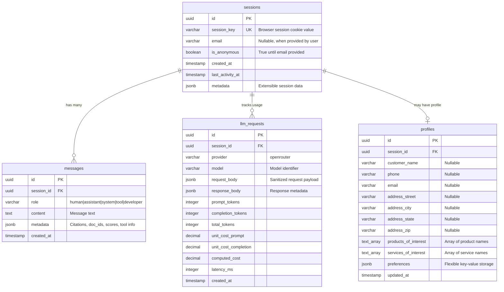

# Data Model & Entity Relationship Diagram

> Database schema for the Salient chat persistence system, supporting session management, message history, profile accumulation, and LLM cost tracking.

## Overview

The data model supports:
- **Session Management**: Browser session tracking with automatic resumption
- **Chat History**: Persistent message storage per session
- **Profile Building**: Incremental customer data collection
- **Cost Tracking**: LLM usage monitoring and billing
- **Email Linking**: Future support for connecting sessions via email

## Entity Relationship Diagram



## Table Descriptions

### sessions
Primary entity tracking browser sessions and user continuity.

**Key Features:**
- `session_key`: Unique identifier stored in browser cookie
- `email`: Captured when user provides it during conversation
- `is_anonymous`: Flips to false when email is provided
- `last_activity_at`: Updated on each request for session timeout
- `metadata`: JSONB field for future extensibility

**Usage:**
- Session resumption: Match browser cookie to `session_key`
- Email linking: Find sessions with same `email` value
- Analytics: Track session duration and activity patterns

### messages
Complete chat history with support for future RAG citations.

**Key Features:**
- `role`: Distinguishes message sources and types:
  - `"human"` - Messages from the user/customer
  - `"assistant"` - Messages from the LLM (OpenRouter responses)
  - `"system"` - System prompts, instructions, or metadata messages
  - `"tool"` - Tool calls and tool responses (function calling)
  - `"developer"` - Developer-specific instructions (GPT-5 compatibility)
- `content`: Full message text
- `metadata`: Extensible JSONB for:
  - RAG citations, document IDs, relevance scores
  - Tool information: `{"tool_type": "call", "tool_name": "get_weather", "tool_id": "abc123"}`
  - Tool results: `{"tool_type": "result", "tool_call_id": "abc123", "status": "success"}`
- Chronological ordering via `created_at`

**Usage:**
- Chat history loading on session resume
- Context window management for LLM calls
- UI rendering: style user vs bot messages differently
- Tool call tracking and result correlation
- Function calling workflows (OpenAI and Anthropic)
- Citation display when RAG is implemented

### llm_requests
Comprehensive LLM usage tracking for cost management and analytics.

**Key Features:**
- `provider`/`model`: Track which LLM service and model used
- Token counting: Separate prompt, completion, and total tokens
- Cost calculation: Unit costs and computed total cost
- `latency_ms`: Performance monitoring
- `request_body`/`response_body`: Sanitized payloads for debugging

**Usage:**
- Session-level cost reporting
- Model performance comparison
- Billing and usage analytics
- Debugging LLM interactions

### profiles
Incremental customer data collection supporting "dribs and drabs" accumulation.

**Key Features:**
- Initially 1:1 with sessions, future: many sessions → 1 profile via email
- All fields nullable to support gradual data collection
- Array fields for products/services of interest
- `preferences`: JSONB for flexible preference storage
- `updated_at`: Track when profile data was last modified

**Usage:**
- Build customer profiles over multiple conversations
- Track product/service interests for sales qualification
- Support future email-based session linking
- Personalize conversations based on known preferences

## Indices Strategy

### Performance Indices
```sql
-- Session lookup and resumption
CREATE UNIQUE INDEX idx_sessions_session_key ON sessions(session_key);
CREATE INDEX idx_sessions_email ON sessions(email) WHERE email IS NOT NULL;

-- Message history retrieval
CREATE INDEX idx_messages_session_created ON messages(session_id, created_at);

-- LLM cost analysis
CREATE INDEX idx_llm_requests_session_created ON llm_requests(session_id, created_at);
CREATE INDEX idx_llm_requests_model_created ON llm_requests(model, created_at);

-- Profile management
CREATE INDEX idx_profiles_session_id ON profiles(session_id);
CREATE INDEX idx_profiles_email ON profiles(email) WHERE email IS NOT NULL;
```

### Email Collision Detection
```sql
-- Find potential profile merging opportunities
CREATE INDEX idx_profiles_email_collision ON profiles(email) 
WHERE email IS NOT NULL;

-- Support future session linking queries
CREATE INDEX idx_sessions_email_collision ON sessions(email) 
WHERE email IS NOT NULL AND is_anonymous = false;
```

## Data Flow Patterns

### Session Lifecycle
1. **New Session**: Browser arrives without session cookie
   - Generate new `session_key`, create `sessions` record
   - Set `is_anonymous = true`, `email = null`
   - Return session cookie to browser

2. **Session Resume**: Browser presents valid session cookie
   - Look up `sessions` by `session_key`
   - Load `messages` for chat history display
   - Update `last_activity_at`

3. **Email Provided**: User shares email during conversation
   - Update `sessions.email`, set `is_anonymous = false`
   - Create or update `profiles` record
   - Check for email collisions with other sessions

### Message Persistence
1. **Human Message**: User submits chat input
   - Save to `messages` with `role = 'human'`, `content = user_input`
   - Pass to LLM for response generation

2. **Assistant Response**: LLM generates response
   - Save streaming chunks or final response to `messages` with `role = 'assistant'`
   - Track request details in `llm_requests`
   - Calculate and store costs

3. **System Messages**: Optional internal messages
   - Save system prompts, instructions with `role = 'system'`
   - Not displayed to user but preserved for context

**Example Message Flow:**
```
messages table:
| role      | content                           | metadata                                    | created_at          |
|-----------|-----------------------------------|---------------------------------------------|---------------------|
| human     | "What products do you have?"      | {}                                          | 2024-01-01 10:00:00 |
| assistant | "We offer SmartFresh solutions..." | {}                                          | 2024-01-01 10:00:05 |
| human     | "What's the weather in SF?"       | {}                                          | 2024-01-01 10:01:00 |
| tool      | "get_weather(location='SF')"      | {"tool_type":"call","tool_name":"get_weather","tool_id":"t001"} | 2024-01-01 10:01:01 |
| tool      | "Temperature: 68°F, sunny"        | {"tool_type":"result","tool_call_id":"t001","status":"success"} | 2024-01-01 10:01:03 |
| assistant | "It's 68°F and sunny in SF today" | {}                                          | 2024-01-01 10:01:05 |
```

### Profile Accumulation
1. **Data Detection**: Extract profile information from messages
   - Name, email, phone, address components
   - Products/services mentioned or expressed interest in
   - Preferences stated during conversation

2. **Profile Update**: Merge new data with existing profile
   - Handle nullable fields gracefully
   - Append to array fields (products/services of interest)
   - Update `preferences` JSONB with new key-value pairs
   - Set `updated_at` timestamp

## Future Evolution

### Email-Based Session Linking
When the same email appears in multiple sessions:
1. **Detection**: Index on `profiles.email` identifies collisions
2. **Logging**: Record potential merge opportunities
3. **Manual Review**: Operator decides if sessions should be linked
4. **Schema Evolution**: Add `primary_profile_id` to support merged profiles

### Multi-Tenant Support
Future addition of `tenants` table:
- Add `tenant_id` FK to all tables
- Partition data by tenant for isolation
- Support tenant-specific configuration overrides

### RAG Integration
Enhance `messages.metadata` for retrieval citations:
- `doc_ids`: Source document identifiers
- `scores`: Relevance scores from vector search
- `citations`: Formatted citation text for display

## Message Role Usage Patterns

### Core Conversation Roles
- **`human`**: Standard user input, questions, requests
- **`assistant`**: LLM-generated responses, explanations, conversation

### System & Control Roles  
- **`system`**: Initial prompts, behavior instructions, context setting
- **`developer`**: Technical instructions, debugging commands (GPT-5 compatibility)

### Function Calling Roles
- **`tool`**: Both tool calls and tool responses, distinguished by metadata:
  ```json
  // Tool call (assistant requests function execution)
  {
    "role": "tool",
    "content": "get_weather(location='San Francisco')",
    "metadata": {
      "tool_type": "call",
      "tool_name": "get_weather", 
      "tool_id": "toolu_001",
      "input": {"location": "San Francisco"}
    }
  }
  
  // Tool result (function execution response)
  {
    "role": "tool", 
    "content": "Temperature: 68°F, partly cloudy",
    "metadata": {
      "tool_type": "result",
      "tool_call_id": "toolu_001",
      "status": "success",
      "execution_time_ms": 245
    }
  }
  ```

### Role-Based Query Patterns
```sql
-- Get conversation messages only (exclude system/tool internals)
SELECT * FROM messages 
WHERE role IN ('human', 'assistant') 
ORDER BY created_at;

-- Get all tool interactions for debugging
SELECT * FROM messages 
WHERE role = 'tool' 
ORDER BY created_at;

-- Find failed tool calls
SELECT * FROM messages 
WHERE role = 'tool' 
AND metadata->>'tool_type' = 'result'
AND metadata->>'status' != 'success';
```

## Design Principles

1. **GUID Primary Keys**: All tables use UUID for globally unique identifiers
2. **Nullable Profile Fields**: Support incremental data collection
3. **JSONB Flexibility**: Extensible metadata without schema changes
4. **Audit Trails**: Timestamps on all entities for debugging
5. **Index Strategy**: Optimized for common query patterns
6. **Future-Ready**: Schema designed to evolve without breaking changes
7. **LLM Compatibility**: Message roles support both OpenAI and Anthropic patterns
