# Data Model & Entity Relationship Diagram
> **Last Updated**: August 28, 2025

> Database schema for the Salient chat persistence system, supporting session management, message history, profile accumulation, and LLM cost tracking.

## Overview

The data model supports:
- **Session Management**: Browser session tracking with automatic resumption
- **Chat History**: Persistent message storage per session
- **Profile Building**: Incremental customer data collection
- **Cost Tracking**: LLM usage monitoring and billing
- **Email Linking**: Future support for connecting sessions via email

## Entity Relationship Diagram

```mermaid
erDiagram
    accounts {
        uuid id PK
        varchar name "Account name or organization"
        varchar slug UK "URL-safe account identifier"
        varchar subscription_tier "free|standard|premium|enterprise"
        varchar status "active|suspended|deleted"
        boolean is_active "Legacy: Account status (deprecated, use status)"
        timestamp created_at
        timestamp updated_at
    }
    
    users {
        uuid id PK
        varchar email UK "User email for authentication"
        varchar password_hash "Nullable for OAuth/SSO users"
        varchar full_name "User display name"
        varchar status "active|suspended|deleted"
        timestamp created_at
        timestamp updated_at
        timestamp last_login_at
    }
    
    roles {
        uuid id PK
        varchar name UK "owner|admin|member|viewer"
        text description "Role description"
        jsonb permissions "Role capabilities"
        timestamp created_at
    }
    
    user_roles {
        uuid id PK
        uuid user_id FK
        uuid account_id FK
        uuid role_id FK
        timestamp created_at
        uuid created_by FK "Who granted this role"
    }
    
    sessions {
        uuid id PK
        uuid account_id FK
        uuid agent_instance_id FK "Current/last used instance"
        uuid user_id FK "Nullable for anonymous sessions"
        varchar account_slug "Denormalized for performance"
        varchar session_key UK "Browser session cookie value"
        varchar email "Nullable, when provided by user (legacy)"
        boolean is_anonymous "True until email provided (legacy)"
        timestamp created_at
        timestamp last_activity_at
        timestamp updated_at
        jsonb metadata "Extensible session data"
    }
    
    agent_instances {
        uuid id PK
        uuid account_id FK
        varchar instance_slug "Unique within account (e.g. simple-chat-customer-support)"
        varchar agent_type "simple_chat|sales_agent|research|rag"
        varchar display_name "User-friendly name for UI"
        varchar status "active|inactive|archived"
        timestamp created_at
        timestamp updated_at
        timestamp last_used_at "For cache warmth tracking"
    }
    
    messages {
        uuid id PK
        uuid session_id FK
        uuid agent_instance_id FK "Which agent handled this message"
        varchar role "human|assistant|system|tool|developer"
        text content "Message text"
        jsonb metadata "Citations, doc_ids, scores, tool info"
        timestamp created_at
    }
    
    llm_requests {
        uuid id PK
        uuid session_id FK
        uuid account_id FK
        uuid agent_instance_id FK "Which agent made this request"
        varchar account_slug "Denormalized for performance"
        varchar agent_instance_slug "Denormalized for performance"
        varchar agent_type "simple_chat|sales_agent|etc"
        varchar completion_status "complete|partial|error"
        varchar provider "openrouter"
        varchar model "Model identifier"
        jsonb request_body "Sanitized request payload"
        jsonb response_body "Response metadata"
        integer prompt_tokens
        integer completion_tokens
        integer total_tokens
        decimal unit_cost_prompt
        decimal unit_cost_completion
        decimal computed_cost
        integer latency_ms
        timestamp created_at
    }
    
    profiles {
        uuid id PK
        uuid session_id FK
        varchar customer_name "Nullable"
        varchar phone "Nullable"
        varchar email "Nullable"
        varchar address_street "Nullable"
        varchar address_city "Nullable"
        varchar address_state "Nullable"
        varchar address_zip "Nullable"
        text_array products_of_interest "Array of product names"
        text_array services_of_interest "Array of service names"
        jsonb preferences "Flexible key-value storage"
        timestamp updated_at
    }
    
    agent_performance_metrics {
        uuid id PK
        uuid account_id FK
        uuid agent_instance_id FK
        decimal response_time_ms "Response time in milliseconds"
        varchar request_type "chat|stream|tool_call"
        varchar status "success|error|timeout"
        timestamp created_at
    }
    
    agent_usage_log {
        uuid id PK
        uuid account_id FK
        uuid agent_instance_id FK
        uuid session_id FK
        integer request_count "Number of requests in this log entry"
        integer total_tokens "Total tokens used"
        decimal total_cost "Total cost for this usage"
        timestamp created_at
    }
    
    agent_templates {
        uuid id PK
        varchar name "simple_chat|sales|simple_research|deep_research"
        varchar workflow_class "Pydantic AI class reference"
        text description
        varchar version
        jsonb config_schema "JSON schema for validation"
        jsonb pricing_tiers "Tier-specific configurations"
        timestamp created_at
        timestamp updated_at
    }
    
    mcp_servers {
        uuid id PK
        varchar name "Server identifier"
        varchar type "crm|pricing|content_analysis|crossfeed"
        varchar endpoint_url
        boolean is_stateless "Whether server maintains state"
        varchar_array supported_tools "List of available tools"
        jsonb account_restrictions "Which accounts can access"
        timestamp created_at
        timestamp updated_at
    }
    
    vector_db_configs {
        uuid id PK
        uuid account_id FK
        uuid agent_instance_id FK
        varchar type "pinecone_namespace|pinecone_dedicated|pgvector"
        jsonb connection_details "Encrypted connection info"
        varchar namespace "For Pinecone namespace isolation"
        varchar index_name "For dedicated indexes"
        timestamp created_at
        timestamp updated_at
    }
    
    %% Relationships
    accounts ||--o{ sessions : "has many"
    accounts ||--o{ agent_instances : "has many"
    accounts ||--o{ user_roles : "has members"
    accounts ||--o{ llm_requests : "tracks costs"
    accounts ||--o{ agent_performance_metrics : "tracks performance"
    accounts ||--o{ agent_usage_log : "tracks usage"
    accounts ||--o{ vector_db_configs : "has many"
    users ||--o{ user_roles : "belongs to accounts"
    users ||--o{ sessions : "authenticated sessions"
    roles ||--o{ user_roles : "assigned to users"
    user_roles }o--|| users : "user"
    user_roles }o--|| accounts : "account"
    user_roles }o--|| roles : "role"
    user_roles }o--o| users : "created by"
    sessions ||--o{ messages : "has many"
    sessions ||--o{ llm_requests : "tracks usage"
    sessions ||--o| profiles : "may have profile"
    sessions ||--o{ agent_usage_log : "generates usage"
    sessions }o--o| agent_instances : "current instance"
    sessions }o--o| users : "user (nullable)"
    agent_instances ||--o{ messages : "handles"
    agent_instances ||--o{ llm_requests : "makes requests"
    agent_instances ||--o{ agent_performance_metrics : "performance tracked"
    agent_instances ||--o{ agent_usage_log : "usage tracked"
    agent_instances ||--|| vector_db_configs : "has config"
    agent_templates ||--o{ agent_instances : "instantiated as"
```



## Table Descriptions

### accounts
Primary entity for multi-account support, enabling organization-level isolation.

**Key Features:**
- `name`: Human-readable account/organization name
- `slug`: URL-safe identifier for routing (e.g., `/accounts/acme-corp/agents/instance-name/chat`)
- `subscription_tier`: Determines feature access and resource limits (free|standard|premium|enterprise)
- `status`: Account status (active|suspended|deleted) - preferred over legacy `is_active`
- `is_active`: Legacy boolean flag (deprecated, use `status` instead)

**Usage:**
- Account-level billing and usage tracking
- Multi-tenancy data isolation
- Feature access control based on subscription tier
- Agent instance provisioning and limits
- User membership via account-scoped roles

**Relationships:**
- Has many `agent_instances` (each with unique config)
- Has many `sessions` (both anonymous and authenticated)
- Has many `user_roles` (users with account-scoped permissions)

### users
User accounts for authentication and identity management.

**Key Features:**
- `email`: Unique identifier for authentication
- `password_hash`: Nullable for OAuth/SSO users
- `full_name`: Display name
- `status`: User status (active|suspended|deleted)
- `last_login_at`: Track login activity

**Usage:**
- Authentication (login/logout)
- User identity across multiple accounts
- Permission management via account-scoped roles
- Session attribution (nullable for anonymous sessions)

**Relationships:**
- Belongs to many `accounts` via `user_roles` (many-to-many)
- Has many `sessions` (nullable, supports anonymous sessions)
- Same user can have different roles in different accounts

### roles
Define available permission sets for account-scoped authorization.

**Key Features:**
- `name`: Unique role identifier (owner|admin|member|viewer)
- `permissions`: JSONB of capabilities (e.g., `{"all": true}` or `{"use_agents": true}`)
- `description`: Human-readable role description

**Usage:**
- Permission checking (e.g., "can this user use agents in this account?")
- Account-scoped roles (user is "admin" in account A, "viewer" in account B)
- Flexible permission model via JSONB

**Standard Roles:**
- `owner`: Full account ownership (`{"all": true}`)
- `admin`: Manage instances and users (`{"manage_instances": true, "manage_users": true}`)
- `member`: Use agents and view history (`{"use_agents": true, "view_history": true}`)
- `viewer`: Read-only access (`{"view_history": true}`)

### user_roles
Many-to-many mapping between users, accounts, and roles. Account-scoped role assignments.

**Key Features:**
- `user_id`: User receiving the role
- `account_id`: Account where role applies
- `role_id`: Role being granted
- `created_by`: Audit trail of who granted the role
- Unique constraint on `(user_id, account_id)`: One role per user per account

**Usage:**
- Permission checking: "Does user X have permission Y in account Z?"
- User management: Grant/revoke roles, list users in account
- Audit trail: Track who granted permissions and when

**Example:**
- User "alice@example.com" is "admin" in account "acme" (can manage instances)
- Same user is "viewer" in account "demo" (read-only)

### agent_instances
Dynamic agent instances per account, each with unique configuration. **Hybrid approach: DB table (metadata) + config files (configuration).**

**Key Features:**
- `instance_slug`: Unique within account (e.g., `simple-chat-customer-support`, `sales-enterprise`)
- `agent_type`: Type of agent (simple_chat, sales_agent, research, rag)
- `display_name`: User-friendly name shown in UI (e.g., "Customer Support Chat")
- `status`: Instance status (active|inactive|archived)
- `last_used_at`: For cache warmth tracking and usage analytics

**Hybrid Approach:**
- **Database**: Metadata, validation, discovery, tracking
  - Query available instances: `SELECT * FROM agent_instances WHERE account_id = ?`
  - Validate instance exists before loading config
  - Track `last_used_at` for intelligent caching
  - Manage status (active/inactive/archived) without deleting configs
- **Config Files**: Actual configuration (model, tools, prompts, parameters)
  - Location: `config/agent_configs/{account_slug}/{instance_slug}/config.yaml`
  - Fast to load, easy to version control
  - No JSONB parsing overhead

**Usage:**
- Multiple instances of same agent type per account (e.g., 4 simple-chat agents with different configs)
- Instance discovery: `GET /accounts/{account}/agents`
- Cost tracking per instance (FK ensures instance exists)
- Instance-specific tool configurations and prompts
- Hot/cold instance management based on `last_used_at`

### sessions
Browser sessions within an account context, supporting both anonymous and authenticated users.

**Key Features:**
- `account_id`: Links session to specific account (FK)
- `account_slug`: Denormalized for fast queries without joins
- `agent_instance_id`: Current or last used agent instance (FK, nullable)
- `user_id`: Authenticated user (FK, nullable for anonymous sessions)
- `session_key`: Unique identifier stored in browser cookie
- `email`: Legacy field - captured when user provides email (Phase 1a anonymous sessions)
- `is_anonymous`: Legacy field - flips to false when email provided
- `last_activity_at`: Updated on each request for session timeout
- `metadata`: JSONB field for extensible session data

**Usage:**
- **Anonymous sessions**: `user_id` is NULL, session identified by `session_key` cookie
- **Authenticated sessions**: `user_id` references user, enables cross-device/cross-session continuity
- Session resumption: Match browser cookie to `session_key` within account
- Agent tracking: Record which instance is handling this session
- Analytics: Track session duration, activity patterns, agent usage per account
- Account-scoped session isolation and security

**Phase 1a vs Phase 1b:**
- Phase 1a: All sessions anonymous (`user_id` NULL, use `email`/`is_anonymous` legacy fields)
- Phase 1b: Add authentication, `user_id` populated for logged-in users

### messages
Complete chat history with agent tracking and RAG citation support.

**Key Features:**
- `agent_instance_id`: Links message to specific agent instance that handled it
- `role`: Distinguishes message sources and types:
  - `"human"` - Messages from the user/customer
  - `"assistant"` - Messages from the LLM (OpenRouter responses)
  - `"system"` - System prompts, instructions, or metadata messages
  - `"tool"` - Tool calls and tool responses (function calling)
  - `"developer"` - Developer-specific instructions (GPT-5 compatibility)
- `content`: Full message text
- `metadata`: Extensible JSONB for:
  - RAG citations, document IDs, relevance scores
  - Tool information: `{"tool_type": "call", "tool_name": "get_weather", "tool_id": "abc123"}`
  - Tool results: `{"tool_type": "result", "tool_call_id": "abc123", "status": "success"}`
- Chronological ordering via `created_at`

**Usage:**
- Chat history loading on session resume
- Context window management for LLM calls
- UI rendering: style user vs bot messages differently
- Tool call tracking and result correlation
- Function calling workflows (OpenAI and Anthropic)
- Citation display when RAG is implemented
- Agent performance tracking and analytics per instance
- Multi-agent conversation handoff tracking

### llm_requests
Comprehensive LLM usage tracking for cost management and analytics with agent attribution. **Hybrid FK + denormalized columns for performance.**

**Key Features:**
- `account_id`: Account reference (FK for integrity)
- `account_slug`: Denormalized for fast aggregation queries without joins
- `agent_instance_id`: Agent instance reference (FK for integrity)
- `agent_instance_slug`: Denormalized for fast queries (e.g., cost per instance)
- `agent_type`: Type of agent (simple_chat, sales_agent, etc.) for analytics
- `completion_status`: Request outcome (complete|partial|error) for tracking stream failures
- `provider`/`model`: Track which LLM service and model used
- Token counting: Separate prompt, completion, and total tokens
- Cost calculation: Unit costs and computed total cost
- `latency_ms`: Performance monitoring
- `request_body`/`response_body`: Sanitized payloads for debugging

**Hybrid Approach:**
- **FKs**: Referential integrity (ensure account/instance exists)
- **Denormalized slugs**: Fast queries without joins
  ```sql
  -- Fast: No joins needed
  SELECT SUM(computed_cost) FROM llm_requests 
  WHERE account_slug = 'acme' AND agent_instance_slug = 'sales-enterprise';
  
  -- Validated: With FK integrity
  SELECT COUNT(*) FROM llm_requests llm
  JOIN agent_instances ai ON llm.agent_instance_id = ai.id
  WHERE ai.status = 'active';
  ```

**Usage:**
- **Account-level billing**: Aggregate costs per account using `account_slug`
- **Instance-level cost tracking**: Compare costs across agent instances
- **Agent type analytics**: Model performance comparison per agent type
- **Session-level reporting**: Track costs for individual conversations
- **Partial response tracking**: Identify stream failures via `completion_status`
- **Debugging**: Inspect sanitized request/response payloads per agent instance
- **Performance monitoring**: Latency tracking per instance and model

### profiles
Incremental customer data collection supporting "dribs and drabs" accumulation.

**Key Features:**
- Initially 1:1 with sessions, future: many sessions → 1 profile via email
- All fields nullable to support gradual data collection
- Array fields for products/services of interest
- `preferences`: JSONB for flexible preference storage
- `updated_at`: Track when profile data was last modified

**Usage:**
- Build customer profiles over multiple conversations
- Track product/service interests for sales qualification
- Support future email-based session linking
- Personalize conversations based on known preferences

### agent_performance_metrics
Real-time performance tracking for agent instances across accounts.

**Key Features:**
- `agent_instance_id`: Links metrics to specific agent instance
- `response_time_ms`: Tracks latency for performance optimization
- `request_type`: Distinguishes between chat, streaming, and tool calls
- `status`: Tracks success/error rates for reliability monitoring

**Usage:**
- Account-level performance dashboards and SLA monitoring
- Agent instance optimization and capacity planning
- Error rate tracking and alerting
- Performance comparison across agent types and accounts

### agent_usage_log
Aggregated usage tracking for billing and resource management.

**Key Features:**
- `agent_instance_id`: Links usage to specific agent instance
- `request_count`: Batch request counting for efficient logging
- `total_tokens`: Token usage aggregation for cost calculation
- `total_cost`: Pre-calculated costs for billing accuracy

**Usage:**
- Account-level billing and usage reporting
- Resource consumption tracking per agent instance
- Cost optimization and budget management
- Usage-based scaling decisions

### agent_templates
Template definitions for the four supported agent types with configuration schemas.

**Key Features:**
- `name`: Agent type identifier (simple_chat, sales, simple_research, deep_research)
- `workflow_class`: Reference to Pydantic AI implementation class
- `config_schema`: JSON schema for validating instance configurations
- `pricing_tiers`: Tier-specific feature and resource configurations
- `version`: Template versioning for backward compatibility

**Usage:**
- Define reusable agent workflows that can be instantiated multiple times per account
- Validate agent instance configurations against schema
- Support different pricing tiers with varying capabilities
- Enable template evolution while maintaining compatibility

### mcp_servers
Registry of available MCP (Model Context Protocol) servers for agent tool integration.

**Key Features:**
- `type`: Server category (crm, pricing, content_analysis, crossfeed)
- `endpoint_url`: Server connection endpoint
- `is_stateless`: Whether server maintains client state
- `supported_tools`: Array of available tool names
- `account_restrictions`: JSONB defining which accounts have access

**Usage:**
- Dynamic tool discovery for agent instances
- Account-based access control for external services
- Stateless vs stateful server routing decisions
- Tool availability validation during agent configuration

### vector_db_configs
Vector database configurations per agent instance for RAG and semantic search.

**Key Features:**
- `type`: Database type (pinecone_namespace, pinecone_dedicated, pgvector)
- `connection_details`: Encrypted connection credentials and settings
- `namespace`: Pinecone namespace for shared index isolation
- `index_name`: Dedicated index name for premium accounts

**Usage:**
- Account-tier based vector database routing (pgvector → Pinecone namespace → dedicated)
- Complete data isolation between accounts and agent instances
- Support multiple agent instances per account with different knowledge bases
- Enable agent specialization through different vector database content

## Indices Strategy

### Performance Indices
```sql
-- Account and agent instance management
CREATE UNIQUE INDEX idx_accounts_slug ON accounts(slug);
CREATE INDEX idx_accounts_tier_active ON accounts(subscription_tier, is_active);
CREATE UNIQUE INDEX idx_agent_instances_account_name ON agent_instances(account_id, instance_name);
CREATE INDEX idx_agent_instances_type_status ON agent_instances(agent_type, status);
CREATE INDEX idx_agent_instances_last_used ON agent_instances(last_used_at) WHERE status = 'active';

-- Session lookup and resumption
CREATE UNIQUE INDEX idx_sessions_session_key ON sessions(session_key);
CREATE INDEX idx_sessions_account_email ON sessions(account_id, email) WHERE email IS NOT NULL;
CREATE INDEX idx_sessions_account_activity ON sessions(account_id, last_activity_at);

-- Message history retrieval  
CREATE INDEX idx_messages_session_created ON messages(session_id, created_at);
CREATE INDEX idx_messages_agent_created ON messages(agent_instance_id, created_at);

-- LLM cost analysis
CREATE INDEX idx_llm_requests_session_created ON llm_requests(session_id, created_at);
CREATE INDEX idx_llm_requests_agent_created ON llm_requests(agent_instance_id, created_at);
CREATE INDEX idx_llm_requests_model_created ON llm_requests(model, created_at);

-- Profile management
CREATE INDEX idx_profiles_session_id ON profiles(session_id);
CREATE INDEX idx_profiles_email ON profiles(email) WHERE email IS NOT NULL;

-- Performance monitoring
CREATE INDEX idx_perf_metrics_account_created ON agent_performance_metrics(account_id, created_at);
CREATE INDEX idx_perf_metrics_agent_created ON agent_performance_metrics(agent_instance_id, created_at);
CREATE INDEX idx_perf_metrics_status_created ON agent_performance_metrics(status, created_at);

-- Usage tracking
CREATE INDEX idx_usage_log_account_created ON agent_usage_log(account_id, created_at);
CREATE INDEX idx_usage_log_agent_created ON agent_usage_log(agent_instance_id, created_at);
CREATE INDEX idx_usage_log_session_created ON agent_usage_log(session_id, created_at);

-- Agent templates
CREATE UNIQUE INDEX idx_agent_templates_name_version ON agent_templates(name, version);
CREATE INDEX idx_agent_templates_name ON agent_templates(name);

-- MCP servers
CREATE UNIQUE INDEX idx_mcp_servers_name ON mcp_servers(name);
CREATE INDEX idx_mcp_servers_type ON mcp_servers(type);

-- Vector database configurations
CREATE UNIQUE INDEX idx_vector_configs_agent_instance ON vector_db_configs(agent_instance_id);
CREATE INDEX idx_vector_configs_account_type ON vector_db_configs(account_id, type);
CREATE INDEX idx_vector_configs_namespace ON vector_db_configs(namespace) WHERE namespace IS NOT NULL;
```

### Email Collision Detection
```sql
-- Find potential profile merging opportunities
CREATE INDEX idx_profiles_email_collision ON profiles(email) 
WHERE email IS NOT NULL;

-- Support future session linking queries
CREATE INDEX idx_sessions_email_collision ON sessions(email) 
WHERE email IS NOT NULL AND is_anonymous = false;
```

## Data Flow Patterns

### Session Lifecycle
1. **New Session**: Browser arrives without session cookie
   - Generate new `session_key`, create `sessions` record
   - Set `is_anonymous = true`, `email = null`
   - Return session cookie to browser

2. **Session Resume**: Browser presents valid session cookie
   - Look up `sessions` by `session_key`
   - Load `messages` for chat history display
   - Update `last_activity_at`

3. **Email Provided**: User shares email during conversation
   - Update `sessions.email`, set `is_anonymous = false`
   - Create or update `profiles` record
   - Check for email collisions with other sessions

### Message Persistence
1. **Human Message**: User submits chat input
   - Save to `messages` with `role = 'human'`, `content = user_input`
   - Pass to LLM for response generation

2. **Assistant Response**: LLM generates response
   - Save streaming chunks or final response to `messages` with `role = 'assistant'`
   - Track request details in `llm_requests`
   - Calculate and store costs

3. **System Messages**: Optional internal messages
   - Save system prompts, instructions with `role = 'system'`
   - Not displayed to user but preserved for context

**Example Message Flow:**
```
messages table:
| role      | content                           | metadata                                    | created_at          |
|-----------|-----------------------------------|---------------------------------------------|---------------------|
| human     | "What products do you have?"      | {}                                          | 2024-01-01 10:00:00 |
| assistant | "We offer SmartFresh solutions..." | {}                                          | 2024-01-01 10:00:05 |
| human     | "What's the weather in SF?"       | {}                                          | 2024-01-01 10:01:00 |
| tool      | "get_weather(location='SF')"      | {"tool_type":"call","tool_name":"get_weather","tool_id":"t001"} | 2024-01-01 10:01:01 |
| tool      | "Temperature: 68°F, sunny"        | {"tool_type":"result","tool_call_id":"t001","status":"success"} | 2024-01-01 10:01:03 |
| assistant | "It's 68°F and sunny in SF today" | {}                                          | 2024-01-01 10:01:05 |
```

### Profile Accumulation
1. **Data Detection**: Extract profile information from messages
   - Name, email, phone, address components
   - Products/services mentioned or expressed interest in
   - Preferences stated during conversation

2. **Profile Update**: Merge new data with existing profile
   - Handle nullable fields gracefully
   - Append to array fields (products/services of interest)
   - Update `preferences` JSONB with new key-value pairs
   - Set `updated_at` timestamp

## Future Evolution

### Email-Based Session Linking
When the same email appears in multiple sessions:
1. **Detection**: Index on `profiles.email` identifies collisions
2. **Logging**: Record potential merge opportunities
3. **Manual Review**: Operator decides if sessions should be linked
4. **Schema Evolution**: Add `primary_profile_id` to support merged profiles

### Multi-Account Support
Implemented with `accounts` table and account-scoped data:
- All tables include `account_id` FK for complete data isolation
- Agent instances are account-specific and configurable
- Account-level billing, usage tracking, and feature access control
- Support for account-specific configuration overrides

### RAG Integration
Enhance `messages.metadata` for retrieval citations:
- `doc_ids`: Source document identifiers
- `scores`: Relevance scores from vector search
- `citations`: Formatted citation text for display

## Message Role Usage Patterns

### Core Conversation Roles
- **`human`**: Standard user input, questions, requests
- **`assistant`**: LLM-generated responses, explanations, conversation

### System & Control Roles  
- **`system`**: Initial prompts, behavior instructions, context setting
- **`developer`**: Technical instructions, debugging commands (GPT-5 compatibility)

### Function Calling Roles
- **`tool`**: Both tool calls and tool responses, distinguished by metadata:
  ```json
  // Tool call (assistant requests function execution)
  {
    "role": "tool",
    "content": "get_weather(location='San Francisco')",
    "metadata": {
      "tool_type": "call",
      "tool_name": "get_weather", 
      "tool_id": "toolu_001",
      "input": {"location": "San Francisco"}
    }
  }
  
  // Tool result (function execution response)
  {
    "role": "tool", 
    "content": "Temperature: 68°F, partly cloudy",
    "metadata": {
      "tool_type": "result",
      "tool_call_id": "toolu_001",
      "status": "success",
      "execution_time_ms": 245
    }
  }
  ```

### Role-Based Query Patterns
```sql
-- Get conversation messages only (exclude system/tool internals)
SELECT * FROM messages 
WHERE role IN ('human', 'assistant') 
ORDER BY created_at;

-- Get all tool interactions for debugging
SELECT * FROM messages 
WHERE role = 'tool' 
ORDER BY created_at;

-- Find failed tool calls
SELECT * FROM messages 
WHERE role = 'tool' 
AND metadata->>'tool_type' = 'result'
AND metadata->>'status' != 'success';
```

## Design Principles

1. **GUID Primary Keys**: All tables use UUID for globally unique identifiers
2. **Nullable Profile Fields**: Support incremental data collection
3. **JSONB Flexibility**: Extensible metadata without schema changes
4. **Audit Trails**: Timestamps on all entities for debugging
5. **Index Strategy**: Optimized for common query patterns
6. **Future-Ready**: Schema designed to evolve without breaking changes
7. **LLM Compatibility**: Message roles support both OpenAI and Anthropic patterns
