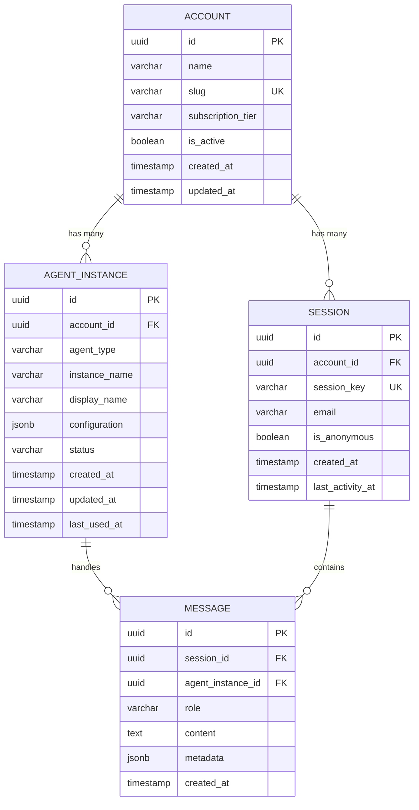
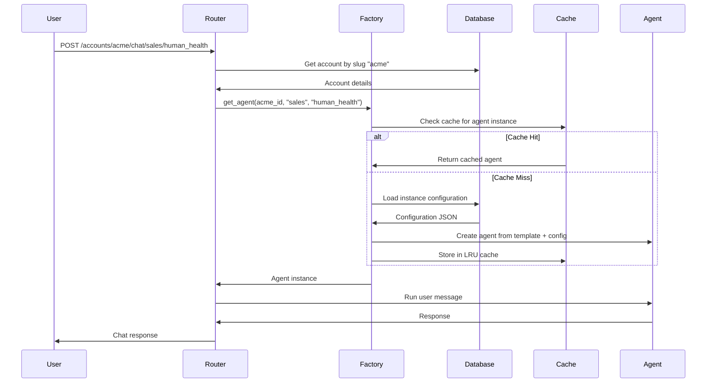

# Multi-Account Support Architecture

> Scalable architecture for supporting hundreds to thousands of accounts, each with multiple agent instances of different types, using database-driven configuration and intelligent caching.

## Overview

Our multi-account architecture enables complete data isolation and customization for each account while maintaining operational efficiency and cost-effectiveness. Each account can provision multiple agent instances (sales, research, RAG, digital expert) with account-specific configurations.

## Account & Agent Instance Model

### Account Structure


### Example Account Configuration

#### Account: "Acme Healthcare Corp"
```yaml
account_id: "acme-healthcare-123"
subscription_tier: "enterprise"
agent_instances:
  - type: "sales"
    instance_name: "human_health"
    display_name: "Human Health Sales Agent"
    configuration:
      vector_database:
        provider: "pinecone"
        namespace: "acme-human-health"
      crm_integration:
        salesforce_instance: "acme-healthcare.my.salesforce.com"
      system_prompt_override: "Focus on FDA-approved treatments..."
        
  - type: "sales" 
    instance_name: "animal_health"
    display_name: "Veterinary Sales Agent"
    configuration:
      vector_database:
        provider: "pinecone"
        namespace: "acme-animal-health"
      crm_integration:
        hubspot_portal: "acme-vet"
        
  - type: "research"
    instance_name: "clinical_research"
    display_name: "Clinical Research Agent"
    configuration:
      vector_database:
        provider: "pinecone"
        namespace: "acme-clinical-docs"
      search_providers:
        - "pubmed"
        - "clinical_trials_gov"
        
  - type: "rag"
    instance_name: "regulatory_docs"
    display_name: "FDA Regulatory Documents"
    configuration:
      vector_database:
        provider: "pinecone"
        namespace: "acme-regulatory"
      document_sources:
        - "google_drive_folder_id": "regulatory-documents"
        - "sharepoint_site": "compliance"
```

## Agent Factory & Instance Management

### Core Architecture Components

#### 1. Agent Template System
```python
# Template definitions stored in code
class SalesAgentTemplate:
    agent_type = "sales"
    base_system_prompt = "You are a sales agent..."
    required_tools = ["crm_integration", "product_search", "scheduling"]
    optional_tools = ["email_templates", "pricing_calculator"]
    
    @classmethod
    def create_instance(cls, account_id: str, instance_config: dict) -> Agent:
        # Merge template with instance configuration
        merged_config = cls.merge_config(cls.base_config, instance_config)
        return SalesAgent(config=merged_config, account_id=account_id)
```

#### 2. Database-Driven Instance Configuration
Agent instance configurations are stored in the database using the schema defined in [datamodel.md](datamodel.md#agent_instances). Each account can have multiple agent instances with unique names and JSONB configuration overrides.

#### 3. Agent Factory with LRU Caching
```python
from functools import lru_cache
from typing import Dict, Optional
import asyncio

class AgentFactory:
    def __init__(self):
        # Hot instance cache (LRU with 500 max instances)
        self._instance_cache: Dict[str, Agent] = {}
        self._cache_size = 500
        self._cache_stats = {"hits": 0, "misses": 0}
        
    async def get_agent(
        self, 
        account_id: str, 
        agent_type: str, 
        instance_name: str
    ) -> Agent:
        """Get or create agent instance with intelligent caching."""
        
        cache_key = f"{account_id}:{agent_type}:{instance_name}"
        
        # Check hot cache first
        if cache_key in self._instance_cache:
            self._cache_stats["hits"] += 1
            await self._update_last_used(account_id, instance_name)
            return self._instance_cache[cache_key]
        
        self._cache_stats["misses"] += 1
        
        # Load configuration from database
        config = await self._load_instance_config(account_id, agent_type, instance_name)
        if not config:
            raise ValueError(f"Agent instance not found: {cache_key}")
            
        # Create agent from template + configuration
        template = self._get_template(agent_type)
        agent = template.create_instance(account_id, config)
        
        # Add to cache (with LRU eviction)
        self._add_to_cache(cache_key, agent)
        
        # Update usage timestamp
        await self._update_last_used(account_id, instance_name)
        
        return agent
        
    def _add_to_cache(self, key: str, agent: Agent):
        """Add agent to cache with LRU eviction."""
        if len(self._instance_cache) >= self._cache_size:
            # Remove least recently used item
            oldest_key = next(iter(self._instance_cache))
            del self._instance_cache[oldest_key]
            
        self._instance_cache[key] = agent
        
    async def _load_instance_config(
        self, 
        account_id: str, 
        agent_type: str, 
        instance_name: str
    ) -> Optional[dict]:
        """Load agent instance configuration from database."""
        query = """
            SELECT configuration, status
            FROM agent_instances 
            WHERE account_id = $1 
            AND agent_type = $2 
            AND instance_name = $3 
            AND status = 'active'
        """
        
        row = await self.db.fetchrow(query, account_id, agent_type, instance_name)
        return row['configuration'] if row else None
        
    async def _update_last_used(self, account_id: str, instance_name: str):
        """Update last_used_at timestamp for cache warmth tracking."""
        query = """
            UPDATE agent_instances 
            SET last_used_at = NOW() 
            WHERE account_id = $1 AND instance_name = $2
        """
        await self.db.execute(query, account_id, instance_name)
```

### 4. Account-Aware Request Routing
```python
class AccountRouter:
    def __init__(self, agent_factory: AgentFactory):
        self.agent_factory = agent_factory
        
    async def route_request(
        self,
        account_slug: str,
        agent_path: str,
        user_message: str,
        session_id: str
    ) -> AgentResponse:
        """Route request to appropriate agent instance."""
        
        # Resolve account
        account = await self._get_account_by_slug(account_slug)
        if not account or not account.is_active:
            raise AccountNotFoundError(f"Account not found: {account_slug}")
            
        # Parse agent path (e.g., "sales/human_health" or "research/clinical")
        agent_type, instance_name = self._parse_agent_path(agent_path)
        
        # Get agent instance
        agent = await self.agent_factory.get_agent(
            account_id=account.id,
            agent_type=agent_type,
            instance_name=instance_name
        )
        
        # Create account-specific dependencies
        dependencies = await self._create_dependencies(account, session_id)
        
        # Execute agent
        result = await agent.run(user_message, deps=dependencies)
        
        # Track usage
        await self._track_usage(account.id, agent_type, instance_name, result.usage())
        
        return result
```

## URL Structure & Routing

### Account-Based URL Patterns
```
# Account-scoped chat endpoints
/accounts/{account_slug}/chat/{agent_type}/{instance_name}
/accounts/{account_slug}/agents/{agent_type}/{instance_name}/stream

# Examples:
/accounts/acme-healthcare/chat/sales/human_health
/accounts/acme-healthcare/chat/sales/animal_health  
/accounts/acme-healthcare/chat/research/clinical_research
/accounts/acme-healthcare/agents/rag/regulatory_docs/stream

# Agent instance management (admin)
/accounts/{account_slug}/admin/agents
/accounts/{account_slug}/admin/agents/{instance_id}/config
```

### Request Flow


## Scalability Features

### 1. Intelligent Caching Strategy
```python
class AdvancedAgentCache:
    def __init__(self):
        # Tiered caching strategy
        self.hot_cache = {}      # 100 most recently used
        self.warm_cache = {}     # 400 frequently used
        self.preload_cache = {}  # Predictive preloading
        
    async def preload_popular_agents(self):
        """Preload agents based on usage patterns from agent_usage_log table."""
        query = """
            SELECT ai.account_id, ai.agent_type, ai.instance_name, SUM(aul.request_count) as usage_count
            FROM agent_instances ai
            JOIN agent_usage_log aul ON ai.id = aul.agent_instance_id
            WHERE aul.created_at > NOW() - INTERVAL '24 hours'
            GROUP BY ai.account_id, ai.agent_type, ai.instance_name
            ORDER BY usage_count DESC
            LIMIT 50
        """
        
        popular_agents = await self.db.fetch(query)
        for agent_info in popular_agents:
            await self.factory.get_agent(
                agent_info['account_id'],
                agent_info['agent_type'], 
                agent_info['instance_name']
            )
```

### 2. Resource Management
```python
class ResourceManager:
    def __init__(self):
        self.limits = {
            "free": {"max_agents": 2, "max_requests_per_hour": 100},
            "standard": {"max_agents": 10, "max_requests_per_hour": 1000},
            "premium": {"max_agents": 50, "max_requests_per_hour": 10000},
            "enterprise": {"max_agents": 200, "max_requests_per_hour": 100000}
        }
        
    async def check_account_limits(self, account: Account, agent_type: str) -> bool:
        """Enforce account-based resource limits."""
        tier_limits = self.limits[account.subscription_tier]
        
        # Check agent instance limit
        current_agents = await self._count_active_agents(account.id)
        if current_agents >= tier_limits["max_agents"]:
            raise ResourceLimitError("Agent instance limit exceeded")
            
        # Check request rate limit
        recent_requests = await self._count_recent_requests(account.id)
        if recent_requests >= tier_limits["max_requests_per_hour"]:
            raise RateLimitError("Request rate limit exceeded")
            
        return True
```

### 3. Performance Monitoring
Performance metrics are tracked using the `agent_performance_metrics` and `agent_usage_log` tables defined in [datamodel.md](datamodel.md#agent_performance_metrics).

```python
class AgentPerformanceMonitor:
    async def track_metrics(self, account_id: str, agent_instance_id: str, response_time: float):
        """Track agent performance metrics using schema from datamodel.md."""
        await self.db.execute("""
            INSERT INTO agent_performance_metrics 
            (account_id, agent_instance_id, response_time_ms, request_type, status, created_at)
            VALUES ($1, $2, $3, $4, $5, NOW())
        """, account_id, agent_instance_id, response_time * 1000, "chat", "success")
        
    async def get_performance_dashboard(self, account_id: str) -> dict:
        """Get account-level performance metrics."""
        return {
            "average_response_time": await self._avg_response_time(account_id),
            "request_volume": await self._request_volume(account_id),
            "error_rate": await self._error_rate(account_id),
            "most_used_agents": await self._popular_agents(account_id),
            "cost_breakdown": await self._cost_by_agent(account_id)
        }
```

## Configuration Management

### Template Configuration (YAML Files)
```yaml
# backend/config/agent_templates/sales.yaml
agent_type: "sales"
version: "1.0"
system_prompt: |
  You are a sales agent specialized in product recommendations and customer qualification.
  Always be helpful, professional, and focus on understanding customer needs.

required_dependencies:
  - database_connection
  - vector_database
  - session_context

optional_dependencies:
  - crm_integration
  - email_service
  - calendar_service

tools:
  - name: "product_search"
    required: true
    config_schema:
      vector_namespace: "string"
      max_results: "integer"
      
  - name: "crm_integration" 
    required: false
    config_schema:
      provider: "enum[salesforce,hubspot,zoho]"
      instance_url: "string"
      
default_model: "openai:gpt-4o"
max_tokens: 2000
temperature: 0.3
```

### Instance Configuration (Database JSON)
```json
{
  "system_prompt_override": "Focus on FDA-approved medical devices for healthcare professionals.",
  "model_override": "openai:gpt-4o-mini",
  "tools": {
    "product_search": {
      "vector_namespace": "acme-medical-devices",
      "max_results": 10,
      "filters": ["fda_approved=true"]
    },
    "crm_integration": {
      "provider": "salesforce",
      "instance_url": "acme-healthcare.my.salesforce.com",
      "custom_fields": {
        "medical_specialty": "Device_Specialty__c",
        "institution_type": "Institution_Type__c"
      }
    }
  },
  "rate_limits": {
    "max_requests_per_minute": 20,
    "max_tokens_per_hour": 50000
  },
  "feature_flags": {
    "enable_scheduling": true,
    "enable_email_followup": true,
    "enable_document_upload": false
  }
}
```

## Migration Strategy

### Phase 1: Single Account Mode (Current)
- Implement account table with single default account
- All existing sessions/messages linked to default account
- Agent instances created for default account

### Phase 2: Multi-Account Infrastructure
- Add account creation and management APIs
- Implement agent factory and caching system
- Update routing to be account-aware

### Phase 3: Account Provisioning
- Self-service account creation
- Agent instance provisioning UI
- Billing and usage tracking integration

### Phase 4: Scale Optimization
- Advanced caching strategies
- Performance monitoring and optimization
- Auto-scaling based on usage patterns

## Success Criteria

1. **Scalability**: Support 1000+ accounts with 5+ agents each
2. **Performance**: <200ms average response time for cached agents
3. **Isolation**: Complete data separation between accounts
4. **Flexibility**: Easy agent instance configuration without code changes
5. **Reliability**: 99.9% uptime with proper error handling and fallbacks
6. **Cost Efficiency**: Intelligent caching keeps resource usage optimal
7. **Monitoring**: Comprehensive metrics and performance tracking

This architecture provides a robust foundation for scaling to thousands of accounts while maintaining excellent performance through intelligent caching and resource management.
