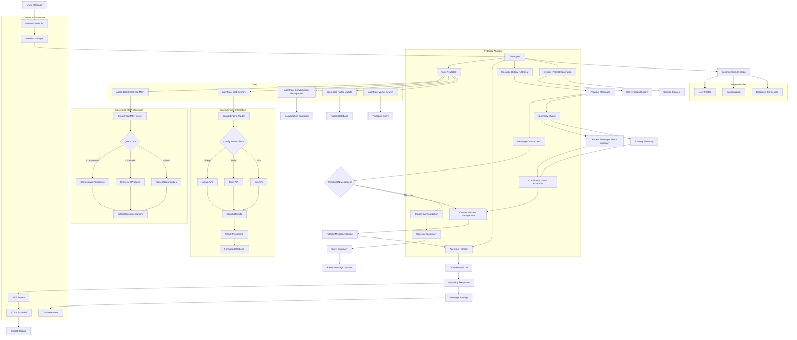

# Simple Chat Agent Design
> **Last Updated**: September 09, 2025



## Tools

- **Vector Search**: Search knowledge base for relevant context and citations
- **Profile Update**: Capture and update customer information during conversation  
- **Conversation Management**: Create new conversations, archive old ones, generate titles and summaries
- **Web Search**: Perform real-time web searches using configured search engine provider
- **CrossFeed MCP**: Access upsell, cross-sell, and competitive positioning data via MCP Server

### Search Engine Integration

- **Search Engine Router**: Routes web search requests to the configured search provider based on agent configuration
- **Configuration Check**: Determines which search engine to use (Exa, Tavily, or Linkup) from agent instance configuration
- **Provider APIs**: Each search engine has its own API integration with provider-specific authentication and query formatting
- **Result Processing**: Normalizes search results from different providers into a consistent format
- **Formatted Citations**: Converts search results into properly formatted citations with URLs, titles, and snippets

### CrossFeed MCP Integration

- **CrossFeed MCP Server**: Extensible platform providing sales intelligence via MCP protocol
- **Query Type Classification**: Determines whether to fetch upsell, cross-sell, or competitive data
- **Upsell Opportunities**: Higher-tier products/services that can be offered to current customers
- **Cross-sell Products**: Complementary products/services that enhance customer value
- **Competitive Positioning**: Advantages of client products over competitor alternatives
- **Sales Recommendations**: Formatted sales guidance combining opportunity data with customer context

### Context Management Strategy

- **Summary Check**: Determine if conversation has existing summary and identify recent messages since last summary
- **Combined Context Assembly**: Merge existing summary with recent messages to create optimal context for LLM
- **Message Count Check**: Track message count against configuration setting N for automatic summarization
- **Trigger Summarization**: When N messages reached, initiate summarization process to condense conversation history
- **Generate Summary**: Create concise summary of conversation maintaining key context and decisions
- **Store Summary**: Persist summary to database and reset message counter for next cycle

## Design

Following Pydantic AI conventions and the code organization structure, here's how to implement the chat agent:

### Widget Architecture Decision
**Reference**: [`/memorybank/architecture/chat-widget-architecture.md`](../architecture/chat-widget-architecture.md)

**Summary**: Hybrid component-based architecture with shared foundation and agent-specific customization layers.
**Simple Chat Impact**: Uses unified widget as foundation for future specialization.

### Agent Dependencies

```python
from dataclasses import dataclass
from typing import Optional

from pydantic_ai import Agent, RunContext

@dataclass
class ChatDependencies:
    account_id: str
    session_id: str
    agent_instance_id: str
    db: DatabaseConn
    vector_config: VectorDBConfig
    search_engines: Dict[str, SearchEngineConfig]
    mcp_clients: Dict[str, MCPClient]
    conversation_context: Optional[ConversationContext]
```

### Agent Output Models

```python
from pydantic import BaseModel, Field

class ChatResponse(BaseModel):
    message: str = Field(description="Response message to the user")
    sources: List[CitationSource] = Field(default=[], description="Sources used in response")
    actions_taken: List[str] = Field(default=[], description="Tools used during response")
    conversation_metadata: Dict[str, Any] = Field(default={}, description="Metadata for conversation management")
```

### Agent Definition

```python
chat_agent = Agent(
    'openai:gpt-4o',
    deps_type=ChatDependencies,
    output_type=ChatResponse,
    system_prompt="You are a helpful AI assistant with access to search, knowledge bases, and conversation management tools."
)

@chat_agent.system_prompt
async def dynamic_system_prompt(ctx: RunContext[ChatDependencies]) -> str:
    # Load conversation context and user profile
    session_info = await ctx.deps.db.get_session_info(ctx.deps.session_id)
    return f"User's name: {session_info.user_name}. Continue the conversation naturally."
```

### Tool Implementation

```python
@chat_agent.tool
async def vector_search(
    ctx: RunContext[ChatDependencies], 
    query: str, 
    max_results: int = 5
) -> List[SearchResult]:
    """Search knowledge base for relevant context and citations."""
    results = await ctx.deps.vector_config.similarity_search(
        query=query,
        namespace=f"account-{ctx.deps.account_id}",
        limit=max_results
    )
    return [SearchResult.from_vector(r) for r in results]

@chat_agent.tool
async def web_search(
    ctx: RunContext[ChatDependencies],
    query: str,
    engine: str = "exa"
) -> List[WebSearchResult]:
    """Perform real-time web search using configured search engine."""
    search_config = ctx.deps.search_engines.get(engine)
    if not search_config:
        raise ValueError(f"Search engine {engine} not configured")
    
    client = SearchEngineFactory.create(engine, search_config)
    results = await client.search(query)
    return [WebSearchResult.from_engine(r) for r in results]

@chat_agent.tool
async def crossfeed_query(
    ctx: RunContext[ChatDependencies],
    query_type: Literal["upsell", "cross-sell", "competitive"],
    context: str
) -> SalesRecommendations:
    """Access sales intelligence via CrossFeed MCP Server."""
    mcp_client = ctx.deps.mcp_clients.get("crossfeed")
    if not mcp_client:
        raise ValueError("CrossFeed MCP client not available")
    
    response = await mcp_client.call_tool(
        "get_recommendations",
        {"type": query_type, "context": context, "account_id": ctx.deps.account_id}
    )
    return SalesRecommendations.from_mcp_response(response)

@chat_agent.tool
async def conversation_management(
    ctx: RunContext[ChatDependencies],
    action: Literal["create", "archive", "summarize"],
    conversation_id: Optional[str] = None
) -> ConversationAction:
    """Manage conversations - create, archive, or summarize."""
    if action == "create":
        conv_id = await ctx.deps.db.create_conversation(ctx.deps.session_id)
        return ConversationAction(action="created", conversation_id=conv_id)
    elif action == "summarize":
        summary = await generate_conversation_summary(ctx.deps.db, conversation_id)
        await ctx.deps.db.store_conversation_summary(conversation_id, summary)
        return ConversationAction(action="summarized", summary=summary)
```

### Agent Factory Integration

```python
# Located in backend/app/agents/factory/agent_factory.py
class AgentFactory:
    async def create_chat_agent(
        self, 
        account_id: str, 
        agent_instance_id: str,
        session_id: str
    ) -> Agent:
        # Load instance configuration from database
        config = await self._load_agent_config(account_id, agent_instance_id)
        
        # Create dependencies
        deps = ChatDependencies(
            account_id=account_id,
            session_id=session_id,
            agent_instance_id=agent_instance_id,
            db=self.db_pool.get_connection(),
            vector_config=self._create_vector_config(config),
            search_engines=self._create_search_configs(config),
            mcp_clients=self._create_mcp_clients(config)
        )
        
        return chat_agent, deps
```

### FastAPI Integration

```python
# Located in backend/app/main.py
@app.post("/chat")
async def chat_endpoint(
    request: ChatRequest,
    session_id: str = Depends(get_session_id)
):
    # Get agent instance
    agent, deps = await agent_factory.create_chat_agent(
        account_id=request.account_id,
        agent_instance_id=request.agent_instance_id,
        session_id=session_id
    )
    
    # Run agent with streaming
    async for chunk in agent.run_stream(request.message, deps=deps):
        yield f"data: {chunk.model_dump_json()}\n\n"
```

### Configuration Structure

```python
# Located in backend/config/agent_templates/simple_chat.yaml
agent_type: "chat"
system_prompt: |
  You are a helpful AI assistant with access to multiple tools.
  Always provide accurate, helpful responses with proper citations.

tools:
  vector_search:
    enabled: true
    max_results: 5
  web_search:
    enabled: true
    default_engine: "exa"
  crossfeed_mcp:
    enabled: true
    server_url: "mcp://crossfeed"
  conversation_management:
    enabled: true
    auto_summarize_threshold: 10

model_settings:
  model: "openai:gpt-4o"
  temperature: 0.3
  max_tokens: 2000
```

This design follows Pydantic AI patterns with type-safe dependencies, structured outputs, and tool registration while integrating with the multi-account architecture and agent factory system.
