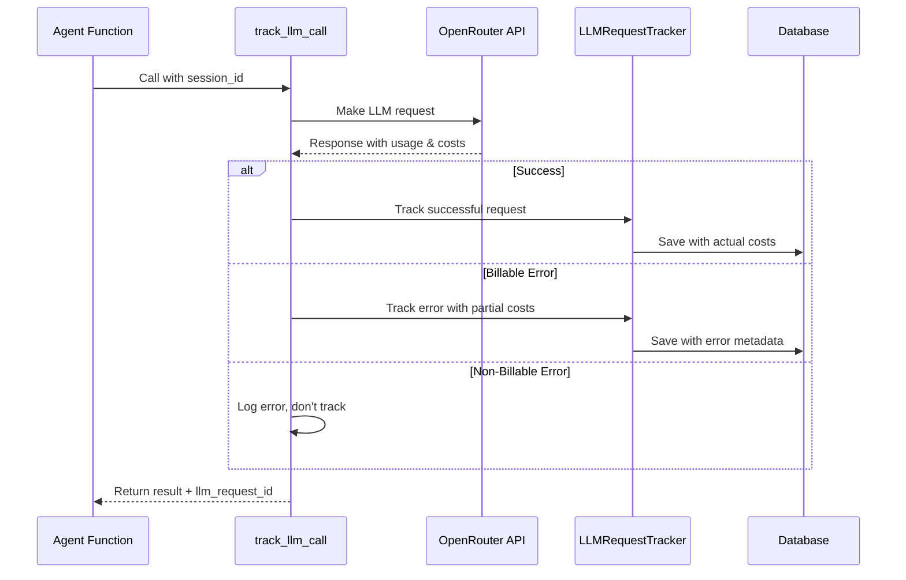

# LLM Cost Tracking Architecture

> Comprehensive documentation for tracking all LLM requests, responses, token usage, and costs across all agent types using the wrapper function pattern.

## Overview

The LLM cost tracking system provides accurate billing data by capturing every billable interaction with OpenRouter and other LLM providers. It uses a **wrapper function pattern** for explicit, consistent tracking across all agent types.

## Architecture Components

### Core Service: LLMRequestTracker

```python
# backend/app/services/llm_request_tracker.py
class LLMRequestTracker:
    """Shared service for tracking all LLM requests across agent types."""
```

**Key Features:**
- ✅ **Real-time cost capture** from OpenRouter actual billing data
- ✅ **Comprehensive error tracking** for billable failures (timeouts, rate limits)
- ✅ **Database persistence** following datamodel.md schema exactly
- ✅ **Default account support** for Phase 1 development
- ✅ **Performance optimized** (<50ms tracking overhead)

### Wrapper Function Pattern

```python
# All agents use the same tracking wrapper
async def track_llm_call(agent_function, session_id, *args, **kwargs):
    """Wrapper function that tracks any LLM agent call."""
```

**Benefits:**
- **Explicit tracking** - developers know when cost tracking occurs
- **Easy testing** - clear call stack for debugging
- **Consistent usage** - same pattern across all agent types
- **Fine-grained control** - can customize per call if needed

## Usage Patterns

### 1. Simple Chat Agent

```python
# backend/app/agents/simple_chat.py
from app.services.llm_request_tracker import track_llm_call

async def simple_chat_endpoint(chat_request: ChatRequest, request: Request):
    # Get session and dependencies
    session = get_current_session(request)
    session_deps = SessionDependencies(session_id=session.id)
    
    # Track the LLM call
    result, llm_request_id = await track_llm_call(
        chat_agent.run,           # The agent function to call
        session.id,               # Session ID for tracking
        chat_request.message,     # Agent function arguments...
        deps=session_deps,
        message_history=message_history
    )
    
    # Link the LLM request to saved messages
    await message_service.save_message(
        session_id=session.id,
        role="assistant", 
        content=result.output,
        metadata={"llm_request_id": str(llm_request_id)}  # Link for billing
    )
    
    return PlainTextResponse(result.output)
```

### 2. Sales Agent (Future)

```python
# backend/app/agents/sales_agent.py
async def sales_agent_call(message: str, session_deps: SessionDependencies):
    # Same wrapper pattern for consistent tracking
    result, llm_request_id = await track_llm_call(
        sales_agent.run,
        session_deps.session_id,
        message,
        deps=session_deps
    )
    
    return result, llm_request_id
```

### 3. Tool Usage (Vector Search, Web Search)

```python
# Tools automatically tracked through agent.run() wrapper
@chat_agent.tool
async def vector_search(ctx: RunContext[SessionDependencies], query: str):
    # Vector search itself doesn't call LLM directly
    # But the agent.run() call that triggered this tool is already tracked
    results = await vector_service.query(query, ctx.deps.session_id)
    return format_results(results)
```

## Data Captured

### Successful Requests
```python
llm_request = {
    "session_id": "uuid",
    "agent_instance_id": "default-agent-uuid", 
    "provider": "openrouter",
    "model": "deepseek/deepseek-chat-v3.1",
    "request_body": {"messages": "sanitized"},
    "response_body": {"response": "sanitized"},
    "prompt_tokens": 150,
    "completion_tokens": 75,
    "total_tokens": 225,
    "unit_cost_prompt": 0.000001,      # From OpenRouter actuals
    "unit_cost_completion": 0.000002,  # From OpenRouter actuals
    "computed_cost": 0.000225,         # From OpenRouter actuals
    "latency_ms": 1250,
    "created_at": "2024-01-01T10:00:00Z"
}
```

### Error Requests (Billable)
```python
llm_request = {
    # ... same base fields ...
    "tokens": {"prompt": 150, "completion": 0, "total": 150},
    "computed_cost": 0.00015,  # Partial cost for consumed tokens
    "response_body": {
        "error_metadata": {
            "error_type": "TimeoutError",
            "error_message": "Request timeout after 30s",
            "billable": True
        }
    }
}
```

## Billable vs Non-Billable Errors

### ✅ Billable (Tracked for Customer Billing)
- **Timeouts** - LLM started processing, consumed tokens
- **Rate limits** - Tokens consumed before limit hit
- **Content filtering** - Tokens processed before filter triggered  
- **Partial responses** - Max tokens reached, partial completion
- **Model availability** - Provider started processing before failure

### ❌ Non-Billable (Logged but Not Tracked)
- **Network failures** - Request never reached provider
- **Invalid requests** - Rejected before processing starts
- **Authentication errors** - No processing attempted
- **Malformed input** - Rejected at validation stage

## Cost Calculation Flow



## Default Account Structure (Phase 1)

```python
# Fixed UUIDs for Phase 1 development
DEFAULT_ACCOUNT_ID = UUID("00000000-0000-0000-0000-000000000001")
DEFAULT_AGENT_INSTANCE_ID = UUID("00000000-0000-0000-0000-000000000002")

# Database setup
accounts = {
    "id": DEFAULT_ACCOUNT_ID,
    "name": "Default Account", 
    "slug": "default",
    "subscription_tier": "standard",
    "is_active": True
}

agent_instances = {
    "id": DEFAULT_AGENT_INSTANCE_ID,
    "account_id": DEFAULT_ACCOUNT_ID,
    "agent_type": "simple_chat",
    "instance_name": "default",
    "display_name": "Default Simple Chat Agent",
    "status": "active"
}
```

## Performance Considerations

### Tracking Overhead
- **Target**: <50ms additional latency per request
- **Database writes**: Async, don't block response to user
- **Error handling**: Failed tracking doesn't break chat functionality

### Optimization Strategies
```python
# Async database operations
async def save_to_db():
    # Non-blocking save operation
    pass

# Sanitize payloads to reduce storage
def sanitize_request_body(body):
    return {
        "message_count": len(body.get("messages", [])),
        "model": body.get("model"),
        "temperature": body.get("temperature")
        # Remove actual message content for privacy
    }
```

## Testing Strategy

### Unit Tests
```python
async def test_successful_tracking():
    # Test successful LLM call tracking
    pass

async def test_error_tracking_billable():
    # Test billable error scenarios
    pass

async def test_error_tracking_non_billable():
    # Test non-billable errors are logged but not tracked
    pass
```

### Integration Tests
```python
async def test_database_persistence():
    # Test data is correctly saved to llm_requests table
    pass

async def test_openrouter_cost_extraction():
    # Test actual OpenRouter response cost parsing
    pass
```

## Migration to Multi-Account (Phase 3)

```python
# Phase 3: Real account and agent instance IDs
async def track_llm_call(
    agent_function, 
    session_id, 
    account_id,        # NEW: Real account ID
    agent_instance_id, # NEW: Real agent instance ID
    *args, **kwargs
):
    # Use provided IDs instead of defaults
    pass
```

## Monitoring & Analytics

### Cost Analytics Queries
```sql
-- Session-level cost analysis
SELECT 
    session_id,
    SUM(computed_cost) as total_cost,
    SUM(total_tokens) as total_tokens,
    COUNT(*) as request_count
FROM llm_requests 
WHERE created_at >= NOW() - INTERVAL '1 day'
GROUP BY session_id;

-- Agent performance analysis  
SELECT
    agent_instance_id,
    AVG(latency_ms) as avg_latency,
    AVG(computed_cost) as avg_cost,
    COUNT(*) as request_count
FROM llm_requests
GROUP BY agent_instance_id;
```

### Error Rate Monitoring
```sql
-- Billable error rate by provider/model
SELECT
    provider,
    model,
    COUNT(CASE WHEN response_body->>'error_metadata' IS NOT NULL THEN 1 END) as error_count,
    COUNT(*) as total_requests,
    ROUND(100.0 * COUNT(CASE WHEN response_body->>'error_metadata' IS NOT NULL THEN 1 END) / COUNT(*), 2) as error_rate_percent
FROM llm_requests
WHERE created_at >= NOW() - INTERVAL '1 hour'
GROUP BY provider, model;
```

## Security Considerations

### Data Sanitization
- **Request bodies**: Remove actual message content, keep metadata  
- **Response bodies**: Remove generated text, keep usage statistics
- **Error messages**: Log errors securely, don't expose internal details

### Access Control
- **Cost data**: Sensitive billing information, restrict access
- **Session linkage**: Don't expose cross-session cost data
- **Agent performance**: Account-scoped access only

## Future Enhancements

### Batch Processing (if needed)
```python
# For high-volume scenarios
async def batch_track_requests(requests: List[LLMRequestData]):
    # Bulk insert for performance
    pass
```

### Real-Time Cost Limits
```python  
async def check_cost_limit(session_id: UUID) -> bool:
    # Check if session/account is approaching cost limits
    # Can be used to prevent expensive requests
    pass
```

This architecture ensures accurate, comprehensive LLM cost tracking while maintaining high performance and supporting future multi-account scaling.
