<!--
Copyright (c) 2025 Ape4, Inc. All rights reserved.
Unauthorized copying of this file is strictly prohibited.
-->

# Conversation Management System Design

> **Scope Note**: This document outlines the advanced conversation management system documented in Epic 0004-012 and related features. While comprehensive, this functionality is **likely not needed for the simple-chat agent** implementation, which can rely on Pydantic AI's native message history management with basic database persistence.

## Overview

The conversation management system provides sophisticated conversation organization, AI-powered summarization, and multi-agent context coordination for enterprise-grade chat applications. It transforms flat message sequences into structured, searchable, and intelligently managed conversation hierarchies.

## Architecture

### Core Hierarchy

```
Account (Enterprise/Organization)
└── Sessions (Browser Instances/Users)
    └── Conversations (Topic-Focused Groups)
        └── Messages (Individual Chat Turns)
            └── LLM Requests (Token/Cost Tracking)
```

### Database Schema

```sql
-- Conversation organization layer
conversations:
  id (GUID, PK)
  session_id (GUID, FK → sessions.id)
  title (VARCHAR)                    -- AI-generated or user-edited
  summary (TEXT)                     -- AI-generated conversation summary
  status (ENUM)                      -- active, archived, deleted
  message_count (INTEGER)            -- Track for summarization triggers
  last_message_at (TIMESTAMP)       -- Activity tracking
  last_visited_at (TIMESTAMP)       -- User engagement tracking
  archive_scheduled_at (TIMESTAMP)  -- Auto-archival scheduling
  created_at (TIMESTAMP)
  metadata (JSONB)                   -- Extensible conversation data

-- Agent-specific conversation context
agent_contexts:
  id (GUID, PK)
  session_id (GUID, FK → sessions.id)
  conversation_id (GUID, FK → conversations.id)
  agent_type (VARCHAR)               -- simple_chat, sales, research
  context_data (JSONB)               -- Agent-specific context state
  context_version (INTEGER)          -- Context evolution tracking
  created_at (TIMESTAMP)
  expires_at (TIMESTAMP)            -- Context TTL

-- Agent handoff tracking
agent_handoffs:
  id (GUID, PK)
  session_id (GUID, FK → sessions.id)
  conversation_id (GUID, FK → conversations.id)
  from_agent_type (VARCHAR)
  to_agent_type (VARCHAR)
  handoff_reason (VARCHAR)
  context_transferred (JSONB)
  handoff_timestamp (TIMESTAMP)
  success_score (FLOAT)              -- Handoff quality metric
```

## Conversation Lifecycle

### States and Transitions


### Lifecycle Rules

**Active Conversations:**
- Currently receiving messages or recently visited
- Displayed prominently in UI
- Full message history accessible
- Real-time updates and notifications

**Auto-Archival Triggers:**
- No activity for X days (configurable per account)
- Manual user archival
- Conversation marked complete by AI/user
- Session cleanup during account maintenance

**Archived Conversations:**
- Collapsed/minimized view in UI
- Searchable by title and summary
- Restoration available on demand
- Scheduled for eventual deletion

**Deletion Rules:**
- Retention period after archival (configurable)
- Compliance with data protection regulations
- User-requested immediate deletion
- Account-level data purge events

## AI-Powered Features

### Smart Summarization

```mermaid
flowchart TD
    A[New Message] --> B{Message Count ≥ N?}
    B -->|No| C[Continue Conversation]
    B -->|Yes| D[Trigger Summarization]
    D --> E[Load Recent Messages]
    E --> F[Generate Summary via LLM]
    F --> G[Store Summary]
    G --> H[Reset Message Counter]
    H --> I[Update Context Window]
    I --> C
    
    J[Existing Summary] --> K[Load Summary + Recent Messages]
    K --> L[Combined Context Assembly]
    L --> M[Agent Context Window]
```



**Summarization Strategy:**
- **Threshold-Based**: Trigger after N messages (configurable per agent)
- **Incremental**: Combine existing summary with new messages  
- **Cost-Optimized**: Use smaller models for summarization (e.g., gpt-4o-mini)
- **Quality Validation**: Fallback and regeneration logic
- **Versioning**: Track summary evolution for audit trails

### Intelligent Titles

**Auto-Generation:**
- Generate titles from first 1-2 messages using LLM
- Update titles as conversation evolves
- Topic classification and categorization
- Duplicate conversation detection

**User Interaction:**
- Click-to-edit title functionality
- "Ask AI to revise title" button
- Title suggestion based on conversation content
- Bulk title management for archived conversations

### Context Window Optimization

```python
class ConversationContextManager:
    async def get_agent_context(
        self,
        conversation_id: UUID,
        agent_type: str,
        max_tokens: int
    ) -> AgentContext:
        """
        Optimize conversation context for specific agent type.
        
        Strategy:
        1. Load existing summary (if available)
        2. Get recent messages since summary
        3. Apply agent-specific filtering
        4. Truncate to fit context window
        5. Include relevance scores
        """
        summary = await self.get_conversation_summary(conversation_id)
        recent_messages = await self.get_messages_since_summary(conversation_id)
        
        # Agent-specific context optimization
        context = self.optimize_for_agent(
            summary=summary,
            messages=recent_messages,
            agent_type=agent_type,
            max_tokens=max_tokens
        )
        
        return context
```

## Multi-Agent Context Management

### Agent Context Isolation

**Context Separation:**
- Each agent type maintains separate context state
- Agent-specific message filtering and relevance scoring
- Isolated memory and preference storage
- Independent context window management

**Context Sharing:**
```python
# Shared context between compatible agents
shared_context = {
    "user_profile": {...},           # Common user information
    "conversation_summary": {...},   # Neutral conversation summary  
    "session_metadata": {...}       # Session-level data
}

# Agent-specific context
agent_context = {
    "sales_opportunities": [...],    # Sales agent specific
    "research_findings": [...],      # Research agent specific
    "conversation_preferences": {...} # Agent behavior preferences
}
```

### Agent Handoffs

**Handoff Scenarios:**
- User explicitly requests different agent type
- AI determines another agent better suited for query
- Agent reaches capability limits, delegates to specialist
- Context becomes too complex for current agent

**Handoff Process:**


**Context Transfer:**
- Preserve conversation summary and recent messages
- Transfer agent-specific insights and findings
- Maintain user preferences and profile data
- Track handoff quality and success metrics

## Configuration Management

### Per-Agent Configuration

```yaml
# Agent-specific conversation settings
agents:
  simple_chat:
    conversation:
      auto_summary_threshold: 15      # Messages before summarization
      summary_model: "gpt-4o-mini"    # Cost-optimized model
      context_window_messages: 25     # Recent messages to include
      title_generation: true          # Auto-generate titles
      title_revision: true            # Allow user title editing
      
  sales:
    conversation:
      auto_summary_threshold: 10      # More frequent for sales context
      summary_model: "gpt-4o-mini"    
      context_window_messages: 30     # Larger context for relationship
      opportunity_tracking: true      # Sales-specific features
      
  research:
    conversation:
      auto_summary_threshold: 20      # Less frequent for deep research
      summary_model: "gpt-4o"         # Higher quality for research
      context_window_messages: 50     # Maximum context for research
      finding_categorization: true    # Research-specific organization
```

### Account-Level Policies

```yaml
# Account-wide conversation management
conversation_management:
  archival_policy:
    auto_archive_days: 30            # Archive inactive conversations
    retention_days: 365              # Keep archived conversations
    
  summarization:
    batch_processing: true           # Background summarization
    cost_optimization: true          # Use efficient models
    
  user_controls:
    manual_archival: true            # Allow user archival
    title_editing: true              # Allow title customization
    conversation_export: true        # Data export capabilities
    
  compliance:
    data_retention: true             # Honor retention policies
    right_to_deletion: true          # GDPR compliance
    audit_logging: true              # Track all conversation operations
```

## UI/UX Design Patterns

### Conversation Sidebar

```
┌─────────────────────────────────┐
│ 🔍 Search conversations...     │
├─────────────────────────────────┤
│ ✨ Active Conversations        │
│ • Product Inquiry (3m ago)     │
│ • Support Request (1h ago)     │
│ • Order Status (2h ago)        │
├─────────────────────────────────┤
│ 📦 Archived (15)               │
│ ▸ Last Week (5)                │ 
│ ▸ Last Month (10)              │
├─────────────────────────────────┤
│ ➕ New Conversation            │
└─────────────────────────────────┘
```

### Conversation Header

```
┌─────────────────────────────────────────┐
│ 📝 Product Inquiry ✏️           🗃️ 🗑️ │
│ Summary: Customer asking about apple    │
│ varieties and pricing for bulk orders   │
│ Agent: Simple Chat • 12 messages • 3h  │
└─────────────────────────────────────────┘
```

### Context Indicators

```
┌─────────────────────────────────────────┐
│ 💭 Using conversation summary +         │
│    last 8 messages for context         │
│ 🤖 Agent has full conversation history │
└─────────────────────────────────────────┘
```

## Implementation Services

### Core Services

```python
# Conversation lifecycle management
class ConversationService:
    async def create_conversation(session_id: UUID) -> UUID
    async def get_active_conversations(session_id: UUID) -> List[Conversation]
    async def archive_conversation(conversation_id: UUID, reason: str) -> bool
    async def restore_conversation(conversation_id: UUID) -> bool
    async def delete_conversation(conversation_id: UUID) -> bool

# AI-powered conversation intelligence  
class ConversationIntelligenceService:
    async def generate_title(conversation_id: UUID) -> str
    async def revise_title(conversation_id: UUID, context: str) -> str
    async def generate_summary(conversation_id: UUID) -> str
    async def update_summary_incremental(conversation_id: UUID) -> str

# Multi-agent context coordination
class AgentContextService:
    async def get_conversation_context(
        conversation_id: UUID, 
        agent_type: str,
        max_tokens: int
    ) -> AgentContext
    
    async def handle_agent_handoff(
        conversation_id: UUID,
        from_agent: str, 
        to_agent: str,
        handoff_context: dict
    ) -> HandoffResult
```

### Integration Points

**With Pydantic AI Agents:**
- Context injection via dependency system
- Tool integration for conversation management
- Automatic context optimization per agent type
- Handoff coordination between agent instances

**With Session Management:**
- Seamless integration with existing session system
- No changes to session cookie or authentication
- Backward compatibility with flat message history
- Migration path from simple to hierarchical conversations

**With Vector Databases:**
- Conversation-scoped vector namespaces
- Summary and title vectorization for search
- Context relevance scoring for retrieval
- Cross-conversation knowledge discovery

## Performance Considerations

### Scalability Patterns

**Database Optimization:**
- Partition conversations by account/time
- Index on session_id, status, last_visited_at
- Efficient pagination for conversation lists
- Background batch processing for archival

**Context Window Caching:**
- LRU cache for frequently accessed contexts
- Pre-computed context summaries
- Lazy loading of full message history
- Context compression for long conversations

**AI Cost Management:**
- Batch summarization during low-usage periods
- Cost-optimized models for routine operations
- Smart caching of AI-generated content
- Rate limiting and quota management

## Migration Strategy

### From Simple Message History

**Phase 1: Additive Schema**
- Add conversations table alongside existing messages
- Default conversation per session for backward compatibility
- No disruption to existing functionality

**Phase 2: Gradual Migration**  
- Background process to group messages into logical conversations
- AI-powered conversation boundary detection
- User validation and correction of auto-generated conversations

**Phase 3: Full Feature Enablement**
- Enable conversation management UI
- Activate AI summarization and title generation
- Multi-agent context features
- Advanced archival and lifecycle management

## Future Enhancements

### Advanced Features

**Conversation Analytics:**
- Success rate tracking per conversation type
- Agent performance across conversation patterns  
- User engagement metrics and optimization
- Conversation outcome prediction

**Cross-Conversation Intelligence:**
- Knowledge graph construction from conversations
- Pattern recognition across user interactions
- Predictive conversation routing
- Automated follow-up and task creation

**Enterprise Features:**
- Conversation templates and automation
- Compliance and audit trail management
- Team collaboration on conversations
- Integration with CRM and support systems

---

## Relationship to Simple Chat Agent

**Why This May Be Overkill for Simple Chat:**

1. **Pydantic AI Native History**: Pydantic AI provides built-in conversation memory that may be sufficient
2. **Complexity vs. Value**: Advanced conversation management adds significant complexity for potentially minimal initial value
3. **Implementation Overhead**: Full conversation hierarchy requires substantial development effort
4. **User Experience**: Simple flat message history may be perfectly adequate for most use cases

**Recommended Approach for Simple Chat:**
- Start with Pydantic AI's native message history
- Add basic database persistence (messages table)
- Consider conversation management as future enhancement if user needs emerge
- Focus implementation effort on core agent functionality (tools, vector search, web search)

**If Conversation Management Is Needed Later:**
This design provides a clear path to add sophisticated conversation management without disrupting the core agent functionality, allowing for evolutionary enhancement based on real user needs and feedback.
