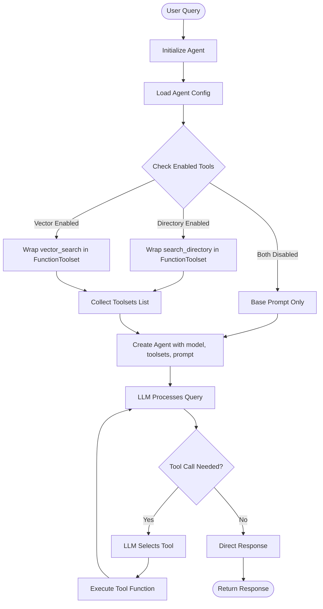
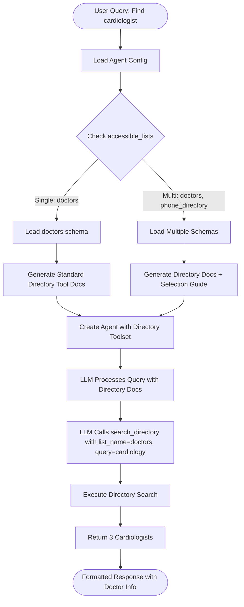
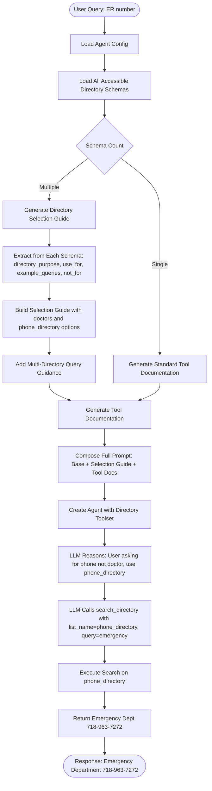
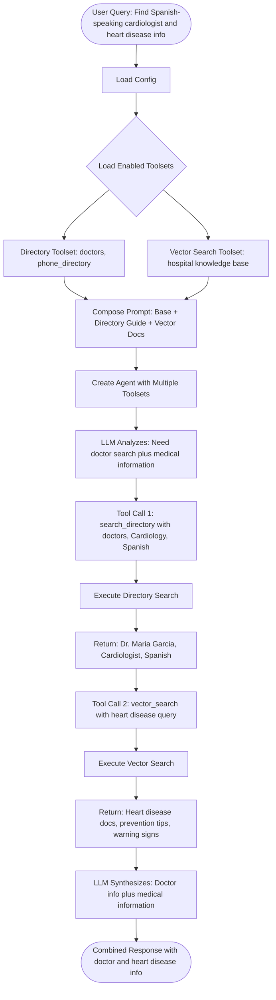
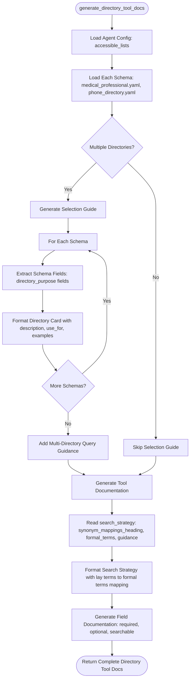
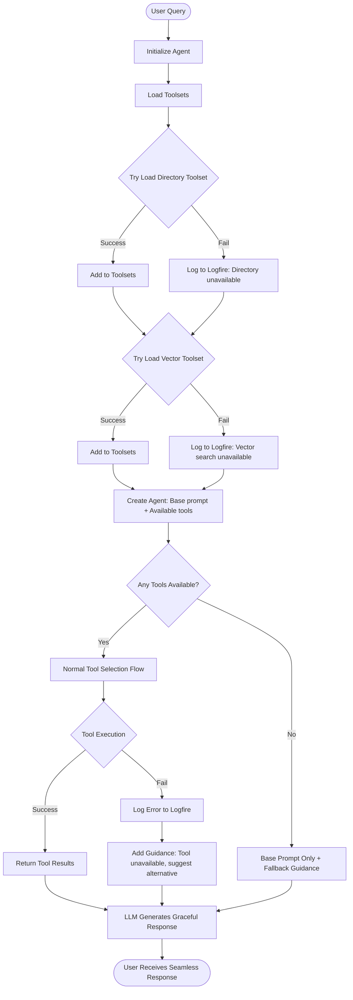
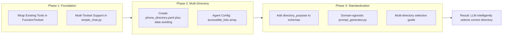

<!--
Copyright (c) 2025 Ape4, Inc. All rights reserved.
Unauthorized copying of this file is strictly prohibited.
-->

# Dynamic Prompting Function Call Flow (Phases 1-3)

Mermaid diagrams showing the function calling flow for Phases 1-3 of the dynamic prompting architecture.

---

## Phase 1: Pydantic AI Native Toolsets

Foundation for multi-tool support using Pydantic AI's native features.

**Key Components**:
- `toolsets.py`: Wraps existing `directory_tools.py` and `vector_tools.py`
- `simple_chat.py`: Conditional toolset loading based on config
- Pydantic AI handles tool orchestration natively

---

## Phase 2: Multi-Directory Prerequisites

Adds phone directory as second directory type, creating real multi-directory scenario.

**Key Changes**:
- Agent config has `accessible_lists: ["doctors", "phone_directory"]`
- Two schemas loaded: `medical_professional.yaml` + `phone_directory.yaml`
- Tool execution unchanged (same `search_directory` function)

---

## Phase 3: Schema Standardization + Multi-Directory Selection

Domain-agnostic prompt generation with intelligent directory selection guide.

**Key Features**:
- Schema-driven selection guide generation
- Domain-agnostic `prompt_generator.py` (reads from schemas)
- LLM uses `directory_purpose` to choose correct directory
- Same tool execution (no code changes to `search_directory`)

---

## Phase 3: Multi-Tool Query Example

Complex query requiring both directory and vector search.

**Key Capabilities**:
- Multiple toolsets work together
- LLM decides which tools to call based on query
- Sequential tool calls (directory → vector)
- Response synthesis combines results

---

## Detailed Prompt Generation Flow (Phase 3)

How `prompt_generator.py` creates domain-agnostic prompts from schemas.

**Key Design Principles**:
- All domain knowledge in schemas (not Python code)
- `directory_purpose` drives selection guide
- `formal_terms` standardized across all schemas
- `prompt_generator.py` is purely domain-agnostic

---

## Error Handling Flow (Phase 3)

Graceful degradation when tools fail.

**Graceful Degradation**:
- Tool failures logged but don't crash agent
- LLM receives guidance on how to handle unavailable tools
- User experience remains seamless
- Partial failures handled (some tools work, others don't)

---

## Summary: Phases 1-3 Flow

**Value Delivered**:
- **Phase 1**: Multi-tool infrastructure (testable immediately)
- **Phase 2**: Real multi-directory scenario (doctors + phone_directory)
- **Phase 3**: Schema-driven selection (unlimited directory types)

**Backward Compatibility**: All phases are incremental, existing agents work unchanged.

