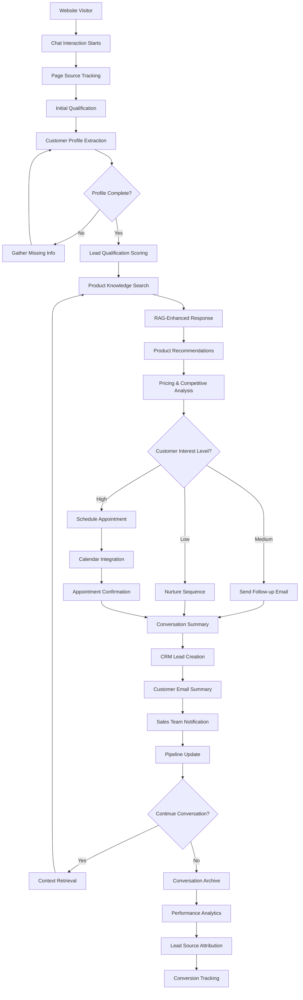

<!--
Copyright (c) 2025 Ape4, Inc. All rights reserved.
Unauthorized copying of this file is strictly prohibited.
-->

# Epic 0008 - Sales Agent (Milestone 1)
> **Last Updated**: August 28, 2025

> Goal: Implement Pydantic AI-powered sales agent with essential CRM integration, customer profile capture, conversation summaries, and appointment scheduling to establish the foundation for a complete sales automation system.

**Framework**: Built on Pydantic AI with structured tools for CRM, email, scheduling, and vector search capabilities.

## Agent Flow Diagram



## Scope & Approach

### Milestone 1 Core Capabilities
- **Page Source Tracking**: Track which website page initiated each conversation
- **Customer Profile Capture**: Collect and store customer information during conversations
- **Conversation Summaries**: Generate and send summaries to customers and sales team
- **Appointment Scheduling**: Enable booking of sales appointments
- **CRM Integration**: Log leads and conversations into Zoho, Salesforce, and HubSpot
- **RAG-Powered Responses**: Use ingested website content to provide accurate product information

### Target Workflows
- **Lead Capture**: Track page source and capture customer details during conversation
- **Content-Informed Responses**: Use website content from vector database for accurate answers
- **Summary Generation**: Create conversation summaries for follow-up
- **Appointment Booking**: Schedule sales meetings directly from chat
- **CRM Sync**: Automatically log leads and conversations to CRM systems

## Pydantic AI Implementation Plan

### FEATURE 0008-001 - Sales Agent Framework
> Establish Pydantic AI-powered sales agent with core functionality

#### TASK 0008-001-001 - Basic Sales Agent Setup
- [ ] 0008-001-001-01 - CHUNK - Sales agent class implementation
  - Create `SalesAgent` class inheriting from base agent
  - Define sales-specific dependencies and configuration
  - Implement basic sales conversation system prompt
  - **Acceptance**: Sales agent responds to basic inquiries
  - **Dependencies**: Requires 0005-001 (Pydantic AI Framework Setup)

- [ ] 0008-001-001-02 - CHUNK - Sales agent dependencies
  - Implement `SalesDependencies` with CRM configs and vector access
  - Add customer profile and conversation tracking dependencies
  - Create sales agent dependency factory
  - **Acceptance**: Sales agent receives all required dependencies

- [ ] 0008-001-001-03 - CHUNK - Sales agent output models
  - Define Pydantic models for lead qualification output
  - Create structured models for product recommendations
  - Implement conversation summary output models
  - **Acceptance**: Sales agent returns structured, validated outputs

#### TASK 0008-001-002 - Sales Agent Tools Integration
- [ ] 0008-001-002-01 - CHUNK - Profile capture tools
  - Implement `@sales_agent.tool` for customer profile extraction
  - Add profile validation and completion tools
  - Create profile scoring and qualification tools
  - **Acceptance**: Agent captures customer profiles during conversation

- [ ] 0008-001-002-02 - CHUNK - Page tracking tools
  - Implement referrer and page source tracking tools
  - Add lead source attribution and analytics tools
  - Create conversion funnel tracking tools
  - **Acceptance**: Agent tracks conversation sources accurately

### FEATURE 0008-002 - Sales Agent Intelligence (RAG)
> Enhance sales agent with sales-specific knowledge and customer intelligence

#### TASK 0008-002-001 - Sales Knowledge Tools
- [ ] 0008-002-001-01 - CHUNK - Product knowledge tools
  - Implement `@sales_agent.tool` for sales-focused product search
  - Add competitive analysis and product comparison tools  
  - Create pricing strategy and discount authorization tools
  - **Acceptance**: Agent provides sales-optimized product information
  - **Dependencies**: Requires 0011-003 (Semantic Search & Retrieval)

- [ ] 0008-002-001-02 - CHUNK - Customer intelligence tools
  - Implement customer history and interaction analysis tools
  - Add lead scoring and qualification intelligence tools
  - Create sales opportunity identification tools
  - **Acceptance**: Agent leverages customer data for sales optimization

#### TASK 0008-002-002 - Sales Context Management
- [ ] 0008-002-002-01 - CHUNK - Sales conversation context
  - Implement sales pipeline and opportunity context
  - Add customer journey and touchpoint tracking
  - Create sales process and methodology integration
  - **Acceptance**: Agent maintains sales-focused conversation context
  - **Dependencies**: Requires 0004-013 (Agent Context Management)

### FEATURE 0008-003 - Sales Agent Business Tools
> Equip sales agent with CRM, email, and scheduling capabilities

#### TASK 0008-003-001 - CRM Integration Tools
- [ ] 0008-003-001-01 - CHUNK - Zoho CRM tools
  - Implement `@sales_agent.tool` for Zoho lead creation
  - Add contact and opportunity management tools
  - Create activity logging and note-taking tools
  - **Acceptance**: Agent creates and manages Zoho CRM records

- [ ] 0008-003-001-02 - CHUNK - Lead qualification tools
  - Implement lead scoring and qualification tools
  - Add pipeline stage management tools
  - Create follow-up scheduling and reminder tools
  - **Acceptance**: Agent qualifies leads and manages pipeline

#### TASK 0008-003-002 - Communication Tools
- [ ] 0008-003-002-01 - CHUNK - Email integration tools
  - Implement `@sales_agent.tool` for email sending
  - Add conversation summary email tools
  - Create follow-up email sequence tools
  - **Acceptance**: Agent sends emails with summaries and follow-ups

- [ ] 0008-003-002-02 - CHUNK - Scheduling tools
  - Implement `@sales_agent.tool` for appointment booking
  - Add calendar availability checking tools
  - Create meeting confirmation and reminder tools
  - **Acceptance**: Agent books appointments and manages calendar

### FEATURE 0008-004 - Sales Agent Optimization
> Optimize sales agent performance and capabilities

#### TASK 0008-004-001 - Performance Optimization
- [ ] 0008-004-001-01 - CHUNK - Response optimization
  - Implement sales conversation flow optimization
  - Add response personalization based on customer profile
  - Create conversion rate tracking and improvement
  - **Acceptance**: Agent optimizes for conversion metrics

- [ ] 0008-004-001-02 - CHUNK - Tool usage optimization
  - Implement intelligent tool selection and routing
  - Add tool performance monitoring and improvement
  - Create tool usage analytics and insights
  - **Acceptance**: Agent uses tools efficiently and effectively

---

## Technical Architecture - Pydantic AI Implementation

### Sales Agent Structure
```python
@dataclass
class SalesDependencies:
    account_id: str
    db: DatabaseConn
    vector_config: VectorDBConfig
    crm_configs: Dict[str, CRMConfig]
    email_config: EmailConfig
    calendar_config: CalendarConfig
    customer_profile: Optional[CustomerProfile]

class LeadQualificationOutput(BaseModel):
    qualification_score: int = Field(ge=0, le=100)
    lead_source: str
    company_size: Optional[str]
    budget_range: Optional[str]
    timeline: Optional[str]
    next_steps: List[str]

sales_agent = Agent[SalesDependencies, LeadQualificationOutput](
    'openai:gpt-4o',
    deps_type=SalesDependencies,
    output_type=LeadQualificationOutput,
    system_prompt="You are a sales agent specialized in lead qualification..."
)

@sales_agent.tool
async def search_products(ctx: RunContext[SalesDependencies], query: str) -> List[ProductInfo]:
    """Search product knowledge base for relevant information."""
    vector_results = await vector_search(ctx.deps.vector_config, query)
    return parse_products(vector_results)

@sales_agent.tool  
async def create_crm_lead(ctx: RunContext[SalesDependencies], lead_data: LeadData) -> str:
    """Create a new lead in the CRM system."""
    crm_config = ctx.deps.crm_configs["zoho"]
    lead_id = await crm_client.create_lead(crm_config, lead_data)
    return f"Lead created with ID: {lead_id}"
```

### Agent Module Structure
```
backend/app/agents/sales/
├── __init__.py
├── agent.py                  # Main SalesAgent class
├── models.py                 # Sales-specific Pydantic models
├── dependencies.py           # SalesDependencies class
├── config.py                 # Sales agent configuration
└── tools/
    ├── __init__.py
    ├── crm_tools.py          # CRM integration tools
    ├── email_tools.py        # Email and communication tools
    ├── scheduling_tools.py   # Calendar and appointment tools
    ├── product_tools.py      # Product search and recommendation tools
    └── profile_tools.py      # Customer profile tools
```

---

## Legacy Requirements (Updated for Pydantic AI)

### [ ] 0008-005 - FEATURE - Page Source & Lead Tracking

#### [ ] 0008-001-001 - TASK - Request Source Tracking
- [ ] 0008-001-001-01 - CHUNK - Page referrer capture
  - SUB-TASKS:
    - Add `referrer_page` field to sessions table
    - Track `document.referrer` and custom page parameters in chat widgets
    - Store page source in session metadata for all chat integration strategies
    - Add API endpoints to retrieve lead source analytics
    - Acceptance: Every conversation tracks the originating website page

#### [ ] 0008-001-002 - TASK - Customer Profile Integration
- [ ] 0008-001-002-01 - CHUNK - Enhanced profile capture
  - SUB-TASKS:
    - Extend existing `profiles` table with company and industry fields
    - Build on 0004-006 Profile Data Collection functionality
    - Add real-time profile extraction during conversations
    - Create profile completion prompts and validation
    - Acceptance: Customer profiles captured and linked to conversations
    - Dependencies: Requires 0004-006 completion

### [ ] 0008-006 - FEATURE - Sales Performance Analytics
> Track and optimize sales agent performance and conversion metrics

#### [ ] 0008-006-001 - TASK - Sales Metrics Tracking
- [ ] 0008-006-001-01 - CHUNK - Conversion tracking and analytics
  - SUB-TASKS:
    - Track lead qualification rates and conversion metrics
    - Monitor appointment booking success rates
    - Measure CRM integration effectiveness and data quality
    - Analyze customer engagement and response patterns
    - Acceptance: Comprehensive sales performance visibility
    - Dependencies: Requires sales agent implementation (0008-001 through 0008-003)

### [ ] 0008-003 - FEATURE - Conversation Summaries & Communication

#### [ ] 0008-003-001 - TASK - Summary Generation & Distribution
- [ ] 0008-003-001-01 - CHUNK - Conversation summarization
  - SUB-TASKS:
    - Build on 0004-012-003 Conversation Summarization functionality
    - Create sales-specific summary templates (lead info, interests, next steps)
    - Add email delivery capability for summary distribution
    - Implement summary customization for customer vs. sales team
    - Acceptance: Automated conversation summaries sent to relevant parties
    - Dependencies: Requires 0004-012 Conversation Hierarchy completion

### [ ] 0008-004 - FEATURE - Appointment Scheduling

#### [ ] 0008-004-001 - TASK - Calendar Integration
- [ ] 0008-004-001-01 - CHUNK - Scheduling system implementation
  - SUB-TASKS:
    - Integrate with Google Calendar API for availability checking
    - Add Calendly integration for seamless booking flow
    - Create appointment booking interface within chat
    - Add timezone handling and confirmation emails
    - Implement appointment modification and cancellation
    - Acceptance: Customers can book sales appointments directly from chat

### [ ] 0008-005 - FEATURE - CRM Integration

#### [ ] 0008-005-001 - TASK - Core CRM Connectivity
- [ ] 0008-005-001-01 - CHUNK - Zoho CRM integration
  - SUB-TASKS:
    - Implement Zoho CRM API integration for lead creation
    - Add contact and opportunity logging functionality
    - Create conversation history sync to CRM activities
    - Add custom field mapping for profile data
    - Acceptance: Leads and conversations automatically logged to Zoho CRM

- [ ] 0008-005-001-02 - CHUNK - Salesforce integration
  - SUB-TASKS:
    - Implement Salesforce API integration for lead management
    - Add opportunity creation and activity logging
    - Create conversation attachment and note sync
    - Add profile data mapping to Salesforce fields
    - Acceptance: Complete lead lifecycle tracked in Salesforce

- [ ] 0008-005-001-03 - CHUNK - HubSpot integration
  - SUB-TASKS:
    - Implement HubSpot API integration for contact and deal creation
    - Add conversation history as HubSpot activities
    - Create custom property mapping for captured profile data
    - Add deal pipeline automation based on conversation outcomes
    - Acceptance: Leads and conversations fully integrated with HubSpot

## Technical Architecture

### Sales Agent Infrastructure
```
Prospect → Sales Agent → Lead Qualification → Product Recommendations
                ↓              ↓                       ↓
         Pricing Engine → Quote Generation → CRM Integration → Sales Team
                                                    ↓
Marketing Automation ← Follow-up Sequences ← Pipeline Management
```

### CRM Integration Schema
```sql
-- CRM system mappings
crm_integrations:
  id (GUID, PK)
  account_id (GUID, FK → accounts.id)
  crm_type (VARCHAR) -- salesforce, hubspot, dynamics, pipedrive
  api_credentials (JSONB, encrypted)
  field_mappings (JSONB)
  sync_settings (JSONB)
  last_sync (TIMESTAMP)

-- Lead and opportunity tracking
sales_leads:
  id (GUID, PK)
  session_id (GUID, FK → sessions.id)
  conversation_id (GUID, FK → conversations.id)
  crm_lead_id (VARCHAR)
  qualification_score (INTEGER)
  lead_source (VARCHAR)
  company_size (VARCHAR)
  budget_range (VARCHAR)
  timeline (VARCHAR)
  decision_maker (BOOLEAN)
  created_at (TIMESTAMP)
  qualified_at (TIMESTAMP)

-- Product interactions and recommendations
product_interactions:
  id (GUID, PK)
  lead_id (GUID, FK → sales_leads.id)
  product_id (VARCHAR)
  interaction_type (VARCHAR) -- viewed, configured, quoted
  requirements (JSONB)
  recommendations (JSONB)
  created_at (TIMESTAMP)
```

### Configuration Schema (app.yaml)
```yaml
sales_agent:
  page_tracking:
    enabled: true
    track_utm_parameters: true
    track_referrer_domain: true
  
  profile_capture:
    required_fields:
      - customer_name
      - email
    optional_fields:
      - phone
      - company
      - industry
  
  vector_database:
    # Core vector DB configuration managed in Epic 0011
    sales_namespace: "sales_content"  
    sales_specific_filters: true
    lead_scoring_integration: true
  
  conversation_summaries:
    auto_generate: true
    email_enabled: true
    send_to_customer: true
    send_to_sales_team: true
    template_style: "professional"  # professional, casual, detailed
  
  appointment_scheduling:
    enabled: true
    calendar_provider: "google"  # google, calendly, outlook
    default_duration: 30  # minutes
    advance_booking_days: 14
    timezone_handling: "auto_detect"
  
  crm_integration:
    zoho:
      enabled: false
      api_domain: "www.zohoapis.com"
    salesforce:
      enabled: false
      sandbox_mode: true
    hubspot:
      enabled: false
      portal_id: null
```

### Integration Points
- **CRM Platforms**: Zoho CRM, Salesforce, HubSpot for lead and opportunity management
- **Calendar Systems**: Google Calendar, Calendly for appointment scheduling
- **Email Services**: SMTP, SendGrid, or Mailgun for summary distribution
- **Vector Database**: Uses Epic 0011 infrastructure for sales-specific content retrieval
- **Content Sources**: Sales-focused content via Epic 0010 and 0011

### Dependencies
- **0005-001**: Pydantic AI Framework Setup (required for agent foundation)
- **0004-006**: Profile Data Collection (foundation for customer capture)
- **0004-012**: Conversation Hierarchy & Management (required for summaries)
- **0004-013**: Agent Context Management (required for sales context)
- **0011**: Vector Database Integration (provides foundational RAG capabilities)
- **0012**: Outbound Email Integration (required for summary distribution)
- **0013**: Scheduling Integration (required for appointment booking)

### Performance & Analytics
- **Lead Source Tracking**: Conversion rates by website page
- **Profile Completion**: Percentage of conversations with complete customer data
- **Summary Delivery**: Success rates for email distribution
- **Appointment Booking**: Conversion from chat to scheduled meetings
- **CRM Sync Health**: Success rates and error tracking for CRM integrations

## Success Criteria (Milestone 1)
1. **Page Source Tracking**: 100% of conversations track originating website page
2. **Profile Capture**: 80% of qualified conversations capture customer contact information
3. **Sales Intelligence**: Agent provides product recommendations and pricing guidance
4. **Lead Qualification**: Automated lead scoring and qualification during conversations
5. **Summary Generation**: Automated summaries sent to customers and sales team
6. **Appointment Booking**: Customers can schedule meetings directly from chat
7. **CRM Integration**: At least one CRM system (Zoho, Salesforce, or HubSpot) fully operational

This milestone establishes the foundation for a complete sales automation system by implementing core lead capture, content-aware responses, and essential CRM integration.
