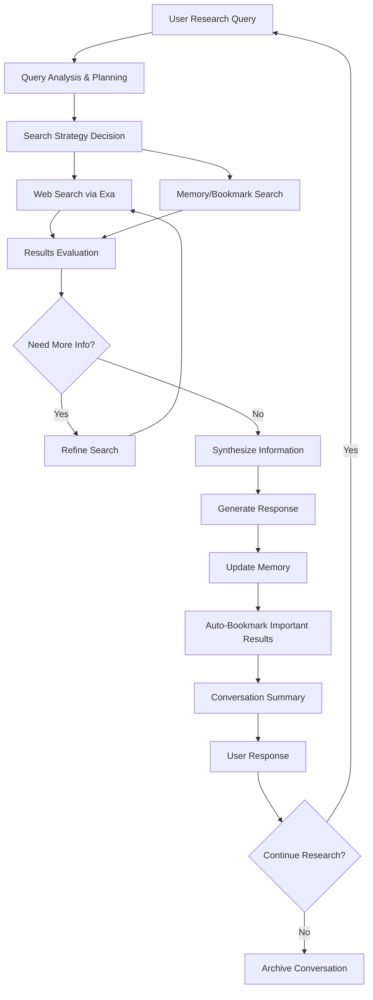

# Epic 0015 - Simple Research Agent

> Goal: Implement Pydantic AI-powered research agent with conversation history, web search capabilities, memory management, and bookmark functionality for basic research workflows.

**Framework**: Built on Pydantic AI with Exa search integration, conversation management, and memory summarization capabilities.

## Agent Flow Diagram



## Scope & Approach

### Core Capabilities
- **Multi-Conversation Support**: Maintain separate research contexts across conversations
- **Conversation History**: Track and reference previous research within conversation threads
- **Web Search Integration**: Leverage Exa search for high-quality research results
- **Memory Management**: Store and retrieve important research findings
- **Memory Summarization**: Condense research findings at specified intervals
- **Smart Bookmarking**: Automatically bookmark valuable research sources
- **Research Continuity**: Resume research across conversation sessions

### Target Workflows
- **Exploratory Research**: Initial topic investigation with iterative refinement
- **Fact Verification**: Cross-reference claims against multiple sources
- **Literature Review**: Comprehensive topic coverage with source tracking
- **Comparative Analysis**: Side-by-side evaluation of options or alternatives
- **Research Synthesis**: Combine findings from multiple research sessions

## Pydantic AI Implementation Plan

### FEATURE 0015-001 - Research Agent Framework
> Establish Pydantic AI-powered research agent with core functionality

#### TASK 0015-001-001 - Basic Research Agent Setup
- [ ] 0015-001-001-01 - CHUNK - Research agent class implementation
  - Create `ResearchAgent` class inheriting from base agent
  - Define research-specific dependencies and configuration
  - Implement research-focused conversation system prompt
  - **Acceptance**: Research agent responds to basic research queries
  - **Dependencies**: Requires 0005-001 (Pydantic AI Framework Setup)

- [ ] 0015-001-001-02 - CHUNK - Research agent dependencies
  - Implement `ResearchDependencies` with Exa API and memory configs
  - Add conversation tracking and research session dependencies
  - Create research agent dependency factory
  - **Acceptance**: Research agent receives all required dependencies

- [ ] 0015-001-001-03 - CHUNK - Research agent output models
  - Define Pydantic models for research query planning output
  - Create structured models for search results and synthesis
  - Implement research summary and bookmark output models
  - **Acceptance**: Research agent returns structured, validated outputs

#### TASK 0015-001-002 - Research Tools Integration
- [ ] 0015-001-002-01 - CHUNK - Web search tools
  - Implement `@research_agent.tool` for Exa search integration
  - Add search result filtering and ranking tools
  - Create search strategy planning and execution tools
  - **Acceptance**: Agent performs intelligent web searches

- [ ] 0015-001-002-02 - CHUNK - Memory management tools
  - Implement research memory storage and retrieval tools
  - Add memory search and association tools
  - Create memory summarization and organization tools
  - **Acceptance**: Agent maintains persistent research memory

### FEATURE 0015-002 - Conversation & History Management
> Enhance research agent with multi-conversation support and history tracking

#### TASK 0015-002-001 - Conversation Architecture
- [ ] 0015-002-001-01 - CHUNK - Research conversation models
  - Extend conversation models for research-specific metadata
  - Add research topic and progress tracking to conversations
  - Create research session linking and continuation logic
  - **Acceptance**: Research conversations maintain context and progress
  - **Dependencies**: Requires 0004-012 (Conversation Hierarchy)

- [ ] 0015-002-001-02 - CHUNK - History integration tools
  - Implement conversation history search and reference tools
  - Add cross-conversation research continuity tools
  - Create research timeline and progress tracking tools
  - **Acceptance**: Agent references and builds on previous research

#### TASK 0015-002-002 - Research Context Management
- [ ] 0015-002-002-01 - CHUNK - Research session context
  - Implement research goal and progress context tracking
  - Add research method and source preference tracking
  - Create research quality and depth optimization
  - **Acceptance**: Agent maintains focused research context
  - **Dependencies**: Requires 0004-013 (Agent Context Management)

### FEATURE 0015-003 - Advanced Search & Memory
> Equip research agent with sophisticated search and memory capabilities

#### TASK 0015-003-001 - Exa Search Integration
- [ ] 0015-003-001-01 - CHUNK - Exa API implementation
  - Implement `@research_agent.tool` for Exa search queries
  - Add search result processing and filtering
  - Create search quality assessment and ranking
  - **Acceptance**: Agent performs high-quality web searches

- [ ] 0015-003-001-02 - CHUNK - Search strategy optimization
  - Implement intelligent search query generation
  - Add search result evaluation and iteration
  - Create search coverage gap detection
  - **Acceptance**: Agent optimizes search strategies automatically

#### TASK 0015-003-002 - Memory & Bookmark System
- [ ] 0015-003-002-01 - CHUNK - Research memory storage
  - Implement structured research finding storage
  - Add memory categorization and tagging
  - Create memory relationship and association tracking
  - **Acceptance**: Agent builds comprehensive research knowledge base

- [ ] 0015-003-002-02 - CHUNK - Smart bookmarking system
  - Implement automatic bookmark creation for valuable sources
  - Add bookmark categorization and metadata extraction
  - Create bookmark recommendation and suggestion tools
  - **Acceptance**: Agent maintains organized research source library

### FEATURE 0015-004 - Research Optimization
> Optimize research agent performance and summarization capabilities

#### TASK 0015-004-001 - Memory Summarization
- [ ] 0015-004-001-01 - CHUNK - Interval-based summarization
  - Implement configurable memory summarization triggers
  - Add research progress and finding synthesis
  - Create summary quality assessment and refinement
  - **Acceptance**: Agent maintains condensed research summaries

- [ ] 0015-004-001-02 - CHUNK - Research synthesis optimization
  - Implement intelligent research finding synthesis
  - Add contradiction detection and resolution
  - Create research gap identification and filling
  - **Acceptance**: Agent produces coherent research syntheses

#### TASK 0015-004-002 - Performance Optimization
- [ ] 0015-004-002-01 - CHUNK - Research efficiency optimization
  - Implement research workflow optimization
  - Add search redundancy detection and prevention
  - Create research completion criteria and assessment
  - **Acceptance**: Agent conducts efficient, thorough research

---

## Technical Architecture - Pydantic AI Implementation

### Research Agent Structure
```python
@dataclass
class ResearchDependencies:
    account_id: str
    db: DatabaseConn
    exa_config: ExaConfig
    memory_config: MemoryConfig
    conversation_context: Optional[ConversationContext]
    research_session: Optional[ResearchSession]

class ResearchQuery(BaseModel):
    query: str
    research_depth: Literal["shallow", "moderate", "deep"]
    time_constraint: Optional[int]  # minutes
    source_preferences: List[str]
    previous_context: Optional[str]

class ResearchOutput(BaseModel):
    findings: List[ResearchFinding]
    sources: List[BookmarkedSource]
    synthesis: str
    confidence_score: float = Field(ge=0, le=1)
    research_gaps: List[str]
    next_steps: List[str]

research_agent = Agent[ResearchDependencies, ResearchOutput](
    'openai:gpt-4o',
    deps_type=ResearchDependencies,
    output_type=ResearchOutput,
    system_prompt="You are a research agent specialized in thorough investigation..."
)

@research_agent.tool
async def exa_search(ctx: RunContext[ResearchDependencies], query: str, num_results: int = 10) -> List[SearchResult]:
    """Perform high-quality web search using Exa API."""
    exa_client = ExaClient(ctx.deps.exa_config.api_key)
    results = await exa_client.search(query, num_results=num_results, use_autoprompt=True)
    return [SearchResult.from_exa(result) for result in results.results]

@research_agent.tool  
async def store_research_memory(ctx: RunContext[ResearchDependencies], finding: ResearchFinding) -> str:
    """Store important research finding in memory."""
    memory_id = await memory_service.store(
        ctx.deps.memory_config, 
        finding, 
        conversation_id=ctx.deps.conversation_context.id
    )
    return f"Research finding stored with ID: {memory_id}"

@research_agent.tool
async def search_research_memory(ctx: RunContext[ResearchDependencies], query: str) -> List[ResearchFinding]:
    """Search previous research findings in memory."""
    return await memory_service.search(
        ctx.deps.memory_config, 
        query, 
        conversation_id=ctx.deps.conversation_context.id
    )
```

### Agent Module Structure
```
backend/app/agents/research/
├── __init__.py
├── agent.py                    # Main ResearchAgent class
├── models.py                   # Research-specific Pydantic models
├── dependencies.py             # ResearchDependencies class
├── config.py                   # Research agent configuration
└── tools/
    ├── __init__.py
    ├── search_tools.py         # Exa search integration tools
    ├── memory_tools.py         # Memory storage and retrieval tools
    ├── bookmark_tools.py       # Bookmarking and source management tools
    ├── synthesis_tools.py      # Research synthesis and analysis tools
    └── conversation_tools.py   # Conversation and history tools
```

---

## Configuration Schema (app.yaml)

```yaml
research_agent:
  search:
    provider: "exa"  # exa, tavily, google
    max_results_per_query: 20
    quality_threshold: 0.7
    auto_follow_links: true
    
  memory:
    summarization_interval: 50  # messages
    max_memory_items: 1000
    retention_days: 90
    auto_categorization: true
    
  conversations:
    max_concurrent: 5
    auto_archive_days: 30
    cross_conversation_search: true
    
  bookmarks:
    auto_bookmark_threshold: 0.8  # relevance score
    max_bookmarks_per_conversation: 100
    metadata_extraction: true
    duplicate_detection: true
    
  performance:
    max_search_iterations: 5
    response_time_target_ms: 3000
    research_depth_auto_adjust: true
```

### Database Extensions

```sql
-- Research-specific conversation metadata
research_conversations:
  id (GUID, PK)
  conversation_id (GUID, FK → conversations.id)
  research_topic (VARCHAR)
  research_depth (VARCHAR)
  progress_status (VARCHAR)
  quality_score (FLOAT)
  created_at (TIMESTAMP)

-- Research memory storage
research_memory:
  id (GUID, PK)
  conversation_id (GUID, FK → conversations.id)
  finding_text (TEXT)
  source_urls (JSONB)
  confidence_score (FLOAT)
  category (VARCHAR)
  created_at (TIMESTAMP)
  summarized_at (TIMESTAMP)

-- Research bookmarks
research_bookmarks:
  id (GUID, PK)
  conversation_id (GUID, FK → conversations.id)
  url (VARCHAR)
  title (VARCHAR)
  description (TEXT)
  relevance_score (FLOAT)
  metadata (JSONB)
  created_at (TIMESTAMP)
```

### Integration Points
- **Exa Search API**: High-quality web search with neural search capabilities
- **Research Memory System**: Persistent storage and retrieval of research findings
- **Conversation Management**: Multi-conversation research context tracking
- **Bookmark System**: Automatic source organization and metadata extraction

### Dependencies
- **0005-001**: Pydantic AI Framework Setup (required for agent foundation)
- **0004-012**: Conversation Hierarchy & Management (required for multi-conversation support)
- **0004-013**: Agent Context Management (required for research context)
- **0011**: Vector Database Integration (for advanced memory search capabilities)

## Success Criteria
1. **Multi-Conversation Support**: Research agent maintains separate contexts across conversations
2. **Web Search Integration**: Successful Exa search integration with quality filtering
3. **Memory Management**: Research findings stored and retrieved effectively
4. **Memory Summarization**: Automatic condensation of research at specified intervals
5. **Smart Bookmarking**: Automatic identification and organization of valuable sources
6. **Research Continuity**: Ability to resume and build on previous research sessions
7. **Research Quality**: Generated syntheses are accurate, comprehensive, and well-sourced

This epic establishes a foundation for intelligent research workflows with persistent memory and multi-conversation support.
