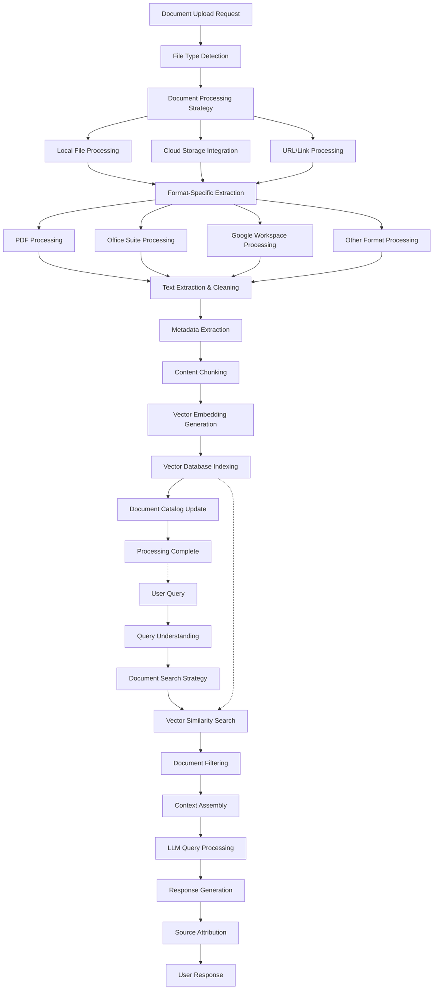

# Epic 0017 - RAG Agent (Document Intelligence)

> Goal: Implement Pydantic AI-powered RAG agent with comprehensive document upload, indexing, and intelligent querying capabilities across multiple file formats and cloud storage platforms.

**Framework**: Built on Pydantic AI with multi-format document processing, vector database integration, and intelligent document analysis capabilities.

## Agent Flow Diagram



## Scope & Approach

### Core Capabilities
- **Multi-Format Document Processing**: PDF, DOC/DOCX, XLS/XLSX, PPT/PPTX, TXT, MD, HTML
- **Cloud Storage Integration**: Google Drive, Box, Dropbox, OneDrive, SharePoint
- **Google Workspace Integration**: Google Docs, Sheets, Slides with real-time access
- **Intelligent Document Analysis**: Metadata extraction, content structure recognition
- **Advanced Vector Indexing**: Hierarchical chunking with context preservation
- **Semantic Document Search**: Natural language queries across document collections
- **Source Attribution**: Precise citations with page/section references
- **Document Versioning**: Track and manage document updates and changes

### Target Workflows
- **Document Library Creation**: Build searchable knowledge bases from document collections
- **Research Document Analysis**: Extract insights from academic papers and reports
- **Enterprise Knowledge Management**: Index and query internal document repositories
- **Legal Document Analysis**: Process contracts, agreements, and legal documents
- **Technical Documentation Search**: Navigate complex technical manuals and specifications
- **Multi-Language Document Processing**: Support for international document collections

## Pydantic AI Implementation Plan

### FEATURE 0017-001 - RAG Agent Framework
> Establish document-focused RAG agent with upload and indexing capabilities

#### TASK 0017-001-001 - Basic RAG Agent Setup
- [ ] 0017-001-001-01 - CHUNK - RAG agent class implementation
  - Create `RAGAgent` class inheriting from base agent
  - Define document processing dependencies and configuration
  - Implement document-focused conversation system prompt
  - **Acceptance**: RAG agent responds to document-related queries
  - **Dependencies**: Requires 0005-001 (Pydantic AI Framework Setup)

- [ ] 0017-001-001-02 - CHUNK - RAG agent dependencies
  - Implement `RAGDependencies` with vector DB and storage configs
  - Add document processing and cloud integration dependencies
  - Create RAG agent dependency factory with authentication
  - **Acceptance**: RAG agent receives all required processing capabilities

- [ ] 0017-001-001-03 - CHUNK - RAG agent output models
  - Define Pydantic models for document processing status output
  - Create structured models for search results and document references
  - Implement document analysis and insight output models
  - **Acceptance**: RAG agent returns structured, validated document outputs

#### TASK 0017-001-002 - Document Processing Tools
- [ ] 0017-001-002-01 - CHUNK - File upload and validation tools
  - Implement `@rag_agent.tool` for file upload handling
  - Add file type validation and security scanning tools
  - Create file size and format compatibility checking tools
  - **Acceptance**: Agent securely handles diverse file uploads

- [ ] 0017-001-002-02 - CHUNK - Cloud storage integration tools
  - Implement cloud storage authentication and access tools
  - Add file listing and download capabilities for cloud platforms
  - Create real-time document synchronization tools
  - **Acceptance**: Agent accesses documents from major cloud platforms

### FEATURE 0017-002 - Multi-Format Document Processing
> Implement comprehensive document parsing and content extraction

#### TASK 0017-002-001 - Core Document Processors
- [ ] 0017-002-001-01 - CHUNK - PDF processing engine
  - Implement advanced PDF text extraction with layout preservation
  - Add table and image extraction capabilities
  - Create OCR integration for scanned documents
  - **Acceptance**: Agent processes PDFs with high fidelity content extraction

- [ ] 0017-002-001-02 - CHUNK - Office suite processing engine
  - Implement Word document processing with structure preservation
  - Add Excel spreadsheet analysis with data extraction
  - Create PowerPoint slide content and metadata extraction
  - **Acceptance**: Agent processes Office documents with full content access

#### TASK 0017-002-002 - Advanced Format Support
- [ ] 0017-002-002-01 - CHUNK - Google Workspace integration
  - Implement Google Docs API integration with real-time access
  - Add Google Sheets data extraction and analysis
  - Create Google Slides content processing
  - **Acceptance**: Agent processes Google Workspace documents natively

- [ ] 0017-002-002-02 - CHUNK - Specialized format processors
  - Implement HTML and web page content extraction
  - Add Markdown and plain text processing with metadata
  - Create custom format extensibility framework
  - **Acceptance**: Agent handles diverse document formats extensibly

### FEATURE 0017-003 - Intelligent Indexing & Search
> Implement advanced vector indexing and semantic search capabilities

#### TASK 0017-003-001 - Vector Indexing Engine
- [ ] 0017-003-001-01 - CHUNK - Document chunking and embedding
  - Implement intelligent content chunking with context preservation
  - Add hierarchical chunking for large documents
  - Create embedding generation with document-specific optimization
  - **Acceptance**: Agent creates high-quality vector representations
  - **Dependencies**: Requires 0011 (Vector Database Integration)

- [ ] 0017-003-001-02 - CHUNK - Metadata and structure indexing
  - Implement document metadata extraction and indexing
  - Add document structure analysis and hierarchical organization
  - Create cross-document relationship detection
  - **Acceptance**: Agent maintains rich document metadata and relationships

#### TASK 0017-003-002 - Semantic Search Engine
- [ ] 0017-003-002-01 - CHUNK - Advanced query processing
  - Implement semantic search with context understanding
  - Add document filtering and scoping capabilities
  - Create multi-document synthesis and comparison tools
  - **Acceptance**: Agent provides accurate, contextual document search

- [ ] 0017-003-002-02 - CHUNK - Source attribution system
  - Implement precise citation generation with page references
  - Add excerpt highlighting and context preservation
  - Create confidence scoring for document matches
  - **Acceptance**: Agent provides traceable, accurate source citations

### FEATURE 0017-004 - Document Intelligence & Analytics
> Enhance RAG agent with document analysis and insight capabilities

#### TASK 0017-004-001 - Document Analysis Tools
- [ ] 0017-004-001-01 - CHUNK - Content analysis and summarization
  - Implement document summarization and key insight extraction
  - Add topic modeling and theme identification tools
  - Create document comparison and difference analysis
  - **Acceptance**: Agent provides intelligent document analysis

- [ ] 0017-004-001-02 - CHUNK - Document collection insights
  - Implement collection-wide analysis and pattern detection
  - Add document clustering and categorization tools
  - Create knowledge gap identification and recommendations
  - **Acceptance**: Agent provides insights across document collections

#### TASK 0017-004-002 - Management & Optimization
- [ ] 0017-004-002-01 - CHUNK - Document lifecycle management
  - Implement document versioning and change tracking
  - Add document access analytics and usage patterns
  - Create document archival and cleanup recommendations
  - **Acceptance**: Agent manages document lifecycle effectively

- [ ] 0017-004-002-02 - CHUNK - Performance optimization
  - Implement query performance optimization and caching
  - Add indexing efficiency monitoring and improvement
  - Create resource usage optimization for large collections
  - **Acceptance**: Agent maintains high performance at scale

---

## Technical Architecture - Pydantic AI Implementation

### RAG Agent Structure
```python
@dataclass
class RAGDependencies:
    account_id: str
    db: DatabaseConn
    vector_config: VectorDBConfig
    storage_configs: Dict[str, CloudStorageConfig]
    processing_config: DocumentProcessingConfig
    document_collection: Optional[DocumentCollection]

class DocumentUpload(BaseModel):
    file_path: Optional[str]
    cloud_url: Optional[str]
    file_type: str
    processing_options: ProcessingOptions
    collection_id: Optional[str]

class DocumentQuery(BaseModel):
    query: str
    collection_filter: Optional[List[str]]
    document_types: Optional[List[str]]
    date_range: Optional[DateRange]
    max_results: int = 10

class RAGOutput(BaseModel):
    answer: str
    sources: List[DocumentSource]
    confidence_score: float = Field(ge=0, le=1)
    processing_time_ms: int
    related_documents: List[str]
    suggested_follow_ups: List[str]

rag_agent = Agent[RAGDependencies, RAGOutput](
    'openai:gpt-4o',
    deps_type=RAGDependencies,
    output_type=RAGOutput,
    system_prompt="""You are a RAG agent specialized in document processing and intelligent querying.
    You can upload, index, and search through diverse document collections to provide accurate,
    well-sourced answers with precise citations."""
)

@rag_agent.tool
async def process_document_upload(
    ctx: RunContext[RAGDependencies], 
    upload: DocumentUpload
) -> DocumentProcessingResult:
    """Process and index uploaded document into vector database."""
    processor = DocumentProcessorFactory.create(upload.file_type)
    content = await processor.extract_content(upload)
    embeddings = await create_embeddings(content.chunks)
    
    result = await ctx.deps.vector_config.index_document(
        document_id=content.document_id,
        embeddings=embeddings,
        metadata=content.metadata
    )
    
    return DocumentProcessingResult(
        document_id=content.document_id,
        chunks_indexed=len(embeddings),
        processing_time=result.processing_time
    )

@rag_agent.tool
async def search_document_collection(
    ctx: RunContext[RAGDependencies], 
    query: DocumentQuery
) -> List[DocumentMatch]:
    """Search indexed documents for relevant information."""
    query_embedding = await create_embedding(query.query)
    
    matches = await ctx.deps.vector_config.similarity_search(
        query_embedding=query_embedding,
        filters=query.collection_filter,
        limit=query.max_results
    )
    
    return [DocumentMatch.from_vector_result(match) for match in matches]

@rag_agent.tool
async def analyze_document_collection(
    ctx: RunContext[RAGDependencies], 
    collection_id: str
) -> CollectionAnalysis:
    """Analyze document collection for insights and patterns."""
    collection = await get_document_collection(ctx.deps.db, collection_id)
    analyzer = DocumentCollectionAnalyzer()
    
    return await analyzer.analyze(collection)
```

### Agent Module Structure
```
backend/app/agents/rag/
├── __init__.py
├── agent.py                    # Main RAGAgent class
├── models.py                   # RAG-specific Pydantic models
├── dependencies.py             # RAGDependencies class
├── config.py                   # RAG agent configuration
├── processors/
│   ├── __init__.py
│   ├── pdf_processor.py        # PDF extraction and processing
│   ├── office_processor.py     # Word/Excel/PowerPoint processing
│   ├── google_processor.py     # Google Workspace integration
│   ├── web_processor.py        # HTML and web content processing
│   └── base_processor.py       # Base document processor interface
├── cloud/
│   ├── __init__.py
│   ├── google_drive.py         # Google Drive integration
│   ├── box_client.py           # Box.com integration
│   ├── dropbox_client.py       # Dropbox integration
│   └── onedrive_client.py      # Microsoft OneDrive integration
└── tools/
    ├── __init__.py
    ├── upload_tools.py          # Document upload and validation tools
    ├── processing_tools.py      # Document processing and extraction tools
    ├── indexing_tools.py        # Vector indexing and embedding tools
    ├── search_tools.py          # Semantic search and retrieval tools
    ├── analysis_tools.py        # Document analysis and insight tools
    └── management_tools.py      # Document lifecycle management tools
```

---

## Configuration Schema (app.yaml)

```yaml
rag_agent:
  document_processing:
    max_file_size_mb: 100
    supported_formats:
      - "pdf"
      - "docx"
      - "xlsx"
      - "pptx"
      - "txt"
      - "md"
      - "html"
    ocr_enabled: true
    table_extraction: true
    image_analysis: false
    
  cloud_storage:
    google_drive:
      enabled: false
      service_account_key: null
      
    box:
      enabled: false
      client_id: null
      client_secret: null
      
    dropbox:
      enabled: false
      app_key: null
      app_secret: null
      
    onedrive:
      enabled: false
      tenant_id: null
      client_id: null
      
  vector_indexing:
    chunk_size: 1000
    chunk_overlap: 200
    embedding_model: "text-embedding-3-large"
    hierarchical_chunking: true
    metadata_indexing: true
    
  search:
    default_max_results: 10
    similarity_threshold: 0.7
    rerank_results: true
    cross_document_synthesis: true
    
  document_analysis:
    auto_summarization: true
    topic_modeling: true
    entity_extraction: true
    sentiment_analysis: false
    
  performance:
    concurrent_processing: 3
    cache_embeddings: true
    batch_processing: true
    indexing_queue_size: 100
```

### Database Extensions

```sql
-- Document collections and organization
document_collections:
  id (GUID, PK)
  account_id (GUID, FK → accounts.id)
  name (VARCHAR)
  description (TEXT)
  document_count (INTEGER)
  total_size_mb (FLOAT)
  created_at (TIMESTAMP)
  updated_at (TIMESTAMP)

-- Individual document tracking
indexed_documents:
  id (GUID, PK)
  collection_id (GUID, FK → document_collections.id)
  original_filename (VARCHAR)
  file_type (VARCHAR)
  file_size_mb (FLOAT)
  cloud_source (VARCHAR)  -- google_drive, box, dropbox, local
  cloud_file_id (VARCHAR)
  processing_status (VARCHAR)  -- pending, processing, completed, failed
  chunk_count (INTEGER)
  metadata_json (JSONB)
  indexed_at (TIMESTAMP)
  last_accessed (TIMESTAMP)

-- Document processing and analytics
document_analytics:
  id (GUID, PK)
  document_id (GUID, FK → indexed_documents.id)
  query_count (INTEGER)
  relevance_score (FLOAT)
  summary (TEXT)
  topics (JSONB)
  entities (JSONB)
  created_at (TIMESTAMP)
  updated_at (TIMESTAMP)

-- Document access and usage tracking
document_access_log:
  id (GUID, PK)
  document_id (GUID, FK → indexed_documents.id)
  user_query (TEXT)
  match_score (FLOAT)
  chunk_references (JSONB)
  access_timestamp (TIMESTAMP)
```

### Integration Points
- **Vector Database**: Pinecone or pgvector for document embeddings storage
- **Cloud Storage APIs**: Google Drive, Box, Dropbox, OneDrive integration
- **Document Processing Libraries**: PyPDF2, python-docx, openpyxl, python-pptx
- **OCR Services**: Tesseract or cloud OCR APIs for scanned documents
- **Google Workspace APIs**: Google Docs, Sheets, Slides real-time access

### Dependencies
- **0005-001**: Pydantic AI Framework Setup (required for agent foundation)
- **0004-012**: Conversation Hierarchy & Management (for document query sessions)
- **0004-013**: Agent Context Management (for document context tracking)
- **0011**: Vector Database Integration (essential for document embeddings)

## Success Criteria
1. **Multi-Format Support**: Successfully process PDF, Office, Google Workspace, and web documents
2. **Cloud Integration**: Seamless access to documents from major cloud storage platforms
3. **High-Quality Indexing**: Accurate vector embeddings with preserved document structure
4. **Semantic Search**: Natural language queries return relevant, well-sourced results
5. **Source Attribution**: Precise citations with page/section references for all responses
6. **Document Analytics**: Insights and analysis across document collections
7. **Performance**: Efficient processing and search at scale with large document libraries
8. **Real-Time Sync**: Document changes reflected in search results automatically

This epic establishes comprehensive document intelligence capabilities, enabling users to build searchable knowledge bases from diverse document sources with sophisticated querying and analysis features.
