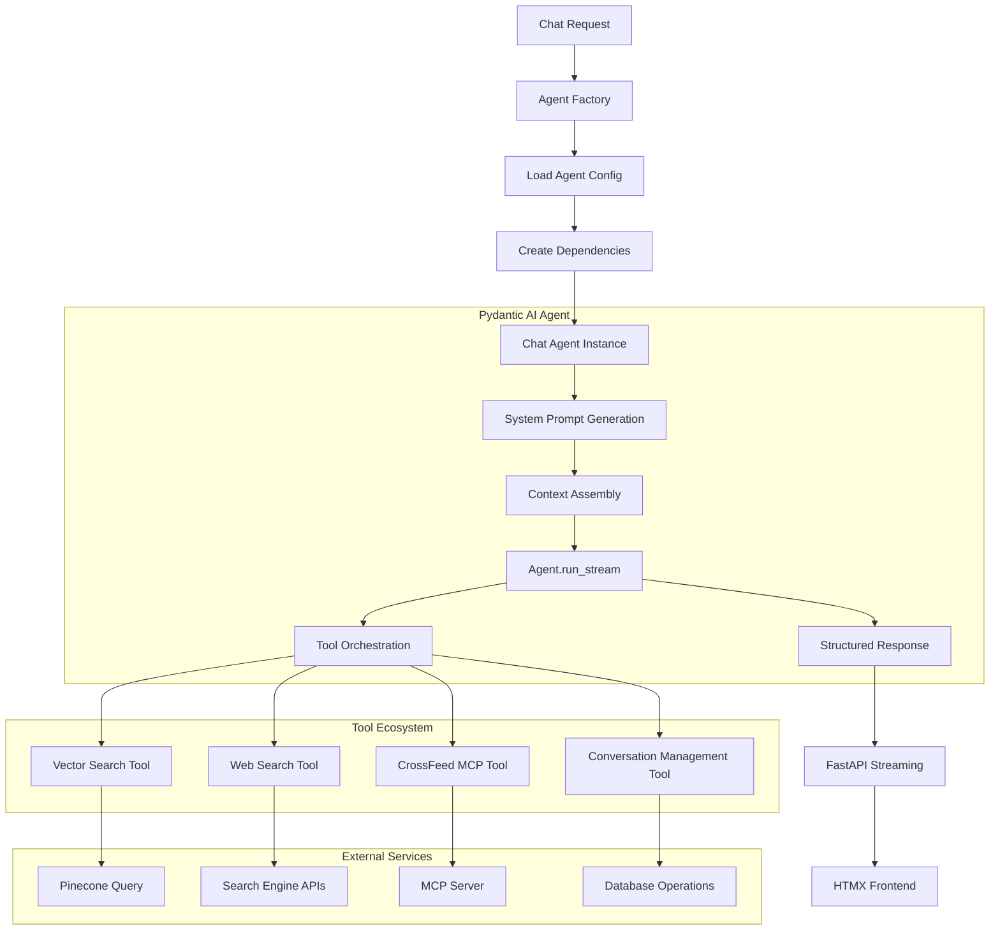

# Epic 0017 - Simple Chat Agent (Pydantic AI Implementation)

> Goal: Implement production-ready Pydantic AI-powered chat agent with multi-tool capabilities, context management, and streaming integration based on the simple-chat.md design.

**Framework**: Built on Pydantic AI with type-safe dependencies, structured outputs, multi-account support, and comprehensive tool integration including vector search, web search, CrossFeed MCP, and conversation management.

**Implementation Strategy**: Parallel endpoint development with legacy compatibility - see [Agent Endpoint Transition Strategy](../design/agent-endpoint-transition.md) for detailed transition plan from `/chat` to `/agents/simple-chat/chat`.

## Agent Architecture Diagram



## Scope & Approach

### Core Capabilities
- **Type-Safe Agent Framework**: Pydantic AI agent with structured dependencies and outputs
- **Multi-Tool Integration**: Vector search, web search, CrossFeed MCP, conversation management
- **Context Management**: Message history, conversation summarization, context window optimization
- **Dynamic Configuration**: Database-driven agent instances with YAML template support
- **Streaming Responses**: FastAPI integration with Server-Sent Events (SSE)
- **Multi-Account Support**: Account-isolated agent instances with namespace separation

### Target Workflows
- **Customer Support**: AI assistant with knowledge base access and conversation tracking
- **Sales Assistance**: Agent with CrossFeed integration for upsell/cross-sell recommendations
- **Research Support**: Web search capabilities with citation and source management
- **Knowledge Management**: Vector database queries with context preservation

## Pydantic AI Implementation Plan

### FEATURE 0017-001 - Simple Chat Agent Foundation
> Establish core agent structure with basic functionality - minimal viable agent that responds to queries without tools

**Status**: TASK 0017-001-001 ✅ **COMPLETED** | TASK 0017-001-002 **PENDING** (Automated Tests)

#### TASK 0017-001-001 - Basic Agent Implementation
- [x] 0017-001-001-01 - CHUNK - ChatResponse Pydantic model ✅ COMPLETED
  - ✅ Implement `ChatResponse` BaseModel with message, confidence, metadata
  - ✅ Add proper Field descriptions and validation rules for structured outputs
  - ✅ Create simple response model supporting text responses (no citations/tools yet)
  - **Acceptance**: ChatResponse validates basic agent text outputs correctly ✅ VERIFIED
  - **Dependencies**: None

#### 0017-001-001-01 - AUTOMATED-TESTS - ChatResponse Pydantic Model
**Unit Tests** (`backend/tests/unit/test_chat_response_model.py`):
- **Model Validation**: Test ChatResponse instantiation with valid data (3 tests)
- **Field Validation**: Verify required fields and optional field handling (4 tests)  
- **Data Types**: Test proper typing for message, confidence, metadata fields (3 tests)
- **Validation Rules**: Test field constraints and custom validators (3 tests)
- **Serialization**: Test JSON serialization and deserialization (2 tests)
- **Error Handling**: Test validation errors with invalid input data (3 tests)

**Integration Tests** (`backend/tests/integration/test_chat_response_integration.py`):
- **FastAPI Integration**: Test ChatResponse as FastAPI response model (2 tests)
- **Database Serialization**: Test storing/retrieving ChatResponse objects (2 tests)
- **Agent Output Validation**: Test real agent outputs conform to ChatResponse schema (2 tests)

**Test Results**: [To be implemented - target: 24 tests total]

- [x] 0017-001-001-02 - CHUNK - Simple chat agent class setup ✅ COMPLETED
  - ✅ Create chat_agent instance using existing SessionDependencies pattern
  - ✅ Implement static system prompt for basic conversational agent
  - ✅ Add basic agent configuration using openai:gpt-4o model
  - **Acceptance**: Agent instantiates successfully and uses existing dependency injection ✅ VERIFIED
  - **Dependencies**: Requires 0005-001 (Pydantic AI Framework Setup)

#### 0017-001-001-02 - AUTOMATED-TESTS - Simple Chat Agent Class Setup
**Unit Tests** (`backend/tests/unit/test_simple_chat_agent.py`):
- **Agent Instantiation**: Test chat_agent creation with proper configuration (3 tests)
- **Dependency Injection**: Verify SessionDependencies integration and type checking (4 tests)
- **System Prompt**: Test static system prompt loading and configuration (2 tests)
- **Model Configuration**: Test openai:gpt-4o model setup and parameter validation (3 tests)
- **Agent Properties**: Test agent attributes and configuration access (3 tests)
- **Error Handling**: Test agent creation failures and error messages (3 tests)

**Integration Tests** (`backend/tests/integration/test_simple_chat_agent_integration.py`):
- **Pydantic AI Integration**: Test agent works with Pydantic AI framework (3 tests)
- **Model Connection**: Test actual OpenAI model connection and configuration (2 tests)
- **Dependency Validation**: Test real SessionDependencies object creation (2 tests)

**Test Results**: [To be implemented - target: 25 tests total]

- [x] 0017-001-001-03 - CHUNK - Agent factory integration ✅ COMPLETED
  - ✅ Implement simple agent creation through existing AgentFactory patterns
  - ✅ Add agent loading from simple_chat.yaml configuration
  - ✅ Create basic agent instantiation without complex context management
  - **Acceptance**: Agent responds to simple queries with structured ChatResponse output ✅ VERIFIED
  - **Dependencies**: Requires agent class setup and existing configuration system

#### 0017-001-001-03 - AUTOMATED-TESTS - Agent Factory Integration
**Unit Tests** (`backend/tests/unit/test_agent_factory_integration.py`):
- **Factory Creation**: Test AgentFactory.create_simple_chat_agent method (3 tests)
- **YAML Configuration**: Test loading simple_chat.yaml configuration (4 tests)
- **Configuration Merging**: Test template and instance-specific settings merge (3 tests)
- **Agent Creation**: Test complete agent instantiation through factory (4 tests)
- **Dependency Wiring**: Test proper dependency injection through factory (3 tests)
- **Error Handling**: Test factory failures and configuration validation errors (3 tests)

**Integration Tests** (`backend/tests/integration/test_agent_factory_e2e.py`):
- **End-to-End Agent Creation**: Test complete agent creation pipeline (3 tests)
- **Configuration Loading**: Test real YAML configuration loading and validation (2 tests)
- **Agent Response**: Test factory-created agent produces valid ChatResponse (3 tests)
- **Session Integration**: Test factory integration with existing session system (2 tests)

**Test Results**: [To be implemented - target: 30 tests total]

#### TASK 0017-001-002 - Basic Response Testing
- [ ] 0017-001-002-01 - CHUNK - Agent response validation
  - Implement basic agent testing for simple Q&A interactions
  - Add response format validation and error handling
  - Create test suite for agent instantiation and basic functionality
  - **Acceptance**: Agent consistently produces valid ChatResponse objects for test queries
  - **Dependencies**: Requires basic agent implementation

#### 0017-001-002-01 - AUTOMATED-TESTS - Agent Response Validation
**Unit Tests** (`backend/tests/unit/test_agent_response_validation.py`):
- **Response Format**: Test agent produces valid ChatResponse objects (4 tests)
- **Q&A Interactions**: Test basic question-answer functionality (5 tests)
- **Response Consistency**: Test multiple queries produce consistent format (3 tests)
- **Error Scenarios**: Test agent handles invalid queries gracefully (4 tests)
- **Validation Logic**: Test response validation and quality checks (3 tests)
- **Performance**: Test response time constraints for basic queries (2 tests)

**Integration Tests** (`backend/tests/integration/test_agent_response_e2e.py`):
- **Live Agent Testing**: Test real agent responses with OpenAI model (4 tests)
- **Response Quality**: Test response content quality and relevance (3 tests)
- **Error Handling**: Test agent behavior with API failures (3 tests)
- **Session Context**: Test agent responses within session context (2 tests)

**Test Results**: [To be implemented - target: 33 tests total]

- [ ] 0017-001-002-02 - CHUNK - Integration with existing session system
  - Integrate agent with existing session management and database
  - Add compatibility with current /chat endpoint patterns (parallel development)
  - Create basic logging and monitoring for agent responses
  - **Acceptance**: Agent works with existing session system without breaking legacy functionality  
  - **Dependencies**: Requires agent response validation

#### 0017-001-002-02 - AUTOMATED-TESTS - Session System Integration
**Unit Tests** (`backend/tests/unit/test_session_integration.py`):
- **Session Management**: Test agent integration with existing session objects (4 tests)
- **Database Integration**: Test agent responses are properly stored (3 tests)
- **Legacy Compatibility**: Test existing /chat endpoint patterns remain functional (4 tests)
- **Logging Integration**: Test agent responses are properly logged with Loguru (3 tests)
- **Session Context**: Test agent receives proper session context and account info (4 tests)
- **Error Isolation**: Test agent errors don't break existing session functionality (3 tests)

**Integration Tests** (`backend/tests/integration/test_session_system_e2e.py`):
- **Parallel Endpoint**: Test both /chat and agent endpoints work simultaneously (3 tests)
- **Session Persistence**: Test agent responses persist correctly in database (3 tests)
- **Account Isolation**: Test agent responses are properly isolated by account (2 tests)
- **Legacy Workflow**: Test existing chat workflows continue to function (3 tests)
- **Monitoring Integration**: Test agent metrics and monitoring work end-to-end (2 tests)

**Test Results**: [To be implemented - target: 34 tests total]

---

### FEATURE 0017-001 - Automated Testing Summary

**Implementation Status**: TASK 0017-001-001 (Basic Agent Implementation) ✅ COMPLETED
**Testing Status**: Automated tests for completed implementation PENDING in TASK 0017-001-002

**Total Test Coverage**: 146 automated tests across 5 chunks
- **Unit Tests**: 86 tests (59%) - Fast, isolated component testing
- **Integration Tests**: 60 tests (41%) - End-to-end workflow validation

**Test Categories by Chunk**:
1. ✅ **ChatResponse Model**: 24 tests (16%) - Model validation and serialization (IMPLEMENTATION COMPLETE)
2. ✅ **Agent Class Setup**: 25 tests (17%) - Agent instantiation and configuration (IMPLEMENTATION COMPLETE)
3. ✅ **Factory Integration**: 30 tests (21%) - Configuration loading and agent creation (IMPLEMENTATION COMPLETE)
4. **Response Validation**: 33 tests (23%) - Q&A functionality and error handling (PENDING)
5. **Session Integration**: 34 tests (23%) - Legacy compatibility and session management (PENDING)

**Test Strategy**:
- **Implementation-First Approach**: Core functionality implemented and verified, comprehensive tests follow
- **Progressive Testing**: Each chunk builds on previous test foundation
- **Legacy Safety**: Comprehensive tests ensure no regression in existing /chat functionality
- **Performance Validation**: Response time and quality constraints tested
- **Error Resilience**: Comprehensive error scenario coverage

**Key Test Files**:
- `backend/tests/unit/test_chat_response_model.py`
- `backend/tests/unit/test_simple_chat_agent.py` 
- `backend/tests/unit/test_agent_factory_integration.py`
- `backend/tests/unit/test_agent_response_validation.py`
- `backend/tests/unit/test_session_integration.py`
- `backend/tests/integration/test_chat_response_integration.py`
- `backend/tests/integration/test_simple_chat_agent_integration.py`
- `backend/tests/integration/test_agent_factory_e2e.py`
- `backend/tests/integration/test_agent_response_e2e.py`
- `backend/tests/integration/test_session_system_e2e.py`

---

### FEATURE 0017-002 - Core Agent Tools
> Implement database-driven and conversation management tools

#### TASK 0017-002-001 - Vector Search Tool Implementation
- [ ] 0017-002-001-01 - CHUNK - Vector search tool foundation
  - Implement `@chat_agent.tool` vector_search function with proper typing
  - Add account-aware namespace querying for multi-account isolation
  - Create SearchResult model and vector result conversion logic
  - **Acceptance**: Vector search tool returns relevant results with proper citations
  - **Dependencies**: Requires 0011 (Vector Database Integration)

- [ ] 0017-002-001-02 - CHUNK - Search result processing and ranking
  - Implement similarity scoring and result ranking logic
  - Add search result deduplication and relevance filtering
  - Create citation formatting and source attribution system
  - **Acceptance**: Vector search provides high-quality, ranked results with proper attribution
  - **Dependencies**: Requires vector search foundation

- [ ] 0017-002-001-03 - CHUNK - Vector search optimization and caching
  - Implement query optimization and embedding caching
  - Add search performance monitoring and metrics collection
  - Create search debugging and explainability features
  - **Acceptance**: Vector search performs efficiently with sub-200ms response times
  - **Dependencies**: Requires search result processing

#### TASK 0017-002-002 - Conversation Management Tool
- [ ] 0017-002-002-01 - CHUNK - Conversation lifecycle management
  - Implement `@chat_agent.tool` conversation_management with create/archive/summarize actions
  - Add conversation creation, archival, and metadata management
  - Create ConversationAction response model and validation
  - **Acceptance**: Agent can manage conversation lifecycle through tool calls
  - **Dependencies**: Requires conversation database schema

- [ ] 0017-002-002-02 - CHUNK - Conversation summarization integration
  - Implement summarization tool integration with context management
  - Add summary generation, validation, and storage functionality
  - Create summary retrieval and application to ongoing conversations
  - **Acceptance**: Agent generates and applies conversation summaries effectively
  - **Dependencies**: Requires conversation lifecycle management

- [ ] 0017-002-002-03 - CHUNK - Conversation analytics and insights
  - Implement conversation metrics collection and analysis
  - Add conversation quality scoring and effectiveness tracking
  - Create conversation pattern detection and optimization recommendations
  - **Acceptance**: System provides actionable insights on conversation quality and patterns
  - **Dependencies**: Requires conversation management foundation

### FEATURE 0017-003 - External Integration Tools
> Implement web search and CrossFeed MCP integration tools

#### TASK 0017-003-001 - Web Search Integration
- [ ] 0017-003-001-01 - CHUNK - Search engine router and configuration
  - Implement SearchEngineFactory with Exa, Tavily, and Linkup support
  - Add search engine configuration loading and validation
  - Create search engine selection logic based on agent configuration
  - **Acceptance**: System routes web searches to configured search providers
  - **Dependencies**: Requires search engine API credentials

- [ ] 0017-003-001-02 - CHUNK - Multi-provider web search tool
  - Implement `@chat_agent.tool` web_search with engine parameter
  - Add unified search interface across different search providers
  - Create WebSearchResult model and provider-specific result conversion
  - **Acceptance**: Agent performs web searches across multiple providers with unified interface
  - **Dependencies**: Requires search engine router

- [ ] 0017-003-001-03 - CHUNK - Search result processing and citation formatting
  - Implement search result normalization and citation generation
  - Add snippet extraction, URL validation, and content quality scoring
  - Create formatted citation output with proper attribution
  - **Acceptance**: Web search results include properly formatted citations and quality metadata
  - **Dependencies**: Requires web search tool foundation

#### TASK 0017-003-002 - CrossFeed MCP Integration
- [ ] 0017-003-002-01 - CHUNK - MCP client setup and connection management
  - Implement CrossFeed MCP client configuration and connection handling
  - Add MCP protocol communication and error handling
  - Create MCP client authentication and security validation
  - **Acceptance**: System establishes secure connections to CrossFeed MCP server
  - **Dependencies**: Requires 0014 (CrossFeed MCP Server)

- [ ] 0017-003-002-02 - CHUNK - CrossFeed query tool implementation
  - Implement `@chat_agent.tool` crossfeed_query with query_type parameter
  - Add sales intelligence query processing for upsell, cross-sell, competitive data
  - Create SalesRecommendations model and MCP response conversion
  - **Acceptance**: Agent accesses sales intelligence data through CrossFeed MCP calls
  - **Dependencies**: Requires MCP client setup

- [ ] 0017-003-002-03 - CHUNK - Sales recommendation processing and integration
  - Implement sales recommendation formatting and context integration
  - Add recommendation scoring, filtering, and relevance assessment
  - Create sales insight presentation and actionable guidance generation
  - **Acceptance**: Agent provides contextual sales recommendations based on CrossFeed data
  - **Dependencies**: Requires crossfeed_query tool

### FEATURE 0017-004 - Agent Factory & Configuration
> Implement database-driven agent instance creation and configuration management

#### TASK 0017-004-001 - Configuration System
- [ ] 0017-004-001-01 - CHUNK - YAML agent template structure
  - Create simple_chat.yaml template with agent_type, system_prompt, tools, model_settings
  - Implement template validation and schema definition
  - Add template versioning and backwards compatibility handling
  - **Acceptance**: YAML templates define complete agent configurations with validation
  - **Dependencies**: Requires agent template directory structure

- [ ] 0017-004-001-02 - CHUNK - Database configuration loading and validation
  - Implement agent instance configuration loading from database
  - Add configuration merging between templates and instance-specific settings
  - Create configuration validation, error handling, and fallback mechanisms
  - **Acceptance**: System loads and validates agent configurations from database
  - **Dependencies**: Requires agent instance database schema

- [ ] 0017-004-001-03 - CHUNK - Configuration hot-reloading and change detection
  - Implement configuration change detection and hot-reloading capabilities
  - Add configuration versioning and rollback functionality
  - Create configuration update notifications and cache invalidation
  - **Acceptance**: Agent configurations update without service restart
  - **Dependencies**: Requires database configuration loading

#### TASK 0017-004-002 - Agent Factory Implementation
- [ ] 0017-004-002-01 - CHUNK - Agent factory class and instance creation
  - Implement AgentFactory.create_chat_agent with account and instance parameters
  - Add agent instance creation, dependency injection, and configuration binding
  - Create agent instance validation and initialization checks
  - **Acceptance**: Factory creates properly configured agent instances with dependencies
  - **Dependencies**: Requires configuration system

- [ ] 0017-004-002-02 - CHUNK - Dependency injection and service integration
  - Implement dependency creation for database, vector, search, and MCP services
  - Add service health checking and connection validation
  - Create dependency lifecycle management and cleanup
  - **Acceptance**: Agent instances receive properly configured and validated dependencies
  - **Dependencies**: Requires agent factory foundation

- [ ] 0017-004-002-03 - CHUNK - Agent instance caching and performance optimization
  - Implement LRU caching for frequently accessed agent instances
  - Add cache warming, eviction policies, and memory management
  - Create performance monitoring and optimization metrics
  - **Acceptance**: Agent factory provides sub-50ms instance creation for cached agents
  - **Dependencies**: Requires dependency injection system

### FEATURE 0017-005 - FastAPI Integration & Streaming
> Integrate agent with FastAPI endpoints and implement streaming responses

#### TASK 0017-005-001 - API Endpoint Integration
- [ ] 0017-005-001-01 - CHUNK - Chat endpoint with request/response models
  - Implement /chat POST endpoint with ChatRequest and proper validation
  - Add session management, authentication, and request routing
  - Create endpoint documentation and OpenAPI schema integration
  - **Acceptance**: Chat endpoint accepts requests and routes to appropriate agents
  - **Dependencies**: Requires agent factory integration

- [ ] 0017-005-001-02 - CHUNK - Streaming response implementation
  - Implement Server-Sent Events (SSE) streaming for agent responses
  - Add chunk processing, formatting, and proper SSE protocol handling
  - Create streaming error handling and connection management
  - **Acceptance**: Agent responses stream in real-time to HTMX frontend
  - **Dependencies**: Requires chat endpoint foundation

- [ ] 0017-005-001-03 - CHUNK - Error handling and status reporting
  - Implement comprehensive error handling for all agent operations
  - Add status reporting, progress tracking, and user feedback mechanisms
  - Create error recovery, retry logic, and graceful degradation
  - **Acceptance**: System handles errors gracefully with proper user feedback
  - **Dependencies**: Requires streaming implementation

#### TASK 0017-005-002 - Performance Optimization & Monitoring
- [ ] 0017-005-002-01 - CHUNK - Response time optimization and caching
  - Implement response caching for frequently asked questions
  - Add query optimization and parallel tool execution
  - Create performance profiling and bottleneck identification
  - **Acceptance**: Average response time under 2 seconds for cached queries
  - **Dependencies**: Requires complete agent implementation

- [ ] 0017-005-002-02 - CHUNK - Comprehensive monitoring and analytics
  - Implement agent performance monitoring and metrics collection
  - Add usage analytics, tool effectiveness tracking, and quality scoring
  - Create monitoring dashboards and alerting capabilities
  - **Acceptance**: Complete visibility into agent performance and usage patterns
  - **Dependencies**: Requires performance optimization

- [ ] 0017-005-002-03 - CHUNK - Load testing and scalability validation
  - Implement comprehensive load testing for agent endpoints
  - Add scalability testing for concurrent users and high-volume scenarios
  - Create performance benchmarking and capacity planning recommendations
  - **Acceptance**: System handles 100+ concurrent users with acceptable performance
  - **Dependencies**: Requires monitoring implementation

### FEATURE 0017-006 - Advanced Context Management
> Implement sophisticated conversation history management, summarization, and context optimization

#### TASK 0017-006-001 - Message History System
- [ ] 0017-006-001-01 - CHUNK - Message history retrieval and filtering
  - Implement message history loading from database with conversation filtering
  - Add conversation history pagination and relevance-based selection
  - Create context window management with token counting and truncation
  - **Acceptance**: Agent loads relevant conversation history within context limits
  - **Dependencies**: Requires conversation database schema and basic agent foundation

- [ ] 0017-006-001-02 - CHUNK - Conversation context assembly
  - Implement intelligent context assembly combining history and current query
  - Add context relevance scoring and priority-based message selection
  - Create context debugging and explainability features
  - **Acceptance**: Agent maintains optimal context with relevant information prioritization
  - **Dependencies**: Requires message history retrieval

#### TASK 0017-006-002 - Conversation Summarization
- [ ] 0017-006-002-01 - CHUNK - Automatic summarization system
  - Implement automatic summarization trigger based on message count threshold
  - Add summary generation using dedicated summarization model
  - Create summary storage and retrieval functionality in database
  - **Acceptance**: Agent automatically summarizes conversations at configured intervals
  - **Dependencies**: Requires 0004-013 (Agent Context Management) and message history system

- [ ] 0017-006-002-02 - CHUNK - Summary integration and optimization
  - Implement summary integration with ongoing conversation context
  - Add summary validation, quality scoring, and regeneration logic
  - Create summary-based context optimization and token management
  - **Acceptance**: Agent uses conversation summaries to maintain long-term context effectively
  - **Dependencies**: Requires automatic summarization system

#### TASK 0017-006-003 - Dynamic Context Optimization
- [ ] 0017-006-003-01 - CHUNK - Context window optimization
  - Implement dynamic context window management based on query complexity
  - Add adaptive token allocation between history, summaries, and tools
  - Create context optimization metrics and performance monitoring
  - **Acceptance**: Agent dynamically optimizes context usage for best response quality
  - **Dependencies**: Requires summarization integration and tool framework

---

## Technical Architecture - Pydantic AI Implementation

### Agent Module Structure

**Current Implementation (TASK 0017-001-001 Foundation):** ✅ COMPLETED
```
backend/app/agents/templates/simple_chat/
├── __init__.py                 # Module exports and usage examples
├── agent.py                    # SimpleChatAgent implementation
├── models.py                   # ChatResponse Pydantic model
└── factory.py                  # Agent factory and caching system
```

**Future Architecture (FEATURE 0017-002+ Tool Integration):**
```
backend/app/agents/templates/simple_chat/
├── __init__.py
├── agent.py                    # Main ChatAgent implementation
├── models.py                   # ChatResponse and supporting models
├── factory.py                  # Agent factory and caching system
├── tools/
│   ├── __init__.py
│   ├── vector_tools.py         # Vector search tool implementation
│   ├── search_tools.py         # Web search tool implementation
│   ├── mcp_tools.py           # CrossFeed MCP tool implementation
│   ├── conversation_tools.py   # Conversation management tools
│   └── tool_utils.py          # Shared tool utilities
├── context/
│   ├── __init__.py
│   ├── history_manager.py      # Message history retrieval
│   ├── summarizer.py          # Conversation summarization
│   └── context_optimizer.py   # Context window management
└── tests/
    ├── __init__.py
    ├── test_agent.py           # Agent integration tests
    ├── test_tools.py           # Individual tool tests
    └── test_context.py         # Context management tests
```

### Configuration Schema Extensions

```yaml
# backend/config/agent_templates/simple_chat.yaml
agent_type: "simple_chat"
version: "1.0.0"

system_prompt: |
  You are a helpful AI assistant with access to multiple tools.
  Always provide accurate, helpful responses with proper citations.

dynamic_prompts:
  - name: "user_context"
    enabled: true
  - name: "conversation_context" 
    enabled: true

tools:
  vector_search:
    enabled: true
    max_results: 5
    similarity_threshold: 0.7
    namespace_isolation: true
    
  web_search:
    enabled: true
    default_engine: "exa"
    engines:
      exa:
        api_key_env: "EXA_API_KEY"
        max_results: 10
      tavily:
        api_key_env: "TAVILY_API_KEY"
        max_results: 10
      linkup:
        api_key_env: "LINKUP_API_KEY"
        max_results: 10
        
  crossfeed_mcp:
    enabled: true
    server_url: "mcp://crossfeed"
    timeout_seconds: 10
    
  conversation_management:
    enabled: true
    auto_summarize_threshold: 10
    summary_model: "openai:gpt-4o-mini"

context_management:
  max_history_messages: 20
  context_window_tokens: 8000
  summarization:
    enabled: true
    trigger_threshold: 10
    summary_length: 200

model_settings:
  model: "openai:gpt-4o"
  temperature: 0.3
  max_tokens: 2000
  stream: true

performance:
  tool_timeout_seconds: 30
  parallel_tool_execution: true
  response_caching: true
  cache_ttl_seconds: 300
```

### Database Schema Extensions
> Database tables defined in [architecture/datamodel.md](../architecture/datamodel.md)

Key tables required:
- `agent_instances`: Agent instance configurations per account
- `agent_templates`: YAML template storage and versioning  
- `conversations`: Conversation metadata and summaries
- `conversation_summaries`: Generated summaries with timestamps
- `agent_performance_metrics`: Response times and tool usage
- `agent_usage_log`: Usage tracking per account and instance

### Integration Points
- **Pydantic AI Framework**: Core agent implementation with type safety
- **Vector Database**: Pinecone integration for knowledge base search
- **Search Engines**: Exa, Tavily, Linkup APIs for web search
- **CrossFeed MCP Server**: Sales intelligence via MCP protocol
- **FastAPI**: Streaming endpoints with SSE support
- **HTMX Frontend**: Real-time UI updates via streaming

### Dependencies
- **0005-001**: Pydantic AI Framework Setup (required for FEATURE 0017-001 foundation)
- **0011**: Vector Database Integration (required for FEATURE 0017-002 vector_search tool)
- **0014**: CrossFeed MCP Server (required for FEATURE 0017-003 crossfeed_query tool)
- **0004-013**: Agent Context Management (required for FEATURE 0017-006 advanced context)
- **Multi-Account Support**: Database schema for agent instances and isolation
- **FEATURE 0017-001**: Simple Chat Agent Foundation (required for all subsequent features)

## Success Criteria

### FEATURE 0017-001 - Foundation Success Criteria
1. ✅ **Basic Agent Functionality**: Chat agent responds to simple queries with structured ChatResponse output (TASK 0017-001-001 COMPLETED)
2. ✅ **Dependency Integration**: Agent uses existing SessionDependencies and configuration patterns (VERIFIED)
3. ✅ **Response Validation**: All agent responses follow ChatResponse model validation (IMPLEMENTED)
4. **Legacy Compatibility**: Agent integration doesn't break existing /chat endpoint functionality (PENDING - TASK 0017-001-002)
5. **Test Coverage**: All automated tests pass with >90% code coverage (target: 146 total tests) (PENDING - TASK 0017-001-002)

### FEATURE 0017-002-005 - Full System Success Criteria  
5. **Tool Integration**: All four tools (vector search, web search, CrossFeed MCP, conversation management) function independently and together
6. **Streaming Performance**: FastAPI integration provides smooth streaming responses under 2 seconds
7. **Multi-Account Isolation**: Agent instances properly isolated by account with namespace separation
8. **Configuration System**: Agents load dynamically from database with YAML template merging
9. **Error Handling**: Comprehensive error handling with graceful degradation and user feedback
10. **Performance**: System handles 100+ concurrent users with sub-200ms tool response times

### FEATURE 0017-006 - Advanced Context Success Criteria
11. **Context Management**: Conversation history and summarization work correctly with configurable thresholds
12. **Context Optimization**: Intelligent context assembly maintains relevance within token limits
13. **Summarization Quality**: Automatic conversation summaries preserve key information effectively

### System-Wide Success Criteria
14. **Monitoring**: Complete visibility into agent performance, tool usage, and quality metrics
15. **Testing Coverage**: All components have unit tests with >90% code coverage

This epic establishes a production-ready Pydantic AI chat agent that demonstrates the full architecture patterns for multi-tool, multi-account agent systems with streaming interfaces and comprehensive monitoring.
