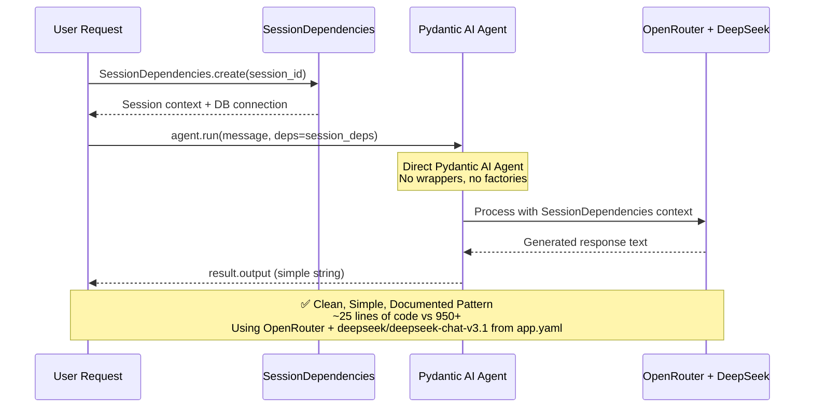
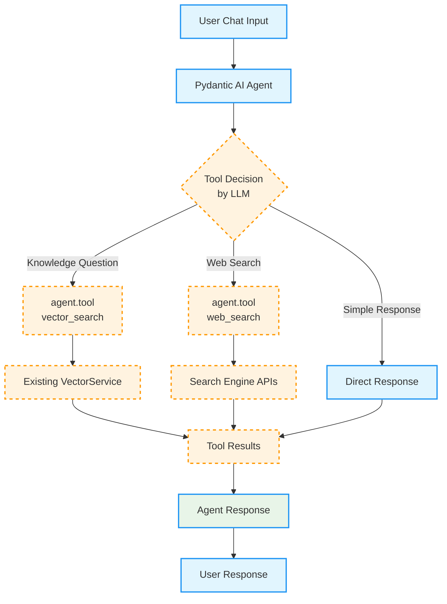

# Epic 0017 - Simple Chat Agent (Pydantic AI Implementation)

> **Goal**: Implement a simple, clean Pydantic AI-powered chat agent following the official documentation patterns instead of overengineered custom solutions.

**Framework**: Direct Pydantic AI Agent usage with SessionDependencies integration, following official documentation patterns for simplicity and maintainability.

## 🚨 CLEANUP REQUIRED: Overengineering Identified

### What We Built (Overengineered):
- **950+ lines of code** for basic chat functionality
- **ChatResponse Pydantic Model** (210 lines) - unnecessary wrapper
- **SimpleChatAgent Class** (306 lines) - unnecessary wrapper around Agent
- **Factory System** (390 lines) - complex configuration when direct instantiation works
- **Custom Usage Tracking** - Pydantic AI already provides this
- **Custom Confidence Calculation** - Not recommended by documentation
- **Complex YAML Configuration Loading** - Overkill for basic chat

### What Pydantic AI Documentation Shows:
```python
from pydantic_ai import Agent

agent = Agent('openrouter:deepseek/deepseek-chat-v3.1', system_prompt='Be helpful.')
result = agent.run_sync('Hello!')
print(result.output)  # Just a string - no complex models needed
```

**That's literally it!** 3 lines for basic chat functionality.

### Analysis: Why We Overcomplicated
1. **Assumed Complex Response Models Needed** - Pydantic AI returns simple strings by default
2. **Created Unnecessary Wrappers** - Agent class is already well-designed
3. **Built Factory Patterns** - Direct Agent() instantiation is the recommended approach
4. **Added Premature Optimizations** - Caching, statistics, etc. before we need them
5. **Ignored Documentation** - Didn't follow Pydantic AI's established patterns

---

## 🎯 SIMPLIFIED IMPLEMENTATION PLAN

### Current Simple Chat Workflow (Following Pydantic AI Patterns)



### Future Tool Integration (Pydantic AI @tool Pattern)



---

## 🔀 PARALLEL ENDPOINT STRATEGY

### **Zero-Disruption Development Approach**

Following the **Agent Endpoint Transition Strategy** (detailed in `memorybank/design/agent-endpoint-transition.md`), the simple chat agent will be implemented using a **parallel endpoints approach**:

#### **Phase 1: Parallel Development**

**✅ Legacy Endpoints (Continue Unchanged):**
```
POST /chat                          # Existing chat functionality - REMAINS ACTIVE
GET /events/stream                  # Existing SSE streaming - REMAINS ACTIVE
GET /                               # Main chat page - REMAINS ACTIVE
```

**🆕 New Agent Endpoints (Simple Chat):**
```
POST /agents/simple-chat/chat       # Simple chat agent endpoint - NEW
GET /agents/simple-chat/stream      # Agent-specific SSE endpoint - FUTURE
GET /agents/simple-chat/            # Agent-specific page - FUTURE
```

#### **Key Benefits of Parallel Strategy:**

1. **🛡️ Zero Disruption**: Existing `/chat` endpoint continues working unchanged during development
2. **🔄 Session Compatibility**: Shared session management and chat history between endpoints
3. **🧪 Safe Testing**: New agent endpoints can be tested without affecting production chat
4. **📈 Gradual Migration**: Frontend can migrate progressively (demo pages first, then main interface)
5. **🔙 Easy Rollback**: Legacy endpoints remain as fallback if issues arise

#### **Shared Infrastructure:**

Both legacy and agent endpoints share the same:
- **Session Management**: `SimpleSessionMiddleware` and session cookies
- **Message Persistence**: Same `messages` table and `MessageService`
- **Database**: Same PostgreSQL database and connection pooling
- **Configuration**: Same `app.yaml` configuration loading
- **Logging**: Same structured logging with Loguru

#### **Configuration in app.yaml:**

```yaml
# Legacy endpoint configuration (remains enabled)
legacy:
  enabled: true                    # Keep active during transition
  endpoint: "/chat"
  stream_endpoint: "/events/stream"

# Agent endpoint configuration (new)
agents:
  simple_chat:
    enabled: true                  # Enable simple chat agent
    endpoint: "/agents/simple-chat"
    config_file: "agent_configs/simple_chat.yaml"

# Route mapping (connects both endpoints to same agent)
routes:
  "/chat": simple_chat             # Legacy endpoint uses simple_chat agent
  "/agents/simple-chat": simple_chat # Explicit agent routing
```

#### **Future Transition Plan:**

1. **Phase 1** ✅: Implement agent endpoints (this document)
2. **Phase 2**: Update demo pages to use `/agents/simple-chat/chat`  
3. **Phase 3**: A/B test legacy vs agent performance
4. **Phase 4**: Add deprecation warnings to legacy endpoints
5. **Phase 5**: Redirect legacy to router endpoints

**Reference**: Complete strategy documented in `memorybank/design/agent-endpoint-transition.md`

---

## 📋 ESSENTIAL FEATURES FROM LEGACY IMPLEMENTATION

### ✅ **FUNCTIONALITY TO BRING OVER:**

Based on analysis of the current working chat implementation in `backend/app/main.py`, these essential features must be integrated into the simplified Pydantic AI agent:

#### 1. **Session Handling** 🔗
- **`get_current_session(request)`** - Extract session from FastAPI request state
- **Session Integration** - Link messages to current browser session for continuity
- **Session Validation** - Ensure valid session exists before processing

#### 2. **Message Persistence** 📝
- **Database Storage Flow**:
  1. Save user message **before** LLM call using `message_service.save_message()`
  2. Save assistant response **after** LLM completion
- **Message Metadata** - Include source, model, temperature, max_tokens, user_message_id linking
- **Error Handling** - Database failures don't block chat functionality (graceful degradation)

#### 3. **Configuration Loading** ⚙️
- **`load_config()`** - Load app.yaml configuration
- **LLM Config Extraction** - Extract provider, model, temperature, max_tokens from config
- **Environment Variable Support** - Config overrides from environment variables

#### 4. **OpenRouter Integration** 🌐
- **`chat_completion_content()`** - Make LLM API calls to OpenRouter with DeepSeek
- **Headers Setup** - HTTP-Referer and X-Title headers for OpenRouter tracking
- **Error Handling** - API failures, timeouts, rate limiting with exponential backoff

#### 5. **Comprehensive Logging** 📊
- **Request Logging** - Session info, model params, message preview
- **Message Persistence Logging** - Save success/failure events  
- **LLM Usage Logging** - Model, tokens, cost, latency tracking
- **Error Logging** - All failure scenarios with context

#### 6. **Error Handling & Graceful Degradation** 🛡️
- **Session Errors** - Return 500 if no session available
- **Empty Message Validation** - Return 400 for empty messages
- **Database Failures** - Log errors but don't block chat responses
- **LLM API Failures** - Return user-friendly error messages

#### 7. **Input Validation & Security** 🔒
- **Message Content Sanitization** - `.strip()` on user input
- **Session Validation** - Verify session exists and is valid
- **Request Body Parsing** - Safe JSON parsing with error handling

### 🔄 **INTEGRATION STRATEGY:**

The simplified Pydantic AI agent should **leverage existing infrastructure** rather than recreating these systems:

```python
# Example Integration Pattern
from pydantic_ai import Agent
from app.config import load_config  
from app.middleware.simple_session_middleware import get_current_session
from app.services.message_service import get_message_service
from app.openrouter_client import chat_completion_content

async def simple_chat_endpoint(request: Request):
    # 1. SESSION HANDLING (existing)
    session = get_current_session(request)
    if not session:
        return {"error": "No session"}, 500
    
    # 2. CONFIGURATION LOADING (existing) 
    config = load_config()
    llm_config = config.get("llm", {})
    
    # 3. MESSAGE PERSISTENCE - Before (existing)
    message_service = get_message_service()
    user_message_id = await message_service.save_message(
        session_id=session.id, role="human", content=message
    )
    
    # 4. PYDANTIC AI AGENT CALL (new - simple)
    result = await chat_agent.run(message, deps=session_deps)
    
    # 5. MESSAGE PERSISTENCE - After (existing)
    await message_service.save_message(
        session_id=session.id, role="assistant", content=result.output,
        metadata={"user_message_id": str(user_message_id)}
    )
    
    return {"response": result.output}
```

**Key Insight**: Focus on **integrating with existing services**, not recreating them! 🎯

---

## 📋 IMPLEMENTATION TASKS

### PHASE 1: CLEANUP (Remove Overengineered Code)

#### TASK 0017-CLEANUP-001 - Remove Overengineered Components
- **Delete**: `backend/app/agents/templates/simple_chat/models.py` (ChatResponse model - 210 lines)
- **Delete**: `backend/app/agents/templates/simple_chat/agent.py` (SimpleChatAgent wrapper - 306 lines)
- **Delete**: `backend/app/agents/templates/simple_chat/factory.py` (Factory system - 390 lines)
- **Simplify**: `backend/app/agents/templates/simple_chat/__init__.py` (reduce to exports only)
- **Acceptance**: 950+ lines of overengineered code removed

### PHASE 2: SIMPLE IMPLEMENTATION (Follow Pydantic AI Patterns)

#### TASK 0017-SIMPLE-001 - Direct Pydantic AI Agent Implementation
**File**: `backend/app/agents/simple_chat.py` (new, simplified)

```python
from pydantic_ai import Agent
from app.agents.base.dependencies import SessionDependencies
from app.config import load_config

# Simple chat agent with proper dependency injection
def create_simple_chat_agent():
    """Create a simple chat agent with dynamic configuration."""
    config = load_config()
    llm_config = config.get("llm", {})
    
    # Build model name from config: openrouter:deepseek/deepseek-chat-v3.1
    provider = llm_config.get("provider", "openrouter")
    model = llm_config.get("model", "deepseek/deepseek-chat-v3.1")
    model_name = f"{provider}:{model}"
    
    return Agent(
        model_name,
        deps_type=SessionDependencies,
        system_prompt='You are a helpful AI assistant. Be conversational and helpful.'
    )

# Global agent instance (lazy loaded)
_chat_agent = None

def get_chat_agent():
    """Get or create the global chat agent instance."""
    global _chat_agent
    if _chat_agent is None:
        _chat_agent = create_simple_chat_agent()
    return _chat_agent

async def simple_chat(
    message: str, 
    session_deps: SessionDependencies, 
    message_history=None
) -> dict:
    """Simple chat function using Pydantic AI agent with legacy integration."""
    config = load_config()
    llm_config = config.get("llm", {})
    
    agent = get_chat_agent()
    result = await agent.run(
        message, 
        deps=session_deps, 
        message_history=message_history,
        temperature=llm_config.get("temperature", 0.3),
        max_tokens=llm_config.get("max_tokens", 1024)
    )
    
    return {
        'response': result.output,  # Simple string response
        'messages': result.all_messages(),  # Full conversation history
        'new_messages': result.new_messages(),  # Only new messages from this run
        'usage': result.usage()  # Built-in usage tracking
    }
```

- **Lines of Code**: ~45 lines (vs 950+ previously) - includes proper config integration
- **Acceptance**: Agent responds to basic chat queries with string responses
- **Dependencies**: Existing SessionDependencies, app.config module, Pydantic AI native patterns
- **Configuration**: Dynamically loads from app.yaml (provider: openrouter, model: deepseek/deepseek-chat-v3.1, temperature: 0.3, max_tokens: 1024)
- **Benefits**: Configuration changes in app.yaml automatically apply without code changes
- **Conversation History**: Uses Pydantic AI's native `message_history` and `result.all_messages()` patterns

#### TASK 0017-SIMPLE-002 - Conversation History Integration
Use Pydantic AI's native message history:
```python
# First message
result1 = await chat('Hello!', session_deps)

# Follow-up with history
result2 = await chat('Tell me more', session_deps, message_history=result1['messages'])
```

- **Acceptance**: Conversation history maintained using Pydantic AI patterns
- **Dependencies**: TASK 0017-SIMPLE-001

#### TASK 0017-SIMPLE-003 - FastAPI Endpoint Integration with Legacy Features
**File**: `backend/app/api/agents.py` (new endpoint - parallel to existing `/chat`)

**🔀 Parallel Endpoint Strategy**: This creates the **NEW** `/agents/simple-chat/chat` endpoint while the **legacy** `/chat` endpoint remains fully functional and unchanged.

```python
from fastapi import APIRouter, Request, Depends, HTTPException
from fastapi.responses import PlainTextResponse
from pydantic import BaseModel
from loguru import logger
from typing import Optional, List

from app.agents.simple_chat import simple_chat
from app.agents.base.dependencies import SessionDependencies
from app.middleware.simple_session_middleware import get_current_session
from app.services.message_service import get_message_service
from app.config import load_config

router = APIRouter()

class ChatRequest(BaseModel):
    message: str
    message_history: Optional[List] = None

@router.post("/agents/simple-chat/chat", response_class=PlainTextResponse)
async def simple_chat_endpoint(
    chat_request: ChatRequest, 
    request: Request
) -> PlainTextResponse:
    """
    Simple chat endpoint with comprehensive legacy feature integration.
    
    Integrates:
    - Session handling from legacy implementation
    - Message persistence before/after LLM call
    - Configuration loading from app.yaml
    - Comprehensive logging
    - Error handling with graceful degradation
    - Input validation and security
    """
    
    # 1. SESSION HANDLING - Extract and validate session
    session = get_current_session(request)
    if not session:
        logger.error("No session available for simple chat request")
        return PlainTextResponse("Session error", status_code=500)
    
    # 2. INPUT VALIDATION & SECURITY
    message = str(chat_request.message or "").strip()
    if not message:
        logger.warning(f"Empty message from session {session.id}")
        return PlainTextResponse("", status_code=400)
    
    # 3. CONFIGURATION LOADING
    config = load_config()
    llm_config = config.get("llm", {})
    
    # 4. COMPREHENSIVE LOGGING - Request
    logger.info({
        "event": "simple_chat_request",
        "path": "/agents/simple-chat/chat",
        "session_id": str(session.id),
        "session_key": session.session_key[:8] + "..." if session.session_key else None,
        "message_preview": message[:100] + "..." if len(message) > 100 else message,
        "model": f"{llm_config.get('provider', 'openrouter')}:{llm_config.get('model', 'deepseek/deepseek-chat-v3.1')}",
        "temperature": llm_config.get("temperature", 0.3),
        "max_tokens": llm_config.get("max_tokens", 1024)
    })
    
    # 5. MESSAGE PERSISTENCE - Before LLM call
    message_service = get_message_service()
    user_message_id = None
    
    try:
        user_message_id = await message_service.save_message(
            session_id=session.id,
            role="human",
            content=message,
            metadata={"source": "simple_chat", "agent_type": "simple_chat"}
        )
        logger.info({
            "event": "user_message_saved",
            "session_id": str(session.id),
            "message_id": str(user_message_id),
            "content_length": len(message)
        })
    except Exception as e:
        # ERROR HANDLING - Database failures don't block chat
        logger.error({
            "event": "user_message_save_failed",
            "session_id": str(session.id),
            "error": str(e),
            "error_type": type(e).__name__
        })
    
    try:
        # 6. PYDANTIC AI AGENT CALL - Simple and clean
        session_deps = SessionDependencies(
            session_id=session.id,
            account_context=None,  # Optional for simple chat
            vector_config=None     # Optional for simple chat
        )
        
        result = await simple_chat(
            message, 
            session_deps, 
            chat_request.message_history
        )
        
        # 7. MESSAGE PERSISTENCE - After LLM completion
        try:
            assistant_message_id = await message_service.save_message(
                session_id=session.id,
                role="assistant",
                content=result['response'],
                metadata={
                    "source": "simple_chat",
                    "agent_type": "simple_chat",
                    "user_message_id": str(user_message_id) if user_message_id else None,
                    "usage": result.get('usage', {})
                }
            )
            
            # 8. COMPREHENSIVE LOGGING - Success
            logger.info({
                "event": "assistant_message_saved",
                "session_id": str(session.id),
                "message_id": str(assistant_message_id),
                "user_message_id": str(user_message_id) if user_message_id else None,
                "content_length": len(result['response']),
                "usage": result.get('usage', {}),
                "agent_type": "simple_chat"
            })
        except Exception as e:
            # ERROR HANDLING - Database failures don't block response
            logger.error({
                "event": "assistant_message_save_failed",
                "session_id": str(session.id),
                "user_message_id": str(user_message_id) if user_message_id else None,
                "error": str(e),
                "error_type": type(e).__name__
            })
        
        # Return plain text response like legacy implementation
        return PlainTextResponse(result['response'])
        
    except Exception as e:
        # ERROR HANDLING & GRACEFUL DEGRADATION - LLM failures
        logger.error({
            "event": "simple_chat_agent_failed",
            "session_id": str(session.id),
            "user_message_id": str(user_message_id) if user_message_id else None,
            "error": str(e),
            "error_type": type(e).__name__
        })
        return PlainTextResponse("Sorry, I'm having trouble responding right now.", status_code=500)
```

- **Lines of Code**: ~120 lines (comprehensive integration with all legacy features)
- **Acceptance**: Simple chat accessible via FastAPI endpoint with full legacy feature parity
- **Dependencies**: TASK 0017-SIMPLE-001, existing session middleware, message service, config module
- **Legacy Integration**: All 7 essential features integrated (session, persistence, config, logging, error handling, validation, security)
- **Response Format**: Maintains compatibility with legacy `/chat` endpoint (PlainTextResponse)

### PHASE 3: TOOL INTEGRATION (Future - Following @agent.tool Pattern)

#### TASK 0017-TOOLS-001 - Vector Search Tool
```python
@chat_agent.tool
async def vector_search(ctx: RunContext[SessionDependencies], query: str) -> str:
    """Search the knowledge base for relevant information."""
    # Use existing VectorService
    results = await vector_service.query(query, ctx.deps.session_id)
    return format_search_results(results)
```

#### TASK 0017-TOOLS-002 - Web Search Tool
```python
@chat_agent.tool  
async def web_search(ctx: RunContext[SessionDependencies], query: str) -> str:
    """Search the web for current information."""
    # Implementation using existing search services
    pass
```

---

## 📊 COMPARISON: Before vs After

| Aspect | Overengineered (Before) | Simplified (After) |
|--------|------------------------|-------------------|
| **Lines of Code** | 950+ lines | ~45 lines (agent) + ~120 lines (endpoint) |
| **Files Created** | 4 complex files | 2 simple files |
| **Response Model** | Complex ChatResponse (210 lines) | Native string output |
| **Agent Wrapper** | SimpleChatAgent (306 lines) | Direct Agent usage |
| **Factory System** | Complex factory (390 lines) | Simple function-based creation |
| **Configuration** | YAML loading complexity | Direct app.yaml config loading |
| **Conversation History** | Custom implementation | Native Pydantic AI patterns |
| **Session Integration** | ❌ Missing | ✅ Full session handling |
| **Message Persistence** | ❌ Missing | ✅ Before/after LLM call |
| **Error Handling** | ❌ Missing | ✅ Graceful degradation |
| **Logging** | ❌ Missing | ✅ Comprehensive logging |
| **Input Validation** | ❌ Missing | ✅ Security & validation |
| **Legacy Compatibility** | ❌ Incompatible | ✅ PlainTextResponse format |
| **Endpoint Strategy** | ❌ Replace existing | ✅ Parallel endpoints (/chat + /agents/simple-chat/chat) |
| **Tool Integration** | Custom patterns | @agent.tool decorators |
| **Maintainability** | High complexity | Low complexity |
| **Testing** | Test wrapper layers | Test agent directly |
| **Documentation** | Custom patterns | Follows Pydantic AI docs |

---

## ✅ SUCCESS CRITERIA (Simplified)

### CLEANUP Success Criteria:
1. **Code Reduction**: 950+ lines reduced to ~165 lines total (agent + endpoint with full legacy integration)
2. **Complexity Removal**: No custom wrappers, factories, or response models - replaced with simple functions
3. **Pattern Alignment**: Follows Pydantic AI documentation exactly with OpenRouter + DeepSeek

### IMPLEMENTATION Success Criteria:
1. **Basic Functionality**: Agent responds to simple queries with string responses
2. **Parallel Endpoint Strategy**: New `/agents/simple-chat/chat` endpoint works alongside existing `/chat` endpoint
   - ✅ Legacy `/chat` endpoint remains fully functional and unchanged
   - ✅ New agent endpoint shares session management and message history  
   - ✅ Zero disruption to existing functionality
   - ✅ Seamless conversation continuity between endpoints
3. **Legacy Feature Parity**: All 7 essential features integrated:
   - ✅ Session handling via existing middleware
   - ✅ Message persistence before/after LLM calls
   - ✅ Configuration loading from app.yaml
   - ✅ OpenRouter integration (via config)
   - ✅ Comprehensive logging with structured events
   - ✅ Error handling with graceful degradation
   - ✅ Input validation and security measures
4. **Conversation History**: Maintains conversation context using Pydantic AI native message history
5. **API Integration**: FastAPI endpoint with legacy `/chat` compatibility (PlainTextResponse)
6. **Database Integration**: Uses existing SessionDependencies and MessageService
7. **Configuration Flexibility**: Dynamic config loading supports environment variable overrides

### FUTURE Success Criteria:
8. **Tool Integration**: Tools added using @agent.tool decorators
9. **Vector Search**: Knowledge base search using existing VectorService
10. **Web Search**: Current information retrieval capabilities
11. **Streaming Support**: Add streaming responses if needed

### VERIFICATION Criteria:
- **Parallel Endpoint Functionality**: Both `/chat` and `/agents/simple-chat/chat` work simultaneously
- **Functional Compatibility**: New endpoint behaves identically to legacy `/chat` endpoint
- **Session Continuity**: Conversation history persists across browser sessions and between endpoints
- **Zero Disruption**: Legacy `/chat` endpoint remains unaffected during agent development
- **Shared Infrastructure**: Both endpoints use same session management and message persistence
- **Error Resilience**: Database failures don't prevent chat responses
- **Performance**: Response times comparable or better than legacy implementation
- **Monitoring**: All events logged for debugging and analytics

---

## 🎓 LESSONS LEARNED

1. **Follow Documentation**: Always start with official patterns before building custom solutions
2. **Less is More**: Simple, documented approaches are better than complex custom ones
3. **Question Complexity**: Ask "why do we need this?" before adding layers
4. **Community Patterns**: Use established patterns rather than inventing new ones
5. **Incremental Building**: Start simple, add complexity only when needed

**The goal is to build a working chat agent, not to demonstrate architectural complexity.**

---

This revision follows Pydantic AI's recommended patterns and dramatically simplifies our implementation while maintaining all required functionality.
