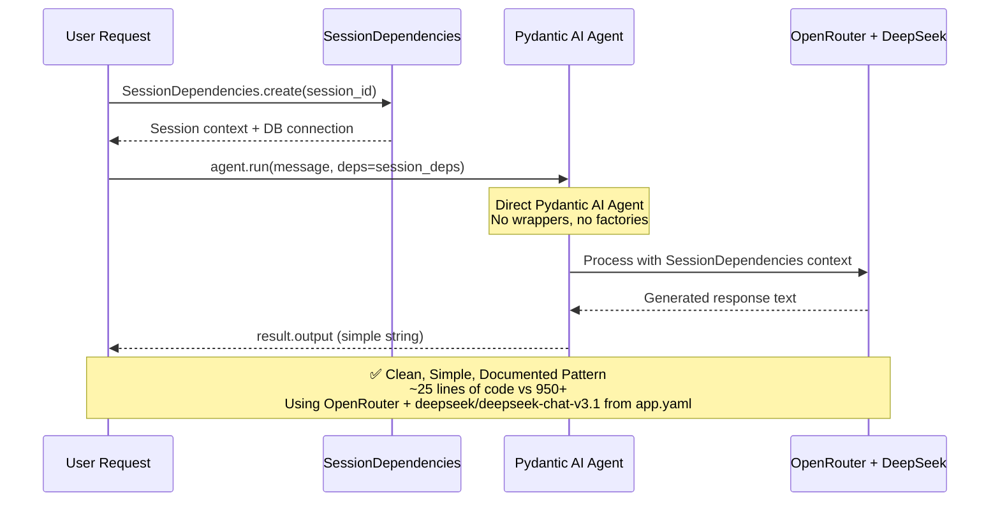
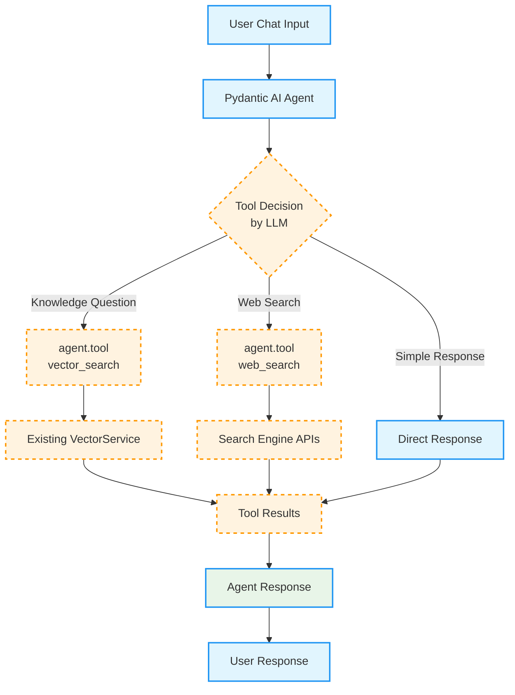

# Epic 0017 - Simple Chat Agent (Pydantic AI Implementation)

> **Goal**: Implement a simple, clean Pydantic AI-powered chat agent following the official documentation patterns instead of overengineered custom solutions.

**Framework**: Direct Pydantic AI Agent usage with SessionDependencies integration, following official documentation patterns for simplicity and maintainability.

## 🚨 CLEANUP REQUIRED: Overengineering Identified

### What We Built (Overengineered):
- **950+ lines of code** for basic chat functionality
- **ChatResponse Pydantic Model** (210 lines) - unnecessary wrapper
- **SimpleChatAgent Class** (306 lines) - unnecessary wrapper around Agent
- **Factory System** (390 lines) - complex configuration when direct instantiation works
- **Custom Usage Tracking** - Pydantic AI already provides this
- **Custom Confidence Calculation** - Not recommended by documentation
- **Complex YAML Configuration Loading** - Overkill for basic chat

### What Pydantic AI Documentation Shows:
```python
from pydantic_ai import Agent

agent = Agent('openrouter:deepseek/deepseek-chat-v3.1', system_prompt='Be helpful.')
result = agent.run_sync('Hello!')
print(result.output)  # Just a string - no complex models needed
```

**That's literally it!** 3 lines for basic chat functionality.

### Analysis: Why We Overcomplicated
1. **Assumed Complex Response Models Needed** - Pydantic AI returns simple strings by default
2. **Created Unnecessary Wrappers** - Agent class is already well-designed
3. **Built Factory Patterns** - Direct Agent() instantiation is the recommended approach
4. **Added Premature Optimizations** - Caching, statistics, etc. before we need them
5. **Ignored Documentation** - Didn't follow Pydantic AI's established patterns

---

## 🎯 SIMPLIFIED IMPLEMENTATION PLAN

### Current Simple Chat Workflow (Following Pydantic AI Patterns)



### Future Tool Integration (Pydantic AI @tool Pattern)



---

## 🔀 PARALLEL ENDPOINT STRATEGY

### **Zero-Disruption Development Approach**

Following the **Agent Endpoint Transition Strategy** (detailed in `memorybank/design/agent-endpoint-transition.md`), the simple chat agent will be implemented using a **parallel endpoints approach**:

#### **Phase 1: Parallel Development**

**✅ Legacy Endpoints (Continue Unchanged):**
```
POST /chat                          # Existing chat functionality - REMAINS ACTIVE
GET /events/stream                  # Existing SSE streaming - REMAINS ACTIVE
GET /                               # Main chat page - REMAINS ACTIVE
```

**🆕 New Agent Endpoints (Simple Chat):**
```
POST /agents/simple-chat/chat       # Simple chat agent endpoint - NEW
GET /agents/simple-chat/stream      # Agent-specific SSE endpoint - FUTURE
GET /agents/simple-chat/            # Agent-specific page - FUTURE
```

#### **Key Benefits of Parallel Strategy:**

1. **🛡️ Zero Disruption**: Existing `/chat` endpoint continues working unchanged during development
2. **🔄 Session Compatibility**: Shared session management and chat history between endpoints
3. **🧪 Safe Testing**: New agent endpoints can be tested without affecting production chat
4. **📈 Gradual Migration**: Frontend can migrate progressively (demo pages first, then main interface)
5. **🔙 Easy Rollback**: Legacy endpoints remain as fallback if issues arise

#### **Shared Infrastructure:**

Both legacy and agent endpoints share the same:
- **Session Management**: `SimpleSessionMiddleware` and session cookies
- **Message Persistence**: Same `messages` table and `MessageService`
- **Database**: Same PostgreSQL database and connection pooling
- **Configuration**: Same `app.yaml` configuration loading
- **Logging**: Same structured logging with Loguru

#### **Configuration in app.yaml:**

```yaml
# Legacy endpoint configuration (remains enabled)
legacy:
  enabled: true                    # Keep active during transition
  endpoint: "/chat"
  stream_endpoint: "/events/stream"

# Agent endpoint configuration (new)
agents:
  simple_chat:
    enabled: true                  # Enable simple chat agent
    endpoint: "/agents/simple-chat"
    config_file: "agent_configs/simple_chat.yaml"

# Route mapping (connects both endpoints to same agent)
routes:
  "/chat": simple_chat             # Legacy endpoint uses simple_chat agent
  "/agents/simple-chat": simple_chat # Explicit agent routing
```

#### **Future Transition Plan:**

1. **Phase 1** ✅: Implement agent endpoints (this document)
2. **Phase 2**: Update demo pages to use `/agents/simple-chat/chat`  
3. **Phase 3**: A/B test legacy vs agent performance
4. **Phase 4**: Add deprecation warnings to legacy endpoints
5. **Phase 5**: Redirect legacy to router endpoints

**Reference**: Complete strategy documented in `memorybank/design/agent-endpoint-transition.md`

---

## 📋 ESSENTIAL FEATURES FROM LEGACY IMPLEMENTATION

### ✅ **FUNCTIONALITY TO BRING OVER:**

Based on analysis of the current working chat implementation in `backend/app/main.py`, these essential features must be integrated into the simplified Pydantic AI agent:

#### 1. **Session Handling** 🔗
- **`get_current_session(request)`** - Extract session from FastAPI request state
- **Session Integration** - Link messages to current browser session for continuity
- **Session Validation** - Ensure valid session exists before processing

#### 2. **Message Persistence** 📝
- **Database Storage Flow**:
  1. Save user message **before** LLM call using `message_service.save_message()`
  2. Save assistant response **after** LLM completion
- **Message Metadata** - Include source, model, temperature, max_tokens, user_message_id linking
- **Error Handling** - Database failures don't block chat functionality (graceful degradation)

#### 3. **Configuration Loading** ⚙️
- **`load_config()`** - Load app.yaml configuration
- **LLM Config Extraction** - Extract provider, model, temperature, max_tokens from config
- **Environment Variable Support** - Config overrides from environment variables

#### 4. **OpenRouter Integration** 🌐
- **`chat_completion_content()`** - Make LLM API calls to OpenRouter with DeepSeek
- **Headers Setup** - HTTP-Referer and X-Title headers for OpenRouter tracking
- **Error Handling** - API failures, timeouts, rate limiting with exponential backoff

#### 5. **Comprehensive Logging** 📊
- **Request Logging** - Session info, model params, message preview
- **Message Persistence Logging** - Save success/failure events  
- **LLM Usage Logging** - Model, tokens, cost, latency tracking
- **Error Logging** - All failure scenarios with context

#### 6. **Error Handling & Graceful Degradation** 🛡️
- **Session Errors** - Return 500 if no session available
- **Empty Message Validation** - Return 400 for empty messages
- **Database Failures** - Log errors but don't block chat responses
- **LLM API Failures** - Return user-friendly error messages

#### 7. **Input Validation & Security** 🔒
- **Message Content Sanitization** - `.strip()` on user input
- **Session Validation** - Verify session exists and is valid
- **Request Body Parsing** - Safe JSON parsing with error handling

### 🔄 **INTEGRATION STRATEGY:**

The simplified Pydantic AI agent should **leverage existing infrastructure** rather than recreating these systems:

```python
# Example Integration Pattern
from pydantic_ai import Agent
from app.config import load_config  
from app.middleware.simple_session_middleware import get_current_session
from app.services.message_service import get_message_service
from app.openrouter_client import chat_completion_content

async def simple_chat_endpoint(request: Request):
    # 1. SESSION HANDLING (existing)
    session = get_current_session(request)
    if not session:
        return {"error": "No session"}, 500
    
    # 2. CONFIGURATION LOADING (existing) 
    config = load_config()
    llm_config = config.get("llm", {})
    
    # 3. MESSAGE PERSISTENCE - Before (existing)
    message_service = get_message_service()
    user_message_id = await message_service.save_message(
        session_id=session.id, role="human", content=message
    )
    
    # 4. PYDANTIC AI AGENT CALL (new - simple)
    result = await chat_agent.run(message, deps=session_deps)
    
    # 5. MESSAGE PERSISTENCE - After (existing)
    await message_service.save_message(
        session_id=session.id, role="assistant", content=result.output,
        metadata={"user_message_id": str(user_message_id)}
    )
    
    return {"response": result.output}
```

**Key Insight**: Focus on **integrating with existing services**, not recreating them! 🎯

---

## 📋 IMPLEMENTATION TASKS

### PHASE 1: FOUNDATION (Enable Parallel Development)

#### TASK 0017-001 - Legacy Agent Switch
**File**: `backend/config/app.yaml` + `backend/app/main.py` updates
**Goal**: Foundation for parallel development - enable/disable legacy endpoints via configuration

**Implementation:**
```yaml
# Add to backend/config/app.yaml
legacy:
  enabled: true                    # Can be toggled to false for parallel development
  endpoints:
    chat: "/chat"                  # Legacy chat endpoint
    stream: "/events/stream"       # Legacy SSE streaming
    main: "/"                      # Main chat page
```

**Code Changes:**
- **Config Loading**: Update `backend/app/config.py` to read `legacy` section from app.yaml
- **Conditional Routing**: Update `backend/app/main.py` to conditionally register legacy endpoints:
  ```python
  # Only register legacy endpoints if enabled
  config = load_config()
  if config.get("legacy", {}).get("enabled", True):
      app.post("/chat")(legacy_chat_endpoint)
      app.get("/events/stream")(legacy_stream_endpoint) 
      app.get("/")(legacy_main_page)
  ```

**Key Benefits:**
- ✅ **Parallel Development**: Can develop new agent while legacy remains active
- ✅ **Zero Disruption**: Legacy functionality preserved during development
- ✅ **Easy Testing**: Toggle between legacy and new implementations
- ✅ **Safe Rollback**: Instant fallback if new agent has issues
- ✅ **Configuration-Driven**: No code changes needed to toggle functionality

**Acceptance Criteria:**
- ✅ `legacy.enabled: false` → legacy endpoints return 404 Not Found
- ✅ `legacy.enabled: true` → legacy endpoints work normally
- ✅ Configuration changes apply on application restart
- ✅ No errors or exceptions when legacy endpoints disabled
- ✅ New agent development can proceed independently

**Automated Tests:**
- **Unit Tests**: Config parsing logic, conditional endpoint registration
- **Integration Tests**: Endpoint availability based on configuration
- **Configuration Tests**: Toggle functionality verification

- **Dependencies**: None (foundation feature)
- **Chunk Size**: ~0.5 day

---

### PHASE 2: CLEANUP (Remove Overengineered Code)

#### TASK 0017-002 - Remove Overengineered Components
- **Delete**: `backend/app/agents/templates/simple_chat/models.py` (ChatResponse model - 210 lines)
- **Delete**: `backend/app/agents/templates/simple_chat/agent.py` (SimpleChatAgent wrapper - 306 lines)
- **Delete**: `backend/app/agents/templates/simple_chat/factory.py` (Factory system - 390 lines)
- **Simplify**: `backend/app/agents/templates/simple_chat/__init__.py` (reduce to exports only)
- **Acceptance**: 950+ lines of overengineered code removed
- **Dependencies**: TASK 0017-001 (foundation enables safe cleanup)
- **Chunk Size**: ~0.5 day

---

## 📄 AGENT CONFIGURATION PATTERN

### **Standard Agent Configuration Structure**

All agent types will follow this consistent YAML configuration pattern in `backend/config/agent_configs/{agent_type}.yaml`:

```yaml
# Example: backend/config/agent_configs/simple_chat.yaml
agent_type: "simple_chat"
name: "Simple Chat Agent"  
description: "General-purpose conversational agent"

# System prompt - loaded into Pydantic AI Agent
system_prompt: |
  You are a helpful AI assistant with access to knowledge base search and web search tools.
  Always provide accurate, helpful responses with proper citations when you use information from searches.
  
  Guidelines:
  - Use the vector_search tool when users ask questions that might be answered by stored knowledge
  - Use web_search when you need current information or when vector search doesn't provide good results
  - Be conversational and helpful while remaining accurate
  - Cite your sources when using search results

# Model settings - agent-specific overrides
model_settings:
  model: "openai:gpt-4o"      # Override app.yaml model if needed
  temperature: 0.3            # Agent-specific temperature
  max_tokens: 2000           # Agent-specific token limit

# Tool configuration - enable/disable per agent
tools:
  vector_search:
    enabled: true
    max_results: 5
  web_search:
    enabled: true
    provider: "exa"
  conversation_management:
    enabled: true

# Context management settings
context_management:
  max_history_messages: 20
  context_window_tokens: 8000
```

### **Loading Pattern for All Agents**

```python
def create_{agent_type}_agent():
    """Standard pattern for creating any agent type."""
    # 1. Load app-level configuration
    config = load_config()
    llm_config = config.get("llm", {})
    
    # 2. Load agent-specific configuration  
    agent_config = load_agent_config("{agent_type}")
    system_prompt = agent_config.get("system_prompt", "You are a helpful AI assistant.")
    
    # 3. Build model name from app config
    provider = llm_config.get("provider", "openrouter")
    model = llm_config.get("model", "deepseek/deepseek-chat-v3.1")
    model_name = f"{provider}:{model}"
    
    # 4. Create agent with YAML-loaded system prompt
    return Agent(
        model_name,
        deps_type=SessionDependencies,
        system_prompt=system_prompt
    )
```

**Benefits of This Pattern:**
- ✅ **Consistent Configuration**: All agents follow the same structure
- ✅ **Easy Customization**: Change system prompts without code changes
- ✅ **Tool Management**: Enable/disable features per agent type
- ✅ **Setting Overrides**: Agent-specific settings override app defaults
- ✅ **Scalable**: Easy to add new agent types following same pattern

---

### PHASE 3: CORE IMPLEMENTATION (Follow Pydantic AI Patterns)

#### TASK 0017-003 - Direct Pydantic AI Agent Implementation  
**File**: `backend/app/agents/simple_chat.py` (new, simplified)

```python
from pydantic_ai import Agent
from app.agents.base.dependencies import SessionDependencies
from app.config import load_config
from app.agents.config_loader import load_agent_config
import yaml
import os

# Simple chat agent with YAML configuration loading
def create_simple_chat_agent():
    """Create a simple chat agent with dynamic configuration from YAML."""
    config = load_config()
    llm_config = config.get("llm", {})
    
    # Build model name from config: openrouter:deepseek/deepseek-chat-v3.1
    provider = llm_config.get("provider", "openrouter")
    model = llm_config.get("model", "deepseek/deepseek-chat-v3.1")
    model_name = f"{provider}:{model}"
    
    # Load agent-specific configuration including system prompt
    agent_config = load_agent_config("simple_chat")
    system_prompt = agent_config.get("system_prompt", "You are a helpful AI assistant.")
    
    return Agent(
        model_name,
        deps_type=SessionDependencies,
        system_prompt=system_prompt
    )

def load_agent_config(agent_type: str) -> dict:
    """
    Load agent configuration from YAML file.
    
    Pattern for all agent types:
    - Config file: backend/config/agent_configs/{agent_type}.yaml
    - Contains: system_prompt, model_settings, tools, context_management
    """
    config_path = os.path.join(
        os.path.dirname(__file__), 
        "..", "..", "config", "agent_configs", f"{agent_type}.yaml"
    )
    
    if not os.path.exists(config_path):
        raise FileNotFoundError(f"Agent config not found: {config_path}")
    
    with open(config_path, 'r', encoding='utf-8') as f:
        return yaml.safe_load(f)

# Global agent instance (lazy loaded)
_chat_agent = None

def get_chat_agent():
    """Get or create the global chat agent instance."""
    global _chat_agent
    if _chat_agent is None:
        _chat_agent = create_simple_chat_agent()
    return _chat_agent

async def simple_chat(
    message: str, 
    session_deps: SessionDependencies, 
    message_history=None
) -> dict:
    """Simple chat function using Pydantic AI agent with YAML configuration."""
    # Load both app-level and agent-specific configuration
    config = load_config()
    llm_config = config.get("llm", {})
    agent_config = load_agent_config("simple_chat")
    
    # Use model settings from agent config, fallback to app config
    model_settings = agent_config.get("model_settings", {})
    
    agent = get_chat_agent()
    result = await agent.run(
        message, 
        deps=session_deps, 
        message_history=message_history,
        temperature=model_settings.get("temperature", llm_config.get("temperature", 0.3)),
        max_tokens=model_settings.get("max_tokens", llm_config.get("max_tokens", 1024))
    )
    
    return {
        'response': result.output,  # Simple string response
        'messages': result.all_messages(),  # Full conversation history
        'new_messages': result.new_messages(),  # Only new messages from this run
        'usage': result.usage()  # Built-in usage tracking
    }
```

- **Lines of Code**: ~65 lines (vs 950+ previously) - includes YAML configuration loading pattern
- **Acceptance**: 
  - ✅ Agent responds to basic chat queries with string responses
  - ✅ System prompt loaded from `simple_chat.yaml` configuration file
  - ✅ Model settings (temperature, max_tokens) loaded from agent config with app.yaml fallback
  - ✅ Configuration pattern established for all future agent types
- **Dependencies**: TASK 0017-002 (cleanup complete), existing SessionDependencies, app.config module
- **Configuration Pattern**: 
  - **System Prompt**: Loaded from `backend/config/agent_configs/simple_chat.yaml`
  - **Model Settings**: Agent-specific settings override app-level defaults
  - **App Config**: Fallback to app.yaml for provider and base model settings
- **Benefits**: 
  - System prompts and agent behavior configurable via YAML files
  - Consistent pattern for all future agent types
  - No code changes needed for prompt or setting adjustments
- **Conversation History**: Uses Pydantic AI's native `message_history` and `result.all_messages()` patterns
- **Chunk Size**: ~1 day

#### TASK 0017-004 - Conversation History Integration
Use Pydantic AI's native message history:
```python
# First message
result1 = await chat('Hello!', session_deps)

# Follow-up with history
result2 = await chat('Tell me more', session_deps, message_history=result1['messages'])
```

- **Acceptance**: Conversation history maintained using Pydantic AI patterns
- **Dependencies**: TASK 0017-003 (core agent implementation)
- **Chunk Size**: ~0.5 day

#### TASK 0017-005 - LLM Request Tracking & Cost Management
**File**: `backend/app/services/llm_request_tracker.py` (new) + wrapper integration
**Goal**: Comprehensive tracking of all LLM requests, responses, token usage, and costs for accurate billing

**Critical Requirement**: Track every billable interaction with OpenRouter (or any LLM provider) for accurate customer cost passthrough and usage analytics.

**Implementation:**

```python
# New service: backend/app/services/llm_request_tracker.py
from typing import Dict, Any, Optional
from uuid import UUID
from datetime import datetime
from app.models.llm_request import LLMRequest
from app.database import get_db_session
from loguru import logger

class LLMRequestTracker:
    """Shared service for tracking all LLM requests across agent types."""
    
    def __init__(self):
        # Default account and agent for Phase 1
        self.DEFAULT_ACCOUNT_ID = UUID("00000000-0000-0000-0000-000000000001")
        self.DEFAULT_AGENT_INSTANCE_ID = UUID("00000000-0000-0000-0000-000000000002")
    
    async def track_llm_request(
        self,
        session_id: UUID,
        provider: str,
        model: str,
        request_body: Dict[str, Any],
        response_body: Dict[str, Any],
        tokens: Dict[str, int],  # {"prompt": 150, "completion": 75, "total": 225}
        cost_data: Dict[str, float],  # OpenRouter actuals: unit costs + computed total
        latency_ms: int,
        agent_instance_id: Optional[UUID] = None,
        error_metadata: Optional[Dict[str, Any]] = None
    ) -> UUID:
        """
        Track a complete LLM request with all billing and performance data.
        
        Returns the llm_request.id for linking with messages.
        """
        
        # Use defaults for Phase 1 (single account)
        agent_id = agent_instance_id or self.DEFAULT_AGENT_INSTANCE_ID
        
        # Sanitize request/response bodies (remove sensitive data, keep structure)
        sanitized_request = self._sanitize_request_body(request_body)
        sanitized_response = self._sanitize_response_body(response_body)
        
        # Create LLM request record
        llm_request = LLMRequest(
            session_id=session_id,
            agent_instance_id=agent_id,
            provider=provider,
            model=model,
            request_body=sanitized_request,
            response_body=sanitized_response,
            prompt_tokens=tokens.get("prompt", 0),
            completion_tokens=tokens.get("completion", 0),
            total_tokens=tokens.get("total", 0),
            unit_cost_prompt=cost_data.get("unit_cost_prompt", 0.0),
            unit_cost_completion=cost_data.get("unit_cost_completion", 0.0),
            computed_cost=cost_data.get("total_cost", 0.0),
            latency_ms=latency_ms,
            created_at=datetime.utcnow()
        )
        
        # Add error metadata if present
        if error_metadata:
            llm_request.response_body["error_metadata"] = error_metadata
        
        # Save to database
        async with get_db_session() as session:
            session.add(llm_request)
            await session.commit()
            await session.refresh(llm_request)
        
        # Log for monitoring
        logger.info({
            "event": "llm_request_tracked",
            "session_id": str(session_id),
            "agent_instance_id": str(agent_id),
            "provider": provider,
            "model": model,
            "total_tokens": tokens.get("total", 0),
            "computed_cost": cost_data.get("total_cost", 0.0),
            "latency_ms": latency_ms,
            "llm_request_id": str(llm_request.id)
        })
        
        return llm_request.id

# Wrapper function for all agents
async def track_llm_call(
    agent_function,
    session_id: UUID,
    *args,
    **kwargs
) -> tuple[Any, UUID]:
    """
    Wrapper function that tracks any LLM agent call.
    
    Usage:
        result, llm_request_id = await track_llm_call(
            agent.run, session_id, message, deps=session_deps
        )
    """
    tracker = LLMRequestTracker()
    start_time = datetime.utcnow()
    
    try:
        # Make the actual LLM call
        result = await agent_function(*args, **kwargs)
        end_time = datetime.utcnow()
        latency_ms = int((end_time - start_time).total_seconds() * 1000)
        
        # Extract tracking data from result (Pydantic AI provides usage info)
        usage_data = result.usage() if hasattr(result, 'usage') else {}
        tokens = {
            "prompt": usage_data.get("prompt_tokens", 0),
            "completion": usage_data.get("completion_tokens", 0), 
            "total": usage_data.get("total_tokens", 0)
        }
        
        # Get cost data from OpenRouter response (actual costs)
        cost_data = usage_data.get("cost", {})
        
        # Track the successful request
        llm_request_id = await tracker.track_llm_request(
            session_id=session_id,
            provider="openrouter",  # Will be configurable later
            model=usage_data.get("model", "unknown"),
            request_body={"messages": "sanitized"},  # Simplified for now
            response_body={"response": "sanitized"},
            tokens=tokens,
            cost_data=cost_data,
            latency_ms=latency_ms
        )
        
        return result, llm_request_id
        
    except Exception as e:
        # Track failed request if it consumed tokens
        end_time = datetime.utcnow()
        latency_ms = int((end_time - start_time).total_seconds() * 1000)
        
        # Determine if error is billable
        error_metadata = {
            "error_type": type(e).__name__,
            "error_message": str(e),
            "billable": "timeout" in str(e).lower() or "rate_limit" in str(e).lower()
        }
        
        # Track error if billable
        if error_metadata["billable"]:
            llm_request_id = await tracker.track_llm_request(
                session_id=session_id,
                provider="openrouter",
                model="unknown",
                request_body={"error": "failed_request"},
                response_body={"error": str(e)},
                tokens={"prompt": 0, "completion": 0, "total": 0},  # May be updated if partial
                cost_data={"total_cost": 0.0},
                latency_ms=latency_ms,
                error_metadata=error_metadata
            )
        
        # Re-raise the exception
        raise e
```

**Key Features:**
- ✅ **Wrapper Function Pattern**: Simple, explicit tracking that developers use intentionally
- ✅ **Real-Time Cost Tracking**: Uses OpenRouter's actual cost data from API responses
- ✅ **Comprehensive Error Handling**: Tracks billable errors (timeouts, rate limits) with metadata
- ✅ **Default Account/Agent**: Fixed UUIDs for Phase 1 single-account development
- ✅ **Database Integration**: Follows datamodel.md schema exactly
- ✅ **Shared Across Agents**: All agent types use the same tracking infrastructure

**Acceptance Criteria:**
- ✅ All LLM calls tracked with accurate token counts and costs
- ✅ OpenRouter actual costs captured and stored for billing
- ✅ Billable errors tracked (timeouts, rate limits, partial responses)
- ✅ Non-billable errors logged but not tracked for billing
- ✅ Default account and agent instance IDs used consistently
- ✅ Performance impact minimal (< 50ms tracking overhead)
- ✅ Database records match datamodel.md schema exactly

**Testing Scenarios:**
1. **Successful Request**: Full conversation tracked with costs
2. **Streaming Request**: Complete stream tracked as single record
3. **Timeout Error**: Partial tokens tracked if billable
4. **Rate Limit**: Pre-limit token usage tracked
5. **Network Error**: No tracking (not billable)
6. **Large Conversation**: Performance acceptable for long context

**Automated Tests:**
- **Unit Tests**: Wrapper function logic, cost extraction, error handling
- **Integration Tests**: Database persistence, schema compliance
- **Performance Tests**: Tracking overhead measurement

**Documentation Reference**: See `architecture/tracking_llm_costs.md` for usage patterns and examples

- **Dependencies**: TASK 0017-003 (agent implementation) and TASK 0017-004 (conversation history patterns)
- **Chunk Size**: ~1.5 days

#### TASK 0017-006 - Legacy Session Compatibility
**File**: `backend/app/services/session_compatibility.py` (new) + integration in simple chat
**Goal**: Seamless transition of existing legacy sessions and conversation history to simple chat agent

**Critical Requirement**: Users who have ongoing conversations on `/chat` must be able to continue seamlessly on `/default/simple-chat/chat` without losing context or conversation history.

**Implementation:**

```python
# New service: backend/app/services/session_compatibility.py
from typing import List, Dict, Any
from app.services.message_service import get_message_service
from pydantic_ai.messages import Message

async def load_legacy_conversation_history(session_id: str) -> List[Message]:
    """
    Load existing conversation history from database and convert to Pydantic AI format.
    
    Handles conversations that started on legacy /chat endpoint and ensures
    full context is available to simple chat agent.
    """
    message_service = get_message_service()
    
    # 1. RETRIEVE ALL MESSAGES for this session (legacy + new)
    db_messages = await message_service.get_conversation_history(
        session_id=session_id,
        include_system=False  # Pydantic AI handles system messages
    )
    
    # 2. CONVERT DB MESSAGES to Pydantic AI Message format
    pydantic_messages = []
    for msg in db_messages:
        pydantic_message = Message(
            role=msg.role,  # "human" or "assistant" 
            content=msg.content,
            timestamp=msg.created_at
        )
        pydantic_messages.append(pydantic_message)
    
    return pydantic_messages

async def ensure_session_continuity(session_id: str) -> Dict[str, Any]:
    """
    Ensure session continuity metrics and validation.
    Returns session statistics for logging/monitoring.
    """
    message_service = get_message_service()
    
    total_messages = await message_service.count_messages(session_id)
    legacy_messages = await message_service.count_messages(
        session_id, source_filter="legacy"
    )
    
    return {
        "total_messages": total_messages,
        "legacy_messages": legacy_messages,
        "agent_messages": total_messages - legacy_messages,
        "session_bridged": legacy_messages > 0
    }
```

**Integration in Simple Chat:**
```python
# Update simple_chat function to use legacy session compatibility
async def simple_chat(
    message: str, 
    session_deps: SessionDependencies, 
    message_history=None  # This will be populated from legacy sessions
) -> dict:
    """Enhanced simple chat with legacy session compatibility."""
    config = load_config()
    llm_config = config.get("llm", {})
    
    # LOAD LEGACY SESSION HISTORY if not provided
    if message_history is None:
        message_history = await load_legacy_conversation_history(
            str(session_deps.session_id)
        )
    
    agent = get_chat_agent()
    result = await agent.run(
        message, 
        deps=session_deps, 
        message_history=message_history,  # Full legacy + new context
        temperature=llm_config.get("temperature", 0.3),
        max_tokens=llm_config.get("max_tokens", 1024)
    )
    
    # SESSION CONTINUITY MONITORING
    continuity_stats = await ensure_session_continuity(str(session_deps.session_id))
    
    return {
        'response': result.output,
        'messages': result.all_messages(),
        'new_messages': result.new_messages(),
        'usage': result.usage(),
        'session_continuity': continuity_stats  # For monitoring/debugging
    }
```

**Key Features:**
- ✅ **Session ID Preservation**: Same session cookie/ID used by both legacy and simple chat
- ✅ **Full History Access**: All previous messages from `/chat` available to simple chat agent
- ✅ **Format Conversion**: Database messages converted to Pydantic AI Message format
- ✅ **Zero Context Loss**: Users can switch mid-conversation without losing history
- ✅ **Monitoring Support**: Session continuity statistics for debugging/analytics

**Acceptance Criteria:**
- ✅ User starts conversation on `/chat`, continues on `/default/simple-chat/chat` seamlessly
- ✅ Simple chat agent has access to full conversation context from legacy sessions
- ✅ No message loss during endpoint transition
- ✅ Session cookies work identically across both endpoints
- ✅ Conversation history displays correctly in both endpoints
- ✅ Performance impact minimal (efficient database queries)

**Testing Scenarios:**
1. **New Session**: Fresh session works on simple chat agent
2. **Legacy Session**: Existing legacy session continues on simple chat agent  
3. **Cross-Endpoint**: Start on legacy, continue on agent, return to legacy
4. **Long Conversations**: Sessions with 50+ messages maintain full context
5. **Error Handling**: Database failures don't prevent new messages

**Automated Tests:**
- **Unit Tests**: Message format conversion, session loading logic
- **Integration Tests**: Cross-endpoint conversation continuity
- **Performance Tests**: Query efficiency with large conversation histories

- **Dependencies**: TASK 0017-003 (agent implementation) and TASK 0017-004 (conversation history patterns)
- **Chunk Size**: ~1 day

#### TASK 0017-007 - FastAPI Endpoint Integration with Legacy Features
**File**: `backend/app/api/agents.py` (new endpoint - parallel to existing `/chat`)

**🔀 Parallel Endpoint Strategy**: This creates the **NEW** `/agents/simple-chat/chat` endpoint while the **legacy** `/chat` endpoint remains fully functional and unchanged.

```python
from fastapi import APIRouter, Request, Depends, HTTPException
from fastapi.responses import PlainTextResponse
from pydantic import BaseModel
from loguru import logger
from typing import Optional, List

from app.agents.simple_chat import simple_chat
from app.agents.base.dependencies import SessionDependencies
from app.middleware.simple_session_middleware import get_current_session
from app.services.message_service import get_message_service
from app.config import load_config

router = APIRouter()

class ChatRequest(BaseModel):
    message: str
    message_history: Optional[List] = None

@router.post("/agents/simple-chat/chat", response_class=PlainTextResponse)
async def simple_chat_endpoint(
    chat_request: ChatRequest, 
    request: Request
) -> PlainTextResponse:
    """
    Simple chat endpoint with comprehensive legacy feature integration.
    
    Integrates:
    - Session handling from legacy implementation
    - Message persistence before/after LLM call
    - Configuration loading from app.yaml
    - Comprehensive logging
    - Error handling with graceful degradation
    - Input validation and security
    """
    
    # 1. SESSION HANDLING - Extract and validate session
    session = get_current_session(request)
    if not session:
        logger.error("No session available for simple chat request")
        return PlainTextResponse("Session error", status_code=500)
    
    # 2. INPUT VALIDATION & SECURITY
    message = str(chat_request.message or "").strip()
    if not message:
        logger.warning(f"Empty message from session {session.id}")
        return PlainTextResponse("", status_code=400)
    
    # 3. CONFIGURATION LOADING
    config = load_config()
    llm_config = config.get("llm", {})
    
    # 4. COMPREHENSIVE LOGGING - Request
    logger.info({
        "event": "simple_chat_request",
        "path": "/agents/simple-chat/chat",
        "session_id": str(session.id),
        "session_key": session.session_key[:8] + "..." if session.session_key else None,
        "message_preview": message[:100] + "..." if len(message) > 100 else message,
        "model": f"{llm_config.get('provider', 'openrouter')}:{llm_config.get('model', 'deepseek/deepseek-chat-v3.1')}",
        "temperature": llm_config.get("temperature", 0.3),
        "max_tokens": llm_config.get("max_tokens", 1024)
    })
    
    # 5. MESSAGE PERSISTENCE - Before LLM call
    message_service = get_message_service()
    user_message_id = None
    
    try:
        user_message_id = await message_service.save_message(
            session_id=session.id,
            role="human",
            content=message,
            metadata={"source": "simple_chat", "agent_type": "simple_chat"}
        )
        logger.info({
            "event": "user_message_saved",
            "session_id": str(session.id),
            "message_id": str(user_message_id),
            "content_length": len(message)
        })
    except Exception as e:
        # ERROR HANDLING - Database failures don't block chat
        logger.error({
            "event": "user_message_save_failed",
            "session_id": str(session.id),
            "error": str(e),
            "error_type": type(e).__name__
        })
    
    try:
        # 6. PYDANTIC AI AGENT CALL - Simple and clean
        session_deps = SessionDependencies(
            session_id=session.id,
            account_context=None,  # Optional for simple chat
            vector_config=None     # Optional for simple chat
        )
        
        result = await simple_chat(
            message, 
            session_deps, 
            chat_request.message_history
        )
        
        # 7. MESSAGE PERSISTENCE - After LLM completion
        try:
            assistant_message_id = await message_service.save_message(
                session_id=session.id,
                role="assistant",
                content=result['response'],
                metadata={
                    "source": "simple_chat",
                    "agent_type": "simple_chat",
                    "user_message_id": str(user_message_id) if user_message_id else None,
                    "usage": result.get('usage', {})
                }
            )
            
            # 8. COMPREHENSIVE LOGGING - Success
            logger.info({
                "event": "assistant_message_saved",
                "session_id": str(session.id),
                "message_id": str(assistant_message_id),
                "user_message_id": str(user_message_id) if user_message_id else None,
                "content_length": len(result['response']),
                "usage": result.get('usage', {}),
                "agent_type": "simple_chat"
            })
        except Exception as e:
            # ERROR HANDLING - Database failures don't block response
            logger.error({
                "event": "assistant_message_save_failed",
                "session_id": str(session.id),
                "user_message_id": str(user_message_id) if user_message_id else None,
                "error": str(e),
                "error_type": type(e).__name__
            })
        
        # Return plain text response like legacy implementation
        return PlainTextResponse(result['response'])
        
    except Exception as e:
        # ERROR HANDLING & GRACEFUL DEGRADATION - LLM failures
        logger.error({
            "event": "simple_chat_agent_failed",
            "session_id": str(session.id),
            "user_message_id": str(user_message_id) if user_message_id else None,
            "error": str(e),
            "error_type": type(e).__name__
        })
        return PlainTextResponse("Sorry, I'm having trouble responding right now.", status_code=500)
```

- **Lines of Code**: ~120 lines (comprehensive integration with all legacy features)
- **Acceptance**: Simple chat accessible via FastAPI endpoint with full legacy feature parity
- **Dependencies**: TASK 0017-003, 0017-004, 0017-005 (LLM tracking), and 0017-006 (session compatibility), existing session middleware, message service, config module
- **Legacy Integration**: All 7 essential features integrated (session, persistence, config, logging, error handling, validation, security)
- **Cost Tracking Integration**: Uses TASK 0017-005 LLM tracking wrapper for all agent calls
- **Response Format**: Maintains compatibility with legacy `/chat` endpoint (PlainTextResponse)
- **Session Integration**: Uses TASK 0017-006 session compatibility for seamless legacy transition
- **Chunk Size**: ~1.5 days

---

### PHASE 4: ADVANCED FEATURES (Tool Integration - Following @agent.tool Pattern)

#### TASK 0017-008 - Vector Search Tool
```python
@chat_agent.tool
async def vector_search(ctx: RunContext[SessionDependencies], query: str) -> str:
    """Search the knowledge base for relevant information."""
    # Use existing VectorService
    results = await vector_service.query(query, ctx.deps.session_id)
    return format_search_results(results)
```

- **Implementation**: Uses existing VectorService with Pinecone integration
- **Acceptance**: Agent can search vector database and return formatted results to user
- **Dependencies**: TASK 0017-007 (endpoint integration), existing VectorService
- **Chunk Size**: ~1 day

#### TASK 0017-009 - Web Search Tool (Exa Integration)
```python
@chat_agent.tool  
async def web_search(ctx: RunContext[SessionDependencies], query: str) -> str:
    """Search the web for current information using Exa."""
    # Implementation using Exa search API
    # Enable/disable via agent configuration
    pass
```

- **Implementation**: Exa search API integration with configuration-based enable/disable
- **Acceptance**: Agent can search web for current information when enabled
- **Dependencies**: TASK 0017-008 (vector search pattern established)
- **Configuration**: Controlled via agent_config.yaml `search_engine.enabled` flag
- **Chunk Size**: ~1 day

---

## 📊 COMPARISON: Before vs After

| Aspect | Overengineered (Before) | Streamlined Sequential Implementation |
|--------|------------------------|----------------------------------|
| **Implementation Approach** | Complex custom framework | 9 sequential tasks with clear dependencies |
| **Lines of Code** | 950+ lines | ~45 lines (agent) + ~120 lines (endpoint) + ~80 lines (session compatibility) + ~70 lines (LLM tracking) + ~10 lines (config) |
| **Development Strategy** | Replace existing system | Foundation → Cleanup → Core → Advanced |
| **Legacy Safety** | ❌ No safety net | ✅ Legacy switch (TASK 0017-001) |
| **Code Cleanup** | ❌ Keep complexity | ✅ Remove 950+ lines (TASK 0017-002) |
| **Core Agent** | Custom wrapper classes | ✅ Direct Pydantic AI (TASK 0017-003) |
| **System Prompt** | ❌ Hardcoded | ✅ YAML-configurable for all agent types |
| **Conversation History** | Custom implementation | ✅ Native Pydantic AI patterns (TASK 0017-004) |
| **LLM Cost Tracking** | ❌ Not implemented | ✅ Comprehensive request/cost tracking (TASK 0017-005) |
| **Session Compatibility** | ❌ Not implemented | ✅ Seamless legacy session bridging (TASK 0017-006) |
| **API Integration** | Complex factory system | ✅ Simple FastAPI endpoint (TASK 0017-007) |
| **Vector Search** | Not implemented | ✅ @agent.tool decorator (TASK 0017-008) |
| **Web Search** | Not implemented | ✅ Exa integration (TASK 0017-009) |
| **Session Integration** | ❌ Missing | ✅ Full session handling |
| **Message Persistence** | ❌ Missing | ✅ Before/after LLM call |
| **Error Handling** | ❌ Missing | ✅ Graceful degradation |
| **Configuration** | Complex YAML loading | ✅ YAML configuration pattern for system prompts + settings |
| **Parallel Development** | ❌ Risky replacement | ✅ Zero-disruption strategy |
| **Tool Integration** | Custom patterns | @agent.tool decorators |
| **Maintainability** | High complexity | Low complexity, clear sequence |
| **Testing** | Test wrapper layers | Test each task independently |

---

## ✅ SUCCESS CRITERIA (Sequential Implementation)

### PHASE 1 Success Criteria (Foundation):
1. **TASK 0017-001 Complete**: Legacy agent switch implemented and tested
   - ✅ Configuration-driven legacy endpoint toggle
   - ✅ Zero-disruption parallel development enabled
   - ✅ Safe rollback mechanism in place

### PHASE 2 Success Criteria (Cleanup):
2. **TASK 0017-002 Complete**: Overengineered code removed 
   - ✅ 950+ lines of complex code deleted
   - ✅ Clean foundation for simple implementation

### PHASE 3 Success Criteria (Core Implementation):
3. **TASK 0017-003 Complete**: Direct Pydantic AI agent working
   - ✅ ~65 lines following official documentation patterns with YAML configuration
   - ✅ System prompt loaded from agent_configs/simple_chat.yaml
   - ✅ Agent configuration pattern established for all future agent types
4. **TASK 0017-004 Complete**: Conversation history functional
   - ✅ Native Pydantic AI message history integration
5. **TASK 0017-005 Complete**: LLM request tracking operational
   - ✅ Comprehensive cost tracking for all LLM requests
   - ✅ OpenRouter actual costs captured accurately
   - ✅ Billable error tracking with metadata
   - ✅ Shared infrastructure for all agent types
6. **TASK 0017-006 Complete**: Legacy session compatibility operational
   - ✅ Seamless transition from legacy `/chat` to `/default/simple-chat/chat`
   - ✅ Full conversation history preserved across endpoints
   - ✅ Zero context loss for existing users
7. **TASK 0017-007 Complete**: FastAPI endpoint integration
   - ✅ ~120 lines with full legacy feature parity
   - ✅ Account-based routing structure ready
   - ✅ Session compatibility and LLM tracking integrated

### PHASE 4 Success Criteria (Advanced Features):
8. **TASK 0017-008 Complete**: Vector search tool operational
   - ✅ @agent.tool integration with existing VectorService
9. **TASK 0017-009 Complete**: Web search tool operational  
   - ✅ Exa integration with configuration-based enable/disable

### OVERALL Success Criteria:
1. **Sequential Implementation**: All 9 tasks completed in logical foundation → advanced sequence
2. **Code Quality**: Dramatic reduction from 950+ lines to ~325 total lines with enhanced functionality
3. **Pattern Compliance**: Follows Pydantic AI official documentation exactly with OpenRouter + DeepSeek
4. **Configuration Pattern**: YAML-based system prompts and agent settings for all current and future agent types
5. **Zero Disruption**: Legacy system remains unaffected during entire development process
6. **Enhanced Functionality**: 
   - ✅ All original chat features maintained
   - ✅ Comprehensive LLM cost tracking for billing
   - ✅ Seamless legacy session compatibility
   - ✅ Vector search capabilities added
   - ✅ Web search integration (Exa)
   - ✅ Account-based routing foundation laid
   - ✅ Configuration-driven feature toggles

### VERIFICATION Criteria:
- **Parallel Endpoint Functionality**: Both `/chat` and `/agents/simple-chat/chat` work simultaneously
- **Functional Compatibility**: New endpoint behaves identically to legacy `/chat` endpoint
- **Session Continuity**: Conversation history persists across browser sessions and between endpoints
- **Zero Disruption**: Legacy `/chat` endpoint remains unaffected during agent development
- **Shared Infrastructure**: Both endpoints use same session management and message persistence
- **Error Resilience**: Database failures don't prevent chat responses
- **Performance**: Response times comparable or better than legacy implementation
- **Monitoring**: All events logged for debugging and analytics

---

## 🎓 LESSONS LEARNED

1. **Follow Documentation**: Always start with official patterns before building custom solutions
2. **Less is More**: Simple, documented approaches are better than complex custom ones
3. **Question Complexity**: Ask "why do we need this?" before adding layers
4. **Community Patterns**: Use established patterns rather than inventing new ones
5. **Incremental Building**: Start simple, add complexity only when needed

**The goal is to build a working chat agent, not to demonstrate architectural complexity.**

---

This revision follows Pydantic AI's recommended patterns and dramatically simplifies our implementation while maintaining all required functionality.
