# Epic 0017 - Simple Chat Agent (InfoBot - Pydantic AI Implementation)
> **Last Updated**: October 17, 2025

Implement Pydantic AI-powered InfoBot agent that shares information about products/services, captures profile data, and emails conversation summaries.

## Architecture Overview

```mermaid
flowchart TD
    %% External Components
    User["👤 User"] --> FastAPI["📡 FastAPI Endpoint"]
    
    %% Configuration System
    AgentConfig["🎛️ simple_chat/config.yaml"] --> Agent["🤖 Pydantic AI Agent"]
    ProfileFields["📋 profile_fields.yaml"] --> Agent
    SystemPromptFile["📝 system_prompt.md"] --> Agent
    GlobalConfig["⚙️ app.yaml (fallback)"] --> Agent
    
    %% Core Agent Structure
    FastAPI --> Agent
    
    %% Dependencies & Session Management
    Session["🔧 SessionDependencies"] --> Agent
    FastAPI --> Session
    
    %% Agent Workflow Components
    Agent --> History["💬 Message History"]
    Agent --> AgentTools["🛠️ Agent Tools"]
    
    %% Agent Tools (@agent.tool)
    AgentTools --> VectorTool["🔍 Vector Search Tool"]
    AgentTools --> ProfileTool["👤 Profile Capture Tool"]
    AgentTools --> SummaryTool["📧 Email Summary Tool"]
    
    %% Profile Management
    ProfileTool --> ProfileValidation["✅ Validate Against YAML"]
    ProfileValidation --> ProfileDB[("🗄️ Profiles Table (JSONB)")]
    ProfileDB --> RequiredFields["required_profile_fields JSONB"]
    ProfileDB --> CapturedFields["captured_profile_fields JSONB"]
    ProfileDB --> FieldsUpdated["required_fields_updated_at"]
    
    %% Email Summary Workflow
    SummaryTool --> CheckProfile{"Profile Complete?"}
    CheckProfile -->|No| RequestInfo["Request Missing Fields"]
    CheckProfile -->|Yes| GenerateSummary["Generate Summary"]
    GenerateSummary --> Mailgun["📧 Mailgun API"]
    Mailgun --> EmailSent["✉️ Email Sent"]
    
    %% Current LLM Integration
    Agent --> OpenRouter["🧠 OpenRouter + LLM"]
    
    %% Data Flow & Persistence
    FastAPI --> MessageService["💾 Message Service"]
    FastAPI --> LLMTracker["📈 LLM Request Tracker"]
    MessageService --> Database[("🗄️ PostgreSQL")]
    LLMTracker --> Database
    
    %% Vector Search Integration
    VectorTool --> VectorService["🔎 Vector Service"]
    VectorService --> Pinecone["📊 Pinecone"]
    
    %% Response Flow
    Agent --> Response["✨ Agent Response"]
    Response --> FastAPI
    FastAPI --> User
```



**Key Pydantic AI Patterns:**
- **Agent Creation**: `Agent(model_name, deps_type=SessionDependencies, output_type=StructuredOutput)`
- **Dependency Injection**: `RunContext[SessionDependencies]` for session, database, and configuration access
- **Tool Registration**: `@agent.tool` decorators for vector search, profile capture, email summary
- **Structured Output**: Pydantic models for validated, type-safe responses
- **Tool Workflow**: Agent determines when to call tools based on conversation context

## InfoBot Purpose
Simple Chat Agent serves as an information bot that:
- Answers questions about products/services using vector search
- Captures minimal profile data (email, phone)
- Emails conversation summaries on request
- Does NOT include web search capabilities

## 0017-001 - FEATURE - Cleanup Overengineered Code
- [x] 0017-001-001 - TASK - Pre-Cleanup Safety & Documentation
  - [x] 0017-001-001-01 - CHUNK - Backup branch and current state documentation
    - SUB-TASKS:
      - Create backup branch: `backup/overengineered-simple-chat-agent`
      - Document line counts, test results, dependencies (950 lines total)
      - Verify system functional baseline
    - STATUS: Completed — Backup branch created, 950+ lines documented, 98 tests baseline established
- [x] 0017-001-002 - TASK - Update Test Files
  - [x] 0017-001-002-01 - CHUNK - Comment out failing tests with TODO markers
    - SUB-TASKS:
      - Identify dependencies: `grep -r "SimpleChatAgent\|ChatResponse"`
      - Comment out 14 failing tests across 2 files
      - Add TODO comments for Phase 3 recreation
    - STATUS: Completed — Test failures reduced from 15 to 4, preserved working components
- [x] 0017-001-003 - TASK - Remove Overengineered Components
  - [x] 0017-001-003-01 - CHUNK - Delete files in dependency order
    - SUB-TASKS:
      - Delete factory system (389 lines)
      - Delete complex models (209 lines)  
      - Delete agent wrapper (305 lines)
      - Update `__init__.py` imports, clear cache
    - STATUS: Completed — 950+ lines removed, no import errors on startup
- [x] 0017-001-004 - TASK - Verify Clean Foundation
  - [x] 0017-001-004-01 - CHUNK - Test preserved components and endpoints
    - SUB-TASKS:
      - Import verification: SessionDependencies, get_agent_config
      - Application startup test
      - Legacy endpoints functional test
    - STATUS: Completed — All preserved components work, legacy endpoints functional

## 0017-002 - FEATURE - Foundation Setup  
- [x] 0017-002-001 - TASK - Legacy Agent Switch
  - [x] 0017-002-001-01 - CHUNK - Configuration-driven endpoint registration
    - SUB-TASKS:
      - Add `legacy.enabled` to app.yaml
      - Conditional endpoint registration in main.py
      - Parallel development capability
    - STATUS: Completed — Legacy endpoints can be toggled via configuration for parallel development

```yaml
# app.yaml
legacy:
  enabled: true                    # Can be toggled to false for parallel development
  endpoints:
    chat: "/chat"                  # Legacy chat endpoint
    stream: "/events/stream"       # Legacy SSE streaming
    main: "/"                      # Main chat page
```

```python
# main.py  
def _register_legacy_endpoints() -> None:
    config = load_config()
    legacy_config = config.get("legacy", {})
    
    if legacy_config.get("enabled", True):
        app.get("/", response_class=HTMLResponse)(serve_base_page)
        app.get("/events/stream")(sse_stream)
        app.post("/chat", response_class=PlainTextResponse)(chat_fallback)
```

## 0017-003 - FEATURE - Core Agent Implementation  
**Status**: 5 of 7 tasks completed

**Additional Enhancements Completed**: Chat history ordering fix, configurable history limits, cross-origin session sharing fix, UI list formatting fix

- [x] 0017-003-001 - TASK - Direct Pydantic AI Agent Implementation  
  - [x] 0017-003-001-01 - CHUNK - Agent creation with YAML configuration
    - SUB-TASKS:
      - Global agent instance with lazy loading
      - Dynamic model configuration: `openrouter:deepseek/deepseek-chat-v3.1`
      - SessionDependencies integration
      - System prompt loading from simple_chat.yaml
    - STATUS: Completed — Agent responds with YAML configuration, async patterns implemented

```python
async def create_simple_chat_agent() -> Agent:
    config = load_config()
    llm_config = config.get("llm", {})
    
    provider = llm_config.get("provider", "openrouter")
    model = llm_config.get("model", "deepseek/deepseek-chat-v3.1")
    model_name = f"{provider}:{model}"
    
    agent_config = await get_agent_config("simple_chat")
    
    return Agent(
        model_name,
        deps_type=SessionDependencies,
        system_prompt=agent_config.system_prompt
    )
```

- [x] 0017-003-002 - TASK - Conversation History Integration
  - [x] 0017-003-002-01 - CHUNK - Database message conversion to Pydantic AI format
    - SUB-TASKS:
      - Convert database messages to ModelRequest/ModelResponse
      - Auto-load conversation history when message_history=None  
      - Session continuity across multiple agent calls
    - STATUS: Completed — Multi-turn conversations maintain context, automatic history loading working

```python
# backend/app/agents/simple_chat.py - History loading function
async def load_conversation_history(session_id: str, max_messages: Optional[int] = None) -> List[ModelMessage]:
    """Load conversation history from database and convert to Pydantic AI format."""
    if max_messages is None:
        config = load_config()
        chat_config = config.get("chat", {})
        max_messages = chat_config.get("history_limit", 20)

    message_service = get_message_service()
    session_uuid = uuid.UUID(session_id)
    
    # Retrieve recent messages from database
    db_messages = await message_service.get_session_messages(
        session_id=session_uuid,
        limit=max_messages
    )

    # Convert database messages to Pydantic AI ModelMessage format
    pydantic_messages = []
    for msg in db_messages:
        if msg.role in ("human", "user"):
            # Create user request message
            pydantic_message = ModelRequest(
                parts=[UserPromptPart(
                    content=msg.content,
                    timestamp=msg.created_at or datetime.now()
                )]
            )
        elif msg.role == "assistant":
            # Create assistant response message
            pydantic_message = ModelResponse(
                parts=[TextPart(content=msg.content)],
                usage=None,
                model_name="simple-chat",
                timestamp=msg.created_at or datetime.now()
            )
        else:
            continue  # Skip system messages
            
        pydantic_messages.append(pydantic_message)

    return pydantic_messages
```

- [x] 0017-003-003 - TASK - FastAPI Endpoint Integration
  - [x] 0017-003-003-01 - CHUNK - `/agents/simple-chat/chat` POST endpoint
    - SUB-TASKS:
      - Session handling via get_current_session()
      - Message persistence before/after LLM call
      - Error handling with graceful degradation  
      - Comprehensive logging for monitoring
    - STATUS: Completed — Endpoint accessible, session handling, message persistence, error handling implemented

```python
# backend/app/api/agents.py
from fastapi import APIRouter, Request, Depends, HTTPException
from fastapi.responses import PlainTextResponse
from pydantic import BaseModel
from app.agents.simple_chat import simple_chat
from app.middleware.simple_session_middleware import get_current_session
from app.services.message_service import get_message_service

router = APIRouter()

class ChatRequest(BaseModel):
    message: str
    message_history: Optional[List[ModelMessage]] = None

@router.post("/agents/simple-chat/chat", response_class=PlainTextResponse)
async def simple_chat_endpoint(chat_request: ChatRequest, request: Request):
    # 1. SESSION HANDLING - Extract and validate session
    session = get_current_session(request)
    if not session:
        return PlainTextResponse("Session error", status_code=500)
    
    # 2. MESSAGE PERSISTENCE - Before LLM call
    message_service = get_message_service()
    user_message_id = await message_service.save_message(
        session_id=session.id,
        role="human",
        content=chat_request.message,
        metadata={"source": "simple_chat", "agent_type": "simple_chat"}
    )
    
    # 3. PYDANTIC AI AGENT CALL
    result = await simple_chat(
        message=chat_request.message, 
        session_id=str(session.id),
        message_history=chat_request.message_history
    )
    
    # 4. MESSAGE PERSISTENCE - After LLM completion  
    await message_service.save_message(
        session_id=session.id,
        role="assistant", 
        content=result['response'],
        metadata={"user_message_id": str(user_message_id), "usage": result.get('usage', {})}
    )
    
    return PlainTextResponse(result['response'])
```

- [x] 0017-003-004 - TASK - LLM Request Tracking & Cost Management  
  - [x] 0017-003-004-01 - CHUNK - OpenRouterProvider breakthrough solution
    - SUB-TASKS:
      - Single-call cost tracking with `OpenRouterProvider`
      - Direct client access: `provider.client` 
      - Real OpenRouter cost extraction via `extra_body={"usage": {"include": True}}`
      - Database storage with Decimal precision
    - STATUS: Completed — Production-ready billing with $0.0001801 precision, breakthrough single-call architecture

```python
# Breakthrough: Direct OpenRouter client with cost tracking
from pydantic_ai.providers.openrouter import OpenRouterProvider

provider = OpenRouterProvider(api_key=openrouter_api_key)
direct_client = provider.client

response = await direct_client.chat.completions.create(
    model="deepseek/deepseek-chat-v3.1",
    messages=api_messages,
    extra_body={"usage": {"include": True}},  # Critical for cost data
    max_tokens=1000,
    temperature=0.7
)

real_cost = float(response.usage.cost)  # Accurate to the penny
```

  - [x] 0017-003-004-02 - CHUNK - Testing UI for cost validation
    - SUB-TASKS:
      - Create `simple-chat.astro` based on htmx-chat.astro design
      - Cost tracking display (tokens, cost, latency)
      - JSON response handling with usage data
      - Session compatibility with existing history endpoint
    - STATUS: Completed — UI accessible at `/demo/simple-chat`, real-time cost tracking visible

- [x] 0017-003-005 - TASK - Agent Conversation Loading
  - [x] 0017-003-005-01 - CHUNK - Create agent session service
    - SUB-TASKS:
      - Create `load_agent_conversation(session_id) -> List[ModelMessage]`
      - Use `message_service.get_session_messages()` 
      - Convert DB roles: "user" → ModelRequest, "assistant" → ModelResponse
    - STATUS: Completed — Agent session service created with proper DB to Pydantic AI conversion
    - AUTOMATED-TESTS:
      - **Unit Tests**: `test_load_agent_conversation()` - Tests message loading and role conversion without database
      - **Integration Tests**: `test_load_agent_conversation_with_db()` - Tests full workflow with real database messages

```python
# backend/app/services/agent_session.py
from typing import List, Dict, Any
from app.services.message_service import get_message_service
from pydantic_ai.messages import ModelMessage, ModelRequest, ModelResponse, UserPromptPart, TextPart
from datetime import datetime
import uuid

async def load_agent_conversation(session_id: str) -> List[ModelMessage]:
    """Load conversation history from database and convert to Pydantic AI format."""
    message_service = get_message_service()
    
    # Get all messages for this session (from any endpoint)
    db_messages = await message_service.get_session_messages(
        session_id=uuid.UUID(session_id),
        limit=50  # Configurable
    )
    
    if not db_messages:
        return []
    
    # Convert DB messages to Pydantic AI ModelMessage format
    pydantic_messages = []
    for msg in db_messages:
        if msg.role in ("human", "user"):
            pydantic_message = ModelRequest(
                parts=[UserPromptPart(
                    content=msg.content,
                    timestamp=msg.created_at or datetime.now()
                )]
            )
        elif msg.role == "assistant":
            pydantic_message = ModelResponse(
                parts=[TextPart(content=msg.content)],
                usage=None,  # Historical messages don't have usage data
                model_name="agent-session",
                timestamp=msg.created_at or datetime.now()
            )
        else:
            continue  # Skip system messages
            
        pydantic_messages.append(pydantic_message)
    
    return pydantic_messages

async def get_session_stats(session_id: str) -> Dict[str, Any]:
    """Get session statistics for monitoring conversation continuity."""
    message_service = get_message_service()
    
    total_messages = await message_service.count_messages(session_id)
    
    return {
        "total_messages": total_messages,
        "session_id": session_id,
        "cross_endpoint_continuity": total_messages > 0
    }
```

  - [x] 0017-003-005-02 - CHUNK - Integration with simple_chat function
    - SUB-TASKS:
      - Modify `simple_chat()` to auto-load history when `message_history=None`
      - Maintain all existing functionality (cost tracking)
      - Cross-endpoint conversation continuity
    - STATUS: Completed — Simple chat function auto-loads history, maintains cost tracking, includes session continuity stats
    - AUTOMATED-TESTS:
      - **Unit Tests**: `test_simple_chat_auto_load_history()` - Tests history loading logic in isolation
      - **Integration Tests**: `test_simple_chat_cross_endpoint_continuity()` - Tests complete cross-endpoint conversation flow

```python
# backend/app/agents/simple_chat.py - Enhanced simple_chat function
async def simple_chat(
    message: str, 
    session_id: str,
    message_history: Optional[List[ModelMessage]] = None
) -> dict:
    """Simple chat function with automatic conversation history loading."""
    
    # STEP 1: Load conversation history if not provided
    if message_history is None:
        from app.services.agent_session import load_agent_conversation
        message_history = await load_agent_conversation(session_id)
    
    # STEP 2: Create session dependencies
    session_deps = await SessionDependencies.create(
        session_id=session_id,
        user_id=None,
        max_history_messages=20
    )
    
    # STEP 3: Get agent and run with full context
    agent = await get_chat_agent()
    result = await agent.run(
        message, 
        deps=session_deps,
        message_history=message_history  # Full conversation context
    )
    
    return {
        'response': result.output,
        'usage': result.usage(),
        'session_continuity': await get_session_stats(session_id)
    }
```

  - [x] 0017-003-005-03 - CHUNK - Session analytics and monitoring
    - SUB-TASKS:
      - Add session stats function (message counts, bridging status)
      - Log session bridging for analytics  
      - Return stats in response for debugging
    - STATUS: Completed — Enhanced session analytics with comprehensive stats, cross-endpoint detection, conversation metrics, and session bridging logging
    - AUTOMATED-TESTS:
      - **Unit Tests**: `test_get_session_stats()` - Tests stats calculation with various message scenarios
      - **Integration Tests**: `test_session_analytics_end_to_end()` - Tests analytics with real multi-source conversations

  AUTOMATED-TESTS:
  - **Integration Tests**: `test_agent_conversation_loading_workflow()` - Complete conversation loading and continuity across endpoints
  - **Performance Tests**: `test_conversation_loading_performance()` - Ensures history loading doesn't impact response times significantly  
  - **Error Handling Tests**: `test_conversation_loading_edge_cases()` - Invalid session IDs, empty sessions, malformed messages

## 0017-004 - FEATURE - Configuration Cascade & Consistency
**Status**: Task 0017-004-001 Completed ✅

**Problem**: Configuration parameter naming inconsistencies and incorrect cascade order
- **Naming Issue**: `app.yaml` uses `history_limit` while `simple_chat.yaml` uses `max_history_messages`  
- **Cascade Issue**: Current implementation checks `app.yaml` first, should check agent config first

**Solution**: Agent-specific → Global → Code fallback hierarchy with consistent naming

**Desired Cascade for Simple Chat Agent:**
1. **`simple_chat/config.yaml`** (agent-specific settings) — highest priority
2. **`app.yaml`** (global defaults) — fallback  
3. **Code constants** (safety fallback) — last resort

- [ ] 0017-004-001 - TASK - Configuration Parameter Standardization

  **NEW STRUCTURE OVERVIEW**:
  ```
  backend/config/agent_configs/
  ├── simple_chat/
  │   ├── config.yaml       # Agent-specific configuration
  │   └── system_prompt.md  # Agent system prompt
  └── app.yaml             # Global configuration defaults
  ```
  - [x] 0017-004-001-01 - CHUNK - Agent-specific folder structure and prompt separation  
    - SUB-TASKS:
      - Create `backend/config/agent_configs/simple_chat/` directory structure
      - Move and rename `simple_chat.yaml` → `simple_chat/config.yaml`
      - Extract system prompt to `simple_chat/system_prompt.md` file
      - Add prompt configuration section to config.yaml specifying prompt file paths
      - Update agent config loader to handle new folder structure and external prompt files
      - Update all code references to new config file path (`simple_chat/config.yaml`)
    - AUTOMATED-TESTS (3 tests):
      - `test_agent_config_loads_from_new_path()` - Verify config.yaml loads from simple_chat/ folder
      - `test_system_prompt_loads_from_md_file()` - Verify system_prompt.md loads correctly
      - `test_prompt_configuration_section()` - Verify config references external prompt file
    - MANUAL-TESTS:
      - Verify config.yaml loads from `backend/config/agent_configs/simple_chat/` folder
      - Confirm system_prompt.md file exists and contains expected prompt content
      - Test that agent config correctly references external prompt file path
    - STATUS: Completed — Agent-specific folder structure implemented with external prompt loading, backward compatibility maintained, all automated tests passing
    - PRIORITY: High — Enables scalable multi-agent architecture with better organization
  
  - [x] 0017-004-001-02 - CHUNK - Parameter name standardization in config.yaml
    - SUB-TASKS:
      - Change `context_management.max_history_messages: 50` → `context_management.history_limit: 50`
      - Verify all other parameter names follow app.yaml conventions
      - Update inline comments to reflect standardized naming
      - Ensure agent-specific overrides maintain consistent naming with global config
    - AUTOMATED-TESTS (2 tests):
      - `test_history_limit_parameter_exists()` - Verify history_limit parameter is read correctly
      - `test_old_max_history_messages_not_used()` - Verify old parameter name is no longer referenced
    - MANUAL-TESTS:
      - Verify config.yaml contains `context_management.history_limit` parameter
      - Confirm old `max_history_messages` parameter is completely removed from config
      - Test that agent uses the standardized parameter name in practice
    - STATUS: Completed — Parameter names standardized across configuration files and code, SessionDependencies updated to use history_limit, all automated and manual tests passing
    - PRIORITY: High — Required for proper configuration cascade implementation
  
  - [x] 0017-004-001-03 - CHUNK - Update SessionDependencies class for standardized parameters
    - SUB-TASKS:
      - Change `SessionDependencies.max_history_messages` → `SessionDependencies.history_limit` in `backend/app/agents/base/dependencies.py`
      - Update constructor parameters: `__init__(max_history_messages: int = 20)` → `__init__(history_limit: int = 20)`
      - Update all method signatures and docstrings
      - Update class factory methods to use new parameter names
    - AUTOMATED-TESTS (3 tests):
      - `test_session_dependencies_constructor()` - Verify constructor accepts history_limit parameter
      - `test_session_dependencies_no_old_params()` - Verify max_history_messages parameter is removed
      - `test_session_dependencies_method_signatures()` - Verify all method signatures use standardized parameters
    - MANUAL-TESTS:
      - Verify SessionDependencies class accepts history_limit parameter in constructor
      - Confirm max_history_messages parameter is no longer accepted
      - Test that all method signatures use standardized parameter names
    - STATUS: Completed — SessionDependencies class already properly implemented with history_limit parameter, all automated tests passing, comprehensive test coverage added
    - PRIORITY: High — Core infrastructure change affects all agents
  
  - [x] 0017-004-001-04 - CHUNK - Update simple_chat.py agent implementation
    - SUB-TASKS:
      - Update agent config loading to read `context_management.history_limit` instead of `max_history_messages`
      - Modify SessionDependencies instantiation: `max_history_messages=limit` → `history_limit=limit`
      - Update load_conversation_history function to use standardized parameter names
      - Verify agent-first configuration cascade logic works correctly
    - AUTOMATED-TESTS (2 tests):
      - `test_agent_reads_from_agent_config_first()` - Verify agent prioritizes agent-specific config
      - `test_agent_uses_history_limit_parameter()` - Verify agent uses standardized parameter name
    - MANUAL-TESTS:
      - Test that agent loads config from agent-specific folder first
      - Verify agent uses history_limit parameter instead of old max_history_messages
      - Confirm SessionDependencies instantiation uses new parameter names
    - STATUS: Completed — Implemented agent-first configuration cascade with get_agent_history_limit() function, updated simple_chat.py and load_conversation_history(), all automated tests passing, manual verification successful, proper logging shows cascade source
    - PRIORITY: High — Core agent functionality must use proper config cascade
  
  - [x] 0017-004-001-05 - CHUNK - Implement agent-first configuration cascade logic
    - SUB-TASKS:
      - Create `get_agent_history_limit(agent_name: str) -> int` function in config_loader.py
      - Implement cascade: agent_config.context_management.history_limit → app.yaml chat.history_limit → fallback (50)
      - Add logging to show which config source is used (agent/global/fallback)
      - Update agent_session.py to use new cascade function instead of direct app.yaml access
    - AUTOMATED-TESTS (4 tests):
      - `test_cascade_uses_agent_config_when_available()` - Agent config takes priority
      - `test_cascade_falls_back_to_global_config()` - Falls back to app.yaml when agent config missing
      - `test_cascade_uses_hardcoded_fallback()` - Uses code fallback when both configs missing
      - `test_cascade_logging_shows_source()` - Logging indicates which config source was used
    - MANUAL-TESTS:
      - Test configuration cascade with agent config present, should use agent value
      - Test cascade fallback when agent config missing, should use app.yaml value
      - Test cascade fallback when both configs missing, should use hardcoded fallback
      - Verify logging shows which configuration source was used for each test
    - STATUS: Completed — Implemented get_agent_history_limit() function in config_loader.py with proper agent→global→fallback cascade, added comprehensive logging with config source tracking, updated agent_session.py to use cascade, manual verification shows correct precedence and source logging working perfectly
    - PRIORITY: High — Core requirement for agent-specific configuration override
  
chara  - [x] 0017-004-001-06 - CHUNK - Update configuration loader to handle prompt files
    - SUB-TASKS:
      - Modify `get_agent_config()` in config_loader.py to handle `system_prompt_file` references
      - Add file reading logic with proper error handling for missing prompt files
      - Implement relative path resolution from agent_configs directory
      - Add validation for prompt file existence and readability
      - Cache loaded prompts for performance
    - AUTOMATED-TESTS (3 tests):
      - `test_prompt_file_loading_success()` - Verify external prompt file loads correctly
      - `test_prompt_file_missing_error_handling()` - Verify graceful error handling for missing files
      - `test_relative_path_resolution()` - Verify paths resolve correctly from agent_configs directory
    - MANUAL-TESTS:
      - Verify system_prompt.md loads correctly when referenced in config.yaml
      - Test error handling when prompt file is missing or unreadable
      - Confirm relative paths resolve correctly from agent_configs directory
    - STATUS: Completed — Enhanced config loader with external prompt file support, comprehensive error handling, relative path resolution, and performance caching. All automated tests passing with 100% success rate
    - PRIORITY: Medium — Supports system prompt separation
  
  - [x] 0017-004-001-07 - CHUNK - Update unit tests for parameter standardization
    - SUB-TASKS:
      - Update `test_simple_chat_agent.py` to use `history_limit` instead of `max_history_messages`
      - Update SessionDependencies test cases with new parameter names
      - Add tests for agent-first configuration cascade logic
      - Add tests for external prompt file loading
      - Verify all existing functionality still works with new parameter names
    - AUTOMATED-TESTS (2 tests):
      - `test_parameter_name_standardization()` - Verify old parameter names are completely removed from codebase
      - `test_end_to_end_configuration_behavior()` - Integration test verifying complete config cascade works
    - MANUAL-TESTS:
      - Run full test suite and verify all tests pass with new parameter names
      - Test end-to-end agent behavior to confirm configuration cascade works properly
    - STATUS: Completed — Updated test_simple_chat_agent.py with comprehensive parameter standardization tests, verified SessionDependencies tests use history_limit, confirmed agent-first configuration cascade tests pass, and validated external prompt file loading tests. All 17 unit tests passing with full coverage of parameter standardization requirements
    - PRIORITY: High — Tests must validate new configuration structure
  
  - [x] 0017-004-001-08 - CHUNK - Update documentation and README files (Documentation-focused)
    - SUB-TASKS:
      - Update `backend/README.md` to document agent-first configuration cascade
      - Update configuration examples in README to show standardized parameter names
      - Document system prompt file separation approach
      - Update inline YAML comments to reflect new parameter names
      - Add configuration troubleshooting section for cascade behavior
    - STATUS: Completed — Added comprehensive Configuration Management section to backend/README.md documenting agent-first cascade, standardized parameter names (history_limit), system prompt file separation, and configuration troubleshooting guide. Updated YAML comments and validated all examples work correctly
    - PRIORITY: Medium — Developers need clear configuration guidance
  
  - [x] 0017-004-001-09 - CHUNK - Update memorybank documentation (Documentation-focused)
    - SUB-TASKS:
      - Update `memorybank/architecture/agent-configuration.md` with standardized parameter names
      - Document agent-first configuration cascade in `memorybank/architecture/configuration-reference.md`
      - Update configuration examples in epic documentation to show new parameter names
      - Add system prompt file separation to architectural documentation
      - Update any other memorybank references to old parameter names
    - STATUS: Completed — Updated architectural documentation with agent-first cascade, standardized parameter names (history_limit), external system prompt files, and comprehensive configuration examples. Fixed all memorybank references to old parameter names
    - PRIORITY: Medium — Maintain accurate project documentation
  
  - [x] 0017-004-001-10 - CHUNK - Validation and integration testing
    - SUB-TASKS:
      - Run full test suite to ensure no regressions with parameter name changes
      - Test agent-first configuration cascade with various scenarios (agent override, global fallback, code fallback)
      - Test system prompt loading from external files
      - Verify legacy endpoints still work with app.yaml only (no agent config access)
      - Test error handling for missing/invalid configuration files
    - AUTOMATED-TESTS (8 tests implemented):
      - `test_full_configuration_regression_suite()` - Run complete test suite with new parameter names ✅
      - `test_configuration_cascade_scenarios()` - Test all cascade scenarios (agent->global->fallback) ✅
      - `test_legacy_endpoint_compatibility()` - Verify legacy endpoints unaffected by agent config changes ✅
      - `test_system_prompt_loads_from_external_file()` - Verify system prompt loading from .md files ✅
      - `test_missing_agent_config_graceful_fallback()` - Test graceful fallback for missing configs ✅
      - `test_corrupted_agent_config_fallback()` - Test error handling for corrupted configs ✅
      - `test_no_old_parameter_names_in_codebase()` - Verify old parameter names removed ✅
      - `test_config_files_use_standardized_names()` - Verify config files use standardized names ✅
    - MANUAL-TESTS:
      - Manually verify agent behavior matches expected configuration cascade in browser
      - Test error scenarios with missing/invalid configuration files
      - Confirm system remains stable under various configuration states
    - STATUS: Completed — Created comprehensive validation test suite (test_validation_integration.py) with 8 automated tests covering regression testing, cascade scenarios, legacy compatibility, system prompt loading, error handling, and parameter standardization. Fixed remaining max_history_messages references in simple_chat.py and config.yaml. All tests passing (23 passed, 2 skipped)
    - PRIORITY: High — Ensure system reliability with configuration changes

  - [x] 0017-004-001-11 - CHUNK - Configuration cascade verification tests
    - SUB-TASKS:
      - Create comprehensive test suite for config.yaml → app.yaml → hardcoded cascade
      - Test all configuration parameters that use cascade logic
      - Verify cascade works correctly when config files are missing/corrupted
      - Test cascade behavior with partial configuration files
      - Add performance tests for configuration loading
    - AUTOMATED-TESTS (12 tests implemented):
      - `test_history_limit_cascade_agent_priority()` - Agent config overrides global config ✅
      - `test_history_limit_cascade_global_fallback()` - Global config used when agent config missing ✅
      - `test_history_limit_cascade_hardcoded_fallback()` - Hardcoded fallback when both configs missing ✅
      - `test_model_settings_cascade_agent_priority()` - Agent model overrides global model ✅
      - `test_model_settings_cascade_global_fallback()` - Global model used when agent model missing ✅
      - `test_cascade_with_corrupted_agent_config()` - Graceful fallback when agent config corrupted ✅
      - `test_cascade_with_partial_configurations()` - Mixed scenarios with some values present ✅
      - `test_cascade_performance_benchmarks()` - Configuration loading performance under load ✅
      - `test_cascade_integration_with_real_config_files()` - Integration tests with real files ✅
      - `test_cascade_integration_missing_agent_config()` - Integration test with missing agent config ✅
      - `test_cascade_with_none_values()` - Error handling for None values ✅
      - `test_cascade_with_empty_configs()` - Error handling for empty configurations ✅
    - MANUAL-TESTS:
      - Test configuration cascade behavior in browser with real agent requests
      - Verify cascade works correctly when switching between different agent configurations
      - Test system stability when configuration files are modified during runtime
      - Confirm logging shows correct configuration source for each parameter
    - STATUS: Completed — Comprehensive configuration cascade test suite already implemented in test_configuration_cascade.py with 12 tests covering all cascade scenarios, error handling, performance benchmarks (avg <10ms per call), and integration testing with real config files. All tests passing
    - PRIORITY: High — Critical for reliable configuration behavior
    
**Configuration Standardization Completed:**
```yaml
# app.yaml (STANDARD)
chat:
  history_limit: 50          # ✅ Standard name

# simple_chat/config.yaml (FIXED) 
context_management:
  history_limit: 50          # ✅ Now standardized - matches app.yaml convention
```

- [x] 0017-004-002 - TASK - Agent-First Configuration Cascade
  
  **CURRENT STATE ANALYSIS**: The core cascade infrastructure is already implemented:
  - ✅ `get_agent_history_limit()` function exists in config_loader.py with proper agent→global→fallback cascade
  - ✅ `agent_session.py` uses the centralized cascade function
  - ❌ `simple_chat.py` has duplicate inline cascade logic instead of using the centralized function
  - ❌ Inconsistent cascade usage across codebase creates maintenance issues
  
  **PLAN UPDATE**: Focus on consolidation and consistency rather than initial implementation
  - [x] 0017-004-002-01 - CHUNK - Implement proper cascade logic in agent_session.py
    - SUB-TASKS:
      - Create `get_agent_history_limit(agent_name: str)` function ✅ (Already implemented in config_loader.py)
      - Check `{agent_name}.yaml` config first, then `app.yaml`, then code fallback ✅ (Implemented with proper cascade)
      - Update `load_agent_conversation()` to use agent-first cascade ✅ (Uses get_agent_history_limit)
      - Maintain backward compatibility for legacy endpoints (app.yaml first) ✅ (Legacy endpoints unchanged)
    - STATUS: Completed — Agent session service uses centralized cascade function
  
  - [x] 0017-004-002-02 - CHUNK - Consolidate cascade usage in simple_chat.py
    - SUB-TASKS:
      - ✅ Replace inline cascade logic with centralized `get_agent_history_limit("simple_chat")` calls
      - ✅ Remove duplicate cascade implementation in simple_chat function
      - ✅ Update SessionDependencies creation to use cascade function
      - ✅ Ensure consistent cascade behavior across all agent entry points
    - AUTOMATED-TESTS (5 tests implemented):
      - ✅ `test_simple_chat_uses_centralized_cascade()` - Verify simple_chat uses get_agent_history_limit
      - ✅ `test_cascade_consistency_across_entry_points()` - Verify all entry points use same cascade logic
      - ✅ `test_session_dependencies_cascade_integration()` - Test SessionDependencies uses cascade properly
      - ✅ `test_no_inline_cascade_logic_in_simple_chat()` - Ensure duplicate cascade implementations removed
      - ✅ `test_consistent_cascade_function_usage()` - Verify consistent cascade function usage patterns
    - MANUAL-TESTS:
      - ✅ Verified simple_chat behavior matches expected cascade (agent→global→fallback)
      - ✅ Tested cascade function returns correct value (50) from agent config
      - ✅ Confirmed logging shows cascade source for debugging ("source": "agent_config")
    - STATUS: Completed — Cascade usage consolidated, duplicate logic removed, 5 automated tests passing
    - PRIORITY: Medium — Code consistency and maintainability
  
  - [x] 0017-004-002-03 - CHUNK - Enhanced cascade logging and monitoring
    - SUB-TASKS:
      - ✅ Add comprehensive logging to show which config source was used for each parameter
      - ✅ Create cascade decision audit trail for debugging configuration issues
      - ✅ Add metrics/monitoring for cascade performance and fallback frequency
      - ✅ Document cascade behavior in logs for troubleshooting
    - AUTOMATED-TESTS (9 tests implemented):
      - ✅ `test_cascade_logging_shows_source()` - Verify logs indicate config source used with comprehensive details
      - ✅ `test_cascade_audit_trail()` - Test comprehensive decision logging with multiple attempts
      - ✅ `test_fallback_usage_monitoring()` - Test fallback usage monitoring and alerting
      - ✅ `test_cascade_audit_trail_performance_tracking()` - Test performance tracking and timing
      - ✅ `test_troubleshooting_guide_generation()` - Test troubleshooting guidance generation
      - ✅ `test_cascade_performance_logging()` - Test performance metrics collection
      - ✅ `test_cascade_health_monitoring()` - Test system health monitoring and reporting
      - ✅ `test_enhanced_logging_backward_compatibility()` - Verify enhanced logging maintains compatibility
      - ✅ `test_logging_level_appropriateness()` - Verify logging levels match scenario severity
    - MANUAL-TESTS:
      - ✅ Reviewed logs to confirm cascade decisions are clearly visible with comprehensive audit trails
      - ✅ Tested cascade logging with various configuration scenarios (agent success, global fallback, hardcoded fallback)
      - ✅ Verified performance monitoring and troubleshooting guidance in logs
    - STATUS: Completed — Comprehensive cascade observability with audit trails, performance monitoring, and troubleshooting guidance
    - PRIORITY: Low — Debugging and monitoring improvement

- [x] 0017-004-003 - TASK - Extend Configuration Cascade to Additional Parameters

  **PARAMETER INHERITANCE STRATEGY**:
  ```yaml
  # Generic Cascade Pattern for Any Parameter
  get_agent_parameter(agent_name, "model_settings.temperature", fallback=0.7) →
    1. Check: agent_configs/{agent_name}/config.yaml → model_settings.temperature
    2. Check: app.yaml → llm.temperature  
    3. Use: fallback value (0.7)
  
  # Mixed Inheritance Example (agent config partial)
  agent_configs/simple_chat/config.yaml:
    model_settings:
      model: "kimi-k2"        # Agent-specific override
      # temperature: missing  # Will inherit from global
  
  Result: {model: "kimi-k2", temperature: 0.3, max_tokens: 1024}
         # ↑agent        ↑global         ↑global
  
  # Tool Configuration Inheritance
  get_agent_tool_config("sales_agent", "vector_search") →
    1. Check: agent_configs/sales_agent/config.yaml → tools.vector_search
    2. Check: app.yaml → tools.vector_search (if exists)
    3. Use: tool-specific fallbacks {enabled: false}
  ```
  
  **COMPREHENSIVE MONITORING INTEGRATION**:
  - All cascade functions use CascadeAuditTrail for consistent logging
  - Performance tracking for multi-parameter operations
  - Troubleshooting guidance specific to each parameter type
  - Audit trails show exact inheritance path for debugging
  - [x] 0017-004-003-01 - CHUNK - Model settings cascade implementation
    - SUB-TASKS:
      - ✅ Create generic `get_agent_parameter(agent_name: str, parameter_path: str, fallback: Any)` function for reusable cascade pattern
      - ✅ Create `get_agent_model_settings(agent_name: str)` function using generic infrastructure
      - ✅ Implement cascade for temperature, max_tokens, and other model parameters with mixed inheritance support
      - ✅ Update simple_chat.py to use centralized model settings cascade
      - ✅ Refactor `get_agent_history_limit()` to use generic cascade infrastructure for consistency
      - ✅ Integrate with existing CascadeAuditTrail system for comprehensive logging and monitoring
      - ✅ Define parameter precedence rules and fallback values for each model parameter
      - ✅ Ensure consistent model configuration across all agent types
    - AUTOMATED-TESTS (9 tests implemented):
      - ✅ `test_generic_cascade_infrastructure()` - Verify reusable get_agent_parameter function works for any parameter
      - ✅ `test_generic_cascade_global_fallback()` - Test global config fallback with custom paths
      - ✅ `test_generic_cascade_hardcoded_fallback()` - Test hardcoded fallback when all sources fail
      - ✅ `test_model_settings_cascade_priority()` - Agent model overrides global model
      - ✅ `test_model_settings_cascade_fallback()` - Global model used when agent missing
      - ✅ `test_model_settings_parameter_inheritance()` - Individual parameters cascade independently with mixed inheritance
      - ✅ `test_model_settings_monitoring_integration()` - Verify CascadeAuditTrail integration for model parameters
      - ✅ `test_history_limit_uses_generic_infrastructure()` - Verify history_limit refactoring to generic infrastructure
      - ✅ `test_simple_chat_uses_centralized_model_cascade()` - Verify simple_chat integration with centralized cascade
    - MANUAL-TESTS:
      - ✅ Tested model settings cascade with agent configuration: {'model': 'moonshotai/kimi-k2-0905', 'temperature': 0.3, 'max_tokens': 2000}
      - ✅ Verified comprehensive cascade logging shows model source with full audit trail (3 separate audit logs per parameter)
      - ✅ Confirmed mixed inheritance support - each parameter resolved independently with agent-first priority
      - ✅ Verified performance tracking for multi-parameter cascade operations (sub-millisecond per parameter)
      - ✅ Tested generic infrastructure works for any parameter type (model_settings, tools, context_management)
    - STATUS: Completed — Generic cascade infrastructure implemented with model settings cascade, comprehensive monitoring, and mixed inheritance
    - PRIORITY: Medium — Consistent configuration pattern across all parameters with comprehensive monitoring
  
  - [x] 0017-004-003-02 - CHUNK - Tool configuration cascade
    - SUB-TASKS:
      - ✅ Implement cascade for vector_search, web_search, and other tool configurations using generic infrastructure
      - ✅ Create `get_agent_tool_config(agent_name: str, tool_name: str)` function using generic `get_agent_parameter()`
      - ✅ Update tool initialization to use cascaded configuration with comprehensive monitoring
      - ✅ Add per-agent tool enable/disable capability with audit trail support
      - ✅ Define tool configuration inheritance strategy (enabled/disabled state, parameter overrides)
      - ✅ Integrate with CascadeAuditTrail system for tool configuration decisions
      - ✅ Establish tool configuration precedence rules and fallback values
    - AUTOMATED-TESTS (6 tests - 100% pass):
      - ✅ `test_tool_configuration_cascade()` - Tool configs cascade properly using generic infrastructure
      - ✅ `test_per_agent_tool_enablement()` - Agents can have different tool sets with inheritance
      - ✅ `test_tool_config_monitoring_integration()` - Verify CascadeAuditTrail integration for tool decisions
      - ✅ `test_tool_config_mixed_inheritance()` - Test mixed tool parameter inheritance scenarios
      - ✅ `test_tool_config_fallback_behavior()` - Test fallback values when agent config missing
      - ✅ `test_tool_config_parameter_types()` - Test different parameter types (bool, int, float, string)
    - MANUAL-TESTS:
      - ✅ Verified tool configuration cascade using `get_agent_tool_config("simple_chat", "vector_search")`
      - ✅ Confirmed per-agent tool enable/disable works with comprehensive audit trail logging
      - ✅ Tested mixed tool inheritance - some tools from agent config, others use fallbacks
      - ✅ Verified tool configuration audit trails provide troubleshooting guidance via CascadeAuditTrail
      - ✅ Tested parameter type handling: boolean (enabled), integer (max_results), float (similarity_threshold), string (provider)
    - STATUS: Completed — Per-agent tool configuration control with generic cascade infrastructure, comprehensive monitoring, and mixed inheritance support
    - PRIORITY: Low — Future multi-agent tool differentiation with comprehensive monitoring

  AUTOMATED-TESTS:
  - **Unit Tests**: `test_comprehensive_config_cascade()` - Tests generic cascade infrastructure for all parameter types
  - **Integration Tests**: `test_multi_parameter_cascade_integration()` - Tests multiple parameters cascade together with mixed inheritance
  - **Performance Tests**: `test_cascade_performance_with_multiple_parameters()` - Ensure cascade scales with more parameters
  - **Monitoring Tests**: `test_cascade_audit_trail_integration()` - Verify CascadeAuditTrail system works for all parameter types
  - **Consistency Tests**: `test_cascade_pattern_consistency()` - Ensure all cascade functions use same generic infrastructure
  - **Troubleshooting Tests**: `test_parameter_troubleshooting_guidance()` - Verify troubleshooting guidance for all parameter types

---

# PHASE 1: MVP Core Functionality

Core features that deliver InfoBot's primary value: answering questions using knowledge base, capturing profile data, and emailing summaries.

## Priority 2B: Vector Search Tool 🎯 **IMMEDIATE NEXT PRIORITY**

### 0017-005 - FEATURE - Vector Search Tool
**Status**: Planned

Enable agent to search knowledge base using existing VectorService integration, demonstrated through multi-client demo sites.

- [x] 0017-005-001 - TASK - Multi-Client Demo Site Architecture (3/3 complete)
  
  **RATIONALE**: Create realistic client demo sites to showcase **true multi-tenant architecture** with separate accounts per client. Each client site demonstrates different use cases and data (AgroFresh = agricultural products, Wyckoff Hospital = doctor profiles). This validates Epic 0022's account-level isolation and provides sales-ready demos.
  
  **KEY DECISION**: Use **separate accounts** per client (not just different agents within same account) to properly demonstrate multi-tenant SaaS architecture:
  - ✅ Authentic account-level isolation
  - ✅ Professional client-branded URLs (`/accounts/agrofresh/...`)
  - ✅ Sales-ready demos showcasing tenant separation
  - ✅ Validates multi-tenant code paths thoroughly
  
  - [x] 0017-005-001-01 - CHUNK - Create multi-client folder structure and layouts
    - **PURPOSE**: Establish scalable architecture for multiple client demo sites with separate accounts and client-specific branding
    - **DESIGN**:
      ```
      web/src/
      ├── pages/
      │   ├── index.astro                      # NEW - Demo selector landing page
      │   ├── agrofresh/                       # MOVED - AgroFresh client (existing pages)
      │   │   ├── index.astro                  # MOVED from pages/index.astro
      │   │   ├── about.astro                  # MOVED from pages/about.astro
      │   │   ├── contact.astro                # MOVED from pages/contact.astro
      │   │   ├── crops/                       # MOVED from pages/crops/
      │   │   ├── digital/                     # MOVED from pages/digital/
      │   │   ├── markets/                     # MOVED from pages/markets/
      │   │   ├── products/                    # MOVED from pages/products/
      │   │   ├── resources/                   # MOVED from pages/resources/
      │   │   └── solutions/                   # MOVED from pages/solutions/
      │   │
      │   ├── wyckoff/                         # NEW - Wyckoff Hospital client
      │   │   ├── index.astro                  # NEW - Hospital homepage
      │   │   ├── departments/                 # NEW - Department pages
      │   │   ├── find-a-doctor.astro          # NEW - Doctor search
      │   │   ├── services.astro               # NEW - Medical services
      │   │   └── contact.astro                # NEW - Contact info
      │   │
      │   └── demo/                            # UNCHANGED - Technical demos stay here
      │       ├── simple-chat.astro            # UNCHANGED - Keep in demo/
      │       ├── widget.astro                 # UNCHANGED - Keep in demo/
      │       ├── iframe.astro                 # UNCHANGED - Keep in demo/
      │       └── htmx-chat.html (public/)     # UNCHANGED - Keep in demo/
      │
      ├── layouts/
      │   ├── Layout.astro                     # EXISTING - Base layout (reuse)
      │   ├── AgroFreshLayout.astro           # NEW - AgroFresh branding
      │   └── WyckoffLayout.astro             # NEW - Hospital branding
      │
      ├── components/
      │   ├── shared/                          # NEW FOLDER - Shared components
      │   ├── agrofresh/                       # NEW FOLDER - AgroFresh-specific
      │   │   ├── AgroFreshHeader.astro        # NEW
      │   │   └── AgroFreshFooter.astro        # NEW (includes widget config)
      │   └── wyckoff/                         # NEW FOLDER - Hospital-specific
      │       ├── WyckoffHeader.astro          # NEW
      │       └── WyckoffFooter.astro          # NEW (includes widget config)
      │
      └── styles/
          ├── global.css                       # EXISTING - Base styles (reuse)
          ├── agrofresh.css                   # NEW - Green/orange theme
          └── wyckoff.css                     # NEW - Blue/teal healthcare theme
      ```
    
    - **MULTI-TENANT ARCHITECTURE** (Separate Accounts):
      ```
      ACCOUNT           AGENT INSTANCE           WEBSITE PAGES        VECTOR SEARCH
      ──────────────────────────────────────────────────────────────────────────────────
      agrofresh      →  agro_info_chat1      →  /agrofresh/*      →  Disabled (no data yet)
      wyckoff        →  wyckoff_info_chat1   →  /wyckoff/*        →  Enabled (doctor profiles)
      default_account→  simple_chat1         →  /demo/*           →  Unchanged (technical demos)
      ```
    
    - **WIDGET INTEGRATION VIA FOOTERS**:
      ```astro
      <!-- components/agrofresh/AgroFreshFooter.astro -->
      <footer><!-- Footer content --></footer>
      <script is:inline>
        window.__SALIENT_WIDGET_CONFIG = {
          account: 'agrofresh',
          agent: 'agro_info_chat1',
          backend: 'http://localhost:8000',
          allowCross: true,
          debug: import.meta.env.DEV
        };
      </script>
      <script src="/widget/chat-widget.js"></script>
      
      <!-- components/wyckoff/WyckoffFooter.astro -->
      <footer><!-- Footer content --></footer>
      <script is:inline>
        window.__SALIENT_WIDGET_CONFIG = {
          account: 'wyckoff',
          agent: 'wyckoff_info_chat1',
          backend: 'http://localhost:8000',
          allowCross: true,
          debug: import.meta.env.DEV
        };
      </script>
      <script src="/widget/chat-widget.js"></script>
      ```
    
    - **FILE ORGANIZATION SUMMARY**:
      - **MOVE**: All existing pages from `pages/*.astro` → `pages/agrofresh/*.astro`
      - **STAY UNCHANGED**: `pages/demo/` folder and all contents (technical demos)
      - **CREATE NEW**: `pages/wyckoff/` folder (hospital pages in next chunk)
      - **CREATE NEW**: Client-specific layouts, components, styles
      - **CREATE NEW**: Root `pages/index.astro` (demo selector)
    
    - SUB-TASKS:
      - **DATABASE SETUP**:
        - Create `agrofresh` account record in database: `INSERT INTO accounts (slug, name) VALUES ('agrofresh', 'AgroFresh Solutions');`
        - Create `wyckoff` account record in database: `INSERT INTO accounts (slug, name) VALUES ('wyckoff', 'Wyckoff Hospital');`
        - Verify `default_account` already exists for `/demo/` pages
      
      - **FOLDER STRUCTURE**:
        - Create `pages/agrofresh/` folder
        - Create `pages/wyckoff/` folder (empty for now)
        - Create `components/shared/` folder
        - Create `components/agrofresh/` folder
        - Create `components/wyckoff/` folder
      
      - **MOVE EXISTING PAGES** (AgroFresh):
        - Move `pages/index.astro` → `pages/agrofresh/index.astro`
        - Move `pages/about.astro` → `pages/agrofresh/about.astro`
        - Move `pages/contact.astro` → `pages/agrofresh/contact.astro`
        - Move `pages/crops/` folder → `pages/agrofresh/crops/`
        - Move `pages/digital/` folder → `pages/agrofresh/digital/`
        - Move `pages/markets/` folder → `pages/agrofresh/markets/`
        - Move `pages/products/` folder → `pages/agrofresh/products/`
        - Move `pages/resources/` folder → `pages/agrofresh/resources/`
        - Move `pages/solutions/` folder → `pages/agrofresh/solutions/`
        - **IMPORTANT**: Do NOT move `pages/demo/` folder - it stays in place
      
      - **UPDATE MOVED PAGES**:
        - Update internal navigation links in moved pages (e.g., `/about` → `/agrofresh/about`)
        - Update layout imports to use `AgroFreshLayout` instead of `Layout`
        - Verify all relative asset paths still work after move
      
      - **CREATE NEW LAYOUTS**:
        - Create `layouts/AgroFreshLayout.astro` with AgroFresh branding (uses AgroFreshHeader/Footer)
        - Create `layouts/WyckoffLayout.astro` with hospital branding (uses WyckoffHeader/Footer)
      
      - **CREATE NEW COMPONENTS**:
        - Create `components/agrofresh/AgroFreshHeader.astro` with AgroFresh navigation
        - Create `components/agrofresh/AgroFreshFooter.astro` with widget config (agrofresh/agro_info_chat1)
        - Create `components/wyckoff/WyckoffHeader.astro` with hospital navigation
        - Create `components/wyckoff/WyckoffFooter.astro` with widget config (wyckoff/wyckoff_info_chat1)
      
      - **CREATE NEW STYLES**:
        - Create `styles/agrofresh.css` with green/orange theme (#2E7D32, #FF6F00)
        - Create `styles/wyckoff.css` with blue/teal healthcare theme (#0277BD, #00838F)
      
      - **CREATE DEMO SELECTOR**:
        - Create root `pages/index.astro` as demo selector landing page
        - Add cards/links for "AgroFresh Solutions" → `/agrofresh/`
        - Add cards/links for "Wyckoff Hospital" → `/wyckoff/`
        - Add link to "Technical Demos" → `/demo/simple-chat`
        - Include branding logos and descriptions for each client
    
    - AUTOMATED-TESTS: `web/tests/test_multi_client_structure.spec.ts` (Playwright)
      - `test_demo_selector_page_loads()` - Root index loads with 3 demo options (AgroFresh, Wyckoff, Technical)
      - `test_agrofresh_site_accessible()` - All AgroFresh pages load correctly
      - `test_agrofresh_navigation_links()` - Internal links use `/agrofresh/` prefix
      - `test_wyckoff_site_accessible()` - Wyckoff site accessible (empty until chunk 02)
      - `test_demo_folder_unchanged()` - All `/demo/*` pages still work unchanged
      - `test_layouts_apply_correctly()` - Client-specific layouts render with correct headers/footers
      - `test_styles_isolated()` - AgroFresh uses green/orange, Wyckoff uses blue/teal
      - `test_widget_on_agrofresh_pages()` - Widget configured with agrofresh/agro_info_chat1
    
    - MANUAL-TESTS:
      - Navigate to `http://localhost:4321/` and verify demo selector shows 3 options
      - Click "AgroFresh Solutions", verify redirects to `/agrofresh/` with green/orange branding
      - Test AgroFresh navigation: verify all links work with `/agrofresh/` prefix
      - Open chat widget on AgroFresh page, verify backend URL uses `/accounts/agrofresh/agents/agro_info_chat1/...`
      - Click "Wyckoff Hospital", verify redirects to `/wyckoff/` (placeholder page)
      - Click "Technical Demos", verify redirects to `/demo/simple-chat` (unchanged)
      - Test `/demo/widget`, `/demo/htmx-chat.html` still work unchanged
      - Verify styles are isolated: AgroFresh ≠ Wyckoff ≠ Demo pages
      - Test responsive design on all client sites
    
    - STATUS: Completed — Multi-client folder structure implemented with separate accounts (agrofresh, wyckoff), client-specific layouts/components, widget integration via footers, and demo selector landing page
    - PRIORITY: High — Required before implementing Wyckoff hospital pages
  
  - [x] 0017-005-001-02 - CHUNK - Create Wyckoff Hospital demo pages
    - **PURPOSE**: Build realistic hospital demo site with pages showcasing vector search for doctor profiles
    - **PAGES TO CREATE** (all NEW):
      - `wyckoff/index.astro` - Hospital homepage with services overview
      - `wyckoff/departments/index.astro` - Department directory
      - `wyckoff/departments/cardiology.astro` - Cardiology department info
      - `wyckoff/departments/neurology.astro` - Neurology department info
      - `wyckoff/departments/emergency.astro` - Emergency services info
      - `wyckoff/find-a-doctor.astro` - Doctor search page (primary vector search demo)
      - `wyckoff/services.astro` - Medical services overview
      - `wyckoff/contact.astro` - Contact information
    
    - **CHAT WIDGET INTEGRATION**:
      - All pages inherit widget from `WyckoffFooter.astro` component
      - Widget configured with `wyckoff/wyckoff_info_chat1` agent (separate account)
      - Widget uses shadow DOM (production-ready from 0022-001-004-01)
      - Configuration in footer: `{ account: 'wyckoff', agent: 'wyckoff_info_chat1', backend: 'http://localhost:8000' }`
    
    - **SUGGESTED QUESTIONS** (displayed on relevant pages):
      - Find a Doctor page: "Find me a Spanish-speaking cardiologist", "Show me neurology specialists", "Which doctors accept Medicare?"
      - Departments: "Tell me about your cardiology department", "What services does neurology offer?"
      - Services: "What imaging services do you offer?", "Do you have an urgent care center?"
    
    - SUB-TASKS:
      - Create 8 Wyckoff hospital pages using `WyckoffLayout`
      - Add hospital-themed content (services, departments, contact info)
      - Widget automatically included via `WyckoffFooter` (configured with wyckoff/wyckoff_info_chat1)
      - Add "Suggested Questions" UI component with clickable example queries
      - Add hospital imagery (stock photos or placeholders from Unsplash)
      - Create department-specific navigation menus in `WyckoffHeader`
      - Add "Find a Doctor" search interface mockup (to complement chat widget)
      - Test chat widget on all pages with example questions
    
    - AUTOMATED-TESTS: `web/tests/test_wyckoff_site.spec.ts` (Playwright)
      - `test_all_wyckoff_pages_load()` - All 8 pages load without errors
      - `test_chat_widget_on_all_pages()` - Chat widget present on all pages
      - `test_widget_configured_correctly()` - Widget uses wyckoff/wyckoff_info_chat1 agent
      - `test_widget_backend_urls()` - Widget hits `/accounts/wyckoff/agents/wyckoff_info_chat1/...` endpoints
      - `test_suggested_questions_clickable()` - Example questions trigger chat
      - `test_navigation_between_pages()` - All internal links work with `/wyckoff/` prefix
      - `test_department_pages_unique()` - Each department has unique content
    
    - MANUAL-TESTS:
      - Navigate through all 8 Wyckoff pages, verify content and branding
      - Test chat widget on each page: send example questions
      - Verify suggested questions appear on relevant pages
      - Click suggested questions, verify chat widget pre-fills and sends
      - Test "Find a Doctor" page: ask "Find a Spanish-speaking cardiologist"
      - Verify backend hits correct endpoint: `/accounts/wyckoff/agents/wyckoff_info_chat1/stream`
      - Verify hospital theme (blue/teal colors, medical imagery) consistent across pages
      - Test responsive design on mobile/tablet viewports
      - Verify chat history persists across page navigation within Wyckoff site
    
    - STATUS: Completed — 8 hospital pages created with SuggestedQuestions component, Find a Doctor page designed for vector search demo, all pages integrated with wyckoff/wyckoff_info_chat1 agent via WyckoffFooter
    - PRIORITY: High — Primary demo for vector search tool
  
  - [x] 0017-005-001-03 - CHUNK - Configure agent instances for multi-client demos
    - **PURPOSE**: Create separate account configs and agent instances matching client contexts, enabling proper multi-tenant isolation
    
    - **BACKEND CONFIGURATION STRUCTURE**:
      ```
      backend/config/agent_configs/
      ├── agrofresh/                           # NEW ACCOUNT
      │   └── agro_info_chat1/                 # NEW AGENT INSTANCE
      │       ├── config.yaml
      │       └── system_prompt.md
      ├── wyckoff/                             # NEW ACCOUNT
      │   └── wyckoff_info_chat1/              # NEW AGENT INSTANCE
      │       ├── config.yaml
      │       └── system_prompt.md
      └── default_account/                     # EXISTING (unchanged for /demo/)
          └── simple_chat1/
              ├── config.yaml
              └── system_prompt.md
      ```
    
    - **AGENT CONFIGURATIONS**:
      ```yaml
      # agrofresh/agro_info_chat1/config.yaml (NEW)
      agent_type: "simple_chat"
      account: "agrofresh"
      instance_name: "agro_info_chat1"
      display_name: "AgroFresh Assistant"
      system_prompt: "agrofresh-focused prompt"
      tools:
        vector_search:
          enabled: false    # No vector data for AgroFresh yet
        web_search:
          enabled: false
      
      # wyckoff/wyckoff_info_chat1/config.yaml (NEW)
      agent_type: "simple_chat"
      account: "wyckoff"
      instance_name: "wyckoff_info_chat1"
      display_name: "Wyckoff Hospital Assistant"
      system_prompt: "hospital-focused prompt"
      tools:
        vector_search:
          enabled: true     # Hospital doctor profiles in Pinecone
          max_results: 5
          similarity_threshold: 0.7
        web_search:
          enabled: false
      
      # default_account/simple_chat1/config.yaml (UNCHANGED)
      # Keep existing config for /demo/ technical demos
      ```
    
    - SUB-TASKS:
      - **CREATE AGENT CONFIGS**:
        - Create `backend/config/agent_configs/agrofresh/agro_info_chat1/config.yaml`
        - Create `backend/config/agent_configs/agrofresh/agro_info_chat1/system_prompt.md` (agricultural context)
        - Create `backend/config/agent_configs/wyckoff/wyckoff_info_chat1/config.yaml`
        - Create `backend/config/agent_configs/wyckoff/wyckoff_info_chat1/system_prompt.md` (healthcare context)
      
      - **VERIFY DATABASE**:
        - Verify `agrofresh` and `wyckoff` account records exist (created in chunk 01)
        - Verify `default_account` still exists for `/demo/` pages
      
      - **VECTOR SEARCH SETUP**:
        - Verify Pinecone has hospital doctor profile data loaded (from `doctors_profile.csv`)
        - Test vector search query returns relevant doctor profiles for wyckoff/hospital_chat1
        - Verify agro_chat1 has vector_search disabled (no data loaded yet)
      
      - **SYSTEM PROMPTS**:
        - Write AgroFresh-focused system prompt (agricultural products, crop management context)
        - Write hospital-focused system prompt (medical services, doctor referrals, healthcare information)
      
      - **LOGGING & ATTRIBUTION**:
        - Add logging to show which account/agent is being used per request
        - Verify LLM request tracking includes account_id and agent_instance_id
        - Verify session/message attribution to correct account
    
    - AUTOMATED-TESTS: `backend/tests/integration/test_multi_client_agents.py`
      - `test_agrofresh_agent_loads()` - agrofresh/agro_info_chat1 config loads successfully
      - `test_wyckoff_agent_loads()` - wyckoff/wyckoff_info_chat1 config loads successfully
      - `test_demo_agent_unchanged()` - default_account/simple_chat1 still works for /demo/
      - `test_agrofresh_vector_disabled()` - agro_info_chat1 has vector_search disabled
      - `test_wyckoff_vector_enabled()` - wyckoff_info_chat1 has vector_search enabled
      - `test_agent_display_names()` - Correct display names for each agent
      - `test_system_prompts_differ()` - Each agent has appropriate context-specific system prompt
      - `test_account_isolation()` - Sessions/messages properly attributed to correct accounts
    
    - MANUAL-TESTS:
      - Send request to `/accounts/agrofresh/agents/agro_info_chat1/chat`: verify agent loads, vector search not used
      - Send request to `/accounts/wyckoff/agents/wyckoff_info_chat1/chat`: verify agent loads, vector search works
      - Ask wyckoff_info_chat1: "Find a Spanish-speaking cardiologist", verify uses vector search
      - Check logs: verify account and agent instance attribution appears correctly
      - Verify Pinecone contains hospital doctor data (query manually)
      - Check `llm_requests` table: verify account_id and agent_instance_id populated correctly
      - Test chat widget on `/agrofresh/`: verify hits correct backend endpoints
      - Test chat widget on `/wyckoff/`: verify hits correct backend endpoints
      - Verify `/demo/` pages still use default_account/simple_chat1 unchanged
    
    - STATUS: Completed — Agent configurations created for agrofresh/agro_info_chat1 (vector search disabled) and wyckoff/wyckoff_info_chat1 (vector search enabled), system prompts tailored to client contexts, database accounts verified
    - PRIORITY: High — Required for vector search to work correctly per client and demonstrate true multi-tenant isolation

### Multi-Model Configuration Summary

**Purpose**: Each agent instance is configured with a different LLM model to demonstrate multi-model support and enable comparative testing across different model families and providers.

**Agent Model Assignments**:

| Account | Agent Instance | Model | Provider | Purpose |
|---------|----------------|-------|----------|---------|
| **agrofresh** | agro_info_chat1 | `deepseek/deepseek-chat-v3-0324` | DeepSeek | Agricultural products info, cost-effective reasoning |
| **wyckoff** | wyckoff_info_chat1 | `qwen/qwen3-235b-a22b-thinking-2507` | Qwen/Alibaba | Healthcare info with advanced reasoning, doctor search |
| **default_account** | simple_chat1 | `moonshotai/kimi-k2-0905` | Moonshot AI | General testing, reliable baseline |
| **default_account** | simple_chat2 | `openai/gpt-oss-120b` | OpenAI | Alternative testing instance |
| **acme** | acme_chat1 | `mistralai/mistral-small-3.2-24b-instruct` | Mistral AI | Efficient multilingual model (higher temp: 0.5) |
| **legacy** | simple_chat | `meta-llama/llama-4-scout` | Meta | Legacy non-multi-tenant agent |

**Key Benefits**:
- ✅ **Model diversity**: Tests across 6 different model families (DeepSeek, Qwen, Moonshot, OpenAI, Mistral, Meta)
- ✅ **Provider diversity**: Tests multiple LLM providers via OpenRouter
- ✅ **Cost optimization**: Different models for different use cases (e.g., DeepSeek for cost-sensitive agricultural info)
- ✅ **Performance comparison**: Each client can evaluate which model works best for their domain
- ✅ **Regression testing**: Multi-model configuration ensures agent code works across different LLM capabilities
- ✅ **Fallback options**: If one model has issues, can quickly switch agents to different model

**Configuration Notes**:
- All models use `temperature: 0.3` (except acme_chat1: 0.5) for consistent, focused responses
- All models use `max_tokens: 2000` for cost control
- Models accessed via OpenRouter for unified API and cost tracking
- Each agent's system prompt tailored to model strengths and use case

This multi-model architecture validates that the Pydantic AI implementation is model-agnostic and works reliably across different LLM providers and capabilities.

---

- [x] 0017-005-002 - TASK - Vector Search Tool Implementation
  
  **TESTING CONFIGURATION**:
  - **Agent**: `wyckoff/wyckoff_info_chat1` (vector search enabled)
  - **Pinecone Index**: `wyckoff-poc-01`
  - **Namespace**: `__default__` (Pinecone's default namespace identifier)
  - **Model**: `qwen/qwen3-235b-a22b-thinking-2507` (advanced reasoning for medical queries)
  - **Frontend**: `http://localhost:4321/wyckoff/find-a-doctor` (dedicated vector search demo page)
  
  **ARCHITECTURE DECISIONS**:
  - **Per-Agent-Instance Pinecone Settings**: Each agent instance can have its own `index_name` + `namespace` (optionally `api_key` for true isolation)
  - **Simplified Scope**: Use index + namespace for multi-tenancy; reserve multiple Pinecone projects for prod/dev environment separation only
  - **Connection Strategy**: Single PineconeClient instance per unique (api_key, index_host) pair - **no connection pooling issues**
  - **Fallback**: If agent has no vector_search config, skip tool registration entirely (tool won't be available to LLM)
  
  **RATIONALE**:
  - Wyckoff agent config already has `vector_search.enabled: true` but settings are placeholders
  - Current global config (`pinecone_config.py`) doesn't support per-agent settings
  - Need to make VectorService agent-instance-aware by passing config from agent's YAML
  - **Vector search queries WordPress content** (hospital services, departments, general info) already loaded in `wyckoff-poc-01` index
  - **NOTE**: Doctor profile search is separate (Epic 0023, PostgreSQL-based, different `@agent.tool`)

  - [ ] 0017-005-002-01 - CHUNK - Per-agent Pinecone configuration loader
    - **PURPOSE**: Load agent-specific Pinecone settings from agent config YAML, enable per-agent index/namespace isolation
    
    - SUB-TASKS:
      
      **Step 1**: Update `backend/config/agent_configs/wyckoff/wyckoff_info_chat1/config.yaml`
      ```yaml
      # Existing settings...
      tools:
        vector_search:
          enabled: true
          max_results: 5
          similarity_threshold: 0.7
          # NEW: Per-agent Pinecone settings
          pinecone:
            index_name: "wyckoff-poc-01"          # Agent-specific index
            namespace: "__default__"               # Pinecone's default namespace
            api_key_env: "PINECONE_API_KEY"       # Optional: agent-specific API key via env var
            # index_host will be auto-discovered via Pinecone.list_indexes() or can be explicit:
            # index_host: "https://wyckoff-poc-01-xyz.svc.region.pinecone.io"
          # Model/embedding settings (use same as global for now)
          embedding:
            model: "text-embedding-3-small"       # OpenAI embedding model
            dimensions: 1536
      ```
      
      **Step 2**: Create `backend/app/services/agent_pinecone_config.py`
```python
      from typing import Optional, Dict, Any
      from dataclasses import dataclass
      import os
      from pinecone import Pinecone
      
      @dataclass
      class AgentPineconeConfig:
          """Per-agent Pinecone configuration"""
          api_key: str
          index_name: str
          index_host: str  # Auto-discovered or explicit
          namespace: str
          embedding_model: str
          dimensions: int
          
      def load_agent_pinecone_config(
          instance_config: Dict[str, Any]
      ) -> Optional[AgentPineconeConfig]:
          """
          Load Pinecone config from agent's config.yaml.
          Returns None if vector_search is disabled or missing pinecone settings.
          """
          vector_config = instance_config.get("tools", {}).get("vector_search", {})
          
          if not vector_config.get("enabled", False):
              return None
          
          pinecone_config = vector_config.get("pinecone", {})
          if not pinecone_config:
              logger.warning("vector_search enabled but no pinecone config found")
              return None
          
          # Get API key from env var (supports per-agent keys)
          api_key_env = pinecone_config.get("api_key_env", "PINECONE_API_KEY")
          api_key = os.getenv(api_key_env)
          if not api_key:
              raise ValueError(f"Pinecone API key not found in env: {api_key_env}")
          
          index_name = pinecone_config["index_name"]
          namespace = pinecone_config.get("namespace", "__default__")
          
          # Auto-discover index host if not explicit
          index_host = pinecone_config.get("index_host")
          if not index_host:
              pc = Pinecone(api_key=api_key)
              index_info = pc.describe_index(index_name)
              index_host = index_info.host
          
          embedding_config = vector_config.get("embedding", {})
          
          return AgentPineconeConfig(
              api_key=api_key,
              index_name=index_name,
              index_host=index_host,
              namespace=namespace,
              embedding_model=embedding_config.get("model", "text-embedding-3-small"),
              dimensions=embedding_config.get("dimensions", 1536)
          )
      ```
      
      **Step 3**: Update `backend/app/services/vector_service.py`
      - Add optional `agent_pinecone_config` parameter to `VectorService.__init__()`
      - If provided, create a separate PineconeClient with agent-specific settings
      - Otherwise, fall back to global config (backward compatible)
      - Update `query_similar()` to use agent's namespace from config
      
      **Step 4**: Update `backend/app/services/pinecone_client.py`
      - Add factory method: `create_from_agent_config(agent_config: AgentPineconeConfig)`
      - Enables multiple PineconeClient instances for different agents
      - Each client manages its own connection to (api_key, index_host) pair
      
    - AUTOMATED-TESTS: `backend/tests/unit/test_agent_pinecone_config.py`
      - `test_load_config_enabled()` - Load valid config with all fields
      - `test_load_config_disabled()` - Returns None when vector_search disabled
      - `test_load_config_missing()` - Returns None when pinecone section missing
      - `test_load_config_auto_discover_host()` - Host auto-discovery works
      - `test_load_config_explicit_host()` - Uses explicit host when provided
      - `test_load_config_custom_api_key_env()` - Custom API key env var works
      - `test_vector_service_with_agent_config()` - VectorService uses agent config
    
    - MANUAL-TESTS:
      - Update wyckoff config.yaml with correct settings
      - Run: `python -c "from app.services.agent_pinecone_config import load_agent_pinecone_config; import yaml; cfg = yaml.safe_load(open('backend/config/agent_configs/wyckoff/wyckoff_info_chat1/config.yaml')); print(load_agent_pinecone_config(cfg))"`
      - Verify: Prints AgentPineconeConfig with correct index_name=wyckoff-poc-01, namespace=__default__
      - Check logs: Should show index host auto-discovered if not explicit
    
    - STATUS: ✅ COMPLETE — Agent-specific Pinecone configuration loading (Commits: da887ae, 379e59b)
    - PRIORITY: High — Foundation for all vector search functionality
  
  - [x] 0017-005-002-02 - CHUNK - Pydantic AI @agent.tool for vector search
    - **PURPOSE**: Register vector search as a Pydantic AI tool, enable LLM to search knowledge base when needed
    
    - SUB-TASKS:
      
      **Step 1**: Create `backend/app/agents/tools/vector_tools.py`
      ```python
      from pydantic_ai import RunContext
      from typing import Optional
      import logging
      
      from app.agents.models.dependencies import SessionDependencies
      from app.services.vector_service import VectorService, VectorQueryResponse
      from app.services.agent_pinecone_config import AgentPineconeConfig
      
      logger = logging.getLogger(__name__)
      
      async def vector_search(
          ctx: RunContext[SessionDependencies],
          query: str,
          max_results: Optional[int] = None
      ) -> str:
          """
          Search the knowledge base for relevant information using vector similarity.
          
          Args:
              query: Natural language query to search for
              max_results: Maximum number of results (defaults to agent config)
          
          Returns:
              Formatted search results or message if no results found
          """
          agent_config = ctx.deps.agent_config
          session_id = ctx.deps.session_id
          
          # Get vector search config
          vector_config = agent_config.get("tools", {}).get("vector_search", {})
          if not vector_config.get("enabled", False):
              return "Vector search is not enabled for this agent."
          
          # Load agent's Pinecone config
          from app.services.agent_pinecone_config import load_agent_pinecone_config
          pinecone_config = load_agent_pinecone_config(agent_config)
          if not pinecone_config:
              logger.error(f"Vector search enabled but config missing: session={session_id}")
              return "Vector search configuration error."
          
          # Create agent-specific VectorService
          from app.services.pinecone_client import PineconeClient
          pinecone_client = PineconeClient.create_from_agent_config(pinecone_config)
          vector_service = VectorService(pinecone_client=pinecone_client)
          
          # Query parameters: Configuration cascade (agent → app.yaml → code)
          # 1. Check if LLM explicitly passed max_results parameter
          # 2. Fall back to agent config
          # 3. Fall back to app.yaml global config
          # 4. Fall back to hardcoded default
          from app.config import app_config
          global_vector_config = app_config.get("vector", {}).get("search", {})
          
          top_k = (
              max_results or  # LLM parameter (highest priority)
              vector_config.get("max_results") or  # Agent config
              global_vector_config.get("max_results", 5)  # app.yaml → code default
          )
          similarity_threshold = (
              vector_config.get("similarity_threshold") or  # Agent config
              global_vector_config.get("similarity_threshold", 0.7)  # app.yaml → code default
          )
          
          logger.info({
              "event": "vector_search_start",
              "session_id": session_id,
              "query": query,
              "index": pinecone_config.index_name,
              "namespace": pinecone_config.namespace,
              "top_k": top_k,
              "threshold": similarity_threshold
          })
          
          # Perform search
          try:
              response: VectorQueryResponse = await vector_service.query_similar(
                  query_text=query,
                  top_k=top_k,
                  similarity_threshold=similarity_threshold,
                  namespace=pinecone_config.namespace
              )
              
              logger.info({
                  "event": "vector_search_complete",
                  "session_id": session_id,
                  "results_count": response.total_results,
                  "query_time_ms": response.query_time_ms
              })
              
              # Format results for LLM consumption
              if not response.results:
                  return f"No relevant information found in knowledge base for query: '{query}'"
              
              formatted_lines = [
                  f"Found {response.total_results} relevant result(s) in knowledge base:\n"
              ]
              
              for i, result in enumerate(response.results, 1):
                  formatted_lines.append(f"{i}. {result.text}")
                  formatted_lines.append(f"   Relevance Score: {result.score:.3f}")
                  
                  # Include metadata if present (e.g., page title, URL, category from WordPress)
                  if result.metadata:
                      metadata_str = ", ".join(
                          f"{k}: {v}" for k, v in result.metadata.items() 
                          if k not in ["text", "created_at", "embedding_model"]
                      )
                      if metadata_str:
                          formatted_lines.append(f"   Details: {metadata_str}")
                  
                  formatted_lines.append("")  # Blank line between results
              
              return "\n".join(formatted_lines)
              
          except Exception as e:
              logger.error({
                  "event": "vector_search_error",
                  "session_id": session_id,
                  "error": str(e)
              })
              return f"Vector search encountered an error. Please try rephrasing your query."
      ```
      
      **Step 2**: Update `backend/app/agents/simple_chat.py`
      - Import `vector_tools.vector_search`
      - In `create_agent()` function (or equivalent), conditionally register tool:
        ```python
        from app.agents.tools import vector_tools
        
        # After agent creation...
        vector_config = instance_config.get("tools", {}).get("vector_search", {})
        if vector_config.get("enabled", False):
            agent.tool(vector_tools.vector_search)
            logger.info(f"Vector search tool registered for {instance_config['instance_name']}")
        ```
      
      **Step 3**: Update `SessionDependencies` in `backend/app/agents/models/dependencies.py`
      - Add `agent_config: Dict[str, Any]` field (pass full config for tool access)
      - Update all `SessionDependencies` instantiations in `account_agents.py` to include `agent_config=instance_config`
      
      **Step 4**: Update wyckoff system prompt
      - Add guidance: "You have access to a vector search tool to search hospital information from our website. Use it when users ask about hospital services, departments, facilities, or general information. For finding specific doctors, use the profile_search tool (separate tool, Epic 0023)."
      
    - AUTOMATED-TESTS: `backend/tests/integration/test_vector_search_tool.py`
      - `test_vector_search_tool_enabled()` - Tool registered when enabled
      - `test_vector_search_tool_disabled()` - Tool NOT registered when disabled
      - `test_vector_search_query()` - Mock VectorService, verify formatted output
      - `test_vector_search_empty_results()` - Handles no results gracefully
      - `test_vector_search_uses_agent_config()` - Uses agent's index/namespace
      - `test_vector_search_error_handling()` - Catches and logs Pinecone errors
    
    - MANUAL-TESTS:
      - Navigate to `http://localhost:4321/wyckoff/find-a-doctor`
      - Send query: "What cardiology services does Wyckoff offer?"
      - Verify: Agent calls vector_search tool (check logs)
      - Verify: Response includes formatted WordPress content results with relevance scores
      - Send query: "Tell me about the emergency department" (test department info)
      - Send query: "What are visiting hours?" (test general hospital info)
      - Send query not in knowledge base: "What's the weather?" (test no results)
      - Check Logfire: Verify `vector_search_start` and `vector_search_complete` events
      - Check `llm_requests` table: Verify tool calls tracked in request_body
      - **NOTE**: Doctor profile queries ("Find Spanish-speaking cardiologist") will use Epic 0023's profile_search tool (separate, PostgreSQL-based)
    
    - STATUS: ✅ COMPLETE — Pydantic AI tool integration (Commit: 379e59b)
    - PRIORITY: High — Core functionality for vector search demo
  
  - [x] 0017-005-002-03 - CHUNK - End-to-end testing with real Pinecone data
    - **PURPOSE**: Verify vector search works with actual Pinecone index (already populated with WordPress content), test multi-agent isolation
    
    - **DATA SOURCE**: 
      - **Index `wyckoff-poc-01`** already populated with Wyckoff Hospital WordPress site content
      - **Separate process** (not part of this epic) handles WordPress → Pinecone ingestion
      - **Project documentation**: `/Users/arifsufi/Documents/GitHub/OpenThought/siphon/siphon-wp-xml-to-md-vdb/memorybank`
      - **NOTE**: Doctor profile data is in PostgreSQL (Epic 0023), NOT in this Pinecone index
    
    - SUB-TASKS:
      
      **Step 1**: Verify index connectivity and content
      ```python
      # backend/scripts/verify_wyckoff_index.py
      import asyncio
      from app.services.agent_pinecone_config import load_agent_pinecone_config
      from app.services.pinecone_client import PineconeClient
      import yaml
      
      async def verify_index():
          # Load wyckoff agent config
          with open("backend/config/agent_configs/wyckoff/wyckoff_info_chat1/config.yaml") as f:
              agent_config = yaml.safe_load(f)
          
          pinecone_config = load_agent_pinecone_config(agent_config)
          pinecone_client = PineconeClient.create_from_agent_config(pinecone_config)
          
          # Check index stats
          stats = await pinecone_client.index.describe_index_stats()
          print(f"Index: {pinecone_config.index_name}")
          print(f"Namespace: {pinecone_config.namespace}")
          print(f"Total vectors: {stats.total_vector_count}")
          print(f"Dimension: {stats.dimension}")
          
          # Sample query to verify connectivity
          from app.services.vector_service import VectorService
          vector_service = VectorService(pinecone_client=pinecone_client)
          
          test_query = "cardiology services"
          results = await vector_service.query_similar(
              query_text=test_query,
              top_k=3,
              namespace=pinecone_config.namespace
          )
          
          print(f"\nTest query: '{test_query}'")
          print(f"Results found: {results.total_results}")
          for i, result in enumerate(results.results, 1):
              print(f"{i}. Score: {result.score:.3f}")
              print(f"   Text: {result.text[:100]}...")
      
      if __name__ == "__main__":
          asyncio.run(verify_index())
      ```
      
      **Step 2**: Create comprehensive test suite
      - `backend/tests/integration/test_wyckoff_vector_search_e2e.py`
      - Test queries: "cardiology services", "emergency department", "visiting hours", "maternity ward"
      - Verify: Results are WordPress content (not doctor profiles)
      - Verify: Similarity scores are reasonable (> 0.7 for good matches)
      - Verify: Metadata (page title, URL, category) is preserved from WordPress
      - **NOTE**: Doctor profile queries will fail in this index (by design - they use Epic 0023)
      
      **Step 3**: Test multi-agent isolation
      - Verify agrofresh agent (vector_search disabled) does NOT have tool
      - Verify default_account/simple_chat1 (no vector config) does NOT have tool
      - Verify wyckoff agent (enabled) HAS tool and queries correct index
      - Attempt to query from wrong agent, verify graceful failure
      
      **Step 4**: Performance testing
      - Measure query latency (should be < 500ms for 5 results)
      - Test with existing WordPress content vectors in index
      - Verify no memory leaks with repeated queries
      - Check Pinecone request logs for errors
    
    - AUTOMATED-TESTS: `backend/tests/integration/test_wyckoff_vector_search_e2e.py`
      - `test_wyckoff_agent_has_vector_tool()` - Tool registered
      - `test_vector_search_cardiology_services()` - Find cardiology department info
      - `test_vector_search_emergency_dept()` - Find emergency department info
      - `test_vector_search_visiting_hours()` - Find general hospital info
      - `test_vector_search_no_match()` - Handles no results (e.g., "weather")
      - `test_agrofresh_no_vector_tool()` - Other agents isolated (no vector search)
      - `test_query_latency()` - Performance < 500ms
    
    - MANUAL-TESTS:
      - Run verification script: `python backend/scripts/verify_wyckoff_index.py` (check connectivity & content)
      - Verify Pinecone console shows vectors in wyckoff-poc-01 index (should already be populated)
      - Open `http://localhost:4321/wyckoff/find-a-doctor`
      - Test queries with hospital/service keywords:
        - "What cardiology services do you offer?"
        - "Tell me about your emergency department"
        - "Do you have a maternity ward?"
        - "What are visiting hours?"
        - "Information about surgical services"
      - Verify suggested questions on page trigger vector search
      - Verify responses contain WordPress content (not doctor profiles)
      - Open `http://localhost:4321/agrofresh/` - verify no vector search (tool not available)
      - Check Logfire for all vector_search events (start/complete/error)
      - Verify `llm_requests` table has tool calls in request_body
      - **NOTE**: Doctor profile queries ("Find Spanish-speaking cardiologist") should gracefully indicate they're not available in this tool (Epic 0023 will handle those)
    
    - STATUS: ✅ COMPLETE — Production-ready validation (Commit: c0499d3, Test: verify_wyckoff_index.py ✅ PASSED)
    - PRIORITY: High — Confirms MVP readiness

## Priority 2B+: Multi-Agent Data Integrity Testing

### 0017-005-003 - FEATURE - Data Integrity Verification Infrastructure
**Status**: ✅ COMPLETE (2025-10-20)

Comprehensive test infrastructure to verify database integrity across all agent instances after data model cleanup (Priority 3).

- [x] 0017-005-003 - TASK - Multi-Agent Data Integrity Verification Script ✅ **COMPLETE 2025-10-20**
  - [x] 0017-005-003-001 - CHUNK - Create comprehensive test script ✅ **COMPLETE 2025-10-20**
    - **PURPOSE**: Verify all database tables (sessions, messages, llm_requests) are populated correctly after Priority 3 denormalization work
    - **SCOPE**: Test all 5 multi-tenant agent instances across 3 accounts
    - **LOCATION**: `backend/tests/manual/test_data_integrity.py`
    - **EXCLUSIONS**: Legacy non-multi-tenant endpoints (`/`, `/chat`, `/events/stream`, `/agents/simple-chat/chat`) excluded from testing (see BUG-0017-007)
    
    - **AGENT COVERAGE** (5 multi-tenant agents only):
      ```
      ACCOUNT           AGENT INSTANCE           MODEL                                 VECTOR SEARCH
      ────────────────────────────────────────────────────────────────────────────────────────────
      agrofresh      →  agro_info_chat1      →  deepseek/deepseek-v3.2-exp        →  Enabled (agrofresh01)
      wyckoff        →  wyckoff_info_chat1   →  qwen/qwen3-235b-a22b-thinking    →  Enabled (wyckoff-poc-01)
      default_account→  simple_chat1         →  moonshotai/kimi-k2-0905           →  Disabled
      default_account→  simple_chat2         →  openai/gpt-oss-120b               →  Disabled
      acme           →  acme_chat1           →  mistralai/mistral-small-3.2       →  Disabled
      
      NOTE: Legacy "simple_chat" endpoint (non-multi-tenant) is NOT tested - it bypasses
            the multi-tenant data model and doesn't populate account_id/agent_instance_id.
            See BUG-0017-007 for legacy endpoint cleanup plan.
      ```
    
    - **VERIFICATION CHECKS** (per agent):
      1. **Sessions Table**:
         - `account_id` populated (FK to accounts table)
         - `agent_instance_id` populated (FK to agent_instances table)
         - `agent_instance_slug` populated (denormalized for fast queries)
         - Session cookie valid and persistent
      
      2. **Messages Table**:
         - `session_id` populated (FK to sessions table)
         - `llm_request_id` populated (nullable FK to llm_requests table)
         - `role` correct (user/assistant)
         - `content` matches request/response
         - Timestamps populated
      
      3. **LLM_requests Table**:
         - `account_id` populated (denormalized)
         - `account_slug` populated (denormalized)
         - `agent_instance_slug` populated (denormalized)
         - `agent_type` populated (e.g., "simple_chat")
         - `completion_status` populated (e.g., "success", "error")
         - `prompt_cost` > 0 (non-zero for successful requests)
         - `completion_cost` > 0 (non-zero for successful requests)
         - `total_cost` = prompt_cost + completion_cost
         - `request_body` and `response_body` populated
         - `model` matches agent config
      
      4. **Cross-Table Relationships**:
         - Messages.llm_request_id references valid llm_requests.id
         - Messages.session_id references valid sessions.id
         - Sessions.account_id references valid accounts.id
         - Sessions.agent_instance_id references valid agent_instances.id
      
      5. **Multi-Tenant Isolation** (All 3 scenarios tested):
         - **Scenario 1: Session-Level Isolation**
           - Same agent, different sessions → messages/llm_requests don't leak between sessions
           - Query: Messages from session A don't appear in queries for session B
         - **Scenario 2: Agent-Level Isolation** 
           - Same account, different agents → sessions/messages properly attributed
           - Query: simple_chat1 data separate from simple_chat2 data
         - **Scenario 3: Account-Level Isolation**
           - Different accounts → complete data isolation
           - Query: agrofresh data never appears in wyckoff queries
         - **LLM Request Isolation**: llm_requests properly scoped by account/agent
         - **FK Integrity**: No orphaned records, all foreign keys valid
      
      6. **Cost Tracking Validation**:
         - All costs use NUMERIC(12, 8) precision
         - Costs match expected ranges for each model
         - No NULL costs for successful completions
         - `genai-prices` or `fallback_pricing.yaml` used correctly
    
    - **CONFIGURATION** (YAML file: `backend/tests/manual/test_data_integrity_config.yaml`):
      ```yaml
      test_prompts:
        agrofresh/agro_info_chat1:
          prompt: "What products do you offer for apples?"
          expected_keywords: ["AgroFresh", "SmartFresh", "coating"]
        
        wyckoff/wyckoff_info_chat1:
          prompt: "What cardiology services do you offer?"
          expected_keywords: ["cardiology", "heart", "services"]
        
        default_account/simple_chat1:
          prompt: "What is your knowledge cutoff date?"
          expected_keywords: ["2023", "2024", "cutoff"]
        
        default_account/simple_chat2:
          prompt: "Tell me about yourself"
          expected_keywords: ["assistant", "help"]
        
        acme/acme_chat1:
          prompt: "What can you do?"
          expected_keywords: ["assist", "help", "answer"]
      
      backend:
        url: "http://localhost:8000"
        timeout_seconds: 30
      
      database:
        connection_string: "${DATABASE_URL}"  # From .env
      
      verification:
        check_costs: true
        check_relationships: true
        check_denormalization: true
        strict_mode: true  # Fail on any issue
      ```
    
    - **IMPLEMENTATION APPROACH** (Chosen: Option 1 - Sequential Database Queries):
      
      **Selected Implementation**:
      ```python
      # CHOSEN: Simple, debuggable, no external dependencies
      # Data preservation: Test data preserved by default for manual inspection
      # Cleanup: Separate script (cleanup_test_data.py) handles data deletion
      
      async def test_agent_data_integrity(account: str, agent: str, prompt: str):
          # 1. Send HTTP request to multi-tenant endpoint
          response = await client.post(f"/accounts/{account}/agents/{agent}/chat", ...)
          
          # 2. Query database directly (SQLAlchemy)
          session_record = await db.query(Session).filter(...).first()
          messages = await db.query(Message).filter(...).all()
          llm_request = await db.query(LLMRequest).filter(...).first()
          
          # 3. Verify all fields (database integrity)
          assert session_record.account_id is not None
          assert session_record.agent_instance_slug == agent
          assert llm_request.prompt_cost > 0
          
          # 4. Verify multi-tenant isolation (all 3 scenarios)
          await verify_multi_tenant_isolation(session_record, account, agent)
          
          # 5. Return results for formatting
          return {
              'account': account,
              'agent': agent,
              'database_checks': 'PASS',
              'isolation_checks': {'session': 'PASS', 'agent': 'PASS', 'account': 'PASS'}
          }
      
      # Run sequentially for all 5 agents
      results = []
      for agent_config in test_configs:
          result = await test_agent_data_integrity(**agent_config)
          results.append(result)
      
      # Format output based on --format flag
      if args.format == 'rich':
          format_rich(results)  # ASCII tables with box-drawing
      elif args.format == 'simple':
          format_simple(results)  # Plain text (grep-friendly)
      elif args.format == 'json':
          format_json(results)  # JSON for CI/CD
      
      # Data preserved by default - run cleanup_test_data.py separately
      ```
      
      **Output Format Examples**:
      
      **Rich Format** (default - ASCII tables):
      ```
      ╔════════════════════════════════════════════════════════════════════════════════╗
      ║               MULTI-AGENT DATA INTEGRITY VERIFICATION REPORT                    ║
      ╚════════════════════════════════════════════════════════════════════════════════╝
      
      AGENT                          STATUS  SESSION  MESSAGES  LLM_REQ  COSTS  ISOLATION
      ───────────────────────────────────────────────────────────────────────────────────
      agrofresh/agro_info_chat1      ✅ PASS    ✅       ✅        ✅       ✅      ✅
      wyckoff/wyckoff_info_chat1     ✅ PASS    ✅       ✅        ✅       ✅      ✅
      default_account/simple_chat1   ✅ PASS    ✅       ✅        ✅       ✅      ✅
      default_account/simple_chat2   ✅ PASS    ✅       ✅        ✅       ✅      ✅
      acme/acme_chat1                ✅ PASS    ✅       ✅        ✅       ✅      ✅
      
      ISOLATION VERIFICATION (3 scenarios)
      ┌────────────────────────────┬────────────────────────────────────────────────┐
      │ Scenario                   │ Result                                         │
      ├────────────────────────────┼────────────────────────────────────────────────┤
      │ Session-level isolation    │ ✅ PASS - No cross-session data leakage       │
      │ Agent-level isolation      │ ✅ PASS - Agents within account isolated      │
      │ Account-level isolation    │ ✅ PASS - Complete account separation         │
      └────────────────────────────┴────────────────────────────────────────────────┘
      
      ✅ ALL CHECKS PASSED (5/5 agents verified)
      💾 Test data preserved for manual inspection
      🧹 Run cleanup_test_data.py to delete test data
      ```
      
      **Simple Format** (`--format simple` - grep-friendly):
      ```
      MULTI-AGENT DATA INTEGRITY REPORT
      ==================================
      Agent: agrofresh/agro_info_chat1 - PASS
      Agent: wyckoff/wyckoff_info_chat1 - PASS
      Agent: default_account/simple_chat1 - PASS
      Agent: default_account/simple_chat2 - PASS
      Agent: acme/acme_chat1 - PASS
      
      Isolation: Session-level - PASS
      Isolation: Agent-level - PASS
      Isolation: Account-level - PASS
      
      Summary: 5/5 PASS
      ```
      
      **JSON Format** (`--format json` - CI/CD integration):
      ```json
      {
        "test_run": "2025-10-19T15:42:31Z",
        "backend_url": "http://localhost:8000",
        "results": [
          {
            "account": "agrofresh",
            "agent": "agro_info_chat1",
            "database_checks": "PASS",
            "isolation_checks": {
              "session": "PASS",
              "agent": "PASS",
              "account": "PASS"
            }
          }
        ],
        "summary": {
          "total_agents": 5,
          "passed": 5,
          "failed": 0
        }
      }
      ```
      
      **Rejected Options** (for reference):
      
      **Option 2: LLM-Assisted Verification**:
      ```python
      # Pros: Smart validation, catches semantic issues, generates test prompts
      # Cons: Costs money, slower, adds complexity
      
      async def llm_verify_data_integrity(agent_config):
          # 1. Use LLM to generate contextual test prompt
          test_prompt = await llm.generate_test_prompt(
              agent_type="info_bot",
              domain=agent_config.domain,  # "agriculture" vs "healthcare"
              purpose="test vector search for hospital services"
          )
          
          # 2. Send request and get response
          response = await send_chat_request(agent_config, test_prompt)
          
          # 3. Use LLM to verify response quality
          verification = await llm.verify_response(
              prompt=test_prompt,
              response=response,
              expected_behavior="Should answer about {domain} using knowledge base"
          )
          
          # 4. Check database integrity (same as Option 1)
          db_checks = await verify_database_records(agent_config)
          
          # 5. LLM semantic checks
          semantic_issues = await llm.check_for_issues(
              agent="wyckoff/hospital_chat1",
              response=response,
              issues_to_check=[
                  "Is agent answering AgroFresh questions when configured for Wyckoff?",
                  "Is agent hallucinating contact info not in knowledge base?",
                  "Is response using correct domain terminology?"
              ]
          )
          
          return {
              "database_integrity": db_checks,
              "response_quality": verification,
              "semantic_issues": semantic_issues
          }
      ```
      
      **Option 3: Pytest Parametrized Suite**:
      ```python
      # NOT CHOSEN - Too complex for manual verification
      # Pros: Professional, parallel execution, reusable in CI/CD, proper fixtures
      # Cons: More complex setup, pytest overhead, harder to read output
      # Decision: Rejected in favor of simple sequential approach (Option 1)
      ```
    
    - **FINAL DECISION**: 
      - ✅ **Option 1 chosen** - Sequential Database Queries with multiple output formats
      - ❌ **Option 2 rejected** - LLM-assisted adds unnecessary cost/complexity
      - ❌ **Option 3 rejected** - Pytest overhead not needed for manual testing
      
    - **KEY FEATURES**:
      - **Data Preservation**: Test data kept by default for manual inspection
      - **Separate Cleanup**: `cleanup_test_data.py` script handles deletion
      - **Flexible Output**: `--format` flag (rich/simple/json) for different use cases
      - **Multi-Tenant Isolation**: All 3 isolation scenarios tested
      - **Multi-Tenant Only**: Legacy endpoints excluded (BUG-0017-007)
    
    - **OUTPUT FORMAT**:
      ```
      ╔════════════════════════════════════════════════════════════════════════════════╗
      ║               MULTI-AGENT DATA INTEGRITY VERIFICATION REPORT                    ║
      ╠════════════════════════════════════════════════════════════════════════════════╣
      ║ Test Run: 2025-10-18 15:42:31 UTC                                              ║
      ║ Backend: http://localhost:8000                                                  ║
      ║ Database: salient_dev (PostgreSQL 14.2)                                         ║
      ╚════════════════════════════════════════════════════════════════════════════════╝
      
      AGENT VERIFICATION RESULTS
      ┌─────────────────────────────────┬────────┬─────────┬──────────┬─────────┬───────┐
      │ Agent                           │ Status │ Session │ Messages │ LLM_Req │ Costs │
      ├─────────────────────────────────┼────────┼─────────┼──────────┼─────────┼───────┤
      │ agrofresh/agro_info_chat1       │ ✅ PASS│   ✅    │    ✅    │   ✅    │  ✅   │
      │ wyckoff/wyckoff_info_chat1      │ ✅ PASS│   ✅    │    ✅    │   ✅    │  ✅   │
      │ default_account/simple_chat1    │ ✅ PASS│   ✅    │    ✅    │   ✅    │  ✅   │
      │ default_account/simple_chat2    │ ✅ PASS│   ✅    │    ✅    │   ✅    │  ✅   │
      │ acme/acme_chat1                 │ ✅ PASS│   ✅    │    ✅    │   ✅    │  ✅   │
      └─────────────────────────────────┴────────┴─────────┴──────────┴─────────┴───────┘
      
      DETAILED VERIFICATION
      ┌─────────────────────────────────┬──────────────────────────────────────────────┐
      │ Check                           │ Result                                        │
      ├─────────────────────────────────┼──────────────────────────────────────────────┤
      │ Sessions.account_id             │ ✅ All populated (5/5)                       │
      │ Sessions.agent_instance_slug    │ ✅ All populated (5/5)                       │
      │ Messages.llm_request_id (FK)    │ ✅ All populated (10/10)                     │
      │ LLM_requests.account_slug       │ ✅ All populated (5/5)                       │
      │ LLM_requests.agent_type         │ ✅ All populated (5/5)                       │
      │ LLM_requests.completion_status  │ ✅ All "success" (5/5)                       │
      │ Cost tracking (non-zero)        │ ✅ All > 0 (5/5)                             │
      │ Cost precision (12,8)           │ ✅ All valid NUMERIC (5/5)                   │
      │ Cross-table FK relationships    │ ✅ All valid (0 orphaned records)            │
      └─────────────────────────────────┴──────────────────────────────────────────────┘
      
      SUMMARY
      ═══════════════════════════════════════════════════════════════════════════════════
      ✅ ALL CHECKS PASSED (5/5 agents verified)
      
      Total execution time: 42.3 seconds
      Database queries: 75
      HTTP requests: 5
      LLM requests: 5
      Total cost: $0.0234
      
      Next Steps:
      1. ✅ Data model cleanup complete - safe to proceed with vector search testing
      2. 📋 Run regression tests: pytest backend/tests/
      3. 📋 Deploy to staging environment
      ```
    
    - SUB-TASKS:
      
      **File 1: `backend/tests/manual/test_data_integrity.py`** (Main test script)
      - Implement sequential database queries approach (Option 1)
      - Test all 5 multi-tenant agents (exclude legacy endpoints)
      - Verify database integrity (sessions, messages, llm_requests)
      - Test multi-tenant isolation (all 3 scenarios: session, agent, account)
      - Add `verify_multi_tenant_isolation()` function
      - CLI argument parsing with argparse
      - Three output formatters: `format_rich()`, `format_simple()`, `format_json()`
      - `--format` flag: rich (default), simple, json
      - `--strict` flag: Exit 1 on any failure (CI/CD mode)
      - Preserve test data by default (no automatic cleanup)
      - Comprehensive logging for each verification step
      - Error handling for network/database issues
      - Timing metrics and cost tracking
      
      **File 2: `backend/tests/manual/cleanup_test_data.py`** (Separate cleanup script)
      - Delete test data from sessions, messages, llm_requests tables
      - Confirmation prompt before deletion ("Are you sure? [y/N]")
      - `--dry-run` flag: Show what would be deleted without actually deleting
      - `--agent` flag: Clean specific agent data only (e.g., `--agent agrofresh/agro_info_chat1`)
      - `--all` flag: Skip confirmation, delete immediately (dangerous!)
      - Summary of deleted records (counts per table)
      - Safety checks (don't delete production data)
      
      **File 3: `backend/tests/manual/test_data_integrity_config.yaml`** (Test configuration)
      - Test prompts for each of the 5 agents
      - Expected keywords for validation
      - Backend URL and timeouts
      - Database connection string reference
    
    - AUTOMATED-TESTS: `backend/tests/unit/test_data_integrity_script.py`
      - `test_verification_logic()` - Test verification checks with mock data
      - `test_config_loading()` - Test YAML config parsing
      - `test_summary_formatting()` - Test ASCII table output
      - `test_error_handling()` - Test network/DB error scenarios
    
    - MANUAL-TESTS:
      
      **Test Execution**:
      ```bash
      # 1. Run test with default rich output (ASCII tables)
      python backend/tests/manual/test_data_integrity.py
      
      # 2. Run with simple output (grep-friendly)
      python backend/tests/manual/test_data_integrity.py --format simple
      
      # 3. Run with JSON output (CI/CD integration)
      python backend/tests/manual/test_data_integrity.py --format json > results.json
      
      # 4. Run in strict mode (exit 1 on failure)
      python backend/tests/manual/test_data_integrity.py --strict
      ```
      
      **Verification Checklist**:
      - ✅ All 5 agents show ✅ PASS in summary table
      - ✅ Session-level isolation: PASS
      - ✅ Agent-level isolation: PASS
      - ✅ Account-level isolation: PASS
      - ✅ Database fields: All denormalized fields populated
      - ✅ FK relationships: All foreign keys valid
      - ✅ Cost tracking: All costs non-zero and correctly calculated
      - ✅ Test data preserved after script completes
      
      **Manual Database Inspection** (after test run):
      ```sql
      -- Verify test data was created and preserved
      SELECT account_slug, agent_instance_slug, COUNT(*) 
      FROM llm_requests 
      WHERE created_at > NOW() - INTERVAL '5 minutes'
      GROUP BY account_slug, agent_instance_slug;
      
      -- Check session isolation
      SELECT session_id, COUNT(*) FROM messages GROUP BY session_id;
      ```
      
      **Cleanup After Testing**:
      ```bash
      # 1. Dry-run: Show what would be deleted
      python backend/tests/manual/cleanup_test_data.py --dry-run
      
      # 2. Delete specific agent's test data
      python backend/tests/manual/cleanup_test_data.py --agent wyckoff/wyckoff_info_chat1
      
      # 3. Delete all test data (with confirmation)
      python backend/tests/manual/cleanup_test_data.py
      
      # 4. Delete all test data (skip confirmation - dangerous!)
      python backend/tests/manual/cleanup_test_data.py --all
      ```
    
    - STATUS: ✅ COMPLETE (2025-10-20) — Comprehensive test infrastructure fully implemented and tested
      - **Files Created**: test_data_integrity.py, cleanup_test_data.py, test_data_integrity_config.yaml
      - **Testing**: All 5 multi-tenant agents verified with proper isolation and cost tracking
      - **Output Formats**: Rich (ASCII tables), Simple (grep-friendly), JSON (CI/CD)
      - **Features**: Timing tracking, 3 isolation scenarios, data preservation by default
    - PRIORITY: High — Required to verify data model cleanup is working correctly

## Priority 2C: Profile Configuration & Schema

### 0017-006 - FEATURE - Profile Fields Configuration & Database Schema
**Status**: Planned

Configure dynamic profile fields via YAML and migrate profiles table to JSONB storage.

- [ ] 0017-006-001 - TASK - Profile Fields YAML Configuration
  - [ ] 0017-006-001-01 - CHUNK - Create profile_fields.yaml structure
    - SUB-TASKS:
      - Define fields with name, type, required, validation, description
      - Support email and phone field types for simple-chat
      - Configuration loaded via agent config loader
    - STATUS: Planned — Profile fields defined externally
  
- [ ] 0017-006-002 - TASK - Migrate Profiles Table to JSONB
  - [ ] 0017-006-002-01 - CHUNK - Add JSONB fields to profiles table
    - SUB-TASKS:
      - Add `required_profile_fields` JSONB column
      - Add `captured_profile_fields` JSONB column  
      - Add `required_fields_updated_at` timestamp column
    - STATUS: Planned — JSONB storage for flexible profiles
    - NOTE: Review and elaborate when implementing migration from hardcoded columns
  
  - [ ] 0017-006-002-02 - CHUNK - Remove hardcoded profile columns
    - SUB-TASKS:
      - Migrate existing data to JSONB fields
      - Remove email, phone, and other hardcoded columns
      - Update SQLAlchemy ORM models
    - STATUS: Planned — Clean schema using JSONB
    - NOTE: Review and elaborate migration strategy before implementing

## Priority 2D: Profile Capture Tool

### 0017-007 - FEATURE - Profile Capture Tool
**Status**: Planned

Implement agent tool to capture and validate profile information during conversation.

- [ ] 0017-007-001 - TASK - Profile Capture Agent Tool
  - [ ] 0017-007-001-01 - CHUNK - Implement @agent.tool for profile capture
    - SUB-TASKS:
      - Tool validates captured data against profile_fields.yaml
      - Stores data in captured_profile_fields JSONB
      - Checks required_fields_updated_at and refreshes if stale (24h)
      - Returns validation results to agent
    - STATUS: Planned — Agent captures profile during conversation

## Priority 2E: Email Summary with Mailgun

### 0017-008 - FEATURE - Email Summary Tool with Mailgun
**Status**: Planned

Implement agent tool to generate conversation summary and email via Mailgun.

- [ ] 0017-008-001 - TASK - Mailgun Integration
  - [ ] 0017-008-001-01 - CHUNK - Mailgun service setup
    - SUB-TASKS:
      - Configure Mailgun API credentials
      - Email template for conversation summaries
      - Error handling and delivery tracking
    - STATUS: Planned — Mailgun email service

- [ ] 0017-008-002 - TASK - Email Summary Agent Tool  
  - [ ] 0017-008-002-01 - CHUNK - Implement @agent.tool for email summary
    - SUB-TASKS:
      - Check profile completeness before sending
      - Request missing required fields if needed
      - Generate conversation summary using LLM
      - Send email via Mailgun when profile complete
      - Configuration setting for auto-send behavior
    - STATUS: Planned — Agent emails summaries when requested

---

# PHASE 2: Enhanced Functionality

Optional enhancements that extend InfoBot capabilities beyond core MVP.

## Priority 2F: Email Capture & Consent (Optional)

### 0017-009 - FEATURE - Email Capture & User Consent
**Status**: Planned
**NOTE**: May be superseded by Profile Capture Tool (0017-007) - review requirements during implementation.

Capture user email addresses and manage email-related permissions and approvals with standard email validation.

- [ ] 0017-009-001 - TASK - Email Collection System
  - [ ] 0017-009-001-01 - CHUNK - Email capture UI and API
    - SUB-TASKS:
      - Create email input component for web interface
      - Add `/api/capture-email` endpoint with HTML5 email validation
      - Email format validation and domain verification (no external API needed)
      - Integration with session management for email association
    - AUTOMATED-TESTS:
      - `test_email_validation()` - Test email format and domain validation
      - `test_email_session_association()` - Verify email tied to session correctly
    - MANUAL-TESTS:
      - Test email capture UI flow in browser
      - Verify email validation works with various formats
    - STATUS: Planned — Email collection mechanism
    - PRIORITY: High — Required for authentication and email features

  - [ ] 0017-009-001-02 - CHUNK - Consent and preferences management
    - SUB-TASKS:
      - Create consent tracking database schema (email_consents table)
      - Implement consent checkbox UI with clear privacy messaging
      - Email preferences system (summary frequency, content type)
      - GDPR compliance features (consent withdrawal, data deletion)
    - AUTOMATED-TESTS:
      - `test_consent_tracking()` - Test consent storage and retrieval
      - `test_consent_withdrawal()` - Test GDPR compliance features
    - MANUAL-TESTS:
      - Test consent flow UI experience
      - Verify consent withdrawal works correctly
    - STATUS: Planned — User consent and privacy compliance
    - PRIORITY: High — Legal compliance requirement

## Priority 2G: Periodic Summarization

### 0017-010 - FEATURE - Periodic Conversation Summarization
**Status**: Planned

Automatically summarize older conversation parts to prevent context window overflow and maintain conversation continuity.

- [ ] 0017-010-001 - TASK - Context Window Management System
  - [ ] 0017-010-001-01 - CHUNK - Token counting and threshold monitoring
    - SUB-TASKS:
      - Create token counting service using tiktoken or similar for accurate LLM token estimation
      - Configure context window thresholds per model (GPT-4: 8K, DeepSeek: 32K, etc.)
      - Add conversation monitoring to track approaching context limits
      - Integration with existing message history loading system
    - AUTOMATED-TESTS:
      - `test_token_counting_accuracy()` - Verify token counts match LLM expectations
      - `test_threshold_detection()` - Test context limit detection triggers correctly
    - MANUAL-TESTS:
      - Test token counting with various conversation lengths and message types
      - Verify threshold monitoring triggers at expected conversation lengths
    - STATUS: Planned — Foundation for context management
    - PRIORITY: Critical — Prevents conversation failures

  - [ ] 0017-010-001-02 - CHUNK - Conversation summarization engine
    - SUB-TASKS:
      - Create conversation summarization logic using existing OpenAI/OpenRouter LLM
      - Implement sliding window approach (keep recent N messages, summarize older ones)
      - Smart summarization that preserves key context, decisions, and user preferences
      - Configurable summarization strategies (aggressive vs conservative compression)
    - AUTOMATED-TESTS:
      - `test_conversation_summarization_quality()` - Test summary preserves key information
      - `test_sliding_window_logic()` - Verify correct messages selected for summarization
    - MANUAL-TESTS:
      - Review generated summaries for quality and context preservation
      - Test different conversation types (technical, casual, decision-making)
    - STATUS: Planned — Core summarization functionality
    - PRIORITY: High — Essential for context preservation

  - [ ] 0017-010-001-03 - CHUNK - Automatic summarization triggers
    - SUB-TASKS:
      - Implement automatic triggers when approaching context limits (80% threshold)
      - Background summarization process that doesn't interrupt user conversations
      - Message replacement strategy that maintains conversation flow
      - Logging and monitoring for summarization events and effectiveness
    - AUTOMATED-TESTS:
      - `test_automatic_trigger_timing()` - Test triggers activate at correct thresholds
      - `test_conversation_continuity()` - Verify seamless user experience during summarization
    - MANUAL-TESTS:
      - Test automatic summarization during long conversations
      - Verify conversation quality maintained after summarization events
    - STATUS: Planned — Seamless user experience
    - PRIORITY: High — User-facing functionality

## Priority 2H: OTP Authentication

### 0017-011 - FEATURE - OTP Authentication & Email-based Accounts  
**Status**: Planned

Implement OTP (One-Time Password) authentication system with email-based account creation using Twilio Verify.

- [ ] 0017-011-001 - TASK - OTP Authentication System
  - [ ] 0017-011-001-01 - CHUNK - Twilio Verify OTP integration
    - SUB-TASKS:
      - Create Twilio Verify service integration with API credentials
      - Configure OTP generation via Twilio Verify API (email channel)
      - Implement Twilio Verify verification checks with fraud protection
      - Rate limiting handled by Twilio Verify (built-in abuse prevention)
    - AUTOMATED-TESTS:
      - `test_twilio_verify_service_setup()` - Test Twilio Verify service initialization
      - `test_otp_verification_flow()` - Test OTP creation and verification via Twilio
    - MANUAL-TESTS:
      - Test OTP email delivery via Twilio Verify
      - Verify Twilio's built-in rate limiting and fraud protection
    - STATUS: Planned — OTP generation and delivery via Twilio Verify
    - PRIORITY: High — Core authentication security

  - [ ] 0017-011-001-02 - CHUNK - OTP verification and session upgrade
    - SUB-TASKS:
      - Create `/api/verify-otp` endpoint using Twilio Verify check API
      - Upgrade anonymous sessions to authenticated sessions after successful verification
      - Account creation for new emails, login for existing (post-verification)
      - Session persistence across browser restarts with secure tokens
    - AUTOMATED-TESTS:
      - `test_twilio_verify_check()` - Test Twilio Verify OTP validation
      - `test_session_upgrade()` - Verify anonymous → authenticated transition
    - MANUAL-TESTS:
      - Test complete OTP verification flow with Twilio Verify
      - Verify session persistence works correctly
    - STATUS: Planned — Authentication verification system via Twilio
    - PRIORITY: High — User authentication flow

  - [ ] 0017-011-001-03 - CHUNK - Account and session association
    - SUB-TASKS:
      - Create accounts database schema (users, user_sessions tables)
      - Link conversations to user accounts via email
      - Account profile management (email, preferences, created_at)
      - Cross-device session synchronization
    - AUTOMATED-TESTS:
      - `test_account_creation()` - Test user account creation flow
      - `test_conversation_association()` - Verify conversations tied to accounts
    - MANUAL-TESTS:
      - Test account creation and login flow end-to-end
      - Verify conversation history persists across devices
    - STATUS: Planned — Account management foundation
    - PRIORITY: Medium — User data persistence

## Definition of Done
- Agent implements Pydantic AI patterns with SessionDependencies integration
- `/agents/simple-chat/chat` endpoint functional with cost tracking
- Conversation history continuity across endpoints
- Vector search tool integrated (web search NOT included)
- Profile capture tool with JSONB storage
- Email summary tool with Mailgun integration
- Profile fields configured via YAML with validation
- Production-ready customer billing with accurate OpenRouter costs

