# Epic 0017 - Simple Chat Agent (Pydantic AI Implementation)

Implement Pydantic AI-powered chat agent with SessionDependencies integration.

## Architecture Overview

```mermaid
flowchart TD
    %% External Components
    User["👤 User"] --> FastAPI["📡 FastAPI Endpoint"]
    Config["📋 Configuration Files"]
    
    %% Core Agent Structure
    FastAPI --> Agent["🤖 Pydantic AI Agent"]
    Config --> Agent
    
    %% Dependencies & Session Management
    Session["🔧 SessionDependencies"] --> Agent
    FastAPI --> Session
    
    %% Agent Components
    Agent --> SystemPrompt["📠System Prompt"]
    Agent --> Tools["ðŸ› ï¸ Agent Tools"]
    Agent --> History["💬 Message History"]
    
    %% Tool Implementations
    Tools --> VectorTool["🔠Vector Search Tool"]
    Tools --> WebTool["🌠Web Search Tool"]
    
    %% External Services
    VectorTool --> VectorService["📊 Vector Service"]
    WebTool --> ExaAPI["🔗 Exa Search API"]
    Agent --> OpenRouter["🧠 OpenRouter + LLM selected in simple_chat.yaml"]
    
    %% Data Flow & Persistence
    FastAPI --> MessageService["💾 Message Service"]
    FastAPI --> LLMTracker["📈 LLM Request Tracker"]
    MessageService --> Database[("ðŸ—„ï¸ PostgreSQL")]
    LLMTracker --> Database
    
    %% Legacy Integration
    FastAPI --> LegacySession["🔄 Legacy Session"]
    LegacySession --> MessageService
    
    %% Response Flow
    Agent --> Response["✨ Agent Response"]
    Response --> FastAPI
    FastAPI --> User

    %% Styling
    classDef agent fill:#e1f5fe,stroke:#2196F3,stroke-width:3px
    classDef dependency fill:#fff3e0,stroke:#ff9800,stroke-width:2px
    classDef tool fill:#f3e5f5,stroke:#9c27b0,stroke-width:2px
    classDef service fill:#e8f5e8,stroke:#4caf50,stroke-width:2px
    classDef config fill:#fce4ec,stroke:#e91e63,stroke-width:2px
    
    class Agent agent
    class Session,LegacySession dependency
    class Tools,VectorTool,WebTool tool
    class MessageService,LLMTracker,VectorService service
    class Config,SystemPrompt config
```



**Key Pydantic AI Patterns:**
- **Agent Creation**: `Agent(model_name, deps_type=SessionDependencies, system_prompt)`
- **Dependency Injection**: `RunContext[SessionDependencies]` provides session and database access
- **Tool Registration**: `@agent.tool` decorators for vector and web search capabilities
- **Message History**: Native `ModelMessage` objects with `result.all_messages()` and `result.new_messages()`

## Priority 3 Widget Foundation Ready
**Backend Complete**: API endpoint, CORS, session bridge, configuration-driven behavior  
**Next**: Preact Islands integration (`<SalientWidget agent="simple-chat" client:load />`)

## 0017-001 - FEATURE - Cleanup Overengineered Code
- [x] 0017-001-001 - TASK - Pre-Cleanup Safety & Documentation
  - [x] 0017-001-001-01 - CHUNK - Backup branch and current state documentation
    - SUB-TASKS:
      - Create backup branch: `backup/overengineered-simple-chat-agent`
      - Document line counts, test results, dependencies (950 lines total)
      - Verify system functional baseline
    - STATUS: Completed — Backup branch created, 950+ lines documented, 98 tests baseline established
- [x] 0017-001-002 - TASK - Update Test Files
  - [x] 0017-001-002-01 - CHUNK - Comment out failing tests with TODO markers
    - SUB-TASKS:
      - Identify dependencies: `grep -r "SimpleChatAgent\|ChatResponse"`
      - Comment out 14 failing tests across 2 files
      - Add TODO comments for Phase 3 recreation
    - STATUS: Completed — Test failures reduced from 15 to 4, preserved working components
- [x] 0017-001-003 - TASK - Remove Overengineered Components
  - [x] 0017-001-003-01 - CHUNK - Delete files in dependency order
    - SUB-TASKS:
      - Delete factory system (389 lines)
      - Delete complex models (209 lines)  
      - Delete agent wrapper (305 lines)
      - Update `__init__.py` imports, clear cache
    - STATUS: Completed — 950+ lines removed, no import errors on startup
- [x] 0017-001-004 - TASK - Verify Clean Foundation
  - [x] 0017-001-004-01 - CHUNK - Test preserved components and endpoints
    - SUB-TASKS:
      - Import verification: SessionDependencies, get_agent_config
      - Application startup test
      - Legacy endpoints functional test
    - STATUS: Completed — All preserved components work, legacy endpoints functional

## 0017-002 - FEATURE - Foundation Setup  
- [x] 0017-002-001 - TASK - Legacy Agent Switch
  - [x] 0017-002-001-01 - CHUNK - Configuration-driven endpoint registration
    - SUB-TASKS:
      - Add `legacy.enabled` to app.yaml
      - Conditional endpoint registration in main.py
      - Parallel development capability
    - STATUS: Completed — Legacy endpoints can be toggled via configuration for parallel development

```yaml
# app.yaml
legacy:
  enabled: true                    # Can be toggled to false for parallel development
  endpoints:
    chat: "/chat"                  # Legacy chat endpoint
    stream: "/events/stream"       # Legacy SSE streaming
    main: "/"                      # Main chat page
```

```python
# main.py  
def _register_legacy_endpoints() -> None:
    config = load_config()
    legacy_config = config.get("legacy", {})
    
    if legacy_config.get("enabled", True):
        app.get("/", response_class=HTMLResponse)(serve_base_page)
        app.get("/events/stream")(sse_stream)
        app.post("/chat", response_class=PlainTextResponse)(chat_fallback)
```

## 0017-003 - FEATURE - Core Agent Implementation  
**Status**: 5 of 7 tasks completed

**Additional Enhancements Completed**: Chat history ordering fix, configurable history limits, cross-origin session sharing fix, UI list formatting fix

- [x] 0017-003-001 - TASK - Direct Pydantic AI Agent Implementation  
  - [x] 0017-003-001-01 - CHUNK - Agent creation with YAML configuration
    - SUB-TASKS:
      - Global agent instance with lazy loading
      - Dynamic model configuration: `openrouter:deepseek/deepseek-chat-v3.1`
      - SessionDependencies integration
      - System prompt loading from simple_chat.yaml
    - STATUS: Completed — Agent responds with YAML configuration, async patterns implemented

```python
async def create_simple_chat_agent() -> Agent:
    config = load_config()
    llm_config = config.get("llm", {})
    
    provider = llm_config.get("provider", "openrouter")
    model = llm_config.get("model", "deepseek/deepseek-chat-v3.1")
    model_name = f"{provider}:{model}"
    
    agent_config = await get_agent_config("simple_chat")
    
    return Agent(
        model_name,
        deps_type=SessionDependencies,
        system_prompt=agent_config.system_prompt
    )
```

- [x] 0017-003-002 - TASK - Conversation History Integration
  - [x] 0017-003-002-01 - CHUNK - Database message conversion to Pydantic AI format
    - SUB-TASKS:
      - Convert database messages to ModelRequest/ModelResponse
      - Auto-load conversation history when message_history=None  
      - Session continuity across multiple agent calls
    - STATUS: Completed — Multi-turn conversations maintain context, automatic history loading working

```python
# backend/app/agents/simple_chat.py - History loading function
async def load_conversation_history(session_id: str, max_messages: Optional[int] = None) -> List[ModelMessage]:
    """Load conversation history from database and convert to Pydantic AI format."""
    if max_messages is None:
        config = load_config()
        chat_config = config.get("chat", {})
        max_messages = chat_config.get("history_limit", 20)

    message_service = get_message_service()
    session_uuid = uuid.UUID(session_id)
    
    # Retrieve recent messages from database
    db_messages = await message_service.get_session_messages(
        session_id=session_uuid,
        limit=max_messages
    )

    # Convert database messages to Pydantic AI ModelMessage format
    pydantic_messages = []
    for msg in db_messages:
        if msg.role in ("human", "user"):
            # Create user request message
            pydantic_message = ModelRequest(
                parts=[UserPromptPart(
                    content=msg.content,
                    timestamp=msg.created_at or datetime.now()
                )]
            )
        elif msg.role == "assistant":
            # Create assistant response message
            pydantic_message = ModelResponse(
                parts=[TextPart(content=msg.content)],
                usage=None,
                model_name="simple-chat",
                timestamp=msg.created_at or datetime.now()
            )
        else:
            continue  # Skip system messages
            
        pydantic_messages.append(pydantic_message)

    return pydantic_messages
```

- [x] 0017-003-003 - TASK - FastAPI Endpoint Integration
  - [x] 0017-003-003-01 - CHUNK - `/agents/simple-chat/chat` POST endpoint
    - SUB-TASKS:
      - Session handling via get_current_session()
      - Message persistence before/after LLM call
      - Error handling with graceful degradation  
      - Comprehensive logging for monitoring
    - STATUS: Completed — Endpoint accessible, session handling, message persistence, error handling implemented

```python
# backend/app/api/agents.py
from fastapi import APIRouter, Request, Depends, HTTPException
from fastapi.responses import PlainTextResponse
from pydantic import BaseModel
from app.agents.simple_chat import simple_chat
from app.middleware.simple_session_middleware import get_current_session
from app.services.message_service import get_message_service

router = APIRouter()

class ChatRequest(BaseModel):
    message: str
    message_history: Optional[List[ModelMessage]] = None

@router.post("/agents/simple-chat/chat", response_class=PlainTextResponse)
async def simple_chat_endpoint(chat_request: ChatRequest, request: Request):
    # 1. SESSION HANDLING - Extract and validate session
    session = get_current_session(request)
    if not session:
        return PlainTextResponse("Session error", status_code=500)
    
    # 2. MESSAGE PERSISTENCE - Before LLM call
    message_service = get_message_service()
    user_message_id = await message_service.save_message(
        session_id=session.id,
        role="human",
        content=chat_request.message,
        metadata={"source": "simple_chat", "agent_type": "simple_chat"}
    )
    
    # 3. PYDANTIC AI AGENT CALL
    result = await simple_chat(
        message=chat_request.message, 
        session_id=str(session.id),
        message_history=chat_request.message_history
    )
    
    # 4. MESSAGE PERSISTENCE - After LLM completion  
    await message_service.save_message(
        session_id=session.id,
        role="assistant", 
        content=result['response'],
        metadata={"user_message_id": str(user_message_id), "usage": result.get('usage', {})}
    )
    
    return PlainTextResponse(result['response'])
```

- [x] 0017-003-004 - TASK - LLM Request Tracking & Cost Management  
  - [x] 0017-003-004-01 - CHUNK - OpenRouterProvider breakthrough solution
    - SUB-TASKS:
      - Single-call cost tracking with `OpenRouterProvider`
      - Direct client access: `provider.client` 
      - Real OpenRouter cost extraction via `extra_body={"usage": {"include": True}}`
      - Database storage with Decimal precision
    - STATUS: Completed — Production-ready billing with $0.0001801 precision, breakthrough single-call architecture

```python
# Breakthrough: Direct OpenRouter client with cost tracking
from pydantic_ai.providers.openrouter import OpenRouterProvider

provider = OpenRouterProvider(api_key=openrouter_api_key)
direct_client = provider.client

response = await direct_client.chat.completions.create(
    model="deepseek/deepseek-chat-v3.1",
    messages=api_messages,
    extra_body={"usage": {"include": True}},  # Critical for cost data
    max_tokens=1000,
    temperature=0.7
)

real_cost = float(response.usage.cost)  # Accurate to the penny
```

  - [x] 0017-003-004-02 - CHUNK - Testing UI for cost validation
    - SUB-TASKS:
      - Create `simple-chat.astro` based on htmx-chat.astro design
      - Cost tracking display (tokens, cost, latency)
      - JSON response handling with usage data
      - Session compatibility with existing history endpoint
    - STATUS: Completed — UI accessible at `/demo/simple-chat`, real-time cost tracking visible

- [x] 0017-003-005 - TASK - Agent Conversation Loading
  - [x] 0017-003-005-01 - CHUNK - Create agent session service
    - SUB-TASKS:
      - Create `load_agent_conversation(session_id) -> List[ModelMessage]`
      - Use `message_service.get_session_messages()` 
      - Convert DB roles: "user" → ModelRequest, "assistant" → ModelResponse
    - STATUS: Completed — Agent session service created with proper DB to Pydantic AI conversion
    - AUTOMATED-TESTS:
      - **Unit Tests**: `test_load_agent_conversation()` - Tests message loading and role conversion without database
      - **Integration Tests**: `test_load_agent_conversation_with_db()` - Tests full workflow with real database messages

```python
# backend/app/services/agent_session.py
from typing import List, Dict, Any
from app.services.message_service import get_message_service
from pydantic_ai.messages import ModelMessage, ModelRequest, ModelResponse, UserPromptPart, TextPart
from datetime import datetime
import uuid

async def load_agent_conversation(session_id: str) -> List[ModelMessage]:
    """Load conversation history from database and convert to Pydantic AI format."""
    message_service = get_message_service()
    
    # Get all messages for this session (from any endpoint)
    db_messages = await message_service.get_session_messages(
        session_id=uuid.UUID(session_id),
        limit=50  # Configurable
    )
    
    if not db_messages:
        return []
    
    # Convert DB messages to Pydantic AI ModelMessage format
    pydantic_messages = []
    for msg in db_messages:
        if msg.role in ("human", "user"):
            pydantic_message = ModelRequest(
                parts=[UserPromptPart(
                    content=msg.content,
                    timestamp=msg.created_at or datetime.now()
                )]
            )
        elif msg.role == "assistant":
            pydantic_message = ModelResponse(
                parts=[TextPart(content=msg.content)],
                usage=None,  # Historical messages don't have usage data
                model_name="agent-session",
                timestamp=msg.created_at or datetime.now()
            )
        else:
            continue  # Skip system messages
            
        pydantic_messages.append(pydantic_message)
    
    return pydantic_messages

async def get_session_stats(session_id: str) -> Dict[str, Any]:
    """Get session statistics for monitoring conversation continuity."""
    message_service = get_message_service()
    
    total_messages = await message_service.count_messages(session_id)
    
    return {
        "total_messages": total_messages,
        "session_id": session_id,
        "cross_endpoint_continuity": total_messages > 0
    }
```

  - [x] 0017-003-005-02 - CHUNK - Integration with simple_chat function
    - SUB-TASKS:
      - Modify `simple_chat()` to auto-load history when `message_history=None`
      - Maintain all existing functionality (cost tracking)
      - Cross-endpoint conversation continuity
    - STATUS: Completed — Simple chat function auto-loads history, maintains cost tracking, includes session continuity stats
    - AUTOMATED-TESTS:
      - **Unit Tests**: `test_simple_chat_auto_load_history()` - Tests history loading logic in isolation
      - **Integration Tests**: `test_simple_chat_cross_endpoint_continuity()` - Tests complete cross-endpoint conversation flow

```python
# backend/app/agents/simple_chat.py - Enhanced simple_chat function
async def simple_chat(
    message: str, 
    session_id: str,
    message_history: Optional[List[ModelMessage]] = None
) -> dict:
    """Simple chat function with automatic conversation history loading."""
    
    # STEP 1: Load conversation history if not provided
    if message_history is None:
        from app.services.agent_session import load_agent_conversation
        message_history = await load_agent_conversation(session_id)
    
    # STEP 2: Create session dependencies
    session_deps = await SessionDependencies.create(
        session_id=session_id,
        user_id=None,
        max_history_messages=20
    )
    
    # STEP 3: Get agent and run with full context
    agent = await get_chat_agent()
    result = await agent.run(
        message, 
        deps=session_deps,
        message_history=message_history  # Full conversation context
    )
    
    return {
        'response': result.output,
        'usage': result.usage(),
        'session_continuity': await get_session_stats(session_id)
    }
```

  - [x] 0017-003-005-03 - CHUNK - Session analytics and monitoring
    - SUB-TASKS:
      - Add session stats function (message counts, bridging status)
      - Log session bridging for analytics  
      - Return stats in response for debugging
    - STATUS: Completed — Enhanced session analytics with comprehensive stats, cross-endpoint detection, conversation metrics, and session bridging logging
    - AUTOMATED-TESTS:
      - **Unit Tests**: `test_get_session_stats()` - Tests stats calculation with various message scenarios
      - **Integration Tests**: `test_session_analytics_end_to_end()` - Tests analytics with real multi-source conversations

  AUTOMATED-TESTS:
  - **Integration Tests**: `test_agent_conversation_loading_workflow()` - Complete conversation loading and continuity across endpoints
  - **Performance Tests**: `test_conversation_loading_performance()` - Ensures history loading doesn't impact response times significantly  
  - **Error Handling Tests**: `test_conversation_loading_edge_cases()` - Invalid session IDs, empty sessions, malformed messages

## 0017-004 - FEATURE - Configuration Cascade & Consistency
**Status**: Planned

**Problem**: Configuration parameter naming inconsistencies and incorrect cascade order
- **Naming Issue**: `app.yaml` uses `history_limit` while `simple_chat.yaml` uses `max_history_messages`  
- **Cascade Issue**: Current implementation checks `app.yaml` first, should check agent config first

**Solution**: Agent-specific → Global → Code fallback hierarchy with consistent naming

**Desired Cascade for Simple Chat Agent:**
1. **`simple_chat/config.yaml`** (agent-specific settings) — highest priority
2. **`app.yaml`** (global defaults) — fallback  
3. **Code constants** (safety fallback) — last resort

- [ ] 0017-004-001 - TASK - Configuration Parameter Standardization

  **NEW STRUCTURE OVERVIEW**:
  ```
  backend/config/agent_configs/
  ├── simple_chat/
  │   ├── config.yaml       # Agent-specific configuration
  │   └── system_prompt.md  # Agent system prompt
  └── app.yaml             # Global configuration defaults
  ```
  - [x] 0017-004-001-01 - CHUNK - Agent-specific folder structure and prompt separation  
    - SUB-TASKS:
      - Create `backend/config/agent_configs/simple_chat/` directory structure
      - Move and rename `simple_chat.yaml` → `simple_chat/config.yaml`
      - Extract system prompt to `simple_chat/system_prompt.md` file
      - Add prompt configuration section to config.yaml specifying prompt file paths
      - Update agent config loader to handle new folder structure and external prompt files
      - Update all code references to new config file path (`simple_chat/config.yaml`)
    - AUTOMATED-TESTS (3 tests):
      - `test_agent_config_loads_from_new_path()` - Verify config.yaml loads from simple_chat/ folder
      - `test_system_prompt_loads_from_md_file()` - Verify system_prompt.md loads correctly
      - `test_prompt_configuration_section()` - Verify config references external prompt file
    - MANUAL-TESTS:
      - Verify config.yaml loads from `backend/config/agent_configs/simple_chat/` folder
      - Confirm system_prompt.md file exists and contains expected prompt content
      - Test that agent config correctly references external prompt file path
    - STATUS: Completed — Agent-specific folder structure implemented with external prompt loading, backward compatibility maintained, all automated tests passing
    - PRIORITY: High — Enables scalable multi-agent architecture with better organization
  
  - [x] 0017-004-001-02 - CHUNK - Parameter name standardization in config.yaml
    - SUB-TASKS:
      - Change `context_management.max_history_messages: 50` → `context_management.history_limit: 50`
      - Verify all other parameter names follow app.yaml conventions
      - Update inline comments to reflect standardized naming
      - Ensure agent-specific overrides maintain consistent naming with global config
    - AUTOMATED-TESTS (2 tests):
      - `test_history_limit_parameter_exists()` - Verify history_limit parameter is read correctly
      - `test_old_max_history_messages_not_used()` - Verify old parameter name is no longer referenced
    - MANUAL-TESTS:
      - Verify config.yaml contains `context_management.history_limit` parameter
      - Confirm old `max_history_messages` parameter is completely removed from config
      - Test that agent uses the standardized parameter name in practice
    - STATUS: Completed — Parameter names standardized across configuration files and code, SessionDependencies updated to use history_limit, all automated and manual tests passing
    - PRIORITY: High — Required for proper configuration cascade implementation
  
  - [ ] 0017-004-001-03 - CHUNK - Update SessionDependencies class for standardized parameters
    - SUB-TASKS:
      - Change `SessionDependencies.max_history_messages` → `SessionDependencies.history_limit` in `backend/app/agents/base/dependencies.py`
      - Update constructor parameters: `__init__(max_history_messages: int = 20)` → `__init__(history_limit: int = 20)`
      - Update all method signatures and docstrings
      - Update class factory methods to use new parameter names
    - AUTOMATED-TESTS (2 tests):
      - `test_session_dependencies_constructor()` - Verify constructor accepts history_limit parameter
      - `test_session_dependencies_no_old_params()` - Verify max_history_messages parameter is removed
    - MANUAL-TESTS:
      - Verify SessionDependencies class accepts history_limit parameter in constructor
      - Confirm max_history_messages parameter is no longer accepted
      - Test that all method signatures use standardized parameter names
    - STATUS: Planned — Standardize core dependency injection class
    - PRIORITY: High — Core infrastructure change affects all agents
  
  - [ ] 0017-004-001-04 - CHUNK - Update simple_chat.py agent implementation
    - SUB-TASKS:
      - Update agent config loading to read `context_management.history_limit` instead of `max_history_messages`
      - Modify SessionDependencies instantiation: `max_history_messages=limit` → `history_limit=limit`
      - Update load_conversation_history function to use standardized parameter names
      - Verify agent-first configuration cascade logic works correctly
    - AUTOMATED-TESTS (2 tests):
      - `test_agent_reads_from_agent_config_first()` - Verify agent prioritizes agent-specific config
      - `test_agent_uses_history_limit_parameter()` - Verify agent uses standardized parameter name
    - MANUAL-TESTS:
      - Test that agent loads config from agent-specific folder first
      - Verify agent uses history_limit parameter instead of old max_history_messages
      - Confirm SessionDependencies instantiation uses new parameter names
    - STATUS: Planned — Update primary agent implementation to use standardized config
    - PRIORITY: High — Core agent functionality must use proper config cascade
  
  - [ ] 0017-004-001-05 - CHUNK - Implement agent-first configuration cascade logic
    - SUB-TASKS:
      - Create `get_agent_history_limit(agent_name: str) -> int` function in config_loader.py
      - Implement cascade: agent_config.context_management.history_limit → app.yaml chat.history_limit → fallback (50)
      - Add logging to show which config source is used (agent/global/fallback)
      - Update agent_session.py to use new cascade function instead of direct app.yaml access
    - AUTOMATED-TESTS (4 tests):
      - `test_cascade_uses_agent_config_when_available()` - Agent config takes priority
      - `test_cascade_falls_back_to_global_config()` - Falls back to app.yaml when agent config missing
      - `test_cascade_uses_hardcoded_fallback()` - Uses code fallback when both configs missing
      - `test_cascade_logging_shows_source()` - Logging indicates which config source was used
    - MANUAL-TESTS:
      - Test configuration cascade with agent config present, should use agent value
      - Test cascade fallback when agent config missing, should use app.yaml value
      - Test cascade fallback when both configs missing, should use hardcoded fallback
      - Verify logging shows which configuration source was used for each test
    - STATUS: Planned — Implement proper configuration hierarchy
    - PRIORITY: High — Core requirement for agent-specific configuration override
  
  - [ ] 0017-004-001-06 - CHUNK - Update configuration loader to handle prompt files
    - SUB-TASKS:
      - Modify `get_agent_config()` in config_loader.py to handle `system_prompt_file` references
      - Add file reading logic with proper error handling for missing prompt files
      - Implement relative path resolution from agent_configs directory
      - Add validation for prompt file existence and readability
      - Cache loaded prompts for performance
    - AUTOMATED-TESTS (3 tests):
      - `test_prompt_file_loading_success()` - Verify external prompt file loads correctly
      - `test_prompt_file_missing_error_handling()` - Verify graceful error handling for missing files
      - `test_relative_path_resolution()` - Verify paths resolve correctly from agent_configs directory
    - MANUAL-TESTS:
      - Verify system_prompt.md loads correctly when referenced in config.yaml
      - Test error handling when prompt file is missing or unreadable
      - Confirm relative paths resolve correctly from agent_configs directory
    - STATUS: Planned — Enhance config loader to support external prompt files
    - PRIORITY: Medium — Supports system prompt separation
  
  - [ ] 0017-004-001-07 - CHUNK - Update unit tests for parameter standardization
    - SUB-TASKS:
      - Update `test_simple_chat_agent.py` to use `history_limit` instead of `max_history_messages`
      - Update SessionDependencies test cases with new parameter names
      - Add tests for agent-first configuration cascade logic
      - Add tests for external prompt file loading
      - Verify all existing functionality still works with new parameter names
    - AUTOMATED-TESTS (2 tests):
      - `test_parameter_name_standardization()` - Verify old parameter names are completely removed from codebase
      - `test_end_to_end_configuration_behavior()` - Integration test verifying complete config cascade works
    - MANUAL-TESTS:
      - Run full test suite and verify all tests pass with new parameter names
      - Test end-to-end agent behavior to confirm configuration cascade works properly
    - STATUS: Planned — Ensure tests pass with standardized configuration
    - PRIORITY: High — Tests must validate new configuration structure
  
  - [ ] 0017-004-001-08 - CHUNK - Update documentation and README files (Documentation-focused)
    - SUB-TASKS:
      - Update `backend/README.md` to document agent-first configuration cascade
      - Update configuration examples in README to show standardized parameter names
      - Document system prompt file separation approach
      - Update inline YAML comments to reflect new parameter names
      - Add configuration troubleshooting section for cascade behavior
    - STATUS: Planned — Document standardized configuration approach
    - PRIORITY: Medium — Developers need clear configuration guidance
  
  - [ ] 0017-004-001-09 - CHUNK - Update memorybank documentation (Documentation-focused)
    - SUB-TASKS:
      - Update `memorybank/architecture/agent-configuration.md` with standardized parameter names
      - Document agent-first configuration cascade in `memorybank/architecture/configuration-reference.md`
      - Update configuration examples in epic documentation to show new parameter names
      - Add system prompt file separation to architectural documentation
      - Update any other memorybank references to old parameter names
    - STATUS: Planned — Update architectural documentation for configuration changes
    - PRIORITY: Medium — Maintain accurate project documentation
  
  - [ ] 0017-004-001-10 - CHUNK - Validation and integration testing
    - SUB-TASKS:
      - Run full test suite to ensure no regressions with parameter name changes
      - Test agent-first configuration cascade with various scenarios (agent override, global fallback, code fallback)
      - Test system prompt loading from external files
      - Verify legacy endpoints still work with app.yaml only (no agent config access)
      - Test error handling for missing/invalid configuration files
    - AUTOMATED-TESTS (3 tests):
      - `test_full_configuration_regression_suite()` - Run complete test suite with new parameter names
      - `test_configuration_cascade_scenarios()` - Test all cascade scenarios (agent->global->fallback)
      - `test_legacy_endpoint_compatibility()` - Verify legacy endpoints unaffected by agent config changes
    - MANUAL-TESTS:
      - Manually verify agent behavior matches expected configuration cascade in browser
      - Test error scenarios with missing/invalid configuration files
      - Confirm system remains stable under various configuration states
    - STATUS: Planned — Comprehensive validation of configuration standardization
    - PRIORITY: High — Ensure system reliability with configuration changes
    
**Current Inconsistencies Identified:**
```yaml
# app.yaml (STANDARD)
chat:
  history_limit: 50          # ✅ Standard name

# simple_chat.yaml (NEEDS FIX) 
context_management:
  max_history_messages: 50   # ❌ Should be "history_limit"
```

- [ ] 0017-004-002 - TASK - Agent-First Configuration Cascade
  - [ ] 0017-004-002-01 - CHUNK - Implement proper cascade logic in agent_session.py
    - SUB-TASKS:
      - Create `get_agent_history_limit(agent_name: str)` function
      - Check `{agent_name}.yaml` config first, then `app.yaml`, then code fallback
      - Update `load_agent_conversation()` to use agent-first cascade
      - Maintain backward compatibility for legacy endpoints (app.yaml first)
    - STATUS: Planned — Agent configs override global configs with proper fallback chain
    
```python
# New cascade implementation
async def get_agent_history_limit(agent_name: str = "simple_chat") -> int:
    """Get history limit with proper agent-first cascade."""
    
    # 1. FIRST: Check agent-specific config
    try:
        agent_config = await get_agent_config(agent_name)
        context_mgmt = getattr(agent_config, 'context_management', {})
        if hasattr(context_mgmt, 'history_limit'):
            return context_mgmt.history_limit
    except Exception:
        pass  # Continue to global config
    
    # 2. SECOND: Check global app.yaml config
    config = load_config()
    chat_config = config.get("chat", {})
    history_limit = chat_config.get("history_limit")
    if history_limit is not None:
        return history_limit
    
    # 3. LAST: Code fallback for safety
    return 50
```

- [ ] 0017-004-003 - TASK - Update Agent Integration Points  
  - [ ] 0017-004-003-01 - CHUNK - Update simple_chat.py to use new cascade
    - SUB-TASKS:
      - Replace direct config calls with `get_agent_history_limit("simple_chat")`
      - Update conversation loading to respect agent-first cascade
      - Add logging to show which config source was used
      - Test agent config override functionality
    - STATUS: Planned — Simple chat agent uses proper configuration hierarchy

  AUTOMATED-TESTS:
  - **Unit Tests**: `test_agent_config_cascade()` - Tests proper config resolution order
  - **Integration Tests**: `test_agent_history_limit_override()` - Tests agent config overrides global config
  - **Edge Case Tests**: `test_config_cascade_fallbacks()` - Tests fallback behavior when configs are missing

## 0017-005 - FEATURE - Vector Search Tool
**Status**: Planned

Enable agent to search knowledge base using existing VectorService integration.

- [ ] 0017-005-001 - TASK - Vector Search Tool Implementation
  - [ ] 0017-005-001-01 - CHUNK - Add vector search tool to agent
    - SUB-TASKS:
      - `@agent.tool` decorator for vector_search function
      - Integration with existing VectorService
      - Format search results for agent consumption
      - Configuration-driven enable/disable from simple_chat.yaml
    - STATUS: Planned — Agent can search knowledge base using existing vector service

```python
@agent.tool
async def vector_search(ctx: RunContext[SessionDependencies], query: str) -> str:
    vector_service = get_vector_service()
    results = await vector_service.query(query, ctx.deps.session_id, max_results=5)
    # Format results for agent consumption
    return "Knowledge base search results:\n\n" + formatted_results
```

## 0017-006 - FEATURE - Web Search Tool (Exa Integration)  
**Status**: Planned

Enable agent to search web for current information using Exa API integration.

- [ ] 0017-006-001 - TASK - Web Search Tool Implementation
  - [ ] 0017-006-001-01 - CHUNK - Add web search tool to agent
    - SUB-TASKS:
      - `@agent.tool` decorator for web_search function
      - Exa API integration with configuration-driven enable/disable
      - Error handling and timeout management
      - Rate limiting and API key management
    - STATUS: Planned — Agent can search web for current information

```python
@agent.tool  
async def web_search(ctx: RunContext[SessionDependencies], query: str) -> str:
    # Check if web search enabled in agent config
    # Call Exa API with proper error handling
    # Format web results for agent consumption
```

## Definition of Done
- Agent implements Pydantic AI patterns with SessionDependencies integration
- `/agents/simple-chat/chat` endpoint functional with cost tracking
- Conversation history continuity across endpoints
- Vector and web search tools integrated
- Production-ready customer billing with accurate OpenRouter costs

