# Epic 0018 - Profile Builder (Customer Intelligence & Tracking)
> **Last Updated**: October 07, 2025

Build comprehensive customer profiles by tracking visitor interactions, interests, and behavioral patterns.

## Relationship to Simple Chat Agent (Epic 0017)
Simple Chat Agent (InfoBot) implements basic profile capture with email and phone fields using JSONB storage. This epic extends that foundation to support:
- Advanced field types (text, number, date, url, address, company, industry, etc.)
- Behavioral tracking (page visits, dwell time, navigation patterns)
- Interest detection from conversations and browsing
- Lead scoring and qualification
- CRM integration and export

The profile_fields.yaml approach from Simple Chat informs this epic's design for flexible, configuration-driven profiles.

## Architecture Overview

```mermaid
flowchart TD
    %% External Components
    User["👤 Visitor"] --> WebSite["🌐 Website Pages"]
    User --> ChatBot["💬 Chat Interface"]
    
    %% Tracking Layer
    WebSite --> PageTracker["📊 Page Tracking"]
    ChatBot --> InterestTracker["🎯 Interest Tracking"]
    
    %% Data Collection
    PageTracker --> EventCollector["📥 Event Collector"]
    InterestTracker --> EventCollector
    
    %% Profile Engine
    EventCollector --> ProfileEngine["🧠 Profile Engine"]
    ProfileEngine --> ProfileDB[("👤 Profile Database")]
    
    %% Intelligence Layer
    ProfileEngine --> InterestAnalyzer["🔍 Interest Analyzer"]
    ProfileEngine --> BehaviorAnalyzer["📈 Behavior Analyzer"]
    ProfileEngine --> ProductMatcher["🏷️ Product Matcher"]
    
    %% External Integrations
    InterestAnalyzer --> ProductCatalog[("📦 Product/Service Catalog")]
    BehaviorAnalyzer --> SessionData[("🔄 Session Data")]
    
    %% Output & Actions
    ProfileEngine --> Recommendations["✨ Recommendations"]
    ProfileEngine --> PersonalizedContent["📝 Personalized Content"]
    ProfileEngine --> LeadScoring["📊 Lead Scoring"]
    
    %% API & Integration
    ProfileEngine --> ProfileAPI["🔌 Profile API"]
    ProfileAPI --> ChatAgent["🤖 Chat Agent"]
    ProfileAPI --> EmailSystem["📧 Email System"]
    
    %% Styling
    classDef tracking fill:#e3f2fd,stroke:#2196f3,stroke-width:2px
    classDef engine fill:#fff3e0,stroke:#ff9800,stroke-width:3px
    classDef intelligence fill:#f3e5f5,stroke:#9c27b0,stroke-width:2px
    classDef data fill:#e8f5e8,stroke:#4caf50,stroke-width:2px
    classDef output fill:#fce4ec,stroke:#e91e63,stroke-width:2px
    
    class PageTracker,InterestTracker,EventCollector tracking
    class ProfileEngine engine
    class InterestAnalyzer,BehaviorAnalyzer,ProductMatcher intelligence
    class ProfileDB,ProductCatalog,SessionData data
    class Recommendations,PersonalizedContent,LeadScoring,ProfileAPI output
```

**Key Profile Building Patterns:**
- **Event Collection**: Capture page views, chat interactions, dwell time, and engagement metrics
- **Interest Extraction**: Analyze chat conversations and page visits to identify product/service interests
- **Behavioral Analysis**: Track navigation patterns, session duration, return visits
- **Profile Scoring**: Generate lead scores and interest ratings for sales and marketing

## Extended Field Types for Future Agents
Simple Chat uses basic field types (email, phone). Profile Builder will support:

**Contact Fields:**
- `email` - Email validation with domain verification
- `phone` - International phone number with country code
- `url` - Website URLs with protocol validation

**Identity Fields:**
- `text` - Free-form text (names, job titles)
- `number` - Numeric values (age, company size, budget)
- `date` - Date fields (founding date, contract renewal)
- `select` - Dropdown selections (industry, role, company size tiers)

**Complex Fields:**
- `address` - Structured address (street, city, state, zip, country)
- `company` - Company information (name, size, industry, revenue)
- `social` - Social media profiles (LinkedIn, Twitter, GitHub)

**Behavioral Fields:**
- `interest_tags` - Array of interests derived from behavior
- `engagement_score` - Calculated engagement metrics
- `lead_score` - Qualification score based on profile completeness and behavior

Each field type includes:
- Validation rules (regex, format, range)
- Required/optional flag
- Description for agent prompts
- Default values where applicable

## 0018-001 - FEATURE - Page Tracking & Navigation Analytics
**Status**: Planned

Track visitor navigation patterns, page visits, and engagement metrics to build behavioral profiles.

- [ ] 0018-001-001 - TASK - Client-Side Tracking Implementation
  - [ ] 0018-001-001-01 - CHUNK - JavaScript tracking library
    - SUB-TASKS:
      - Create lightweight tracking script for page views and interactions
      - Track page visits, dwell time, scroll depth, and click events
      - Session-based tracking with anonymous visitor IDs
      - Privacy-compliant tracking with opt-out mechanisms
    - AUTOMATED-TESTS:
      - `test_tracking_script_initialization()` - Verify tracking script loads correctly
      - `test_event_capture()` - Test page view and interaction event capture
    - MANUAL-TESTS:
      - Test tracking script on various pages and devices
      - Verify events are captured correctly without impacting page performance
    - STATUS: Planned — Client-side visitor tracking foundation
    - PRIORITY: High — Required for all profile building functionality

  - [ ] 0018-001-001-02 - CHUNK - Event collection API
    - SUB-TASKS:
      - Create `/api/track/page-view` and `/api/track/interaction` endpoints
      - Event batching and queuing for performance
      - Rate limiting and abuse prevention
      - GDPR-compliant data collection with consent validation
    - AUTOMATED-TESTS:
      - `test_event_collection_endpoints()` - Test tracking API functionality
      - `test_rate_limiting()` - Verify abuse prevention works correctly
    - MANUAL-TESTS:
      - Test event collection under high traffic scenarios
      - Verify consent validation works correctly
    - STATUS: Planned — Server-side event collection infrastructure
    - PRIORITY: High — Core data collection capability

  - [ ] 0018-001-001-03 - CHUNK - Navigation pattern analysis
    - SUB-TASKS:
      - Analyze page visit sequences and navigation flows
      - Identify common user journeys and drop-off points
      - Calculate engagement metrics (pages per session, time on site)
      - Generate behavioral insights for profile enrichment
    - AUTOMATED-TESTS:
      - `test_navigation_analysis()` - Test journey and pattern detection
      - `test_engagement_metrics()` - Verify metric calculations
    - MANUAL-TESTS:
      - Review navigation insights for accuracy and usefulness
      - Test with various user journey scenarios
    - STATUS: Planned — Convert raw tracking data into behavioral insights
    - PRIORITY: Medium — Data analysis for profile building

## 0018-002 - FEATURE - Interest Detection & Product Mapping
**Status**: Planned

Extract visitor interests from chat conversations and page visits, mapping to products/services.

- [ ] 0018-002-001 - TASK - Conversation Interest Analysis
  - [ ] 0018-002-001-01 - CHUNK - Chat message analysis for interests
    - SUB-TASKS:
      - Analyze chat conversations using LLM to extract interests and intent
      - Identify product/service mentions, questions, and pain points
      - Extract demographic information and company details (if provided)
      - Real-time interest scoring and classification
    - AUTOMATED-TESTS:
      - `test_interest_extraction()` - Test interest detection accuracy
      - `test_intent_classification()` - Verify intent categorization
    - MANUAL-TESTS:
      - Review interest extraction quality with sample conversations
      - Test with various conversation types and lengths
    - STATUS: Planned — Extract interests from chat interactions
    - PRIORITY: High — Core intelligence for profile building

  - [ ] 0018-002-001-02 - CHUNK - Product/service catalog integration
    - SUB-TASKS:
      - Create product/service catalog database schema
      - Map interests to specific products, services, and categories
      - Interest matching algorithms with confidence scoring
      - Dynamic catalog updates and interest mapping refinement
    - AUTOMATED-TESTS:
      - `test_interest_product_mapping()` - Test mapping accuracy
      - `test_catalog_integration()` - Verify catalog data handling
    - MANUAL-TESTS:
      - Test interest mapping with real product catalog
      - Verify mapping accuracy and relevance
    - STATUS: Planned — Connect interests to business offerings
    - PRIORITY: High — Business value alignment

  - [ ] 0018-002-001-03 - CHUNK - Page content interest inference  
    - SUB-TASKS:
      - Analyze visited pages to infer interests (URL patterns, content topics)
      - Page categorization by product/service relevance
      - Combine page visit data with explicit chat interests
      - Interest confidence weighting based on engagement depth
    - AUTOMATED-TESTS:
      - `test_page_interest_inference()` - Test interest inference from page visits
      - `test_interest_confidence_scoring()` - Verify confidence calculations
    - MANUAL-TESTS:
      - Review inferred interests for accuracy
      - Test with various page visit patterns
    - STATUS: Planned — Implicit interest detection from browsing behavior
    - PRIORITY: Medium — Enhance profile completeness

## 0018-003 - FEATURE - Profile Building & Management
**Status**: Planned

Build and maintain comprehensive visitor profiles with interests, behaviors, and engagement history.

- [ ] 0018-003-001 - TASK - Profile Data Model & Storage
  - [ ] 0018-003-001-01 - CHUNK - Profile database schema
    - SUB-TASKS:
      - Design visitor_profiles table with core profile fields
      - Interest tracking tables (interests, product_interests, page_interests)
      - Behavioral metrics storage (session_analytics, engagement_metrics)
      - GDPR-compliant data structure with anonymization options
    - AUTOMATED-TESTS:
      - `test_profile_schema()` - Test database schema creation and constraints
      - `test_data_relationships()` - Verify profile data relationships
    - MANUAL-TESTS:
      - Verify database schema handles expected data volumes
      - Test data integrity constraints
    - STATUS: Planned — Foundation for profile data storage
    - PRIORITY: High — Core data architecture

  - [ ] 0018-003-001-02 - CHUNK - Profile aggregation engine
    - SUB-TASKS:
      - Aggregate data from chat, page tracking, and explicit inputs
      - Real-time profile updates as new data arrives
      - Profile scoring algorithms (lead score, interest strength)
      - Data deduplication and conflict resolution
    - AUTOMATED-TESTS:
      - `test_profile_aggregation()` - Test data aggregation accuracy  
      - `test_real_time_updates()` - Verify real-time profile updates
    - MANUAL-TESTS:
      - Test profile building with various data sources
      - Verify profile accuracy and completeness
    - STATUS: Planned — Convert raw data into comprehensive profiles
    - PRIORITY: High — Core profile building logic

  - [ ] 0018-003-001-03 - CHUNK - Profile API and management
    - SUB-TASKS:
      - Create Profile API endpoints for reading and updating profiles
      - Profile search and filtering capabilities
      - Profile export functionality for CRM integration
      - Profile anonymization and deletion for GDPR compliance
    - AUTOMATED-TESTS:
      - `test_profile_api()` - Test profile CRUD operations
      - `test_gdpr_compliance()` - Verify privacy compliance features
    - MANUAL-TESTS:
      - Test complete profile management workflow
      - Verify GDPR compliance features work correctly
    - STATUS: Planned — Profile access and management interface
    - PRIORITY: Medium — API for profile utilization

## 0018-004 - FEATURE - Profile Intelligence & Insights
**Status**: Planned

Generate actionable insights from visitor profiles for personalization and lead qualification.

- [ ] 0018-004-001 - TASK - Profile Analytics & Insights
  - [ ] 0018-004-001-01 - CHUNK - Behavioral pattern recognition
    - SUB-TASKS:
      - Identify common visitor behavior patterns and segments
      - Detect high-intent visitors based on behavioral signals
      - Analyze conversion paths and success patterns
      - Generate visitor segment classifications
    - AUTOMATED-TESTS:
      - `test_pattern_recognition()` - Test behavioral pattern detection
      - `test_visitor_segmentation()` - Verify segment classification
    - MANUAL-TESTS:
      - Review behavioral insights for business relevance
      - Test segmentation accuracy with known visitor types
    - STATUS: Planned — Convert profiles into business intelligence
    - PRIORITY: Medium — Analytics foundation

  - [ ] 0018-004-001-02 - CHUNK - Lead scoring and qualification
    - SUB-TASKS:
      - Implement lead scoring algorithms based on interests and behaviors
      - Qualification criteria based on engagement depth and intent signals
      - Dynamic scoring updates as profiles evolve
      - Integration with sales and marketing workflows
    - AUTOMATED-TESTS:
      - `test_lead_scoring()` - Test scoring algorithm accuracy
      - `test_dynamic_updates()` - Verify scores update correctly
    - MANUAL-TESTS:
      - Review lead scores for business accuracy
      - Test scoring with various visitor profiles
    - STATUS: Planned — Qualify visitors for sales engagement
    - PRIORITY: High — Business value generation

  - [ ] 0018-004-001-03 - CHUNK - Personalization recommendations
    - SUB-TASKS:
      - Generate personalized content recommendations based on interests
      - Product/service recommendations for individual profiles
      - Chat conversation personalization based on profile data
      - Email content personalization for conversation summaries
    - AUTOMATED-TESTS:
      - `test_content_recommendations()` - Test recommendation accuracy
      - `test_personalization_quality()` - Verify personalization relevance
    - MANUAL-TESTS:
      - Review recommendations for business relevance
      - Test personalization across various channels
    - STATUS: Planned — Use profiles for personalized experiences
    - PRIORITY: High — Customer experience enhancement

## 0018-005 - FEATURE - Integration & Data Export
**Status**: Planned

Integrate profile data with existing systems and provide export capabilities for CRM and marketing tools.

- [ ] 0018-005-001 - TASK - CRM and Marketing Integration
  - [ ] 0018-005-001-01 - CHUNK - Profile data export
    - SUB-TASKS:
      - Export profiles to common CRM formats (CSV, JSON, API)
      - Real-time webhook integration for profile updates
      - Scheduled exports and data synchronization
      - Custom field mapping for different CRM systems
    - AUTOMATED-TESTS:
      - `test_profile_export()` - Test export functionality and formats
      - `test_webhook_integration()` - Verify real-time data sync
    - MANUAL-TESTS:
      - Test exports with popular CRM systems
      - Verify data mapping accuracy
    - STATUS: Planned — Connect profiles to external systems
    - PRIORITY: Medium — Business system integration

  - [ ] 0018-005-001-02 - CHUNK - Analytics and reporting
    - SUB-TASKS:
      - Profile analytics dashboard with key metrics
      - Visitor behavior reports and trend analysis
      - Lead qualification pipeline reports
      - ROI tracking for profile-based personalization
    - AUTOMATED-TESTS:
      - `test_analytics_calculations()` - Test metric calculations
      - `test_report_generation()` - Verify report accuracy
    - MANUAL-TESTS:
      - Review analytics dashboard for business usefulness
      - Test reports with various data scenarios
    - STATUS: Planned — Business intelligence and reporting
    - PRIORITY: Medium — Data-driven decision making

## Definition of Done
- Comprehensive visitor profiles with interests, behaviors, and engagement metrics
- Real-time profile building from chat conversations and page tracking
- Lead scoring and qualification system for sales engagement
- GDPR-compliant data collection and management
- Integration capabilities with CRM and marketing systems
- Actionable insights and personalization recommendations
