# Epic 0022 - Multi-Tenant Account-Instance Architecture

Implement platform-wide multi-tenant architecture with explicit account and agent instance URLs, enabling multiple agent instances per account with individual configurations and comprehensive cost tracking.

## Architecture Overview

```mermaid
flowchart TD
    %% Client Request
    Client["🌐 Client Request"] --> Router["🔀 FastAPI Router"]
    
    %% URL Structure
    Router --> URL["/accounts/{account-slug}/agents/{instance-slug}/chat"]
    
    %% Instance Loading (Hybrid Approach)
    URL --> InstanceLoader["📦 Instance Loader"]
    InstanceLoader --> DB[("🗄️ PostgreSQL")]
    InstanceLoader --> ConfigFile["📄 config.yaml"]
    
    %% Database Validation
    DB --> AgentInstancesTable["agent_instances table<br/>(metadata, validation)"]
    DB --> AccountsTable["accounts table<br/>(multi-tenancy)"]
    
    %% Config File Loading
    ConfigFile --> AgentConfig["Agent Configuration<br/>(model, tools, prompts)"]
    
    %% Agent Execution
    InstanceLoader --> AgentInstance["🤖 Agent Instance<br/>(combined metadata + config)"]
    AgentInstance --> PydanticAgent["🧠 Pydantic AI Agent"]
    
    %% Cost Tracking
    PydanticAgent --> LLMProvider["☁️ OpenRouter"]
    PydanticAgent --> CostTracker["💰 LLM Request Tracker"]
    CostTracker --> LLMRequestsTable["llm_requests table<br/>(FK + denormalized)"]
    
    %% Response
    PydanticAgent --> Response["✨ Response"]
    Response --> Client
```



**Key Architecture Principles:**
- **Explicit URLs**: No routing logic needed - URL directly specifies account and instance
- **Hybrid Approach**: Database (metadata, validation, discovery) + Config Files (configuration)
- **Pydantic AI Mandate**: ALL LLM interactions use Pydantic AI agents (no direct API calls)
- **Multi-Tenancy**: Account-scoped data isolation and cost tracking
- **Instance Flexibility**: Multiple instances of same agent type per account with unique configs

## Prerequisites & Documentation

**📚 Required Reading Before Implementation:**
- [Library Documentation Review](../analysis/epic-0022-library-review.md) - Alembic & SQLAlchemy 2.0 async patterns (573+ code snippets analyzed)
- [Design Document](../design/account-agent-instance-architecture.md) - Complete implementation details with SQL and code

## Design Reference

**📐 Detailed Implementation Guide:** [Account-Agent Instance Architecture](../design/account-agent-instance-architecture.md)

This epic implements the architecture described in the design document above. Refer to the design doc for:
- **Complete SQL schema definitions** with CREATE TABLE statements, indexes, and seed data
- **Full code implementations** with error handling, logging, and type annotations
- **SSE format and streaming patterns** using Pydantic AI
- **Permission checking examples** with account-scoped role validation
- **Message history conversion** from database to Pydantic AI format
- **Error handling strategies** (two-level retry logic)
- **Testing approaches** (unit tests with FunctionModel, integration tests)

**Key Design Sections:**
- [Database Schema](../design/account-agent-instance-architecture.md#deliverables) - Complete SQL for Phase 1a & 1b
- [Instance Loader](../design/account-agent-instance-architecture.md#3-agent-instance-infrastructure) - Hybrid DB + config file implementation
- [Endpoint Handlers](../design/account-agent-instance-architecture.md#5-new-endpoint-handlers) - Chat, stream, list endpoints
- [Cost Tracking](../design/account-agent-instance-architecture.md#6-cost-tracking-updates) - LLMRequestTracker updates
- [Streaming Pattern](../design/account-agent-instance-architecture.md#pydantic-ai-streaming-pattern) - SSE with Pydantic AI
- [Implementation Phases](../design/account-agent-instance-architecture.md#implementation-approach) - Phased deployment strategy

## Library Documentation Review

**📚 Critical Libraries Analysis:** [Epic 0022 Library Review](../analysis/epic-0022-library-review.md)

Before implementing Phase 1a, review this comprehensive analysis of Alembic and SQLAlchemy 2.0 async patterns:
- **Alembic**: Async migration patterns, autogenerate best practices, FK dependency handling
- **SQLAlchemy 2.0**: Async session patterns, eager loading strategies, relationship definitions
- **Key Gotchas**: Lazy loading issues, constraint naming, denormalized column sync
- **Implementation Checklist**: Pre-implementation verification steps

## Problem Statement

**Current Architecture Issues:**
1. ❌ Legacy endpoints (`/chat`, `/events/stream`) use direct OpenRouter calls, NOT Pydantic AI
2. ❌ No multi-tenant support - all data in one "default" context
3. ❌ No way to have multiple configurations of same agent type per account
4. ❌ Cost tracking not tied to specific agent instances or accounts
5. ❌ Complex routing and registry systems proposed but over-engineered

**New Architecture Benefits:**
- ✅ **Pydantic AI Everywhere**: All endpoints use proper agent pattern with cost tracking
- ✅ **True Multi-Tenancy**: Account-level data isolation and billing
- ✅ **Flexible Instances**: Account "acme" can have 4 simple-chat agents with different configs
- ✅ **Explicit Routing**: URL structure eliminates need for complex routing logic
- ✅ **Simplified Design**: No agent registry, no router agent, no complex dispatcher

## URL Structure

```
POST /accounts/{account-slug}/agents/{instance-slug}/chat
GET  /accounts/{account-slug}/agents/{instance-slug}/stream
GET  /accounts/{account}/agents
```

**Examples:**
```
POST /accounts/acme/agents/simple-chat-customer-support/chat
POST /accounts/acme/agents/simple-chat-lead-qualification/chat
POST /accounts/acme/agents/sales-enterprise/chat
GET  /accounts/acme/agents
```

## Configuration Structure

**Base Path**: Controlled by `app.yaml` → `agents.configs_directory` (default: `./config/agent_configs/`)

```
config/agent_configs/
  {account-slug}/
    {agent-instance-slug}/
      config.yaml
      system_prompt.md (optional)
```

**Key Principle**: Each account can have **multiple instances of the same agent type**, each with its own configuration.

**Example - Test Setup with Multiple Instances**:
```
config/agent_configs/
  default_account/
    simple_chat1/          # Instance 1: Primary test instance
      config.yaml
      system_prompt.md
    simple_chat2/          # Instance 2: Test multiple instances per account
      config.yaml
      system_prompt.md
  acme/
    acme_chat1/            # Instance 3: Test account isolation
      config.yaml
      system_prompt.md
```

**Future Examples (Not Implemented in Phase 1a)**:
```
config/agent_configs/
  acme/
    simple-chat-customer-support/   # Multiple configurations of same agent type
      config.yaml
    simple-chat-lead-qualification/
      config.yaml
    sales-enterprise/               # Different agent types per account
      config.yaml
```

**Example Config** (`config/agent_configs/default_account/simple_chat1/config.yaml`):
```yaml
agent_type: "simple_chat"              # Which agent function to call
account: "default_account"
instance_name: "simple_chat1"

llm:
  model: "moonshotai/kimi-k2-0905"
  temperature: 0.3
  max_tokens: 2000

tools:
  vector_search:
    enabled: true
  email_summary:
    enabled: true

context_management:
  history_limit: 10
```

## Database Schema

### Phase 1a Tables

**New Tables:**
- `accounts`: Multi-tenant account management
- `agent_instances`: Instance metadata (tracks config files)

**Updated Tables:**
- `sessions`: Add `account_id`, `account_slug`, `agent_instance_id`, `user_id` (nullable)
- `messages`: Add `agent_instance_id`
- `llm_requests`: Add `account_id`, `account_slug`, `agent_instance_id`, `agent_instance_slug`, `agent_type`, `completion_status`

### Phase 1b Tables (Authentication - When Needed)

**New Tables:**
- `users`: User authentication and identity
- `roles`: Permission definitions (owner, admin, member, viewer)
- `user_roles`: Many-to-many user-account-role mapping

## 0022-001 - FEATURE - Phase 1a: Core Multi-Tenancy Infrastructure
**Status**: Planned

Build foundational multi-tenant architecture with account and agent instance support, enabling Pydantic AI migration for all endpoints.

**📚 Before Starting**: Review [Library Documentation Analysis](../analysis/epic-0022-library-review.md) for critical Alembic and SQLAlchemy 2.0 async patterns, gotchas, and pre-implementation checklist.

- [ ] 0022-001-001 - TASK - Database & Configuration Infrastructure
  
  **Design References:**
  - [Database Schema SQL](../design/account-agent-instance-architecture.md#deliverables) - Complete CREATE TABLE statements, indexes, seed data
  - [Instance Loader Implementation](../design/account-agent-instance-architecture.md#3-agent-instance-infrastructure) - Hybrid DB + config file approach
  
  **Implementation Clarifications:**
  - **Primary Keys**: UUID for ALL tables (new and existing) - consistent throughout system
  - **UUID Generation**: Let database generate UUIDs (uuid_generate_v4() or DEFAULT gen_random_uuid()) - no hardcoded UUIDs
  - **NOT NULL Constraints**: `sessions.account_id`, `sessions.agent_instance_id`, `messages.agent_instance_id` are NOT NULL (added immediately, no backfill needed)
  - **Config Path**: `config/agent_configs/{account_slug}/{instance_slug}/config.yaml` (base path controlled by `app.yaml`)
  - **Data Migration Strategy**: CLEAR all existing data (TRUNCATE sessions, messages, llm_requests, profiles) - start fresh with clean multi-tenant architecture
  - **Test Data Setup**: Create 2 accounts and 3 instances for comprehensive multi-tenant testing:
    - **default_account** (generated UUID): "Default Account"
      - simple_chat1 (generated UUID): "Simple Chat 1" - primary test instance
      - simple_chat2 (generated UUID): "Simple Chat 2" - test multiple instances per account
    - **acme** (generated UUID): "Acme Corporation"
      - acme_chat1 (generated UUID): "Acme Chat 1" - test account isolation
  
  - [x] 0022-001-001-01 - CHUNK - Test instance configuration files
    - SUB-TASKS:
      - ✅ Create directory structure for default_account: `config/agent_configs/default_account/simple_chat1/`
      - ✅ Move/copy existing config from `config/agent_configs/simple_chat/` to `default_account/simple_chat1/`
      - ✅ Create `config.yaml` for simple_chat1 with agent_type="simple_chat", account="default_account", instance_name="simple_chat1"
      - ✅ Configure llm settings (model, temperature, max_tokens)
      - ✅ Configure tool settings (vector_search, conversation_management enabled)
      - ✅ Configure context_management (history_limit: 50 - matches app.yaml default)
      - ✅ Copy `system_prompt.md` if it exists
      - ✅ Add inline documentation comments
      - ✅ Create second instance: `config/agent_configs/default_account/simple_chat2/`
      - ✅ Create `config.yaml` for simple_chat2 (copy from simple_chat1, update instance_name="simple_chat2")
      - ✅ Create acme account directory: `config/agent_configs/acme/acme_chat1/`
      - ✅ Create `config.yaml` for acme_chat1 with account="acme", instance_name="acme_chat1"
      - ✅ Differentiate acme_chat1 config (e.g., different temperature or history_limit for testing)
    - AUTOMATED-TESTS: `backend/tests/unit/test_config_files.py`
      - ✅ `test_all_config_files_exist()` - Verified all 3 config files exist at correct paths
      - ✅ `test_all_configs_valid_yaml()` - All YAML files parse without errors
      - ✅ `test_all_configs_required_fields()` - All required fields present in each config
      - ⏭️ `test_configs_match_schema()` - Will verify when AgentConfig schema updated
      - ✅ `test_instance_names_unique()` - Each instance has unique account/instance_name combination
    - MANUAL-TESTS:
      - ✅ Verify 3 config files created:
        - `config/agent_configs/default_account/simple_chat1/config.yaml`
        - `config/agent_configs/default_account/simple_chat2/config.yaml`
        - `config/agent_configs/acme/acme_chat1/config.yaml`
      - ✅ Confirm all YAML syntax is valid (no parsing errors)
      - ✅ Review config values are appropriate for each instance
      - ✅ Verify acme_chat1 has different settings for easy identification during testing (temp: 0.5, history: 30)
      - ✅ Verify old config path still exists (for backward compatibility during migration)
    - STATUS: ✅ Complete — Config files for test instances created and validated
    - PRIORITY: Critical — Foundation for both DB migration and instance loader
  
  - [x] 0022-001-001-02 - CHUNK - Multi-tenant database schema migration
    - SUB-TASKS:
      - ✅ Create Alembic migration for Phase 1a schema (d7f01eb864b8)
      - ✅ **CLEAR existing data**: TRUNCATE llm_requests, messages, profiles, sessions (CASCADE to handle foreign keys)
      - ✅ Create `accounts` table (id UUID PRIMARY KEY, slug TEXT UNIQUE, name TEXT, status TEXT, subscription_tier TEXT, created_at, updated_at)
      - ✅ Create `agent_instances` table (id UUID PRIMARY KEY, account_id UUID FK, instance_slug TEXT, agent_type TEXT, display_name TEXT, status TEXT, last_used_at)
      - ✅ Add unique constraint on (account_id, instance_slug) in agent_instances
      - ✅ Add columns to `sessions` table (account_id UUID FK NOT NULL, account_slug TEXT NOT NULL, agent_instance_id UUID FK NOT NULL, user_id UUID FK NULL)
      - ✅ Add columns to `messages` table (agent_instance_id UUID FK NOT NULL)
      - ✅ Add columns to `llm_requests` table (account_id UUID FK, account_slug TEXT, agent_instance_id UUID FK, agent_instance_slug TEXT, agent_type TEXT, completion_status TEXT)
      - ✅ Create indexes for performance (18 indexes for account_id, agent_instance_id, slugs)
      - ✅ Seed test accounts (generate UUIDs dynamically):
        - INSERT accounts with slug="default_account", name="Default Account", status="active" (let DB generate UUID)
        - INSERT accounts with slug="acme", name="Acme Corporation", status="active" (let DB generate UUID)
        - Query back generated UUIDs for foreign key references
      - ✅ Seed test agent instances (use generated account UUIDs):
        - Query default_account UUID, INSERT agent_instance: instance_slug="simple_chat1", agent_type="simple_chat", display_name="Simple Chat 1", status="active"
        - Query default_account UUID, INSERT agent_instance: instance_slug="simple_chat2", agent_type="simple_chat", display_name="Simple Chat 2", status="active"
        - Query acme UUID, INSERT agent_instance: instance_slug="acme_chat1", agent_type="simple_chat", display_name="Acme Chat 1", status="active"
    - AUTOMATED-TESTS: `backend/tests/integration/test_migration_schema.py` ✅ **ALL 31 TESTS PASSING** (test runtime: 1.01s)
      - ✅ `TestMigrationClearsData` (4 tests) - Verified all existing data truncated (sessions: 0, messages: 0, llm_requests: 0, profiles: 0)
      - ✅ `TestMigrationCreatesAllTables` (2 tests) - Verified accounts and agent_instances tables created
      - ✅ `TestMigrationAddsColumns` (3 tests) - Verified new columns added to sessions, messages, llm_requests
      - ✅ `TestMigrationCreatesIndexes` (3 tests) - Verified 18 indexes created on accounts, agent_instances, sessions
      - ✅ `TestTestAccountsSeeded` (4 tests) - Verified 2 accounts (default_account, acme) created with UUID primary keys
      - ✅ `TestTestInstancesSeeded` (3 tests) - Verified 3 instances (simple_chat1, simple_chat2, acme_chat1) created with UUID primary keys
      - ✅ `TestInstanceAccountReferences` (2 tests) - Verified instances correctly reference their accounts via UUID FKs
      - ✅ `TestForeignKeyConstraints` (3 tests) - Verified referential integrity (fk_sessions_account_id, fk_sessions_agent_instance_id, fk_agent_instances_account_id)
      - ✅ `TestUniqueConstraints` (2 tests) - Verified (account_id, instance_slug) unique in agent_instances, accounts.slug unique
      - ✅ `TestNotNullConstraints` (4 tests) - Verified NOT NULL constraints on account_id, agent_instance_id in sessions/messages
      - ✅ `test_sessions_user_id_nullable` (1 test) - Verified user_id is nullable for anonymous sessions
    - MANUAL-TESTS:
      - ✅ Run migration, verify no errors (alembic upgrade head succeeded)
      - ✅ Verify all existing data cleared: SELECT COUNT(*) FROM sessions (returned 0)
      - ✅ Check that 2 accounts exist: default_account and acme (both with UUID primary keys)
      - ✅ Check that 3 agent instances exist (all with UUID primary keys):
        - default_account/simple_chat1 (UUID: e0a59657-6514-4989-a08e-c191c77e4659)
        - default_account/simple_chat2 (UUID: 28d891db-23b7-43c1-aa48-6d6ae286bd04)
        - acme/acme_chat1 (UUID: 6a3f8c71-6efa-4368-95e0-174c7109725d)
      - ✅ Verify new columns exist: sessions now has account_id, account_slug, agent_instance_id, user_id, updated_at
      - ✅ Use Postgres MCP to verify all indexes created correctly (18 indexes confirmed)
      - ⏭️ Run queries from `backend/scripts/admin_queries.sql` to validate schema (will do after all chunks complete)
      - ✅ Test multi-instance query: SELECT * FROM agent_instances WHERE account_id = (SELECT id FROM accounts WHERE slug='default_account') (returned 2 rows)
    - STATUS: ✅ Complete — Foundation database schema for multi-tenancy migrated successfully
    - PRIORITY: Critical — Enables instance loader to work
  
  - [x] 0022-001-001-03 - CHUNK - Agent instance loader implementation
    - SUB-TASKS:
      - ✅ Create `backend/app/agents/instance_loader.py`
      - ✅ Implement `AgentInstance` dataclass (id, account_id, account_slug, instance_slug, agent_type, display_name, status, config, system_prompt, last_used_at)
      - ✅ Implement `load_agent_instance(account_slug, instance_slug)` async function
      - ✅ Database query: validate instance exists and is active (with account lookup via JOIN)
      - ✅ Config file loading: read YAML from `{configs_dir}/{account_slug}/{instance_slug}/config.yaml`
      - ✅ Read configs_directory from app.yaml (agents.configs_directory via load_config())
      - ✅ Update `last_used_at` timestamp in database (async UPDATE with func.now())
      - ✅ Error handling: ValueError for missing/inactive instances, FileNotFoundError for missing configs
      - ✅ Add comprehensive logging for debugging (account, instance, config path, status)
      - ✅ Support system_prompt.md loading if specified in config
      - ✅ Create SQLAlchemy models: Account, AgentInstanceModel
      - ✅ Update Session and Message models with account/instance relationships
    - AUTOMATED-TESTS: `backend/tests/integration/test_instance_loader.py` ✅ **ALL 11 TESTS PASSING** (test runtime: 0.60s)
      - ✅ `test_load_default_account_simple_chat1()` - Successfully loads default_account/simple_chat1 with all metadata
      - ✅ `test_load_multiple_instances_same_account()` - Loads simple_chat1 and simple_chat2 from default_account independently
      - ✅ `test_load_instance_different_account()` - Loads acme/acme_chat1 with correct account attribution
      - ✅ `test_load_updates_last_used_at()` - Verified last_used_at timestamp updates on each load
      - ✅ `test_load_invalid_account()` - Raises ValueError with message "Account 'invalid_account' not found"
      - ✅ `test_load_invalid_instance()` - Raises ValueError with message "Agent instance 'invalid' not found"
      - ✅ `test_load_inactive_instance()` - Raises ValueError for inactive instance
      - ✅ `test_load_missing_config()` - Raises FileNotFoundError for missing config.yaml
      - ✅ `test_dataclass_validation()` - AgentInstance dataclass properly structured with all 10 fields
      - ✅ `test_config_path_construction()` - _get_config_path() builds correct paths
      - ✅ `test_config_path_exists_for_test_instances()` - All 3 test instance configs exist
    - MANUAL-TESTS:
      - ✅ Load default_account/simple_chat1 instance, verified returns correct config (temp: 0.3, history: 50)
      - ✅ Load default_account/simple_chat2 instance, verified different config (same as simple_chat1 for now)
      - ✅ Load acme/acme_chat1 instance, verified correct account attribution and differentiated config (temp: 0.5, history: 30)
      - ✅ Try loading non-existent instance, verified proper error message: ValueError with "Agent instance 'invalid' not found"
      - ✅ Check database that last_used_at timestamp updated for each load (verified with direct DB query)
      - ✅ Verify logging shows instance loading details (account, instance, config path, status='active')
      - ✅ Test with app.yaml configs_directory, verified uses correct path from load_config()
    - STATUS: ✅ Complete — Core instance loading infrastructure (Hybrid DB + config files)
    - PRIORITY: Critical — Required for all endpoints
  
  - [x] 0022-001-001-04 - CHUNK - Instance discovery and listing
    - SUB-TASKS:
      - ✅ Add `list_account_instances(account_slug, session=None)` function to instance_loader.py
      - ✅ Query database for all active instances in account (JOIN with accounts table for validation)
      - ✅ Return list with instance_slug, agent_type, display_name, status, last_used_at
      - ✅ Add `get_instance_metadata(account_slug, instance_slug, session=None)` helper
      - ✅ Error handling for invalid accounts (raise ValueError with clear messages)
      - ✅ Add logging for discovery operations (info/warning/debug levels)
      - ✅ Optional session parameter for both functions (creates new if not provided)
      - ✅ Proper session cleanup with finally blocks
      - ✅ Filter by status='active' for list_account_instances
      - ✅ Created_at ordering for consistent instance lists
    - AUTOMATED-TESTS: `backend/tests/integration/test_instance_loader.py` ✅ **ALL 10 TESTS PASSING** (test runtime: 0.69s)
      - ✅ `test_list_account_instances_default()` - Lists 2 instances for default_account (simple_chat1, simple_chat2)
      - ✅ `test_list_account_instances_acme()` - Lists 1 instance for acme (acme_chat1)
      - ✅ `test_list_empty_account()` - Handles account with no instances (returns empty list)
      - ✅ `test_list_filters_inactive()` - Only shows active instances (inactive instances filtered out)
      - ✅ `test_get_instance_metadata()` - Returns metadata correctly for both default_account and acme instances
      - ✅ `test_list_invalid_account()` - ValueError with "not found" message for nonexistent account
      - ✅ `test_get_metadata_invalid_account()` - ValueError for invalid account in get_instance_metadata
      - ✅ `test_get_metadata_invalid_instance()` - ValueError for invalid instance slug
      - ✅ `test_get_metadata_inactive_instance()` - ValueError for inactive instance with "inactive" in message
      - ✅ `test_instance_isolation()` - Verifies default_account and acme instances are properly isolated
    - MANUAL-TESTS:
      - ✅ List instances for default_account, verified shows 2 instances (simple_chat1, simple_chat2)
      - ✅ List instances for acme, verified shows 1 instance (acme_chat1)
      - ✅ Verified instance isolation: acme results don't include default_account instances
      - ✅ Mark simple_chat2 as inactive, verified only simple_chat1 appears in default_account list
      - ✅ Test with invalid account slug, verified clear error message
      - ✅ Get metadata for valid instances, verified all fields present (id, account_id, slugs, timestamps)
      - ✅ Test error conditions, verified proper ValueError exceptions raised
    - STATUS: ✅ Complete — Instance discovery and listing (21 total tests passing: 11 original + 10 new)
    - PRIORITY: Medium — Nice to have for Phase 1a

- [ ] 0022-001-002 - TASK - API Endpoints
  
  **Design Reference:** [Endpoint Handlers](../design/account-agent-instance-architecture.md#5-new-endpoint-handlers) - Complete implementations for chat, stream, and list endpoints with instance loading, session management, and error handling patterns
  
  - [x] 0022-001-002-01 - CHUNK - Account agents router setup
    - SUB-TASKS:
      - ✅ Create `backend/app/api/account_agents.py`
      - ✅ Create FastAPI APIRouter instance
      - ✅ Import required dependencies (instance_loader, session middleware, etc.)
      - ✅ Add router to main.py application
      - ✅ Add basic health check endpoint for testing
    - AUTOMATED-TESTS: `backend/tests/integration/test_account_agents_endpoints.py`
      - ✅ `test_router_registered()` - Router added to app
      - ✅ `test_health_endpoint()` - Basic endpoint works
      - ✅ `test_health_endpoint_different_accounts()` - Works for multiple accounts
      - ✅ `test_router_prefix()` - Prefix enforcement verified
      - ✅ `test_health_response_structure()` - Response structure validated
    - MANUAL-TESTS:
      - ✅ Start server, verify no import errors
      - ✅ Hit health endpoint, verify 200 OK
    - STATUS: ✅ Complete — Router infrastructure functional
    - PRIORITY: High — Foundation for all endpoints
  
  - [ ] 0022-001-002-02 - CHUNK - Non-streaming chat endpoint
    - SUB-TASKS:
      - Implement `POST /accounts/{account}/agents/{instance}/chat`
      - Extract account_slug and instance_slug from URL
      - Load agent instance using instance_loader
      - Get current session (create if needed with account/instance context)
      - Load conversation history with instance-specific history_limit
      - Route to appropriate agent function based on agent_type (simple_chat, sales_agent, etc.)
      - Pass instance config to agent function
      - Save user message and assistant response to database
      - Track LLM request with account/instance attribution
      - Return JSON response with message and usage data
      - Comprehensive error handling and logging
    - AUTOMATED-TESTS: `backend/tests/integration/test_account_agents_endpoints.py`
      - `test_chat_endpoint_simple_chat()` - Works with simple_chat agent
      - `test_chat_endpoint_creates_session()` - Session created with account/instance
      - `test_chat_endpoint_loads_history()` - History loaded correctly
      - `test_chat_endpoint_saves_messages()` - Messages persisted
      - `test_chat_endpoint_tracks_cost()` - LLM request tracked
      - `test_chat_endpoint_invalid_account()` - 404 for invalid account
      - `test_chat_endpoint_invalid_instance()` - 404 for invalid instance
      - `test_chat_endpoint_unknown_agent_type()` - 400 for unknown agent type
    - MANUAL-TESTS:
      - Send POST to /accounts/default/agents/simple-chat/chat with message
      - Verify response contains agent reply
      - Check database that message saved with correct agent_instance_id
      - Check llm_requests table has entry with account/instance attribution
      - Test with invalid account/instance slugs, verify error responses
    - STATUS: Planned — Primary chat endpoint
    - PRIORITY: Critical — Core functionality
  
  - [ ] 0022-001-002-03 - CHUNK - Streaming chat endpoint
    - SUB-TASKS:
      - Implement `GET /accounts/{account}/agents/{instance}/stream`
      - Extract account_slug, instance_slug, message from request
      - Load agent instance using instance_loader
      - Get current session (create if needed)
      - Load conversation history
      - Route to streaming agent function based on agent_type
      - Yield SSE events: `{"event": "message", "data": chunk}`
      - Yield completion: `{"event": "done", "data": ""}`
      - Yield errors: `{"event": "error", "data": json.dumps({"message": "..."})}`
      - Track LLM request with completion_status (complete/partial/error)
      - Save messages after stream completes
      - Error handling for partial responses
    - AUTOMATED-TESTS: `backend/tests/integration/test_account_agents_endpoints.py`
      - `test_stream_endpoint_yields_events()` - SSE events emitted
      - `test_stream_endpoint_completion_event()` - Done event sent
      - `test_stream_endpoint_saves_messages()` - Messages saved after stream
      - `test_stream_endpoint_tracks_cost()` - Cost tracked with completion_status
      - `test_stream_endpoint_partial_response()` - Handles errors gracefully
      - `test_stream_endpoint_invalid_instance()` - Error for invalid instance
    - MANUAL-TESTS:
      - Connect to /accounts/default/agents/simple-chat/stream?message=hello
      - Verify SSE events stream in real-time
      - Check completion event received at end
      - Verify messages saved to database after stream completes
      - Check llm_requests has completion_status="complete"
      - Test error scenario, verify partial response tracked
    - STATUS: Planned — Streaming chat endpoint
    - PRIORITY: High — Real-time user experience
  
  - [ ] 0022-001-002-04 - CHUNK - Instance listing endpoint
    - SUB-TASKS:
      - Implement `GET /accounts/{account}/agents`
      - Extract account_slug from URL
      - Call `list_account_instances(account_slug)` function
      - Format response as JSON array of instances
      - Include instance metadata: slug, type, display_name, last_used_at
      - Error handling for invalid accounts
    - AUTOMATED-TESTS: `backend/tests/integration/test_account_agents_endpoints.py`
      - `test_list_endpoint_returns_instances()` - Returns instance array
      - `test_list_endpoint_default_account()` - Works for default account
      - `test_list_endpoint_invalid_account()` - 404 for invalid account
      - `test_list_endpoint_filters_inactive()` - Only shows active instances
    - MANUAL-TESTS:
      - GET /accounts/default/agents, verify returns simple-chat instance
      - Check response format matches specification
      - Test with invalid account, verify 404 error
    - STATUS: Planned — Instance discovery API
    - PRIORITY: Medium — For future UI features

- [ ] 0022-001-003 - TASK - Frontend Widget Migration
  
  Migrate all frontend chat widgets to use new multi-tenant endpoint structure (`/accounts/{account}/agents/{instance}/*`), making widgets easily configurable for different accounts and agent instances.
  
  - [ ] 0022-001-003-01 - CHUNK - Update Astro/Preact chat components
    - SUB-TASKS:
      - Add `accountSlug` prop to all chat components (default: "default_account")
      - Add `agentInstanceSlug` prop to all chat components (default: "simple_chat1")
      - Update `SimpleChatWidget.tsx`: Replace `/events/stream` → `/accounts/${accountSlug}/agents/${agentInstanceSlug}/stream`
      - Update `SimpleChatWidget.tsx`: Replace `/chat` → `/accounts/${accountSlug}/agents/${agentInstanceSlug}/chat`
      - Update `ChatInterface.astro`: Pass account/instance props to widgets
      - Update any other Preact/Astro chat components in `web/src/components/`
      - Add prop validation and TypeScript types for account/instance slugs
      - Add JSDoc documentation for new props
      - Ensure session cookies still work correctly with new endpoints
    - AUTOMATED-TESTS: `web/tests/test_widgets.spec.ts` (Playwright or Vitest)
      - `test_widget_default_props()` - Default to default_account/simple_chat1
      - `test_widget_custom_props()` - Accept custom account/instance slugs
      - `test_widget_api_calls()` - Verify correct endpoint URLs generated
      - `test_widget_prop_types()` - TypeScript types enforce string slugs
      - `test_widget_invalid_slugs()` - Handle empty/null slugs gracefully
    - MANUAL-TESTS:
      - Load chat widget, verify connects to default_account/simple_chat1
      - Set accountSlug="acme", agentInstanceSlug="acme_chat1", verify uses correct endpoint
      - Check browser network tab: confirm requests go to /accounts/acme/agents/acme_chat1/stream
      - Test chat functionality: send message, receive response, verify session persists
      - Verify multiple widgets on same page can use different accounts/instances
    - STATUS: Planned — Core widget components
    - PRIORITY: Critical — Required for frontend to work with new architecture
  
  - [ ] 0022-001-003-02 - CHUNK - Update embedded widgets (iframe, shadow DOM)
    - SUB-TASKS:
      - Update iframe widget loader (`web/public/widget.html` or similar)
      - Support config via data attributes: `<div id="salient-chat" data-account="acme" data-agent="sales-chat">`
      - Support config via query params: `widget.html?account=acme&instance=sales-chat`
      - Update JavaScript widget API: `window.SalientChat.init({account: 'acme', instance: 'sales-chat'})`
      - Update shadow DOM widget to read config from host element attributes
      - Ensure iframe postMessage communication passes account/instance correctly
      - Update widget embed documentation/examples
      - Add fallback to default_account/simple_chat1 if no config provided
    - AUTOMATED-TESTS: `web/tests/test_embed_widgets.spec.ts` (Playwright)
      - `test_iframe_data_attributes()` - Config from data-account/data-agent
      - `test_iframe_query_params()` - Config from URL params
      - `test_js_api_init()` - Config from init() call
      - `test_shadow_dom_attributes()` - Shadow DOM reads host attributes
      - `test_widget_defaults()` - Falls back to default_account/simple_chat1
      - `test_postmessage_config()` - iframe communication includes account/instance
    - MANUAL-TESTS:
      - Embed widget with: `<div data-account="acme" data-agent="acme_chat1">`, verify correct endpoint
      - Load widget.html?account=acme&instance=acme_chat1, verify query params work
      - Use JS API: `SalientChat.init({account: 'acme'})`, verify config applied
      - Test iframe embedding on external page, verify cross-origin communication
      - Embed multiple widgets with different configs, verify isolation
    - STATUS: Planned — Embeddable widget configuration
    - PRIORITY: High — Enable multi-tenant widget embedding
  
  - [ ] 0022-001-003-03 - CHUNK - Update demo pages
    - SUB-TASKS:
      - Update `web/src/pages/demo/simple-chat.astro` to use default_account/simple_chat1
      - Update any HTMX demo pages in `web/src/pages/demo/` or `web/src/pages/test/`
      - Add demo page examples showing different account/instance configs
      - Create `web/src/pages/demo/multi-tenant-examples.astro` with 3 widgets (simple_chat1, simple_chat2, acme_chat1)
      - Update demo page documentation/comments to explain account/instance config
      - Verify all demo pages work correctly with new endpoints
      - Update localhost:8000 main chat page (if applicable) to use default_account/simple_chat1
    - AUTOMATED-TESTS: `web/tests/test_demo_pages.spec.ts` (Playwright)
      - `test_demo_pages_render()` - All demo pages render without errors
      - `test_demo_widgets_configured()` - Widgets have account/instance props set
      - `test_multi_tenant_demo()` - Multi-tenant demo page shows 3 different instances
    - MANUAL-TESTS:
      - Navigate to /demo/simple-chat, verify chat works with default_account/simple_chat1
      - Navigate to /demo/multi-tenant-examples, verify 3 widgets with different instances
      - Test each demo widget: send message, verify correct agent responds
      - Verify localhost:8000 main page (if applicable) uses new endpoints
      - Check that each widget maintains separate session/conversation
    - STATUS: Planned — Demo page migration
    - PRIORITY: Medium — Required for testing and demonstrations

- [ ] 0022-001-004 - TASK - Cost Tracking & Observability
  
  **Design Reference:** [Cost Tracking Updates](../design/account-agent-instance-architecture.md#6-cost-tracking-updates) - Complete track_llm_request() signature with hybrid FK + denormalized columns, query examples for fast aggregation
  
  - [ ] 0022-001-004-01 - CHUNK - LLM request tracker updates
    - SUB-TASKS:
      - Update `backend/app/services/llm_request_tracker.py`
      - Add parameters to `track_llm_request()`: account_id, account_slug, agent_instance_id, agent_instance_slug, agent_type, completion_status
      - Update SQL INSERT to include new columns
      - Maintain backward compatibility (all new params optional with defaults)
      - Add helper method `track_agent_request()` for agent-specific tracking
      - Update logging to show account/instance attribution
    - AUTOMATED-TESTS: `backend/tests/unit/test_llm_request_tracker.py`
      - `test_track_request_with_account_instance()` - New fields saved
      - `test_track_request_backward_compatible()` - Old calls still work
      - `test_track_agent_request_helper()` - Helper method works
      - `test_hybrid_fk_denormalized()` - Both FK and slug columns populated
      - `test_completion_status_values()` - Accepts complete/partial/error
    - MANUAL-TESTS:
      - Call track_llm_request with new parameters, check database
      - Verify both account_id (FK) and account_slug (denormalized) saved
      - Verify agent_instance_id (FK) and agent_instance_slug saved
      - Test backward compatibility with old calls (should use NULL for new fields)
    - STATUS: Planned — Enhanced cost tracking
    - PRIORITY: High — Required for proper billing

- [ ] 0022-001-005 - TASK - Testing & Validation
  - [ ] 0022-001-005-01 - CHUNK - Unit tests for instance loader
    - SUB-TASKS:
      - Create `backend/tests/unit/test_instance_loader_unit.py`
      - Mock database queries for fast unit tests
      - Test all error conditions (missing instance, inactive, missing config)
      - Test successful loading path
      - Test timestamp update logic
      - Test AgentInstance dataclass validation
    - AUTOMATED-TESTS: `backend/tests/unit/test_instance_loader_unit.py` (note: separate from integration tests)
      - `test_instance_loader_mocked_db()` - Mocked database queries
      - `test_error_conditions_mocked()` - All error paths with mocks
      - `test_dataclass_validation_unit()` - Dataclass structure tests
    - STATUS: Planned — Instance loader test coverage
    - PRIORITY: High — Core infrastructure testing
  
  - [ ] 0022-001-005-02 - CHUNK - Integration test fixtures and utilities
    - SUB-TASKS:
      - Create `backend/tests/fixtures/multi_tenant_prompts.py` with test prompts
      - Define 4 prompts per instance (12 total):
        - default_account/simple_chat1: Return policy, international shipping, shipping time, order tracking
        - default_account/simple_chat2: Company history, business hours, bulk discounts, payment methods
        - acme/acme_chat1: Password reset, system requirements, mobile app, contact support
      - Create `backend/tests/utils/multi_tenant_verification.py`
      - Implement `verify_sessions_created(db, expected_count=3)` - check account_id, account_slug, agent_instance_id
      - Implement `verify_messages_created(db, expected_count=24)` - 8 per instance (4 user + 4 assistant)
      - Implement `verify_llm_requests_created(db, expected_count=12)` - check attribution, tokens, costs
      - Implement `verify_data_isolation(db)` - verify account-scoped queries
      - Implement `verify_conversation_continuity(db, session_id)` - check message ordering
      - Implement `get_account_total_cost(db, account_id)` - aggregate cost helper
      - Add test database reset utilities
    - AUTOMATED-TESTS: `backend/tests/unit/test_multi_tenant_utilities.py`
      - `test_verification_utils()` - Test each verification function works correctly
      - `test_prompts_unique_per_instance()` - Verify prompts differentiated
    - MANUAL-TESTS:
      - Review prompt content, ensure they're reasonable test cases
      - Verify verification utilities can be imported and used
    - STATUS: Planned — Test infrastructure for integration tests
    - PRIORITY: High — Foundation for comprehensive testing
  
  - [ ] 0022-001-005-03 - CHUNK - Multi-instance integration tests (MOCKED LLM)
    - SUB-TASKS:
      - Create `backend/tests/integration/test_multi_instance_integration_mocked.py`
      - Mock Pydantic AI Agent.run() to return deterministic responses
      - Mock usage data: Usage(prompt_tokens=10, completion_tokens=20, total_tokens=30)
      - Loop through all 3 instances (simple_chat1, simple_chat2, acme_chat1)
      - For each instance, send 4 prompts from fixtures
      - Reuse session across prompts for conversation continuity
      - After all prompts sent, run verification suite:
        - `verify_sessions_created()` - 3 sessions, correct attribution
        - `verify_messages_created()` - 24 messages (12 user + 12 assistant)
        - `verify_llm_requests_created()` - 12 LLM requests with correct account/instance IDs
        - `verify_data_isolation()` - default_account has 16 messages, acme has 8
        - `verify_conversation_continuity()` - messages ordered correctly per session
      - Test performance: instance loading < 50ms
      - Test error handling: invalid account/instance returns 404
    - AUTOMATED-TESTS: `backend/tests/integration/test_multi_instance_integration_mocked.py`
      - `test_multi_instance_integration_mocked()` - Main integration test with mocked LLM
      - `test_sessions_attribution_correct()` - All 3 sessions have correct account_id, account_slug, agent_instance_id
      - `test_messages_attribution_correct()` - All 24 messages have correct agent_instance_id
      - `test_llm_requests_attribution_correct()` - All 12 requests have account/instance slugs populated
      - `test_cost_tracking_by_account()` - Can aggregate costs by account_id
      - `test_cost_tracking_by_instance()` - Can aggregate costs by agent_instance_id
      - `test_data_isolation_queries()` - Account-scoped queries return only that account's data
      - `test_instance_loading_performance()` - load_agent_instance() < 50ms
      - `test_invalid_account_404()` - Invalid account slug returns 404
      - `test_invalid_instance_404()` - Invalid instance slug returns 404
      - `test_conversation_history_loads()` - Verify history passed to agent on subsequent calls
    - MANUAL-TESTS:
      - Run mocked integration test, verify passes in < 5 seconds
      - Check test database after run, verify all records created
      - Review logged SQL queries, verify proper foreign key relationships
      - Test with pytest-xdist for parallel execution
    - STATUS: Planned — Fast integration tests with mocked LLM (manual trigger)
    - PRIORITY: Critical — Primary validation mechanism for development
  
  - [ ] 0022-001-005-04 - CHUNK - Multi-instance integration tests (REAL LLM)
    - SUB-TASKS:
      - Create `backend/tests/integration/test_multi_instance_integration_real.py`
      - Mark with `@pytest.mark.integration` and `@pytest.mark.slow`
      - **Load API keys from project root .env** (`/path/to/salient02/.env`) using python-dotenv or pytest-dotenv
      - Add conftest.py to load .env from project root if not already loaded by app
      - Skip tests gracefully if OPENROUTER_API_KEY not in .env (pytest.skip with message)
      - NO MOCKING - use real Pydantic AI agent with OpenRouter
      - Loop through all 3 instances (simple_chat1, simple_chat2, acme_chat1)
      - For each instance, send 4 prompts from fixtures
      - Reuse session across prompts for conversation continuity
      - After all prompts sent, run same verification suite as mocked tests
      - Additionally verify:
        - Real LLM responses are coherent and contextual
        - Token counts are realistic (not mock values)
        - Costs are > 0 and calculated correctly
        - Different instances can use different models (if configured)
        - Conversation history actually influences responses
      - Add retry logic for transient LLM failures
      - Set reasonable timeout (30s per request)
      - **Test Execution Documentation**:
        - Create `backend/tests/integration/README.md` with:
          - "Running Integration Tests" section
          - **ALL TESTS ARE MANUAL TRIGGER ONLY** - no CI automation
          - **Environment Setup**: All API keys loaded from project root `.env` file (`salient02/.env`)
          - Required .env variables: OPENROUTER_API_KEY, DATABASE_URL
          - Pytest commands for mocked tests (fast, no API key, for development)
          - Pytest commands for real LLM tests (slow, uses .env API key, for integration validation)
          - Pytest commands for full test suite (mocked + real, for pre-release validation)
          - Expected timing (mocked: < 5s, real: < 2min, full: ~2min)
          - Expected costs (real LLM: < $0.50 per run)
          - pytest.ini configuration for marks (integration, slow)
          - Note: Tests use python-dotenv or pytest-dotenv to auto-load .env from project root
        - Add pytest.ini to backend/ if not exists:
          ```ini
          [pytest]
          markers =
              integration: Integration tests (may be slow)
              slow: Slow tests that make real API calls
          ```
    - AUTOMATED-TESTS: `backend/tests/integration/test_multi_instance_integration_real.py`
      - `test_env_file_loaded()` - Verify .env file loads and OPENROUTER_API_KEY available (or skip)
      - `test_multi_instance_integration_real()` - Main integration test with REAL LLM
      - `test_real_token_counts()` - Verify tokens > 0 and realistic (not 10/20/30)
      - `test_real_costs_calculated()` - Verify cost_data.total_cost > 0
      - `test_real_responses_coherent()` - Basic sanity check on response content
      - `test_conversation_context_used()` - Verify LLM references previous prompts
      - `test_different_models_per_instance()` - If configs differ, verify model field differs
      - `test_streaming_endpoint_real()` - Test SSE streaming with real LLM
      - All verification tests from mocked version (sessions, messages, llm_requests, isolation)
    - MANUAL-TESTS:
      - **Run mocked tests only (fast, no API key needed)**:
        ```bash
        cd backend
        pytest tests/integration/test_multi_instance_integration_mocked.py -v
        # Expected: < 5 seconds, all tests pass
        ```
      - **Run real LLM tests (slow, requires API key from .env)**:
        ```bash
        cd backend
        # API keys loaded automatically from project root .env (salient02/.env)
        pytest tests/integration/test_multi_instance_integration_real.py -v -m "integration and slow"
        # Expected: < 2 minutes, cost < $0.50
        ```
      - **Run all integration tests (mocked + real) - MANUAL TRIGGER**:
        ```bash
        cd backend
        # API keys loaded automatically from project root .env (salient02/.env)
        pytest tests/integration/ -v
        # Expected: ~2 minutes total
        # USE THIS for full integration validation before releases
        ```
      - After real LLM test run:
        - Check test database: 12 LLM requests with real usage data
        - Calculate total cost: should be < $0.50 for 12 calls
        - Review actual LLM responses for quality and relevance
      - Verify test isolation: can run multiple times without interference
    - STATUS: Planned — Real-world validation with actual LLM calls (runnable on demand)
    - PRIORITY: High — Critical for validating real LLM integration

- [ ] 0022-001-006 - TASK - Simple Admin UI (Optional)
  - [ ] 0022-001-006-01 - CHUNK - Account browser page
    - SUB-TASKS:
      - Create `web/src/pages/dev/accounts.astro`
      - Add page to dev navigation (similar to `/dev/logs`)
      - Display accounts list with basic stats (instances, sessions, cost)
      - Make accounts clickable to expand/show details
      - Use HTMX for dynamic content loading (no full page reloads)
      - Style with existing CSS (Basecoat + Tailwind)
      - Add backend API endpoint `GET /api/dev/accounts` for data
    - AUTOMATED-TESTS: `web/tests/test_admin_pages.spec.ts` (Playwright)
      - `test_dev_accounts_page_loads()` - Page renders without errors
      - `test_dev_accounts_api_endpoint()` - API returns account data
      - `test_dev_accounts_requires_dev_mode()` - Only available in dev
    - MANUAL-TESTS:
      - Navigate to localhost:4321/dev/accounts
      - Verify accounts list displays
      - Click on account, verify expansion shows instances
      - Check styling matches existing dev pages
    - STATUS: Planned — Optional admin UI
    - PRIORITY: Low — Nice to have, not required for Phase 1a completion
  
  - [ ] 0022-001-006-02 - CHUNK - Agent instance drill-down
    - SUB-TASKS:
      - Add expandable instance list per account
      - Show instance details: slug, type, status, last_used_at
      - Display session count and message count per instance
      - Add backend API endpoint `GET /api/dev/accounts/{account}/instances`
      - Use HTMX `hx-get` to load instance details on demand
      - Add "View Sessions" button per instance
    - AUTOMATED-TESTS: `web/tests/test_admin_pages.spec.ts` (Playwright)
      - `test_instance_drill_down_api()` - API returns instance data
      - `test_instance_stats_accurate()` - Counts match database
    - MANUAL-TESTS:
      - Expand account, verify instances shown
      - Check instance stats are accurate
      - Verify HTMX loads data without full page refresh
    - STATUS: Planned — Instance browsing
    - PRIORITY: Low — Optional enhancement
  
  - [ ] 0022-001-006-03 - CHUNK - Session and cost tracking views
    - SUB-TASKS:
      - Add "View Sessions" modal/expansion for each instance
      - Show recent sessions: session_key, message_count, last_activity_at
      - Add cost summary card: total requests, total cost, tokens used
      - Create backend API `GET /api/dev/instances/{instance_id}/sessions`
      - Create backend API `GET /api/dev/instances/{instance_id}/costs`
      - Add simple search/filter by date range
      - Display in collapsible sections to keep page clean
    - AUTOMATED-TESTS: `web/tests/test_admin_pages.spec.ts` (Playwright)
      - `test_session_list_api()` - Returns session data correctly
      - `test_cost_summary_api()` - Returns accurate cost calculations
      - `test_date_filter_works()` - Date filtering applies correctly
    - MANUAL-TESTS:
      - Click "View Sessions" on an instance
      - Verify sessions display with accurate counts
      - Check cost summary matches SQL query results
      - Test date filtering functionality
    - STATUS: Planned — Session and cost browsing
    - PRIORITY: Low — Optional for debugging

## 0022-002 - FEATURE - Phase 1b: Authentication & Authorization
**Status**: Planned - Deferred (implement when authentication needed)

Add user authentication, role-based permissions, and account management capabilities.

- [ ] 0022-002-001 - TASK - Authentication Database Schema
  - [ ] 0022-002-001-01 - CHUNK - User and role tables migration
    - SUB-TASKS:
      - Create Alembic migration for Phase 1b schema
      - Create `users` table (id, email, password_hash, full_name, status, created_at, updated_at, last_login_at)
      - Create `roles` table (id, name, description, permissions JSONB, created_at)
      - Create `user_roles` table (id, user_id, account_id, role_id, created_at, created_by)
      - Add unique constraint on (user_id, account_id) in user_roles
      - Create indexes for performance
      - Seed default roles (owner, admin, member, viewer)
      - Add user_id to sessions table (nullable for anonymous sessions)
    - AUTOMATED-TESTS: `backend/tests/integration/test_auth_migration.py`
      - `test_auth_migration_creates_tables()` - All auth tables created
      - `test_default_roles_seeded()` - Four default roles exist
      - `test_user_roles_unique_constraint()` - One role per user per account
    - MANUAL-TESTS:
      - Run migration, verify no errors
      - Check roles table has 4 default roles with correct permissions
      - Verify user_roles unique constraint works
    - STATUS: Planned — Authentication database foundation
    - PRIORITY: Medium — When authentication needed

- [ ] 0022-002-002 - TASK - Authentication Endpoints
  - [ ] 0022-002-002-01 - CHUNK - User registration and login
    - SUB-TASKS:
      - Create `backend/app/api/auth.py` router
      - Implement `POST /auth/register` (email, password, full_name)
      - Password hashing using bcrypt
      - Implement `POST /auth/login` (email, password)
      - JWT token generation and session cookie
      - Implement `POST /auth/logout` (clear session cookie)
      - Update last_login_at on successful login
      - Email validation and duplicate checking
    - AUTOMATED-TESTS: `backend/tests/integration/test_auth_endpoints.py`
      - `test_register_new_user()` - User registration works
      - `test_register_duplicate_email()` - Prevents duplicate emails
      - `test_login_success()` - Login with valid credentials
      - `test_login_invalid_password()` - Rejects invalid password
      - `test_logout()` - Session cleared on logout
    - MANUAL-TESTS:
      - Register new user, verify account created
      - Login with credentials, verify JWT token returned
      - Logout, verify session cleared
    - STATUS: Planned — Basic authentication
    - PRIORITY: Medium — Core auth functionality
  
  - [ ] 0022-002-002-02 - CHUNK - Permission checking infrastructure
    - SUB-TASKS:
      - Create `backend/app/services/permissions.py`
      - Implement `check_permission(user_id, account_slug, permission)` async function
      - Query user_roles and roles to get permissions
      - Support wildcard permissions ({"all": true})
      - Add `get_current_user()` dependency for FastAPI
      - Add `get_current_user_optional()` for backward compatibility
      - Add permission checking decorators
    - AUTOMATED-TESTS: `backend/tests/unit/test_permissions.py`
      - `test_check_permission_owner()` - Owner has all permissions
      - `test_check_permission_specific()` - Specific permission checked
      - `test_check_permission_denied()` - Returns False for missing permission
      - `test_get_current_user()` - Extracts user from JWT
    - MANUAL-TESTS:
      - Create user with role, verify permission check works
      - Test with different roles, verify correct permissions
    - STATUS: Planned — Permission checking system
    - PRIORITY: Medium — Required for protected endpoints

- [ ] 0022-002-003 - TASK - Account Management Endpoints
  - [ ] 0022-002-003-01 - CHUNK - Account creation and user management
    - SUB-TASKS:
      - Implement `POST /accounts` (name, slug) - creates account and grants owner role
      - Implement `GET /accounts/{account_slug}/users` - lists users in account
      - Implement `POST /accounts/{account_slug}/users/{user_id}/role` - grants/updates role
      - Implement `DELETE /accounts/{account_slug}/users/{user_id}` - removes user from account
      - Permission checking: Only owners/admins can manage users
      - Audit trail: Record created_by for role grants
    - AUTOMATED-TESTS: `backend/tests/integration/test_account_management.py`
      - `test_create_account()` - Account created, creator becomes owner
      - `test_list_users_requires_permission()` - Permission check enforced
      - `test_grant_role()` - Role granted correctly
      - `test_remove_user()` - User removed from account
    - MANUAL-TESTS:
      - Create new account, verify creator is owner
      - Add users to account with different roles
      - List users, verify roles shown correctly
      - Try operations without permission, verify denied
    - STATUS: Planned — Account management
    - PRIORITY: Medium — Multi-tenant user management

- [ ] 0022-002-004 - TASK - Protected Agent Endpoints
  - [ ] 0022-002-004-01 - CHUNK - Add authentication to agent endpoints
    - SUB-TASKS:
      - Update account_agents.py endpoints with `get_current_user_optional` dependency
      - Add permission checking: If authenticated, verify "use_agents" permission
      - Associate sessions with user_id when authenticated
      - Support anonymous sessions (user_id NULL) for backward compatibility
      - Add user context to LLM request tracking
    - AUTOMATED-TESTS: `backend/tests/integration/test_protected_agent_endpoints.py`
      - `test_agent_endpoint_anonymous()` - Works without authentication
      - `test_agent_endpoint_authenticated()` - Works with valid user
      - `test_agent_endpoint_permission_denied()` - Blocks user without permission
      - `test_session_associated_with_user()` - User_id populated in session
    - MANUAL-TESTS:
      - Chat without authentication, verify still works
      - Login and chat, verify user_id tracked
      - Test with user lacking permission, verify blocked
    - STATUS: Planned — Optional authentication for agents
    - PRIORITY: Low — Backward compatibility maintained

## 0022-003 - FEATURE - Phase 2: Internal Migration (Deferred)
**Status**: Planned - Deferred (implement when ready to deprecate legacy endpoints)

Migrate existing legacy endpoints to use new infrastructure internally while maintaining backward compatibility.

- [ ] 0022-003-001 - TASK - Legacy Endpoint Internal Migration
  - Implementation: Make `/chat` and `/events/stream` reverse proxies to `/accounts/default/agents/simple-chat/*`
  - Status: Deferred until ready to remove legacy code

## 0022-004 - FEATURE - Phase 3: Deprecation & Cleanup (Optional)
**Status**: Planned - Optional (can defer indefinitely)

Remove legacy code and migrate frontends to new URL structure.

- [ ] 0022-004-001 - TASK - Frontend Migration and Code Cleanup
  - Implementation: Update frontends to use new URLs, remove legacy endpoints
  - Status: Optional - can coexist with new architecture permanently

## Definition of Done

### Phase 1a Complete When:
- [ ] All database migrations run successfully
- [ ] 2 test accounts created (default_account, acme) and loadable
- [ ] 3 test instances created (simple_chat1, simple_chat2, acme_chat1) with config files
- [ ] New endpoints work with real Pydantic AI agents
- [ ] Cost tracking records account/instance attribution
- [ ] Multiple instances can coexist in same account
- [ ] All automated tests pass (unit tests for instance loader)
- [ ] **Mocked integration tests pass** (3 instances × 4 prompts = 12 calls):
  - [ ] 3 sessions created with correct account/instance attribution
  - [ ] 24 messages created (8 per instance: 4 user + 4 assistant)
  - [ ] 12 LLM requests tracked with account_id, account_slug, agent_instance_id, agent_instance_slug
  - [ ] Data isolation verified (default_account has 16 messages, acme has 8)
  - [ ] Conversation continuity verified (history loads correctly)
  - [ ] Cost aggregation works by account and by instance
  - [ ] Performance benchmarks met (instance loading < 50ms)
  - [ ] Error handling verified (404 for invalid account/instance)
- [ ] **Real LLM integration tests available** (run on demand, API keys from project root `.env`):
  - [ ] Real token counts and costs recorded (not mock values)
  - [ ] Conversation context used across prompts
  - [ ] Different instance configs respected (if using different models)
  - [ ] Can execute via: `pytest tests/integration/test_multi_instance_integration_real.py -v -m "integration and slow"`
  - [ ] Requires OPENROUTER_API_KEY in `salient02/.env` file
  - [ ] Documented in test README with cost expectations (< $0.50 per run)
- [ ] Legacy endpoints continue to work (no breaking changes)
- [ ] Documentation updated with new URL patterns
- [ ] Admin SQL queries tested and working (required)
- [ ] Simple admin UI at `/dev/accounts` (optional - can defer)

### Phase 1b Complete When:
- [ ] User registration and login work
- [ ] Permission checking enforces role-based access
- [ ] Account management endpoints functional
- [ ] Anonymous sessions continue to work
- [ ] Authenticated sessions track user_id
- [ ] All auth automated tests pass

## Success Criteria

- ✅ **Pydantic AI Compliance**: All new endpoints use Pydantic AI agents (no direct API calls)
- ✅ **Multi-Tenancy**: Account-level data isolation and cost tracking working
- ✅ **Instance Flexibility**: Multiple agent instances per account with unique configs
- ✅ **Zero Risk Deployment**: New architecture runs in parallel with existing code
- ✅ **Performance**: Instance loading < 50ms, endpoint response < 2s
- ✅ **Backward Compatibility**: Existing functionality unaffected during migration

