# Epic 0022 - Multi-Tenant Account-Instance Architecture

Implement platform-wide multi-tenant architecture with explicit account and agent instance URLs, enabling multiple agent instances per account with individual configurations and comprehensive cost tracking.

## Architecture Overview

```mermaid
flowchart TD
    %% Client Request
    Client["🌐 Client Request"] --> Router["🔀 FastAPI Router"]
    
    %% URL Structure
    Router --> URL["/accounts/{account-slug}/agents/{instance-slug}/chat"]
    
    %% Instance Loading (Hybrid Approach)
    URL --> InstanceLoader["📦 Instance Loader"]
    InstanceLoader --> DB[("🗄️ PostgreSQL")]
    InstanceLoader --> ConfigFile["📄 config.yaml"]
    
    %% Database Validation
    DB --> AgentInstancesTable["agent_instances table<br/>(metadata, validation)"]
    DB --> AccountsTable["accounts table<br/>(multi-tenancy)"]
    
    %% Config File Loading
    ConfigFile --> AgentConfig["Agent Configuration<br/>(model, tools, prompts)"]
    
    %% Agent Execution
    InstanceLoader --> AgentInstance["🤖 Agent Instance<br/>(combined metadata + config)"]
    AgentInstance --> PydanticAgent["🧠 Pydantic AI Agent"]
    
    %% Cost Tracking
    PydanticAgent --> LLMProvider["☁️ OpenRouter"]
    PydanticAgent --> CostTracker["💰 LLM Request Tracker"]
    CostTracker --> LLMRequestsTable["llm_requests table<br/>(FK + denormalized)"]
    
    %% Response
    PydanticAgent --> Response["✨ Response"]
    Response --> Client
```



**Key Architecture Principles:**
- **Explicit URLs**: No routing logic needed - URL directly specifies account and instance
- **Hybrid Approach**: Database (metadata, validation, discovery) + Config Files (configuration)
- **Pydantic AI Mandate**: ALL LLM interactions use Pydantic AI agents (no direct API calls)
- **Multi-Tenancy**: Account-scoped data isolation and cost tracking
- **Instance Flexibility**: Multiple instances of same agent type per account with unique configs

## Prerequisites & Documentation

**📚 Required Reading Before Implementation:**
- [Library Documentation Review](../analysis/epic-0022-library-review.md) - Alembic & SQLAlchemy 2.0 async patterns (573+ code snippets analyzed)
- [Design Document](../design/account-agent-instance-architecture.md) - Complete implementation details with SQL and code

## Design Reference

**📐 Detailed Implementation Guide:** [Account-Agent Instance Architecture](../design/account-agent-instance-architecture.md)

This epic implements the architecture described in the design document above. Refer to the design doc for:
- **Complete SQL schema definitions** with CREATE TABLE statements, indexes, and seed data
- **Full code implementations** with error handling, logging, and type annotations
- **SSE format and streaming patterns** using Pydantic AI
- **Permission checking examples** with account-scoped role validation
- **Message history conversion** from database to Pydantic AI format
- **Error handling strategies** (two-level retry logic)
- **Testing approaches** (unit tests with FunctionModel, integration tests)

**Key Design Sections:**
- [Database Schema](../design/account-agent-instance-architecture.md#deliverables) - Complete SQL for Phase 1a & 1b
- [Instance Loader](../design/account-agent-instance-architecture.md#3-agent-instance-infrastructure) - Hybrid DB + config file implementation
- [Endpoint Handlers](../design/account-agent-instance-architecture.md#5-new-endpoint-handlers) - Chat, stream, list endpoints
- [Cost Tracking](../design/account-agent-instance-architecture.md#6-cost-tracking-updates) - LLMRequestTracker updates
- [Streaming Pattern](../design/account-agent-instance-architecture.md#pydantic-ai-streaming-pattern) - SSE with Pydantic AI
- [Implementation Phases](../design/account-agent-instance-architecture.md#implementation-approach) - Phased deployment strategy

## Library Documentation Review

**📚 Critical Libraries Analysis:** [Epic 0022 Library Review](../analysis/epic-0022-library-review.md)

Before implementing Phase 1a, review this comprehensive analysis of Alembic and SQLAlchemy 2.0 async patterns:
- **Alembic**: Async migration patterns, autogenerate best practices, FK dependency handling
- **SQLAlchemy 2.0**: Async session patterns, eager loading strategies, relationship definitions
- **Key Gotchas**: Lazy loading issues, constraint naming, denormalized column sync
- **Implementation Checklist**: Pre-implementation verification steps

## Problem Statement

**Current Architecture Issues:**
1. ❌ Legacy endpoints (`/chat`, `/events/stream`) use direct OpenRouter calls, NOT Pydantic AI
2. ❌ No multi-tenant support - all data in one "default" context
3. ❌ No way to have multiple configurations of same agent type per account
4. ❌ Cost tracking not tied to specific agent instances or accounts
5. ❌ Complex routing and registry systems proposed but over-engineered

**New Architecture Benefits:**
- ✅ **Pydantic AI Everywhere**: All endpoints use proper agent pattern with cost tracking
- ✅ **True Multi-Tenancy**: Account-level data isolation and billing
- ✅ **Flexible Instances**: Account "acme" can have 4 simple-chat agents with different configs
- ✅ **Explicit Routing**: URL structure eliminates need for complex routing logic
- ✅ **Simplified Design**: No agent registry, no router agent, no complex dispatcher

## URL Structure

```
POST /accounts/{account-slug}/agents/{instance-slug}/chat
GET  /accounts/{account-slug}/agents/{instance-slug}/stream
GET  /accounts/{account}/agents
```

**Examples:**
```
POST /accounts/acme/agents/simple-chat-customer-support/chat
POST /accounts/acme/agents/simple-chat-lead-qualification/chat
POST /accounts/acme/agents/sales-enterprise/chat
GET  /accounts/acme/agents
```

## Configuration Structure

**Base Path**: Controlled by `app.yaml` → `agents.configs_directory` (default: `./config/agent_configs/`)

```
config/agent_configs/
  {account-slug}/
    {agent-instance-slug}/
      config.yaml
      system_prompt.md (optional)
```

**Key Principle**: Each account can have **multiple instances of the same agent type**, each with its own configuration.

**Example - Test Setup with Multiple Instances**:
```
config/agent_configs/
  default_account/
    simple_chat1/          # Instance 1: Backfill target for existing data
      config.yaml
      system_prompt.md
    simple_chat2/          # Instance 2: Test multiple instances per account
      config.yaml
      system_prompt.md
  acme/
    acme_chat1/            # Instance 3: Test account isolation
      config.yaml
      system_prompt.md
```

**Future Examples (Not Implemented in Phase 1a)**:
```
config/agent_configs/
  acme/
    simple-chat-customer-support/   # Multiple configurations of same agent type
      config.yaml
    simple-chat-lead-qualification/
      config.yaml
    sales-enterprise/               # Different agent types per account
      config.yaml
```

**Example Config** (`config/agent_configs/default_account/simple_chat1/config.yaml`):
```yaml
agent_type: "simple_chat"              # Which agent function to call
account: "default_account"
instance_name: "simple_chat1"

llm:
  model: "moonshotai/kimi-k2-0905"
  temperature: 0.3
  max_tokens: 2000

tools:
  vector_search:
    enabled: true
  email_summary:
    enabled: true

context_management:
  history_limit: 10
```

## Database Schema

### Phase 1a Tables

**New Tables:**
- `accounts`: Multi-tenant account management
- `agent_instances`: Instance metadata (tracks config files)

**Updated Tables:**
- `sessions`: Add `account_id`, `account_slug`, `agent_instance_id`, `user_id` (nullable)
- `messages`: Add `agent_instance_id`
- `llm_requests`: Add `account_id`, `account_slug`, `agent_instance_id`, `agent_instance_slug`, `agent_type`, `completion_status`

### Phase 1b Tables (Authentication - When Needed)

**New Tables:**
- `users`: User authentication and identity
- `roles`: Permission definitions (owner, admin, member, viewer)
- `user_roles`: Many-to-many user-account-role mapping

## 0022-001 - FEATURE - Phase 1a: Core Multi-Tenancy Infrastructure
**Status**: Planned

Build foundational multi-tenant architecture with account and agent instance support, enabling Pydantic AI migration for all endpoints.

**📚 Before Starting**: Review [Library Documentation Analysis](../analysis/epic-0022-library-review.md) for critical Alembic and SQLAlchemy 2.0 async patterns, gotchas, and pre-implementation checklist.

- [ ] 0022-001-001 - TASK - Database & Configuration Infrastructure
  
  **Design References:**
  - [Database Schema SQL](../design/account-agent-instance-architecture.md#deliverables) - Complete CREATE TABLE statements, indexes, seed data
  - [Instance Loader Implementation](../design/account-agent-instance-architecture.md#3-agent-instance-infrastructure) - Hybrid DB + config file approach
  
  **Implementation Clarifications:**
  - **Primary Keys**: Integer for new tables (existing tables keep UUIDs)
  - **NOT NULL Constraints**: `sessions.account_id`, `sessions.agent_instance_id`, `messages.agent_instance_id` are NOT NULL
  - **Config Path**: `config/agent_configs/{account_slug}/{instance_slug}/config.yaml` (base path controlled by `app.yaml`)
  - **Backfill Strategy**: Use default values in migration (all existing data → default_account/simple_chat1)
  - **Test Data Setup**: Create 2 accounts and 3 instances for comprehensive multi-tenant testing:
    - **default_account** (id=1): "Default Account"
      - simple_chat1 (id=1): "Simple Chat 1" - backfill target
      - simple_chat2 (id=2): "Simple Chat 2" - test multiple instances per account
    - **acme** (id=2): "Acme Corporation"
      - acme_chat1 (id=3): "Acme Chat 1" - test account isolation
  
  - [ ] 0022-001-001-01 - CHUNK - Test instance configuration files
    - SUB-TASKS:
      - Create directory structure for default_account: `config/agent_configs/default_account/simple_chat1/`
      - Move/copy existing config from `config/agent_configs/simple_chat/` to `default_account/simple_chat1/`
      - Create `config.yaml` for simple_chat1 with agent_type="simple_chat", account="default_account", instance_name="simple_chat1"
      - Configure llm settings (model, temperature, max_tokens)
      - Configure tool settings (vector_search, conversation_management enabled)
      - Configure context_management (history_limit: 50 - matches app.yaml default)
      - Copy `system_prompt.md` if it exists
      - Add inline documentation comments
      - Create second instance: `config/agent_configs/default_account/simple_chat2/`
      - Create `config.yaml` for simple_chat2 (copy from simple_chat1, update instance_name="simple_chat2")
      - Create acme account directory: `config/agent_configs/acme/acme_chat1/`
      - Create `config.yaml` for acme_chat1 with account="acme", instance_name="acme_chat1"
      - Differentiate acme_chat1 config (e.g., different temperature or history_limit for testing)
    - AUTOMATED-TESTS:
      - `test_all_config_files_exist()` - Verify all 3 config files exist at correct paths
      - `test_all_configs_valid_yaml()` - All YAML files parse without errors
      - `test_all_configs_required_fields()` - All required fields present in each config
      - `test_configs_match_schema()` - All configs match existing AgentConfig schema
      - `test_instance_names_unique()` - Each instance has unique account/instance_name combination
    - MANUAL-TESTS:
      - Verify 3 config files created:
        - `config/agent_configs/default_account/simple_chat1/config.yaml`
        - `config/agent_configs/default_account/simple_chat2/config.yaml`
        - `config/agent_configs/acme/acme_chat1/config.yaml`
      - Confirm all YAML syntax is valid (no parsing errors)
      - Review config values are appropriate for each instance
      - Verify acme_chat1 has different settings for easy identification during testing
      - Verify old config path still exists (for backward compatibility during migration)
    - STATUS: Planned — Config files for test instances (DO THIS FIRST)
    - PRIORITY: Critical — Foundation for both DB migration and instance loader
  
  - [ ] 0022-001-001-02 - CHUNK - Multi-tenant database schema migration
    - SUB-TASKS:
      - Create Alembic migration for Phase 1a schema
      - Create `accounts` table (id INTEGER PRIMARY KEY, slug TEXT UNIQUE, name TEXT, status TEXT, subscription_tier TEXT, created_at, updated_at)
      - Create `agent_instances` table (id INTEGER PRIMARY KEY, account_id INTEGER FK, instance_slug TEXT, agent_type TEXT, display_name TEXT, status TEXT, last_used_at)
      - Add unique constraint on (account_id, instance_slug) in agent_instances
      - Add columns to `sessions` table (account_id INTEGER FK NOT NULL, account_slug TEXT NOT NULL, agent_instance_id INTEGER FK NOT NULL, user_id INTEGER FK NULL)
      - Add columns to `messages` table (agent_instance_id INTEGER FK NOT NULL)
      - Add columns to `llm_requests` table (account_id INTEGER FK, account_slug TEXT, agent_instance_id INTEGER FK, agent_instance_slug TEXT, agent_type TEXT, completion_status TEXT)
      - Create indexes for performance (account_id, agent_instance_id, slugs)
      - Seed test accounts:
        - Account 1: slug="default_account", name="Default Account", status="active"
        - Account 2: slug="acme", name="Acme Corporation", status="active"
      - Seed test agent instances:
        - Instance 1: account_id=1, instance_slug="simple_chat1", agent_type="simple_chat", display_name="Simple Chat 1", status="active"
        - Instance 2: account_id=1, instance_slug="simple_chat2", agent_type="simple_chat", display_name="Simple Chat 2", status="active"
        - Instance 3: account_id=2, instance_slug="acme_chat1", agent_type="simple_chat", display_name="Acme Chat 1", status="active"
      - Backfill existing sessions/messages/llm_requests to default account (id=1) and instance (id=1)
      - Add NOT NULL constraints after backfill
    - AUTOMATED-TESTS:
      - `test_migration_creates_all_tables()` - Verify all tables created
      - `test_migration_creates_indexes()` - Verify indexes exist
      - `test_test_accounts_seeded()` - Verify 2 accounts (default_account, acme) created
      - `test_test_instances_seeded()` - Verify 3 instances (simple_chat1, simple_chat2, acme_chat1) created
      - `test_instance_account_references()` - Verify instances correctly reference their accounts
      - `test_backfill_existing_data()` - Verify existing data mapped to default (account_id=1, agent_instance_id=1)
      - `test_foreign_key_constraints()` - Verify referential integrity
      - `test_unique_constraints()` - Verify (account_id, instance_slug) unique in agent_instances
      - `test_not_null_constraints()` - Verify NOT NULL constraints on account_id, agent_instance_id
    - MANUAL-TESTS:
      - Run migration on clean database, verify no errors
      - Check that 2 accounts exist: default_account and acme
      - Check that 3 agent instances exist:
        - default_account/simple_chat1 (id=1)
        - default_account/simple_chat2 (id=2)
        - acme/acme_chat1 (id=3)
      - Verify existing sessions/messages/llm_requests have account_id=1 and agent_instance_id=1 populated
      - Use psql or Postgres MCP to verify all indexes created correctly
      - Run queries from `backend/scripts/admin_queries.sql` to validate data integrity
      - Test multi-instance query: SELECT * FROM agent_instances WHERE account_id=1 (should return 2 rows)
    - STATUS: Planned — Foundation database schema for multi-tenancy (DO THIS SECOND)
    - PRIORITY: Critical — Enables instance loader to work
  
  - [ ] 0022-001-001-03 - CHUNK - Agent instance loader implementation
    - SUB-TASKS:
      - Create `backend/app/agents/instance_loader.py`
      - Implement `AgentInstance` dataclass (id, account_id, account_slug, instance_slug, agent_type, display_name, status, config)
      - Implement `load_agent_instance(account_slug, instance_slug)` async function
      - Database query: validate instance exists and is active (with account lookup)
      - Config file loading: read YAML from `{configs_dir}/{account_slug}/{instance_slug}/config.yaml`
      - Read configs_directory from app.yaml (agents.configs_directory)
      - Update `last_used_at` timestamp in database
      - Error handling: ValueError for missing/inactive instances, FileNotFoundError for missing configs
      - Add comprehensive logging for debugging (account, instance, config path)
      - Support system_prompt.md loading if specified in config
    - AUTOMATED-TESTS:
      - `test_load_agent_instance_success()` - Successful instance loading for default_account/simple_chat1
      - `test_load_multiple_instances_same_account()` - Load simple_chat1 and simple_chat2 from default_account
      - `test_load_instance_different_account()` - Load acme/acme_chat1 successfully
      - `test_load_agent_instance_updates_timestamp()` - Verify last_used_at updated
      - `test_load_agent_instance_invalid_account()` - ValueError for invalid account
      - `test_load_agent_instance_invalid_instance()` - ValueError for invalid instance
      - `test_load_agent_instance_inactive_instance()` - ValueError for inactive instance
      - `test_load_agent_instance_missing_config()` - FileNotFoundError for missing config file
      - `test_agent_instance_dataclass_validation()` - Dataclass properly structured
      - `test_config_path_from_app_yaml()` - Reads configs_directory from app.yaml
    - MANUAL-TESTS:
      - Load default_account/simple_chat1 instance, verify returns correct config
      - Load default_account/simple_chat2 instance, verify different config
      - Load acme/acme_chat1 instance, verify correct account attribution
      - Try loading non-existent instance, verify proper error message
      - Check database that last_used_at timestamp updated for each load
      - Verify logging shows instance loading details (account, instance, config path)
      - Test with modified app.yaml configs_directory, verify uses correct path
    - STATUS: Planned — Core instance loading infrastructure (DO THIS THIRD)
    - PRIORITY: Critical — Required for all endpoints
  
  - [ ] 0022-001-001-04 - CHUNK - Instance discovery and listing
    - SUB-TASKS:
      - Add `list_account_instances(account_slug)` function to instance_loader.py
      - Query database for all active instances in account (JOIN with accounts table)
      - Return list with instance_slug, agent_type, display_name, last_used_at
      - Add `get_instance_metadata(account_slug, instance_slug)` helper
      - Error handling for invalid accounts (raise ValueError)
      - Add logging for discovery operations
    - AUTOMATED-TESTS:
      - `test_list_account_instances_default()` - Lists 2 instances for default_account (simple_chat1, simple_chat2)
      - `test_list_account_instances_acme()` - Lists 1 instance for acme (acme_chat1)
      - `test_list_empty_account()` - Handles account with no instances
      - `test_list_filters_inactive()` - Only shows active instances
      - `test_get_instance_metadata()` - Returns metadata correctly for each instance
      - `test_list_invalid_account()` - ValueError for invalid account
      - `test_instance_isolation()` - Verify default_account instances don't appear in acme list
    - MANUAL-TESTS:
      - List instances for default_account, verify shows 2 instances (simple_chat1, simple_chat2)
      - List instances for acme, verify shows 1 instance (acme_chat1)
      - Verify instance isolation: acme results don't include default_account instances
      - Mark simple_chat2 as inactive, verify only simple_chat1 appears in default_account list
      - Test with invalid account slug, verify error message
    - STATUS: Planned — Instance discovery for UI (DO THIS FOURTH)
    - PRIORITY: Medium — Nice to have for Phase 1a

- [ ] 0022-001-002 - TASK - API Endpoints
  
  **Design Reference:** [Endpoint Handlers](../design/account-agent-instance-architecture.md#5-new-endpoint-handlers) - Complete implementations for chat, stream, and list endpoints with instance loading, session management, and error handling patterns
  
  - [ ] 0022-001-002-01 - CHUNK - Account agents router setup
    - SUB-TASKS:
      - Create `backend/app/api/account_agents.py`
      - Create FastAPI APIRouter instance
      - Import required dependencies (instance_loader, session middleware, etc.)
      - Add router to main.py application
      - Add basic health check endpoint for testing
    - AUTOMATED-TESTS:
      - `test_router_registered()` - Router added to app
      - `test_health_endpoint()` - Basic endpoint works
    - MANUAL-TESTS:
      - Start server, verify no import errors
      - Hit health endpoint, verify 200 OK
    - STATUS: Planned — Router infrastructure
    - PRIORITY: High — Foundation for all endpoints
  
  - [ ] 0022-001-002-02 - CHUNK - Non-streaming chat endpoint
    - SUB-TASKS:
      - Implement `POST /accounts/{account}/agents/{instance}/chat`
      - Extract account_slug and instance_slug from URL
      - Load agent instance using instance_loader
      - Get current session (create if needed with account/instance context)
      - Load conversation history with instance-specific history_limit
      - Route to appropriate agent function based on agent_type (simple_chat, sales_agent, etc.)
      - Pass instance config to agent function
      - Save user message and assistant response to database
      - Track LLM request with account/instance attribution
      - Return JSON response with message and usage data
      - Comprehensive error handling and logging
    - AUTOMATED-TESTS:
      - `test_chat_endpoint_simple_chat()` - Works with simple_chat agent
      - `test_chat_endpoint_creates_session()` - Session created with account/instance
      - `test_chat_endpoint_loads_history()` - History loaded correctly
      - `test_chat_endpoint_saves_messages()` - Messages persisted
      - `test_chat_endpoint_tracks_cost()` - LLM request tracked
      - `test_chat_endpoint_invalid_account()` - 404 for invalid account
      - `test_chat_endpoint_invalid_instance()` - 404 for invalid instance
      - `test_chat_endpoint_unknown_agent_type()` - 400 for unknown agent type
    - MANUAL-TESTS:
      - Send POST to /accounts/default/agents/simple-chat/chat with message
      - Verify response contains agent reply
      - Check database that message saved with correct agent_instance_id
      - Check llm_requests table has entry with account/instance attribution
      - Test with invalid account/instance slugs, verify error responses
    - STATUS: Planned — Primary chat endpoint
    - PRIORITY: Critical — Core functionality
  
  - [ ] 0022-001-002-03 - CHUNK - Streaming chat endpoint
    - SUB-TASKS:
      - Implement `GET /accounts/{account}/agents/{instance}/stream`
      - Extract account_slug, instance_slug, message from request
      - Load agent instance using instance_loader
      - Get current session (create if needed)
      - Load conversation history
      - Route to streaming agent function based on agent_type
      - Yield SSE events: `{"event": "message", "data": chunk}`
      - Yield completion: `{"event": "done", "data": ""}`
      - Yield errors: `{"event": "error", "data": json.dumps({"message": "..."})}`
      - Track LLM request with completion_status (complete/partial/error)
      - Save messages after stream completes
      - Error handling for partial responses
    - AUTOMATED-TESTS:
      - `test_stream_endpoint_yields_events()` - SSE events emitted
      - `test_stream_endpoint_completion_event()` - Done event sent
      - `test_stream_endpoint_saves_messages()` - Messages saved after stream
      - `test_stream_endpoint_tracks_cost()` - Cost tracked with completion_status
      - `test_stream_endpoint_partial_response()` - Handles errors gracefully
      - `test_stream_endpoint_invalid_instance()` - Error for invalid instance
    - MANUAL-TESTS:
      - Connect to /accounts/default/agents/simple-chat/stream?message=hello
      - Verify SSE events stream in real-time
      - Check completion event received at end
      - Verify messages saved to database after stream completes
      - Check llm_requests has completion_status="complete"
      - Test error scenario, verify partial response tracked
    - STATUS: Planned — Streaming chat endpoint
    - PRIORITY: High — Real-time user experience
  
  - [ ] 0022-001-002-04 - CHUNK - Instance listing endpoint
    - SUB-TASKS:
      - Implement `GET /accounts/{account}/agents`
      - Extract account_slug from URL
      - Call `list_account_instances(account_slug)` function
      - Format response as JSON array of instances
      - Include instance metadata: slug, type, display_name, last_used_at
      - Error handling for invalid accounts
    - AUTOMATED-TESTS:
      - `test_list_endpoint_returns_instances()` - Returns instance array
      - `test_list_endpoint_default_account()` - Works for default account
      - `test_list_endpoint_invalid_account()` - 404 for invalid account
      - `test_list_endpoint_filters_inactive()` - Only shows active instances
    - MANUAL-TESTS:
      - GET /accounts/default/agents, verify returns simple-chat instance
      - Check response format matches specification
      - Test with invalid account, verify 404 error
    - STATUS: Planned — Instance discovery API
    - PRIORITY: Medium — For future UI features

- [ ] 0022-001-003 - TASK - Cost Tracking & Observability
  
  **Design Reference:** [Cost Tracking Updates](../design/account-agent-instance-architecture.md#6-cost-tracking-updates) - Complete track_llm_request() signature with hybrid FK + denormalized columns, query examples for fast aggregation
  
  - [ ] 0022-001-003-01 - CHUNK - LLM request tracker updates
    - SUB-TASKS:
      - Update `backend/app/services/llm_request_tracker.py`
      - Add parameters to `track_llm_request()`: account_id, account_slug, agent_instance_id, agent_instance_slug, agent_type, completion_status
      - Update SQL INSERT to include new columns
      - Maintain backward compatibility (all new params optional with defaults)
      - Add helper method `track_agent_request()` for agent-specific tracking
      - Update logging to show account/instance attribution
    - AUTOMATED-TESTS:
      - `test_track_request_with_account_instance()` - New fields saved
      - `test_track_request_backward_compatible()` - Old calls still work
      - `test_track_agent_request_helper()` - Helper method works
      - `test_hybrid_fk_denormalized()` - Both FK and slug columns populated
      - `test_completion_status_values()` - Accepts complete/partial/error
    - MANUAL-TESTS:
      - Call track_llm_request with new parameters, check database
      - Verify both account_id (FK) and account_slug (denormalized) saved
      - Verify agent_instance_id (FK) and agent_instance_slug saved
      - Test backward compatibility with old calls (should use NULL for new fields)
    - STATUS: Planned — Enhanced cost tracking
    - PRIORITY: High — Required for proper billing

- [ ] 0022-001-004 - TASK - Testing & Validation
  - [ ] 0022-001-004-01 - CHUNK - Unit tests for instance loader
    - SUB-TASKS:
      - Create `backend/tests/test_instance_loader.py`
      - Mock database queries for fast unit tests
      - Test all error conditions (missing instance, inactive, missing config)
      - Test successful loading path
      - Test timestamp update logic
      - Test AgentInstance dataclass validation
    - STATUS: Planned — Instance loader test coverage
    - PRIORITY: High — Core infrastructure testing
  
  - [ ] 0022-001-004-02 - CHUNK - Integration tests for new endpoints
    - SUB-TASKS:
      - Create `backend/tests/test_account_agents_endpoints.py`
      - Test POST /accounts/{account}/agents/{instance}/chat with real database
      - Test GET /accounts/{account}/agents/{instance}/stream
      - Test GET /accounts/{account}/agents
      - Verify database persistence (messages, llm_requests)
      - Test error scenarios (invalid account/instance)
      - Test session creation and continuity
    - STATUS: Planned — Endpoint integration testing
    - PRIORITY: High — Ensure endpoints work end-to-end
  
  - [ ] 0022-001-004-03 - CHUNK - End-to-end validation
    - SUB-TASKS:
      - Create validation test suite covering full workflow
      - Test: Create account → Create instance config → Load instance → Chat → Verify tracking
      - Test multi-instance scenario: Two instances in same account
      - Test cost tracking attribution to correct account/instance
      - Test conversation continuity across multiple calls
      - Performance benchmarks: Instance loading < 50ms, endpoint response < 2s
    - AUTOMATED-TESTS:
      - `test_full_workflow_new_account()` - Complete workflow for new account
      - `test_multi_instance_isolation()` - Multiple instances work independently
      - `test_cost_attribution_accuracy()` - Costs tracked to correct instance
      - `test_conversation_continuity()` - History works across calls
      - `test_performance_benchmarks()` - Meets performance targets
    - MANUAL-TESTS:
      - Run full workflow manually, verify each step
      - Check database state at each step
      - Verify cost tracking in llm_requests table
      - Test with real OpenRouter LLM calls
    - STATUS: Planned — Comprehensive validation
    - PRIORITY: High — Ensure system works end-to-end

- [ ] 0022-001-005 - TASK - Simple Admin UI (Optional)
  - [ ] 0022-001-005-01 - CHUNK - Account browser page
    - SUB-TASKS:
      - Create `web/src/pages/dev/accounts.astro`
      - Add page to dev navigation (similar to `/dev/logs`)
      - Display accounts list with basic stats (instances, sessions, cost)
      - Make accounts clickable to expand/show details
      - Use HTMX for dynamic content loading (no full page reloads)
      - Style with existing CSS (Basecoat + Tailwind)
      - Add backend API endpoint `GET /api/dev/accounts` for data
    - AUTOMATED-TESTS:
      - `test_dev_accounts_page_loads()` - Page renders without errors
      - `test_dev_accounts_api_endpoint()` - API returns account data
      - `test_dev_accounts_requires_dev_mode()` - Only available in dev
    - MANUAL-TESTS:
      - Navigate to localhost:4321/dev/accounts
      - Verify accounts list displays
      - Click on account, verify expansion shows instances
      - Check styling matches existing dev pages
    - STATUS: Planned — Optional admin UI
    - PRIORITY: Low — Nice to have, not required for Phase 1a completion
  
  - [ ] 0022-001-005-02 - CHUNK - Agent instance drill-down
    - SUB-TASKS:
      - Add expandable instance list per account
      - Show instance details: slug, type, status, last_used_at
      - Display session count and message count per instance
      - Add backend API endpoint `GET /api/dev/accounts/{account}/instances`
      - Use HTMX `hx-get` to load instance details on demand
      - Add "View Sessions" button per instance
    - AUTOMATED-TESTS:
      - `test_instance_drill_down_api()` - API returns instance data
      - `test_instance_stats_accurate()` - Counts match database
    - MANUAL-TESTS:
      - Expand account, verify instances shown
      - Check instance stats are accurate
      - Verify HTMX loads data without full page refresh
    - STATUS: Planned — Instance browsing
    - PRIORITY: Low — Optional enhancement
  
  - [ ] 0022-001-005-03 - CHUNK - Session and cost tracking views
    - SUB-TASKS:
      - Add "View Sessions" modal/expansion for each instance
      - Show recent sessions: session_key, message_count, last_activity_at
      - Add cost summary card: total requests, total cost, tokens used
      - Create backend API `GET /api/dev/instances/{instance_id}/sessions`
      - Create backend API `GET /api/dev/instances/{instance_id}/costs`
      - Add simple search/filter by date range
      - Display in collapsible sections to keep page clean
    - AUTOMATED-TESTS:
      - `test_session_list_api()` - Returns session data correctly
      - `test_cost_summary_api()` - Returns accurate cost calculations
      - `test_date_filter_works()` - Date filtering applies correctly
    - MANUAL-TESTS:
      - Click "View Sessions" on an instance
      - Verify sessions display with accurate counts
      - Check cost summary matches SQL query results
      - Test date filtering functionality
    - STATUS: Planned — Session and cost browsing
    - PRIORITY: Low — Optional for debugging

## 0022-002 - FEATURE - Phase 1b: Authentication & Authorization
**Status**: Planned - Deferred (implement when authentication needed)

Add user authentication, role-based permissions, and account management capabilities.

- [ ] 0022-002-001 - TASK - Authentication Database Schema
  - [ ] 0022-002-001-01 - CHUNK - User and role tables migration
    - SUB-TASKS:
      - Create Alembic migration for Phase 1b schema
      - Create `users` table (id, email, password_hash, full_name, status, created_at, updated_at, last_login_at)
      - Create `roles` table (id, name, description, permissions JSONB, created_at)
      - Create `user_roles` table (id, user_id, account_id, role_id, created_at, created_by)
      - Add unique constraint on (user_id, account_id) in user_roles
      - Create indexes for performance
      - Seed default roles (owner, admin, member, viewer)
      - Add user_id to sessions table (nullable for anonymous sessions)
    - AUTOMATED-TESTS:
      - `test_auth_migration_creates_tables()` - All auth tables created
      - `test_default_roles_seeded()` - Four default roles exist
      - `test_user_roles_unique_constraint()` - One role per user per account
    - MANUAL-TESTS:
      - Run migration, verify no errors
      - Check roles table has 4 default roles with correct permissions
      - Verify user_roles unique constraint works
    - STATUS: Planned — Authentication database foundation
    - PRIORITY: Medium — When authentication needed

- [ ] 0022-002-002 - TASK - Authentication Endpoints
  - [ ] 0022-002-002-01 - CHUNK - User registration and login
    - SUB-TASKS:
      - Create `backend/app/api/auth.py` router
      - Implement `POST /auth/register` (email, password, full_name)
      - Password hashing using bcrypt
      - Implement `POST /auth/login` (email, password)
      - JWT token generation and session cookie
      - Implement `POST /auth/logout` (clear session cookie)
      - Update last_login_at on successful login
      - Email validation and duplicate checking
    - AUTOMATED-TESTS:
      - `test_register_new_user()` - User registration works
      - `test_register_duplicate_email()` - Prevents duplicate emails
      - `test_login_success()` - Login with valid credentials
      - `test_login_invalid_password()` - Rejects invalid password
      - `test_logout()` - Session cleared on logout
    - MANUAL-TESTS:
      - Register new user, verify account created
      - Login with credentials, verify JWT token returned
      - Logout, verify session cleared
    - STATUS: Planned — Basic authentication
    - PRIORITY: Medium — Core auth functionality
  
  - [ ] 0022-002-002-02 - CHUNK - Permission checking infrastructure
    - SUB-TASKS:
      - Create `backend/app/services/permissions.py`
      - Implement `check_permission(user_id, account_slug, permission)` async function
      - Query user_roles and roles to get permissions
      - Support wildcard permissions ({"all": true})
      - Add `get_current_user()` dependency for FastAPI
      - Add `get_current_user_optional()` for backward compatibility
      - Add permission checking decorators
    - AUTOMATED-TESTS:
      - `test_check_permission_owner()` - Owner has all permissions
      - `test_check_permission_specific()` - Specific permission checked
      - `test_check_permission_denied()` - Returns False for missing permission
      - `test_get_current_user()` - Extracts user from JWT
    - MANUAL-TESTS:
      - Create user with role, verify permission check works
      - Test with different roles, verify correct permissions
    - STATUS: Planned — Permission checking system
    - PRIORITY: Medium — Required for protected endpoints

- [ ] 0022-002-003 - TASK - Account Management Endpoints
  - [ ] 0022-002-003-01 - CHUNK - Account creation and user management
    - SUB-TASKS:
      - Implement `POST /accounts` (name, slug) - creates account and grants owner role
      - Implement `GET /accounts/{account_slug}/users` - lists users in account
      - Implement `POST /accounts/{account_slug}/users/{user_id}/role` - grants/updates role
      - Implement `DELETE /accounts/{account_slug}/users/{user_id}` - removes user from account
      - Permission checking: Only owners/admins can manage users
      - Audit trail: Record created_by for role grants
    - AUTOMATED-TESTS:
      - `test_create_account()` - Account created, creator becomes owner
      - `test_list_users_requires_permission()` - Permission check enforced
      - `test_grant_role()` - Role granted correctly
      - `test_remove_user()` - User removed from account
    - MANUAL-TESTS:
      - Create new account, verify creator is owner
      - Add users to account with different roles
      - List users, verify roles shown correctly
      - Try operations without permission, verify denied
    - STATUS: Planned — Account management
    - PRIORITY: Medium — Multi-tenant user management

- [ ] 0022-002-004 - TASK - Protected Agent Endpoints
  - [ ] 0022-002-004-01 - CHUNK - Add authentication to agent endpoints
    - SUB-TASKS:
      - Update account_agents.py endpoints with `get_current_user_optional` dependency
      - Add permission checking: If authenticated, verify "use_agents" permission
      - Associate sessions with user_id when authenticated
      - Support anonymous sessions (user_id NULL) for backward compatibility
      - Add user context to LLM request tracking
    - AUTOMATED-TESTS:
      - `test_agent_endpoint_anonymous()` - Works without authentication
      - `test_agent_endpoint_authenticated()` - Works with valid user
      - `test_agent_endpoint_permission_denied()` - Blocks user without permission
      - `test_session_associated_with_user()` - User_id populated in session
    - MANUAL-TESTS:
      - Chat without authentication, verify still works
      - Login and chat, verify user_id tracked
      - Test with user lacking permission, verify blocked
    - STATUS: Planned — Optional authentication for agents
    - PRIORITY: Low — Backward compatibility maintained

## 0022-003 - FEATURE - Phase 2: Internal Migration (Deferred)
**Status**: Planned - Deferred (implement when ready to deprecate legacy endpoints)

Migrate existing legacy endpoints to use new infrastructure internally while maintaining backward compatibility.

- [ ] 0022-003-001 - TASK - Legacy Endpoint Internal Migration
  - Implementation: Make `/chat` and `/events/stream` reverse proxies to `/accounts/default/agents/simple-chat/*`
  - Status: Deferred until ready to remove legacy code

## 0022-004 - FEATURE - Phase 3: Deprecation & Cleanup (Optional)
**Status**: Planned - Optional (can defer indefinitely)

Remove legacy code and migrate frontends to new URL structure.

- [ ] 0022-004-001 - TASK - Frontend Migration and Code Cleanup
  - Implementation: Update frontends to use new URLs, remove legacy endpoints
  - Status: Optional - can coexist with new architecture permanently

## Definition of Done

### Phase 1a Complete When:
- [ ] All database migrations run successfully
- [ ] Default account and instance created and loadable
- [ ] New endpoints work with real Pydantic AI agents
- [ ] Cost tracking records account/instance attribution
- [ ] Multiple instances can coexist in same account
- [ ] All automated tests pass
- [ ] Integration tests verify end-to-end functionality
- [ ] Legacy endpoints continue to work (no breaking changes)
- [ ] Documentation updated with new URL patterns
- [ ] Admin SQL queries tested and working (required)
- [ ] Simple admin UI at `/dev/accounts` (optional - can defer)

### Phase 1b Complete When:
- [ ] User registration and login work
- [ ] Permission checking enforces role-based access
- [ ] Account management endpoints functional
- [ ] Anonymous sessions continue to work
- [ ] Authenticated sessions track user_id
- [ ] All auth automated tests pass

## Success Criteria

- ✅ **Pydantic AI Compliance**: All new endpoints use Pydantic AI agents (no direct API calls)
- ✅ **Multi-Tenancy**: Account-level data isolation and cost tracking working
- ✅ **Instance Flexibility**: Multiple agent instances per account with unique configs
- ✅ **Zero Risk Deployment**: New architecture runs in parallel with existing code
- ✅ **Performance**: Instance loading < 50ms, endpoint response < 2s
- ✅ **Backward Compatibility**: Existing functionality unaffected during migration

