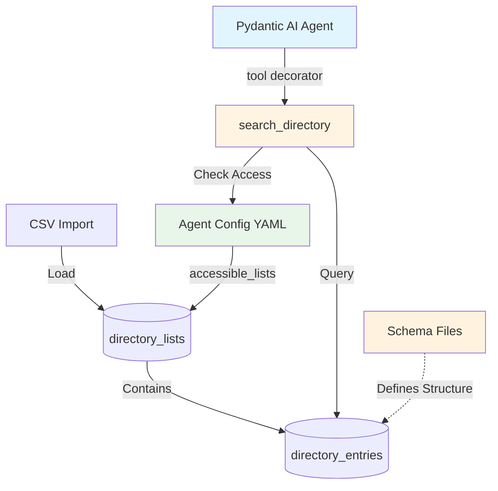

# Epic 0023 - Multi-Purpose Directory Service
> **Last Updated**: October 20, 2025

Generic multi-tenant directory service enabling agents to search structured entries (doctors, drugs, products, consultants, services) via natural language queries and structured filters.

**Stack**: PostgreSQL (JSONB + GIN indexes) + Pinecone (semantic - deferred) + Pydantic AI tools

**Initial Use Case**: Wyckoff Hospital - 318 doctor profiles → `backend/data/wyckoff/doctors_profile.csv`

**Design Philosophy**: Single generic implementation supporting unlimited entry types via JSONB schemas. Name reflects actual capability (multi-purpose directory), not just initial use case (medical professionals). Distinct from Epic 0018 "Profile Builder" (customer/visitor lead capture).

---

## Architecture



---

## Architecture Overview

**Three-Layer Design**:

1. **Schema Definitions** (`backend/config/directory_schemas/*.yaml`)
   - Define field structure for entry types (medical_professional, pharmaceutical, product, etc.)
   - Reusable across accounts
   - Version controlled
   - Example: `medical_professional.yaml` defines fields like department, specialty, board_certifications

2. **Database Storage** (account-level)
   - `directory_lists`: Collections per account (e.g., wyckoff's "doctors" list)
     - Links list_name to schema_file: `list_name="doctors", schema_file="medical_professional.yaml"`
   - `directory_entries`: Actual data entries (318 Wyckoff doctors, drug information, products)
   - Multi-tenant isolation via account_id FK

3. **Agent Access Control** (`agent_instance/config.yaml`)
   - Each agent config specifies `accessible_lists: ["doctors"]` (list names only)
   - **No direct schema reference** - agent references list name, database links list to schema
   - Runtime: DirectoryService queries database to resolve list names → list IDs → applies filters

**Schema Reference Flow**:
```
Agent config → list_name ("doctors")
    ↓
Database directory_lists → schema_file ("medical_professional.yaml")
    ↓
Schema file → defines entry_data structure
```

---

## Implementation Architecture

**Tool Layer**: `backend/app/agents/tools/directory_tools.py`
- Pydantic AI tool using `@agent.tool` decorator pattern
- `search_directory()` function with `RunContext[SessionDependencies]`
- Registered dynamically per agent based on config
- Direct LLM interaction (natural language queries → structured searches)

**Service Layer**: `backend/app/services/directory_service.py`
- `DirectoryService` class for database operations
- SQLAlchemy queries with multi-tenant filtering
- No direct LLM interaction (pure data access layer)
- Reusable across tools and API endpoints

**Data Layer**: `backend/app/models/directory.py`
- SQLAlchemy models: `DirectoryList`, `DirectoryEntry`
- Relationships to `Account` model
- JSONB and ARRAY type mappings

**Import/Seeding**: `backend/app/services/directory_importer.py`
- Generic CSV parser with configurable field mappers
- `DirectoryImporter` class with type-specific mappers
- Seeding script: `backend/scripts/seed_directory.py`

**Schema Definitions**: `backend/config/directory_schemas/*.yaml`
- YAML schema files per entry type
- Define JSONB structure, required/optional fields
- Version controlled, reusable across accounts

---

## 2-Table Design

```sql
directory_lists        -- Collections per account (e.g., "doctors", "prescription_drugs", "products")
├── id (UUID), account_id (UUID), list_name, entry_type, schema_file
│
directory_entries      -- Individual entries in lists
├── id (UUID), directory_list_id (UUID), name, tags[], contact_info{}, entry_data{}
```

**Access Control**: Config-based (no DB join table for MVP)

```yaml
# wyckoff/wyckoff_info_chat1/config.yaml
tools:
  directory:
    enabled: true
    accessible_lists: ["doctors", "nurse_practitioners"]
```

**Access Rules**:
- Account can have 0+ directory lists
- Account A cannot see Account B's lists (FK enforcement)
- Agent access in `config.yaml` (no join table)
- All queries filtered by accessible lists (config → DB lookup)

---

## JSONB Schema Definitions

**Schema files**: `backend/config/directory_schemas/{entry_type}.yaml`

**Entry Types**:
- **medical_professional**: `{department, specialty, board_certifications, education}` | Tags: languages
- **pharmaceutical**: `{drug_class, active_ingredients, dosage_forms, indications, contraindications}` | Tags: drug classes
- **product**: `{category, sku, brand, price, in_stock, specifications}` | Tags: categories, brands
- **consultant**: `{expertise, hourly_rate, availability, certifications}` | Tags: expertise areas
- **service**: `{service_type, duration, cost, availability, requirements}` | Tags: service categories

**Example - `medical_professional.yaml`:**

```yaml
entry_type: medical_professional
schema_version: "1.0"
required_fields: [department, specialty]
optional_fields: [board_certifications, education, residencies, fellowships, internship, gender, profile_pic]

fields:
  department:
    type: string
    examples: ["Cardiology", "Emergency Medicine", "Surgery"]
  specialty:
    type: string
    examples: ["Interventional Cardiology", "Plastic Surgery"]
  board_certifications:
    type: text
    format: "Certification Name, Year"
  education:
    type: string
    example: "Harvard Medical School, MD"
  # ... additional fields

tags_usage:
  description: "Languages spoken by medical professional"
  examples: ["English", "Spanish", "Hindi", "Mandarin"]
```

---

## Database IDs (Wyckoff)

```
Account:  481d3e72-c0f5-47dd-8d6e-291c5a44a5c7 (wyckoff)
Agent:    5dc7a769-bb5e-485b-9f19-093b95dd404d (wyckoff_info_chat1)
```

---

## Features

- [ ] 0023-001 - Core Infrastructure (schema, data, service)
- [ ] 0023-002 - Search Tool (Pydantic AI tool + integration)
- [ ] 0023-003 - Semantic Search (Pinecone - deferred)

---

## 0023-001 - FEATURE - Core Infrastructure

### 0023-001-001 - TASK - Database Schema

- [ ] **0023-001-001-01 - CHUNK - Alembic migration**

```sql
CREATE TABLE directory_lists (
    id UUID PRIMARY KEY DEFAULT gen_random_uuid(),
    account_id UUID NOT NULL REFERENCES accounts(id) ON DELETE CASCADE,
    list_name TEXT NOT NULL,
    list_description TEXT,
    entry_type TEXT NOT NULL,
    schema_file TEXT,
    created_at TIMESTAMPTZ DEFAULT NOW(),
    updated_at TIMESTAMPTZ DEFAULT NOW(),
    UNIQUE(account_id, list_name)
);

CREATE INDEX idx_directory_lists_account_id ON directory_lists(account_id);
CREATE INDEX idx_directory_lists_entry_type ON directory_lists(entry_type);

COMMENT ON TABLE directory_lists IS 'Multi-purpose directory collections per account (doctors, drugs, products, services, etc.)';
COMMENT ON COLUMN directory_lists.entry_type IS 'References schema in backend/config/directory_schemas/{entry_type}.yaml';

CREATE TABLE directory_entries (
    id UUID PRIMARY KEY DEFAULT gen_random_uuid(),
    directory_list_id UUID NOT NULL REFERENCES directory_lists(id) ON DELETE CASCADE,
    name TEXT NOT NULL,
    status TEXT NOT NULL DEFAULT 'active',
    tags TEXT[] DEFAULT '{}',
    contact_info JSONB DEFAULT '{}',
    entry_data JSONB DEFAULT '{}',
    created_at TIMESTAMPTZ DEFAULT NOW(),
    updated_at TIMESTAMPTZ DEFAULT NOW()
);

CREATE INDEX idx_directory_entries_list_id ON directory_entries(directory_list_id);
CREATE INDEX idx_directory_entries_name ON directory_entries(name);
CREATE INDEX idx_directory_entries_status ON directory_entries(status);
CREATE INDEX idx_directory_entries_tags ON directory_entries USING GIN(tags);
CREATE INDEX idx_directory_entries_entry_data ON directory_entries USING GIN(entry_data);

COMMENT ON TABLE directory_entries IS 'Generic directory entries - doctors, drugs, products, consultants, services, etc.';
COMMENT ON COLUMN directory_entries.tags IS 'Flexible array - languages for people, categories for products, drug classes for pharmaceuticals';
COMMENT ON COLUMN directory_entries.entry_data IS 'JSONB structure defined by schema_file in directory_lists table';
```

**Design Decisions**:
- UUID primary keys (gen_random_uuid())
- Account-level isolation via FK
- Schema reference via `schema_file` column
- JSONB structure varies by entry_type
- Flexible tags array (languages, categories, drug classes)
- Skip empty fields in JSONB
- Normalize spelling (American)
- Parse comma-separated tags gracefully

**Tests**: Table structure, constraints, cascades, indexes, FK relationships
**Verify**: `alembic upgrade head` → tables exist → `alembic downgrade -1` → rollback
**STATUS**: Planned

---

- [ ] **0023-001-001-02 - CHUNK - SQLAlchemy models**

```python
# backend/app/models/directory.py
from sqlalchemy import Column, String, ARRAY, Text, TIMESTAMP, ForeignKey
from sqlalchemy.dialects.postgresql import UUID, JSONB
from sqlalchemy.orm import relationship, Mapped, mapped_column
from datetime import datetime
from app.database import Base
import uuid
from typing import Optional

class DirectoryList(Base):
    __tablename__ = "directory_lists"
    
    id: Mapped[uuid.UUID] = mapped_column(UUID(as_uuid=True), primary_key=True, default=uuid.uuid4)
    account_id: Mapped[uuid.UUID] = mapped_column(UUID(as_uuid=True), ForeignKey("accounts.id", ondelete="CASCADE"), nullable=False, index=True)
    list_name: Mapped[str] = mapped_column(String, nullable=False)
    list_description: Mapped[Optional[str]] = mapped_column(Text)
    entry_type: Mapped[str] = mapped_column(String, nullable=False, index=True)
    schema_file: Mapped[Optional[str]] = mapped_column(String)
    created_at: Mapped[datetime] = mapped_column(TIMESTAMP(timezone=True), default=datetime.utcnow)
    updated_at: Mapped[datetime] = mapped_column(TIMESTAMP(timezone=True), default=datetime.utcnow, onupdate=datetime.utcnow)
    
    account = relationship("Account", back_populates="directory_lists")
    entries = relationship("DirectoryEntry", back_populates="directory_list", cascade="all, delete-orphan")
    
    def to_dict(self):
        return {
            "id": str(self.id),
            "account_id": str(self.account_id),
            "list_name": self.list_name,
            "list_description": self.list_description,
            "entry_type": self.entry_type,
            "schema_file": self.schema_file,
            "entry_count": len(self.entries) if self.entries else 0,
        }


class DirectoryEntry(Base):
    __tablename__ = "directory_entries"
    
    id: Mapped[uuid.UUID] = mapped_column(UUID(as_uuid=True), primary_key=True, default=uuid.uuid4)
    directory_list_id: Mapped[uuid.UUID] = mapped_column(UUID(as_uuid=True), ForeignKey("directory_lists.id", ondelete="CASCADE"), nullable=False, index=True)
    name: Mapped[str] = mapped_column(String, nullable=False, index=True)
    status: Mapped[str] = mapped_column(String, nullable=False, default="active", index=True)
    tags: Mapped[list[str]] = mapped_column(ARRAY(String), default=list)
    contact_info: Mapped[dict] = mapped_column(JSONB, default=dict)
    entry_data: Mapped[dict] = mapped_column(JSONB, default=dict)
    created_at: Mapped[datetime] = mapped_column(TIMESTAMP(timezone=True), default=datetime.utcnow)
    updated_at: Mapped[datetime] = mapped_column(TIMESTAMP(timezone=True), default=datetime.utcnow, onupdate=datetime.utcnow)
    
    directory_list = relationship("DirectoryList", back_populates="entries")
    
    def to_dict(self):
        return {
            "id": str(self.id),
            "directory_list_id": str(self.directory_list_id),
            "name": self.name,
            "status": self.status,
            "tags": self.tags,
            "contact_info": self.contact_info,
            "entry_data": self.entry_data,
        }
```

**Add to existing models**:
```python
# backend/app/models/account.py
class Account(Base):
    directory_lists = relationship("DirectoryList", back_populates="account", cascade="all, delete-orphan")
```

**Tests**: Model instantiation, to_dict(), relationships, cascade deletes
**STATUS**: Planned

---

### 0023-001-002 - TASK - Schema Definitions

- [ ] **0023-001-002-01 - CHUNK - Create medical_professional schema file**

Create `backend/config/directory_schemas/medical_professional.yaml` (see schema example above)

**Tests**: YAML validation, schema loading
**STATUS**: Planned

---

### 0023-001-003 - TASK - CSV Import

- [ ] **0023-001-003-01 - CHUNK - Generic CSV importer**

```python
# backend/app/services/directory_importer.py
import csv
from typing import List, Dict, Callable
from uuid import UUID
from pathlib import Path
from app.models.directory import DirectoryEntry
import logging

logger = logging.getLogger(__name__)


class DirectoryImporter:
    """Generic CSV importer with configurable field mapping."""
    
    @staticmethod
    def parse_csv(csv_path: str, directory_list_id: UUID, field_mapper: Callable[[Dict], Dict]) -> List[DirectoryEntry]:
        entries = []
        csv_file = Path(csv_path)
        
        if not csv_file.exists():
            raise FileNotFoundError(f"CSV file not found: {csv_path}")
        
        with open(csv_file, 'r', encoding='utf-8') as f:
            reader = csv.DictReader(f)
            row_num = 0
            for row in reader:
                row_num += 1
                try:
                    entry_data = field_mapper(row)
                    entry = DirectoryEntry(directory_list_id=directory_list_id, **entry_data)
                    entries.append(entry)
                except Exception as e:
                    logger.warning(f"Error parsing row {row_num}: {e}")
                    continue
        
        logger.info(f"Parsed {len(entries)} entries from {csv_file.name}")
        return entries
    
    @staticmethod
    def medical_professional_mapper(row: Dict) -> Dict:
        """Map Wyckoff doctor CSV columns to DirectoryEntry fields."""
        # Parse tags (languages for medical professionals)
        tags_raw = row.get('language', '').strip()
        tags = [tag.strip() for tag in tags_raw.split(',') if tag.strip()] if tags_raw else []
        
        # Parse status
        status = 'active' if row.get('is_active') == '1' else 'inactive'
        
        # Build contact_info JSONB (skip empty fields)
        contact_info = {}
        if row.get('phone', '').strip():
            contact_info['phone'] = row['phone'].strip()
        if row.get('location', '').strip():
            contact_info['location'] = row['location'].strip()
        if row.get('facility', '').strip():
            contact_info['facility'] = row['facility'].strip()
        
        # Build entry_data JSONB (skip empty, normalize spelling)
        entry_data = {}
        if row.get('department', '').strip():
            entry_data['department'] = row['department'].strip()
        
        # Normalize "speciality" → "specialty"
        specialty = row.get('speciality', '').strip()
        if specialty:
            entry_data['specialty'] = specialty
        
        # Optional fields
        optional_fields = ['board_certifications', 'education', 'residencies', 'fellowships', 'internship', 'gender', 'profile_pic']
        for field in optional_fields:
            value = row.get(field, '').strip()
            if value:
                entry_data[field] = value
        
        return {
            'name': row.get('doctor_name', '').strip(),
            'status': status,
            'tags': tags,
            'contact_info': contact_info,
            'entry_data': entry_data
        }
    
    @staticmethod
    def pharmaceutical_mapper(row: Dict) -> Dict:
        """Map pharmaceutical CSV to DirectoryEntry fields."""
        drug_class = row.get('drug_class', '').strip()
        tags = [drug_class] if drug_class else []
        
        category = row.get('category', '').strip()
        if category and category not in tags:
            tags.append(category)
        
        entry_data = {}
        if drug_class:
            entry_data['drug_class'] = drug_class
        
        if row.get('active_ingredients', '').strip():
            ingredients = [ing.strip() for ing in row['active_ingredients'].split(',') if ing.strip()]
            entry_data['active_ingredients'] = ingredients
        
        optional_fields = ['dosage_forms', 'common_dosages', 'indications', 'contraindications', 'side_effects', 'interactions', 'pregnancy_category', 'manufacturer']
        for field in optional_fields:
            value = row.get(field, '').strip()
            if value:
                if field == 'dosage_forms':
                    entry_data[field] = [f.strip() for f in value.split(',') if f.strip()]
                else:
                    entry_data[field] = value
        
        return {
            'name': row.get('drug_name', '').strip(),
            'status': row.get('status', 'active').strip(),
            'tags': tags,
            'contact_info': {
                'manufacturer_website': row.get('website', '').strip(),
                'manufacturer_contact': row.get('contact', '').strip()
            } if row.get('website') or row.get('contact') else {},
            'entry_data': entry_data
        }
    
    @staticmethod
    def product_mapper(row: Dict) -> Dict:
        """Map product catalog CSV to DirectoryEntry fields."""
        category = row.get('category', '').strip()
        tags = [category] if category else []
        
        brand = row.get('brand', '').strip()
        if brand and brand not in tags:
            tags.append(brand)
        
        entry_data = {}
        if category:
            entry_data['category'] = category
        if row.get('sku', '').strip():
            entry_data['sku'] = row['sku'].strip()
        if brand:
            entry_data['brand'] = brand
        
        # Price fields
        if row.get('price', '').strip():
            try:
                entry_data['price'] = float(row['price'])
            except ValueError:
                pass
        
        if row.get('sale_price', '').strip():
            try:
                entry_data['sale_price'] = float(row['sale_price'])
            except ValueError:
                pass
        
        # Boolean fields
        if row.get('in_stock', '').strip():
            entry_data['in_stock'] = row['in_stock'].lower() in ['true', '1', 'yes']
        
        optional_fields = ['warranty', 'dimensions', 'weight', 'specifications']
        for field in optional_fields:
            value = row.get(field, '').strip()
            if value:
                entry_data[field] = value
        
        return {
            'name': row.get('product_name', '').strip(),
            'status': 'active' if entry_data.get('in_stock') else 'out_of_stock',
            'tags': tags,
            'contact_info': {
                'product_url': row.get('url', '').strip(),
                'support_email': row.get('support_email', '').strip()
            } if row.get('url') or row.get('support_email') else {},
            'entry_data': entry_data
        }
```

**Tests**: Parse CSV, verify mapping, tag variations, status conversion, multiple entry types
**STATUS**: Planned

---

- [ ] **0023-001-003-02 - CHUNK - Seeding script**

```python
# backend/scripts/seed_directory.py
"""
Seed directory lists with CSV data.

Usage:
    python backend/scripts/seed_directory.py \
        --account wyckoff \
        --list doctors \
        --entry-type medical_professional \
        --csv backend/data/wyckoff/doctors_profile.csv \
        --mapper medical_professional
"""
import asyncio
import argparse
from pathlib import Path
from sqlalchemy import select, delete
from app.database import get_database_service
from app.models.account import Account
from app.models.directory import DirectoryList, DirectoryEntry
from app.services.directory_importer import DirectoryImporter
import logging

logging.basicConfig(level=logging.INFO)
logger = logging.getLogger(__name__)

MAPPERS = {
    'medical_professional': DirectoryImporter.medical_professional_mapper,
    'pharmaceutical': DirectoryImporter.pharmaceutical_mapper,
    'product': DirectoryImporter.product_mapper,
}


async def seed_directory(account_slug: str, list_name: str, entry_type: str, schema_file: str, csv_path: str, mapper_name: str, list_description: str = None):
    db = get_database_service()
    await db.initialize()
    
    mapper = MAPPERS.get(mapper_name)
    if not mapper:
        logger.error(f"Unknown mapper: {mapper_name}. Available: {list(MAPPERS.keys())}")
        return
    
    async with db.get_session() as session:
        # Get account
        result = await session.execute(select(Account).where(Account.slug == account_slug))
        account = result.scalar_one_or_none()
        
        if not account:
            logger.error(f"❌ Account not found: {account_slug}")
            return
        
        logger.info(f"✅ Account: {account.name} ({account.slug})")
        
        # Clear existing
        await session.execute(delete(DirectoryList).where(DirectoryList.account_id == account.id, DirectoryList.list_name == list_name))
        await session.commit()
        logger.info(f"🗑️  Cleared: {list_name}")
        
        # Create list
        directory_list = DirectoryList(
            account_id=account.id,
            list_name=list_name,
            list_description=list_description or f"{entry_type} directory - {list_name}",
            entry_type=entry_type,
            schema_file=schema_file
        )
        session.add(directory_list)
        await session.commit()
        await session.refresh(directory_list)
        logger.info(f"📋 Created: {directory_list.list_name} (ID: {directory_list.id})")
        
        # Import entries
        csv_file = Path(csv_path)
        if not csv_file.exists():
            logger.error(f"❌ CSV not found: {csv_path}")
            return
        
        entries = DirectoryImporter.parse_csv(csv_path=str(csv_file), directory_list_id=directory_list.id, field_mapper=mapper)
        session.add_all(entries)
        await session.commit()
        
        logger.info(f"✅ Imported {len(entries)} entries")
        
        # Sample output
        if entries:
            sample = entries[0]
            logger.info(f"\n📝 Sample: {sample.name}")
            logger.info(f"   Tags: {sample.tags}")
            if entry_type == "medical_professional":
                logger.info(f"   Dept: {sample.entry_data.get('department')}, Spec: {sample.entry_data.get('specialty')}")


async def main():
    parser = argparse.ArgumentParser()
    parser.add_argument('--account', required=True)
    parser.add_argument('--list', required=True)
    parser.add_argument('--entry-type', required=True)
    parser.add_argument('--schema-file')
    parser.add_argument('--csv', required=True)
    parser.add_argument('--mapper', required=True, choices=list(MAPPERS.keys()))
    parser.add_argument('--description')
    
    args = parser.parse_args()
    schema_file = args.schema_file or f"{args.entry_type}.yaml"
    
    await seed_directory(args.account, args.list, args.entry_type, schema_file, args.csv, args.mapper, args.description)
    logger.info("\n✅ Seeding complete!")


if __name__ == "__main__":
    asyncio.run(main())
```

**Tests**: Creates records, idempotent, error handling, multiple entry types
**STATUS**: Planned

---

### 0023-001-004 - TASK - Directory Service

- [ ] **0023-001-004-01 - CHUNK - DirectoryService**

```python
# backend/app/services/directory_service.py
from typing import List, Optional
from uuid import UUID
from sqlalchemy import select, and_
from sqlalchemy.ext.asyncio import AsyncSession
from app.models.directory import DirectoryList, DirectoryEntry
import logging

logger = logging.getLogger(__name__)


class DirectoryService:
    @staticmethod
    async def get_accessible_lists(session: AsyncSession, account_id: UUID, list_names: List[str]) -> List[UUID]:
        if not list_names:
            return []
        
        result = await session.execute(
            select(DirectoryList.id).where(
                and_(DirectoryList.account_id == account_id, DirectoryList.list_name.in_(list_names))
            )
        )
        return [row[0] for row in result.fetchall()]
    
    @staticmethod
    async def search(
        session: AsyncSession,
        accessible_list_ids: List[UUID],
        name_query: Optional[str] = None,
        tags: Optional[List[str]] = None,
        status: str = "active",
        jsonb_filters: Optional[dict] = None,
        limit: int = 10
    ) -> List[DirectoryEntry]:
        if not accessible_list_ids:
            logger.warning("No accessible lists")
            return []
        
        query = select(DirectoryEntry).where(
            and_(DirectoryEntry.directory_list_id.in_(accessible_list_ids), DirectoryEntry.status == status)
        )
        
        if name_query:
            query = query.where(DirectoryEntry.name.ilike(f"%{name_query}%"))
        
        if tags:
            query = query.where(DirectoryEntry.tags.overlap(tags))
        
        if jsonb_filters:
            for key, value in jsonb_filters.items():
                query = query.where(DirectoryEntry.entry_data[key].astext.ilike(f"%{value}%"))
        
        query = query.limit(limit)
        result = await session.execute(query)
        return result.scalars().all()
```

**Tests**: Get lists, search by name/tags/JSONB, access control, multi-tenant isolation
**STATUS**: Planned

---

## 0023-002 - FEATURE - Search Tool

### 0023-002-001 - TASK - Pydantic AI Tool

- [ ] **0023-002-001-01 - CHUNK - search_directory tool**

```python
# backend/app/agents/tools/directory_tools.py
from pydantic_ai import RunContext
from app.agents.models.dependencies import SessionDependencies
from app.services.directory_service import DirectoryService
from typing import Optional
import logging

logger = logging.getLogger(__name__)


async def search_directory(ctx: RunContext[SessionDependencies], query: Optional[str] = None, tag: Optional[str] = None, **kwargs) -> str:
    """
    Search directory for entries (doctors, drugs, products, consultants, etc.).
    
    Use for: Name searches, tag/attribute filters, entry-specific fields
    
    Args:
        query: Name to search (partial match)
        tag: Tag filter (language, drug class, category, etc.)
        **kwargs: Entry-type specific filters (department, specialty, drug_class, category, price)
    """
    session = ctx.deps.db_session
    agent_config = ctx.deps.agent_config
    account_id = ctx.deps.account_id
    
    if not account_id:
        return "Error: Account context not available"
    
    directory_config = agent_config.get("tools", {}).get("directory", {})
    accessible_lists = directory_config.get("accessible_lists", [])
    
    if not accessible_lists:
        return "Directory not configured"
    
    service = DirectoryService()
    list_ids = await service.get_accessible_lists(session, account_id, accessible_lists)
    
    if not list_ids:
        return "No directory available"
    
    tags = [tag] if tag else None
    jsonb_filters = {k: kwargs[k] for k in ['department', 'specialty', 'drug_class', 'category', 'brand', 'price'] if k in kwargs and kwargs[k]}
    
    entries = await service.search(
        session=session,
        accessible_list_ids=list_ids,
        name_query=query,
        tags=tags,
        jsonb_filters=jsonb_filters if jsonb_filters else None,
        limit=directory_config.get("max_results", 5)
    )
    
    if not entries:
        return "No entries found"
    
    # Format results (adaptive by entry type)
    result_lines = [f"Found {len(entries)} entry(ies):\n"]
    
    for i, entry in enumerate(entries, 1):
        lines = [f"{i}. **{entry.name}**"]
        
        # Medical professionals
        if 'department' in entry.entry_data or 'specialty' in entry.entry_data:
            dept = entry.entry_data.get('department', '')
            spec = entry.entry_data.get('specialty', '')
            if dept or spec:
                lines.append(f"   {dept}" + (f" - {spec}" if spec else ""))
        
        # Pharmaceuticals
        if 'drug_class' in entry.entry_data:
            lines.append(f"   Class: {entry.entry_data['drug_class']}")
            if entry.entry_data.get('dosage_forms'):
                lines.append(f"   Forms: {', '.join(entry.entry_data['dosage_forms'])}")
        
        # Products
        if 'category' in entry.entry_data:
            lines.append(f"   Category: {entry.entry_data['category']}")
            if entry.entry_data.get('price'):
                lines.append(f"   Price: ${entry.entry_data['price']}")
        
        # Tags
        if entry.tags:
            lines.append(f"   Tags: {', '.join(entry.tags)}")
        
        # Contact info
        if entry.contact_info.get('location'):
            lines.append(f"   Location: {entry.contact_info['location']}")
        if entry.contact_info.get('product_url'):
            lines.append(f"   URL: {entry.contact_info['product_url']}")
        
        # Additional details
        if entry.entry_data.get('education'):
            lines.append(f"   Education: {entry.entry_data['education']}")
        if entry.entry_data.get('indications'):
            lines.append(f"   Uses: {entry.entry_data['indications'][:100]}...")
        if entry.entry_data.get('in_stock') is not None:
            lines.append(f"   {'In Stock' if entry.entry_data['in_stock'] else 'Out of Stock'}")
        
        result_lines.append('\n'.join(lines))
    
    return '\n\n'.join(result_lines)
```

**Tests**: Tool call, tag/JSONB filters, config integration, access control, multiple entry types
**STATUS**: Planned

---

- [ ] **0023-002-001-02 - CHUNK - Register with wyckoff_info_chat1**

**Config**:
```yaml
# backend/config/agent_configs/wyckoff/wyckoff_info_chat1/config.yaml
tools:
  vector_search:
    enabled: true
  directory:
    enabled: true
    accessible_lists: ["doctors"]
    max_results: 5
```

**System Prompt**:
```markdown
# backend/config/agent_configs/wyckoff/wyckoff_info_chat1/system_prompt.md

## Tools

1. **vector_search**: Hospital services, facilities, departments, general info
2. **search_directory**: Medical professionals (doctors, nurses, specialists)

**Decision Rule**: Person queries → search_directory | Service queries → vector_search
```

**Registration**:
```python
# backend/app/agents/simple_chat.py
from app.agents.tools.directory_tools import search_directory

directory_config = instance_config.get("tools", {}).get("directory", {})
if directory_config.get("enabled", False):
    agent.tool(search_directory)
```

**Tests**: Tool registered, agent calls correctly, formatted results
**STATUS**: Planned

---

### 0023-002-002 - TASK - Testing

- [ ] **0023-002-002-01 - CHUNK - Manual test script**

Create `backend/tests/manual/test_directory.py` with test scenarios for medical, pharmaceutical, product entry types.

**STATUS**: Planned

---

- [ ] **0023-002-002-02 - CHUNK - Integration tests**

Create `backend/tests/integration/test_directory_integration.py`:
- Search by tag (medical professionals by language)
- Search by JSONB filters (pharmaceuticals by drug class)
- Multi-tenant isolation
- Search performance (< 100ms for 100 entries)
- Multiple entry types

**STATUS**: Planned

---

## 0023-003 - FEATURE - Semantic Search (Pinecone)

**DEFERRED**: Embedding generation + Pinecone index + hybrid search

---

## Definition of Done

- [ ] 2 tables with indexes, FK constraints
- [ ] 318 Wyckoff doctors loaded
- [ ] DirectoryService with config-based access
- [ ] Multi-tenant isolation verified
- [ ] Tool registered with wyckoff_info_chat1
- [ ] Manual script demonstrates 5+ queries
- [ ] Performance < 100ms
- [ ] All automated tests passing

---

## Use Cases

**Hospital**: Lists=`doctors,nurses,therapists` | Type=`medical_professional` | Tags=languages
**Pharma**: Lists=`prescription_drugs,otc` | Type=`pharmaceutical` | Tags=drug classes
**Retail**: Lists=`electronics,furniture` | Type=`product` | Tags=categories/brands
**Consulting**: Lists=`senior,junior,contractors` | Type=`consultant` | Tags=expertise

---

## Design Rationale

**Generic naming**: Architecture is generic (JSONB, schemas). Known use cases: pharma, retail, consulting. Future-proof.

**Config-based access**: Simpler MVP (no join table), version controlled, faster queries. Dynamic access deferred to enterprise.

**Schema files**: Reusable, version controlled, self-documenting, validation.

**Account-level lists**: True multi-tenancy, privacy/compliance (HIPAA), customization.

**2 tables vs 3**: YAGNI principle. Can add join table later.
