<!--
Copyright (c) 2025 Ape4, Inc. All rights reserved.
Unauthorized copying of this file is strictly prohibited.
-->

# Epic 0028 - Email Summary Tool (Demo Feature)
> **Last Updated**: December 5, 2025
> **Supersedes**: Epic 0017-008 (Email Summary Tool with Mailgun)

Implement demo email summary tool that creates the illusion of sending conversation summaries without actual email integration.

Demo email summary tool with lightweight logging, maintaining extensibility for future Mailgun integration.

## Architecture Overview

```mermaid
flowchart TD
    %% User Interaction
    User["👤 User"] --> Agent["🤖 Pydantic AI Agent"]
    
    %% Agent Decision
    Agent --> DecideEmail{"User requests<br>summary?"}
    
    %% Email Tool Flow
    DecideEmail -->|Yes| EmailCheck{"Has email<br>address?"}
    EmailCheck -->|No| AskEmail["Ask for email"]
    EmailCheck -->|Yes| EmailTool["📧 send_conversation_summary() tool"]
    AskEmail --> EmailTool
    
    %% Tool Implementation
    EmailTool --> LogEvent["📊 Logfire Event"]
    EmailTool --> ReturnMsg["✓ Confirmation Message"]
    
    %% Logging Details
    LogEvent --> LogDetails["Log:<br>- Session ID<br>- Email address<br>- Summary notes<br>- Timestamp<br>- demo_mode: true"]
    
    %% Response Flow
    ReturnMsg --> Agent
    Agent --> User
    
    %% System Prompt
    SystemPrompt["📝 System Prompt<br>Guidance"] -.-> Agent
    
    %% Future Extension
    EmailTool -.->|Future| RealEmail["📬 Real Email<br>Integration"]
    
    style EmailTool fill:#e1f5e1
    style LogEvent fill:#fff3cd
    style RealEmail fill:#f8d7da,stroke-dasharray: 5 5
    style SystemPrompt fill:#e7f3ff
```



## Design Decisions

**Lightweight tool with logging** - No filesystem clutter, fast response, easy upgrade path to real email.

**Rejected**: Prompt-only (inconsistent), file-writing tool (unnecessary complexity).

**Privacy**: Email addresses logged for demo analytics only. No PII in database. Future: add consent tracking for production.

---

## 0028-001 - FEATURE - Demo Email Summary Tool

### 0028-001-001 - TASK - Email Summary Tool Implementation

- [ ] 0028-001-001-01 - CHUNK - Create email_tools.py with demo tool
  
  **FILE**: `backend/app/agents/tools/email_tools.py`
  
  - **IMPLEMENTATION**:
    ```python
    """
    Email tools for agent - Demo implementation.
    
    This module provides a demo email summary tool that creates the illusion
    of sending conversation summaries without actual email integration.
    
    Future: Replace demo implementation with real Mailgun integration.
    """
    
    import logfire
    from datetime import datetime, UTC
    from typing import Optional
    from pydantic_ai import RunContext
    
    from ..base.dependencies import SessionDependencies
    
    
    async def send_conversation_summary(
        ctx: RunContext[SessionDependencies],
        email_address: str,
        summary_notes: str = ""
    ) -> str:
        """
        Send a conversation summary with attachments to the user's email.
        
        NOTE: This is a demo feature - no actual email is sent.
        
        When the user requests a conversation summary or asks to receive
        information via email, use this tool to confirm the request has
        been queued. The system will log the request for analytics.
        
        Args:
            ctx: Run context with session dependencies
            email_address: Recipient email address (format: user@domain.com)
            summary_notes: Optional notes about what to include in summary
                          (e.g., "doctor information", "resources discussed")
        
        Returns:
            Confirmation message for the user
            
        Examples:
            # User: "Can you email me a summary?"
            await send_conversation_summary(
                ctx=ctx,
                email_address="patient@example.com",
                summary_notes="cardiology discussion and Dr. Smith contact info"
            )
            
            # User: "Send me the doctor's information"
            await send_conversation_summary(
                ctx=ctx,
                email_address="john@example.com", 
                summary_notes="Dr. Johnson profile and availability"
            )
        """
        session_id = ctx.deps.session_id
        
        # Validate email format (basic validation)
        if not email_address or '@' not in email_address:
            return (
                "I need a valid email address to send the summary. "
                "Could you please provide your email address?"
            )
        
        # Log the demo email request
        logfire.info(
            'email.summary.demo',
            session_id=session_id,
            email=email_address,
            notes=summary_notes,
            timestamp=datetime.now(UTC).isoformat(),
            demo_mode=True,
            message="Demo email tool called - no actual email sent"
        )
        
        # Return professional confirmation message
        return (
            f"✓ Your conversation summary has been queued to {email_address}. "
            f"You'll receive it in your inbox within the next few minutes. "
            f"The summary will include key discussion points and any relevant attachments."
        )
    ```
  
  - **KEY FEATURES**:
    - Lightweight (no file I/O, just logging)
    - Professional user experience
    - Basic email validation
    - Extensible design for future real email
    - Clear demo mode indicator in logs
  
  - SUB-TASKS:
    - Create `backend/app/agents/tools/email_tools.py` file
    - Implement `send_conversation_summary()` function
    - Add email format validation (basic @ check)
    - Add Logfire logging with structured data
    - Write clear docstring with examples
    - Add demo_mode flag to distinguish from future real implementation
    - Test function signature matches Pydantic AI tool requirements
  
  - AUTOMATED-TESTS: `backend/tests/unit/test_email_tools.py`
    - `test_email_tool_logs_request()` - Verify Logfire event created
    - `test_email_tool_returns_confirmation()` - Test return message format
    - `test_email_validation()` - Test email format validation
    - `test_email_tool_with_notes()` - Test with summary_notes parameter
    - `test_email_tool_without_notes()` - Test with default empty notes
    - `test_invalid_email_format()` - Test validation error message
  
  - MANUAL-TESTS:
    - Review code for Pydantic AI compatibility
    - Check docstring clarity and examples
    - Verify email validation logic
    - Test that function signature is correct for @agent.tool

- [ ] 0028-001-001-02 - CHUNK - Register tool in agent configuration
  
  **CONFIGURATION**:
    ```yaml
    # backend/config/agent_configs/windriver/windriver_info_chat1/config.yaml
    
    tools:
      email_summary:
        enabled: true  # Demo feature
      
      vector_search:
        enabled: true
        # ... existing config
      
      directory:
        enabled: true
        # ... existing config
    ```
  
  - **REGISTRATION PATTERN** (in `simple_chat.py`):
    ```python
    # backend/app/agents/simple_chat.py
    
    from .tools.email_tools import send_conversation_summary
    
    # In create_simple_chat_agent():
    tools_list = []
    tools_config = (instance_config or {}).get("tools", {})
    
    # Add directory tools if enabled
    if tools_config.get("directory", {}).get("enabled", False):
        tools_list.extend([get_available_directories, search_directory])
    
    # Add vector search tool if enabled
    if tools_config.get("vector_search", {}).get("enabled", False):
        tools_list.append(vector_search)
    
    # Add email summary tool if enabled (NEW)
    if tools_config.get("email_summary", {}).get("enabled", False):
        tools_list.append(send_conversation_summary)
        logfire.info(
            'agent.tool.registered',
            tool='send_conversation_summary',
            agent=instance_config.get('instance_name', 'unknown'),
            demo_mode=True
        )
    
    # Create agent with tools
    agent = Agent(
        model_name,
        deps_type=SessionDependencies,
        system_prompt=system_prompt,
        tools=tools_list
    )
    ```
  
  - SUB-TASKS:
    - Update `simple_chat.py` to import email_tools
    - Add email_summary tool registration logic
    - Enable email_summary for Wind River agent config
    - Add logging for tool registration
    - Test tool appears in agent's available tools
    - Verify tool disabled by default for other agents
  
  - AUTOMATED-TESTS: `backend/tests/unit/test_email_tool_registration.py`
    - `test_email_tool_registered_when_enabled()` - Tool in tools_list when enabled
    - `test_email_tool_not_registered_when_disabled()` - Tool not in tools_list when disabled
    - `test_email_tool_not_registered_by_default()` - Tool disabled by default
    - `test_multiple_agents_different_email_configs()` - Per-agent configuration works
  
  - MANUAL-TESTS:
    - Update Wind River config.yaml with email_summary.enabled: true
    - Start backend
    - Check logs: verify "agent.tool.registered" for send_conversation_summary
    - Send chat message to Wind River agent
    - Verify tool available (check LLM request body for tool definitions)
    - Test agent WITHOUT email_summary enabled
    - Verify tool NOT available for that agent

- [ ] 0028-001-001-03 - CHUNK - Update system prompt with email guidance
  
  **SYSTEM PROMPT ADDITIONS**:
    ```markdown
    ## Sending Conversation Summaries
    
    You can help users receive an email summary of your conversation:
    
    - Use the `send_conversation_summary()` tool when they request a summary via email
    - Ask for their email address if you don't have it
    - The summary will include key points from your discussion and any relevant attachments
    - Let them know the email will arrive within a few minutes
    
    **When to offer summaries**:
    - After providing complex medical information (doctor names, departments, procedures)
    - When discussing multiple services or resources
    - If the user mentions wanting to save or reference the information later
    - When sharing contact information or directions
    
    **Example interactions**:
    - User: "Can you email me this information?"
      → Ask for email, then use send_conversation_summary()
    
    - User: "I need to save the doctor's contact info"
      → "I can email you a summary with Dr. Smith's information. What's your email address?"
    
    - User: "How do I remember all this?"
      → "Would you like me to email you a summary of our conversation with all the details?"
    
    **What to include in summary_notes parameter**:
    - Specific information discussed (e.g., "cardiology services and Dr. Johnson contact info")
    - Resources mentioned (e.g., "insurance information and appointment scheduling")
    - Any attachments or materials (e.g., "department brochure and parking directions")
    ```
  
  **FILE**: `backend/config/agent_configs/windriver/windriver_info_chat1/system_prompt.md`
  
  - SUB-TASKS:
    - Add "Sending Conversation Summaries" section to Wind River system prompt
    - Include clear guidance on when to offer email summaries
    - Add example interactions for context
    - Document summary_notes parameter usage
    - Add proactive suggestions (offer summaries when appropriate)
    - Test prompt doesn't exceed token limits
    - Review prompt for clarity and natural language
  
  - AUTOMATED-TESTS: `backend/tests/unit/test_email_prompt.py`
    - `test_system_prompt_includes_email_guidance()` - Verify section present
    - `test_system_prompt_token_count()` - Verify total prompt under limit
    - `test_email_keywords_in_prompt()` - Check for key terms (send_conversation_summary, email, summary)
  
  - MANUAL-TESTS:
    - Review updated system prompt for naturalness
    - Check prompt length (should not be excessive)
    - Test agent behavior: ask "Can you email me a summary?"
    - Verify agent asks for email address
    - Verify agent calls send_conversation_summary tool
    - Test agent offers summaries proactively when appropriate
    - Verify agent doesn't over-suggest emails (not pushy)

- [ ] 0028-001-001-04 - CHUNK - End-to-end testing and validation
  
  **TEST SCENARIOS**:
    
    **Scenario 1: User requests summary**
    ```
    User: "Can you email me a summary of our conversation?"
    Agent: "I'd be happy to send you a summary. What's your email address?"
    User: "john@example.com"
    Agent: [Calls send_conversation_summary tool]
    Agent: "✓ Your conversation summary has been queued to john@example.com..."
    ```
    
    **Scenario 2: User provides email upfront**
    ```
    User: "Send a summary to jane@hospital.com"
    Agent: [Calls send_conversation_summary tool with email]
    Agent: "✓ Your conversation summary has been queued to jane@hospital.com..."
    ```
    
    **Scenario 3: Invalid email format**
    ```
    User: "Send summary to john"
    Agent: [Calls tool with "john"]
    Tool: Returns error message about invalid email
    Agent: "I need a valid email address. Could you provide your full email (e.g., john@example.com)?"
    ```
    
    **Scenario 4: Agent offers summary proactively**
    ```
    User: "Tell me about the cardiology department and Dr. Smith"
    Agent: [Provides information about department and doctor]
    Agent: "Would you like me to email you a summary with Dr. Smith's contact information and the department details?"
    ```
    
    **Scenario 5: Multiple information items**
    ```
    User: "I need the doctor's number, department hours, and parking info"
    Agent: [Provides all information]
    Agent: "That's a lot to remember! Would you like me to email you a summary with all these details?"
    User: "Yes please, sarah@email.com"
    Agent: [Calls tool with summary_notes="Dr. contact, department hours, parking information"]
    ```
  
  - **VALIDATION CHECKLIST**:
    - ✅ Tool registered correctly for Wind River agent
    - ✅ Agent asks for email when not provided
    - ✅ Agent calls tool with correct parameters
    - ✅ Tool logs to Logfire with structured data
    - ✅ Tool returns professional confirmation message
    - ✅ Agent relays confirmation naturally
    - ✅ Email validation catches invalid formats
    - ✅ Agent offers summaries proactively (not pushy)
    - ✅ summary_notes parameter populated with context
    - ✅ Logfire events queryable and clear
  
  - SUB-TASKS:
    - Create comprehensive test script: `backend/tests/manual/test_email_summary_e2e.py`
    - Test all 5 scenarios via API calls
    - Verify Logfire events created correctly
    - Check event structure (session_id, email, notes, demo_mode)
    - Test with multiple agents (enabled vs disabled)
    - Validate email formats (valid, invalid, edge cases)
    - Test summary_notes variations
    - Measure response latency (should be fast, no file I/O)
    - Document test results
  
  - AUTOMATED-TESTS: `backend/tests/integration/test_email_summary_e2e.py`
    - `test_email_summary_full_flow()` - Complete request flow
    - `test_agent_asks_for_email()` - Agent behavior when email missing
    - `test_agent_calls_tool()` - Verify tool invocation
    - `test_logfire_event_created()` - Check logging
    - `test_invalid_email_handling()` - Test validation errors
    - `test_summary_notes_populated()` - Verify context in notes
  
  - MANUAL-TESTS:
    - **Test via Wind River site**:
      - Navigate to `http://localhost:4321/windriver/find-a-doctor`
      - Open chat widget
      - Ask: "Can you email me a summary?"
      - Verify agent asks for email
      - Provide: "test@example.com"
      - Verify confirmation message appears
    
    - **Check Logfire dashboard**:
      - Filter events: `email.summary.demo`
      - Verify event shows:
        - session_id
        - email: "test@example.com"
        - notes: (summary context)
        - demo_mode: true
        - timestamp
    
    - **Test invalid email**:
      - Ask: "Send summary to john"
      - Verify agent asks for valid email format
    
    - **Test proactive offer**:
      - Ask about complex topic (multiple doctors, services)
      - Verify agent offers email summary
    
    - **Test with other agents**:
      - Test AgroFresh agent (email_summary disabled)
      - Verify tool NOT available
      - Ask for summary, verify agent can't send email

---

## 0028-002 - FEATURE - Analytics and Monitoring (Optional)

### 0028-002-001 - TASK - Email Request Analytics Dashboard

- [ ] 0028-002-001-01 - CHUNK - Create Logfire query dashboard
  
  **METRICS**:
    - Total email summary requests (count)
    - Requests per agent instance
    - Unique email addresses (approximate user count)
    - Most common summary_notes (topics of interest)
    - Request frequency over time
    - Failed requests (invalid emails)
  
  - **LOGFIRE QUERIES**:
    ```sql
    -- Total email summary requests
    SELECT COUNT(*) FROM logs
    WHERE event = 'email.summary.demo'
    AND timestamp > NOW() - INTERVAL '30 days'
    
    -- Requests per agent
    SELECT agent_instance, COUNT(*) as request_count
    FROM logs
    WHERE event = 'email.summary.demo'
    GROUP BY agent_instance
    ORDER BY request_count DESC
    
    -- Popular summary topics (from notes field)
    SELECT notes, COUNT(*) as frequency
    FROM logs
    WHERE event = 'email.summary.demo'
    AND notes IS NOT NULL
    GROUP BY notes
    ORDER BY frequency DESC
    LIMIT 20
    
    -- Request trend over time
    SELECT DATE(timestamp) as date, COUNT(*) as requests
    FROM logs
    WHERE event = 'email.summary.demo'
    GROUP BY DATE(timestamp)
    ORDER BY date DESC
    LIMIT 90
    ```
  
  - SUB-TASKS:
    - Create saved queries in Logfire dashboard
    - Set up visualization charts (line, bar, pie)
    - Add alerts for unusual activity (spike in requests)
    - Document how to access analytics
    - Export sample reports for stakeholders

---

## 0028-003 - FEATURE - Real Email Integration with Mailgun (Future)

**Supersedes**: 0017-008

Production-ready email integration: Mailgun API, conversation summarization, HTML templates, consent tracking.

### 0028-003-001 - TASK - Mailgun Service Integration

- [ ] 0028-003-001-01 - CHUNK - Create MailgunService class
  
  **FILE**: `backend/app/services/mailgun_service.py`
  
  - **IMPLEMENTATION**:
    ```python
    """
    Mailgun email service for sending conversation summaries.
    
    Handles email sending, template rendering, and delivery tracking.
    """
    
    import os
    import logfire
    from typing import Optional, List
    from dataclasses import dataclass
    import aiohttp
    
    @dataclass
    class EmailResult:
        success: bool
        message_id: Optional[str] = None
        error: Optional[str] = None
    
    class MailgunService:
        """Service for sending emails via Mailgun API."""
        
        def __init__(
            self,
            api_key: Optional[str] = None,
            domain: Optional[str] = None,
            from_email: Optional[str] = None
        ):
            self.api_key = api_key or os.getenv('MAILGUN_API_KEY')
            self.domain = domain or os.getenv('MAILGUN_DOMAIN')
            self.from_email = from_email or os.getenv('MAILGUN_FROM_EMAIL')
            
            if not all([self.api_key, self.domain, self.from_email]):
                raise ValueError("Mailgun credentials not configured")
            
            self.base_url = f"https://api.mailgun.net/v3/{self.domain}"
        
        async def send_email(
            self,
            to: str,
            subject: str,
            html_body: str,
            text_body: Optional[str] = None,
            attachments: Optional[List[str]] = None
        ) -> EmailResult:
            """Send email via Mailgun API."""
            
            logfire.info(
                'mailgun.send_email.start',
                to=to,
                subject=subject,
                has_attachments=bool(attachments)
            )
            
            try:
                data = {
                    'from': self.from_email,
                    'to': to,
                    'subject': subject,
                    'html': html_body
                }
                
                if text_body:
                    data['text'] = text_body
                
                async with aiohttp.ClientSession() as session:
                    async with session.post(
                        f"{self.base_url}/messages",
                        auth=aiohttp.BasicAuth('api', self.api_key),
                        data=data
                    ) as response:
                        if response.status == 200:
                            result_data = await response.json()
                            message_id = result_data.get('id')
                            
                            logfire.info(
                                'mailgun.send_email.success',
                                to=to,
                                message_id=message_id
                            )
                            
                            return EmailResult(
                                success=True,
                                message_id=message_id
                            )
                        else:
                            error_text = await response.text()
                            logfire.error(
                                'mailgun.send_email.failed',
                                to=to,
                                status=response.status,
                                error=error_text
                            )
                            
                            return EmailResult(
                                success=False,
                                error=f"Mailgun API error: {response.status}"
                            )
            
            except Exception as e:
                logfire.error(
                    'mailgun.send_email.exception',
                    to=to,
                    error=str(e)
                )
                
                return EmailResult(
                    success=False,
                    error=str(e)
                )
    
    # Singleton instance
    _mailgun_service: Optional[MailgunService] = None
    
    def get_mailgun_service() -> MailgunService:
        """Get or create Mailgun service singleton."""
        global _mailgun_service
        
        if _mailgun_service is None:
            _mailgun_service = MailgunService()
        
        return _mailgun_service
    ```
  
  - SUB-TASKS:
    - Create `backend/app/services/mailgun_service.py` file
    - Implement `MailgunService` class with async email sending
    - Add Mailgun API authentication (API key, domain)
    - Implement `send_email()` method with error handling
    - Add singleton `get_mailgun_service()` function
    - Add comprehensive logging (start, success, failure)
    - Handle Mailgun API errors gracefully
    - Add email validation
  
  - AUTOMATED-TESTS: `backend/tests/unit/test_mailgun_service.py`
    - `test_mailgun_service_initialization()` - Test service creation with credentials
    - `test_send_email_success()` - Mock successful email send
    - `test_send_email_failure()` - Mock API failure handling
    - `test_missing_credentials()` - Test error when credentials missing
    - `test_get_mailgun_service_singleton()` - Test singleton pattern
  
  - MANUAL-TESTS:
    - Set environment variables: MAILGUN_API_KEY, MAILGUN_DOMAIN, MAILGUN_FROM_EMAIL
    - Test service initialization
    - Send test email via Mailgun (use test mode domain)
    - Verify email received
    - Check Mailgun dashboard for delivery logs

- [ ] 0028-003-001-02 - CHUNK - Add Mailgun configuration to app.yaml
  
  **CONFIGURATION**:
    ```yaml
    # backend/config/app.yaml
    
    email:
      enabled: false  # Feature flag: false = demo mode, true = real email
      provider: "mailgun"
      
      mailgun:
        api_key_env: "MAILGUN_API_KEY"  # Environment variable name
        domain_env: "MAILGUN_DOMAIN"     # e.g., "mg.example.com"
        from_email_env: "MAILGUN_FROM_EMAIL"  # e.g., "noreply@example.com"
        
      # Email sending behavior
      retry_attempts: 3
      retry_delay_seconds: 5
      timeout_seconds: 30
    ```
  
  - SUB-TASKS:
    - Add `email` section to `backend/config/app.yaml`
    - Document environment variable names
    - Add feature flag: `email.enabled`
    - Add retry and timeout settings
    - Update `.env.example` with Mailgun variables
    - Document configuration in `backend/README.md`

### 0028-003-002 - TASK - Conversation Summarization Engine

- [ ] 0028-003-002-01 - CHUNK - Create conversation summary generator
  
  **FILE**: `backend/app/services/conversation_summary_service.py`
  
  **CONFIGURATION REQUIREMENTS**:
  
  Add to `config.yaml`:
  ```yaml
  email:
    enabled: false
    summarization:
      model: "openai/gpt-4o-mini"  # LLM for summarization (fast, cost-effective)
      prompt_file: "email_summarization_prompt.md"  # Follows cascade: instance → account → system → none
      max_messages: 100  # Conversation history limit
  ```
  
  **PROMPT FILE CASCADE** (agent-instance → account → system → none):
  - `backend/config/agent_configs/{account}/{instance}/email_summarization_prompt.md`
  - `backend/config/prompt_modules/accounts/{account}/email_summarization_prompt.md`
  - `backend/config/prompt_modules/system/email_summarization_prompt.md`
  
  **IMPLEMENTATION**:
    ```python
    """
    Conversation summary generation service.
    
    Generates intelligent, contextual summaries of chat conversations
    using LLM to extract key points, decisions, and information shared.
    """
    
    import logfire
    from typing import List, Optional
    from uuid import UUID
    from pydantic_ai import Agent
    
    from ..models.message import Message
    from ..services.message_service import get_message_service
    
    class ConversationSummaryService:
        """Service for generating conversation summaries."""
        
        def __init__(self, config: dict):
            # Load summarization configuration
            email_config = config.get('email', {})
            summarization_config = email_config.get('summarization', {})
            
            # Get model and prompt file from config
            model = summarization_config.get('model', 'openai/gpt-4o-mini')
            prompt_file = summarization_config.get('prompt_file', 'email_summarization_prompt.md')
            
            # Load summarization prompt with cascade
            from ..agents.tools.prompt_modules import load_prompt_module
            system_prompt = load_prompt_module(prompt_file) or self._get_default_prompt()
            
            # Create dedicated summarization agent
            self.agent = Agent(
                model,
                system_prompt=system_prompt
            )
            
            self.max_messages = summarization_config.get('max_messages', 100)
        
        def _get_default_prompt(self) -> str:
            """Fallback prompt if no cascade file found."""
            return """You are a conversation summarizer.
            
            Generate concise, accurate summaries of chat conversations.
            Focus on:
            - Key information shared
            - Questions asked and answered
            - Decisions made or recommendations given
            - Action items or next steps
            - Important details (names, numbers, dates)
            
            Format the summary in clear sections with bullet points.
            Be professional but friendly."""
        
        async def generate_summary(
            self,
            session_id: UUID,
            summary_notes: Optional[str] = None
        ) -> str:
            """
            Generate HTML summary of conversation.
            
            Args:
                session_id: Session UUID
                summary_notes: Optional context about what to emphasize
            
            Returns:
                HTML-formatted summary
            """
            logfire.info(
                'conversation.summary.generate_start',
                session_id=str(session_id),
                has_notes=bool(summary_notes)
            )
            
            # Load conversation history
            message_service = get_message_service()
            messages = await message_service.get_session_messages(
                session_id=session_id,
                limit=100  # Last 100 messages
            )
            
            if not messages:
                return "<p>No conversation history found.</p>"
            
            # Format conversation for LLM
            conversation_text = self._format_conversation(messages)
            
            # Generate summary with LLM
            prompt = f"""Summarize this conversation:

{conversation_text}

{f"Focus especially on: {summary_notes}" if summary_notes else ""}

Generate an HTML summary with sections and bullet points."""
            
            result = await self.agent.run(prompt)
            summary_html = result.output
            
            logfire.info(
                'conversation.summary.generate_complete',
                session_id=str(session_id),
                message_count=len(messages),
                summary_length=len(summary_html)
            )
            
            return summary_html
        
        def _format_conversation(self, messages: List[Message]) -> str:
            """Format messages for LLM summarization."""
            lines = []
            for msg in messages:
                role = "User" if msg.role in ("user", "human") else "Assistant"
                lines.append(f"{role}: {msg.content}")
            
            return "\n\n".join(lines)
    
    # Singleton instance
    _summary_service: Optional[ConversationSummaryService] = None
    
    def get_conversation_summary_service() -> ConversationSummaryService:
        """Get or create conversation summary service singleton."""
        global _summary_service
        
        if _summary_service is None:
            from ...config import load_config
            config = load_config()
            _summary_service = ConversationSummaryService(config)
        
        return _summary_service
    ```
  
  - SUB-TASKS:
    - Create `backend/app/services/conversation_summary_service.py`
    - Implement `ConversationSummaryService` class
    - Add configuration loading (model, prompt_file, max_messages)
    - Load summarization prompt with cascade (instance → account → system)
    - Create default fallback prompt
    - Create dedicated Pydantic AI agent for summarization
    - Implement `generate_summary()` method
    - Format conversation history for LLM
    - Handle empty conversations gracefully
    - Add cost tracking for summary generation
    - Add logging for monitoring
  
  - AUTOMATED-TESTS: `backend/tests/unit/test_conversation_summary.py`
    - `test_generate_summary()` - Mock LLM, test summary generation
    - `test_empty_conversation()` - Handle no messages
    - `test_summary_with_notes()` - Test with summary_notes context
    - `test_conversation_formatting()` - Test message formatting
  
  - MANUAL-TESTS:
    - Create test conversation (5-10 messages)
    - Generate summary via service
    - Review summary quality and accuracy
    - Test with different conversation types
    - Verify HTML output is valid

- [ ] 0028-003-002-02 - CHUNK - Create HTML email templates
  
  **FILE**: `backend/app/templates/email/conversation_summary.html`
  
  - **TEMPLATE EXAMPLE**:
    ```html
    <!DOCTYPE html>
    <html>
    <head>
        <meta charset="utf-8">
        <meta name="viewport" content="width=device-width, initial-scale=1.0">
        <title>Your Conversation Summary</title>
        <style>
            body {
                font-family: -apple-system, BlinkMacSystemFont, "Segoe UI", Roboto, sans-serif;
                line-height: 1.6;
                color: #333;
                max-width: 600px;
                margin: 0 auto;
                padding: 20px;
            }
            .header {
                background: linear-gradient(135deg, #667eea 0%, #764ba2 100%);
                color: white;
                padding: 30px;
                border-radius: 8px 8px 0 0;
                text-align: center;
            }
            .content {
                background: #f9f9f9;
                padding: 30px;
                border-radius: 0 0 8px 8px;
            }
            .summary-section {
                background: white;
                padding: 20px;
                margin: 20px 0;
                border-radius: 6px;
                box-shadow: 0 2px 4px rgba(0,0,0,0.1);
            }
            .footer {
                text-align: center;
                padding: 20px;
                color: #666;
                font-size: 12px;
            }
        </style>
    </head>
    <body>
        <div class="header">
            <h1>Your Conversation Summary</h1>
            <p>{{ agent_name }}</p>
        </div>
        
        <div class="content">
            <div class="summary-section">
                {{ summary_html }}
            </div>
            
            <p style="margin-top: 30px;">
                <strong>Session Date:</strong> {{ session_date }}<br>
                <strong>Messages:</strong> {{ message_count }}
            </p>
        </div>
        
        <div class="footer">
            <p>This summary was generated from your conversation.</p>
            <p>If you have questions, please reply to this email.</p>
        </div>
    </body>
    </html>
    ```
  
  - SUB-TASKS:
    - Create `backend/app/templates/email/` directory
    - Design HTML email template (responsive, professional)
    - Add Jinja2 template rendering
    - Create template rendering service
    - Add branding customization per agent
    - Test email rendering in multiple clients (Gmail, Outlook, Apple Mail)
    - Add plain text fallback template
  
  - AUTOMATED-TESTS: `backend/tests/unit/test_email_templates.py`
    - `test_template_rendering()` - Test Jinja2 rendering
    - `test_template_variables()` - Test all template variables
    - `test_html_validity()` - Test HTML is valid
  
  - MANUAL-TESTS:
    - Render template with sample data
    - Test in email client preview tools
    - Verify responsive design (mobile/desktop)
    - Check appearance in Gmail, Outlook, Apple Mail

### 0028-003-003 - TASK - Update Email Tool for Production

- [ ] 0028-003-003-01 - CHUNK - Add environment-based routing to email tool
  
  **UPDATED IMPLEMENTATION**:
    ```python
    # backend/app/agents/tools/email_tools.py
    
    import logfire
    import os
    from datetime import datetime, UTC
    from typing import Optional
    from pydantic_ai import RunContext
    
    from ..base.dependencies import SessionDependencies
    from ...config import load_config
    
    async def send_conversation_summary(
        ctx: RunContext[SessionDependencies],
        email_address: str,
        summary_notes: str = ""
    ) -> str:
        """
        Send conversation summary via email.
        
        Supports both demo mode and real email sending based on configuration.
        
        Args:
            ctx: Run context with session dependencies
            email_address: Recipient email address
            summary_notes: Optional notes about what to include
        
        Returns:
            Confirmation message for the user
        """
        session_id = ctx.deps.session_id
        
        # Validate email format
        if not email_address or '@' not in email_address:
            return (
                "I need a valid email address to send the summary. "
                "Could you please provide your email address?"
            )
        
        # Check if real email is enabled
        config = load_config()
        email_enabled = config.get('email', {}).get('enabled', False)
        
        if email_enabled:
            # REAL EMAIL PATH
            from app.services.mailgun_service import get_mailgun_service
            from app.services.conversation_summary_service import get_conversation_summary_service
            
            logfire.info(
                'email.summary.real_start',
                session_id=session_id,
                email=email_address,
                notes=summary_notes
            )
            
            # Generate conversation summary
            summary_service = get_conversation_summary_service()
            summary_html = await summary_service.generate_summary(
                session_id=UUID(session_id),
                summary_notes=summary_notes
            )
            
            # Send via Mailgun
            mailgun = get_mailgun_service()
            result = await mailgun.send_email(
                to=email_address,
                subject="Your Conversation Summary",
                html_body=summary_html
            )
            
            if result.success:
                logfire.info(
                    'email.summary.sent',
                    session_id=session_id,
                    email=email_address,
                    message_id=result.message_id
                )
                return (
                    f"✓ Your conversation summary has been sent to {email_address}. "
                    f"You should receive it within a few minutes."
                )
            else:
                logfire.error(
                    'email.summary.failed',
                    session_id=session_id,
                    email=email_address,
                    error=result.error
                )
                return (
                    "I encountered an error sending the email. "
                    "Please try again or contact support if the problem persists."
                )
        
        else:
            # DEMO MODE PATH (current implementation)
            logfire.info(
                'email.summary.demo',
                session_id=session_id,
                email=email_address,
                notes=summary_notes,
                timestamp=datetime.now(UTC).isoformat(),
                demo_mode=True,
                message="Demo email tool called - no actual email sent"
            )
            
            return (
                f"✓ Your conversation summary has been queued to {email_address}. "
                f"You'll receive it in your inbox within the next few minutes. "
                f"The summary will include key discussion points and any relevant attachments."
            )
    ```
  
  - SUB-TASKS:
    - Update `send_conversation_summary()` with environment check
    - Add real email path integration
    - Maintain demo mode path (backward compatible)
    - Add error handling for email failures
    - Update logging for both paths
    - Test routing logic (demo vs real)
    - Update docstrings
  
  - AUTOMATED-TESTS: `backend/tests/integration/test_email_tool_routing.py`
    - `test_demo_mode_routing()` - Test when email.enabled = false
    - `test_real_email_routing()` - Test when email.enabled = true
    - `test_email_failure_handling()` - Test error cases
    - `test_environment_switching()` - Test config changes
  
  - MANUAL-TESTS:
    - Set `email.enabled: false`, test demo mode
    - Set `email.enabled: true`, test real email
    - Toggle configuration, verify routing changes
    - Test error scenarios (invalid credentials, API failures)

### 0028-003-004 - TASK - Email Consent and Compliance

- [ ] 0028-003-004-01 - CHUNK - Add email consent tracking
  
  **DATABASE MIGRATION**:
    ```sql
    -- Add email_consent to profiles table
    ALTER TABLE profiles
    ADD COLUMN email_consent BOOLEAN DEFAULT FALSE,
    ADD COLUMN email_consent_date TIMESTAMP WITH TIME ZONE,
    ADD COLUMN email_opt_out BOOLEAN DEFAULT FALSE,
    ADD COLUMN email_opt_out_date TIMESTAMP WITH TIME ZONE;
    
    CREATE INDEX idx_profiles_email_consent ON profiles(email_consent);
    ```
  
  - **CONSENT CHECK**:
    ```python
    # In send_conversation_summary():
    
    # Check consent before sending
    profile = await get_or_create_profile(session_id, email_address)
    
    if not profile.email_consent:
        return (
            "I need your consent to send you emails. "
            "Would you like to receive a conversation summary? "
            "Reply 'yes' to consent to receive this email."
        )
    
    if profile.email_opt_out:
        return (
            "You've opted out of receiving emails. "
            "If you'd like to receive summaries again, please let me know."
        )
    
    # Proceed with email sending...
    ```
  
  - SUB-TASKS:
    - Create database migration for consent fields
    - Add consent checking logic to email tool
    - Implement consent capture flow
    - Add opt-out mechanism
    - Add unsubscribe link to email templates
    - Document consent requirements
    - Add logging for consent actions


