<!--
Copyright (c) 2025 Ape4, Inc. All rights reserved.
Unauthorized copying of this file is strictly prohibited.
-->

# Epic 0028 - Email Summary Tool (Demo Feature)
> **Last Updated**: December 4, 2025

Implement demo email summary tool that creates the illusion of sending conversation summaries without actual email integration.

## Purpose

Create a convincing demo feature that allows users to request conversation summaries "via email" while:
- Demonstrating tool calling capabilities
- Providing professional user experience
- Logging feature requests for analytics
- Avoiding email infrastructure complexity during demo phase
- Maintaining extensibility for future real email integration

## Architecture Overview

```mermaid
flowchart TD
    %% User Interaction
    User["👤 User"] --> Agent["🤖 Pydantic AI Agent"]
    
    %% Agent Decision
    Agent --> DecideEmail{"User requests<br>summary?"}
    
    %% Email Tool Flow
    DecideEmail -->|Yes| EmailCheck{"Has email<br>address?"}
    EmailCheck -->|No| AskEmail["Ask for email"]
    EmailCheck -->|Yes| EmailTool["📧 send_conversation_summary() tool"]
    AskEmail --> EmailTool
    
    %% Tool Implementation
    EmailTool --> LogEvent["📊 Logfire Event"]
    EmailTool --> ReturnMsg["✓ Confirmation Message"]
    
    %% Logging Details
    LogEvent --> LogDetails["Log:<br>- Session ID<br>- Email address<br>- Summary notes<br>- Timestamp<br>- demo_mode: true"]
    
    %% Response Flow
    ReturnMsg --> Agent
    Agent --> User
    
    %% System Prompt
    SystemPrompt["📝 System Prompt<br>Guidance"] -.-> Agent
    
    %% Future Extension
    EmailTool -.->|Future| RealEmail["📬 Real Email<br>Integration"]
    
    style EmailTool fill:#e1f5e1
    style LogEvent fill:#fff3cd
    style RealEmail fill:#f8d7da,stroke-dasharray: 5 5
    style SystemPrompt fill:#e7f3ff
```



## Design Decisions

### Why Lightweight Tool (Option 3)?

**Chosen Approach**: Hybrid - Lightweight tool with logging

✅ **Advantages**:
- Demonstrates tool calling (impressive for demos)
- Professional user experience (feels real)
- Analytics tracking (measure feature interest)
- No filesystem clutter (just logs)
- Easy to upgrade to real email later
- Consistent phrasing every time
- Fast (no file I/O)

❌ **Rejected Alternatives**:
1. **Prompt-only** - LLM may not follow instructions consistently
2. **File-writing tool** - Unnecessary filesystem management

### Security & Privacy

- ✅ **Email addresses logged** - For demo analytics only
- ✅ **No actual email sent** - Demo mode clearly indicated
- ✅ **Logfire retention** - Logs expire naturally
- ✅ **No PII storage** - Email addresses in logs only, not database
- ⚠️ **Future consideration** - When implementing real email, add consent tracking

---

## 0028-001 - FEATURE - Demo Email Summary Tool

**Status**: 📋 Planned

Implement lightweight email summary tool with Logfire logging.

### 0028-001-001 - TASK - Email Summary Tool Implementation

- [ ] 0028-001-001-01 - CHUNK - Create email_tools.py with demo tool
  - **PURPOSE**: Implement lightweight tool that logs email requests without sending actual emails
  
  - **FILE LOCATION**: `backend/app/agents/tools/email_tools.py`
  
  - **IMPLEMENTATION**:
    ```python
    """
    Email tools for agent - Demo implementation.
    
    This module provides a demo email summary tool that creates the illusion
    of sending conversation summaries without actual email integration.
    
    Future: Replace demo implementation with real Mailgun integration.
    """
    
    import logfire
    from datetime import datetime, UTC
    from typing import Optional
    from pydantic_ai import RunContext
    
    from ..base.dependencies import SessionDependencies
    
    
    async def send_conversation_summary(
        ctx: RunContext[SessionDependencies],
        email_address: str,
        summary_notes: str = ""
    ) -> str:
        """
        Send a conversation summary with attachments to the user's email.
        
        NOTE: This is a demo feature - no actual email is sent.
        
        When the user requests a conversation summary or asks to receive
        information via email, use this tool to confirm the request has
        been queued. The system will log the request for analytics.
        
        Args:
            ctx: Run context with session dependencies
            email_address: Recipient email address (format: user@domain.com)
            summary_notes: Optional notes about what to include in summary
                          (e.g., "doctor information", "resources discussed")
        
        Returns:
            Confirmation message for the user
            
        Examples:
            # User: "Can you email me a summary?"
            await send_conversation_summary(
                ctx=ctx,
                email_address="patient@example.com",
                summary_notes="cardiology discussion and Dr. Smith contact info"
            )
            
            # User: "Send me the doctor's information"
            await send_conversation_summary(
                ctx=ctx,
                email_address="john@example.com", 
                summary_notes="Dr. Johnson profile and availability"
            )
        """
        session_id = ctx.deps.session_id
        
        # Validate email format (basic validation)
        if not email_address or '@' not in email_address:
            return (
                "I need a valid email address to send the summary. "
                "Could you please provide your email address?"
            )
        
        # Log the demo email request
        logfire.info(
            'email.summary.demo',
            session_id=session_id,
            email=email_address,
            notes=summary_notes,
            timestamp=datetime.now(UTC).isoformat(),
            demo_mode=True,
            message="Demo email tool called - no actual email sent"
        )
        
        # Return professional confirmation message
        return (
            f"✓ Your conversation summary has been queued to {email_address}. "
            f"You'll receive it in your inbox within the next few minutes. "
            f"The summary will include key discussion points and any relevant attachments."
        )
    ```
  
  - **KEY FEATURES**:
    - Lightweight (no file I/O, just logging)
    - Professional user experience
    - Basic email validation
    - Extensible design for future real email
    - Clear demo mode indicator in logs
  
  - SUB-TASKS:
    - Create `backend/app/agents/tools/email_tools.py` file
    - Implement `send_conversation_summary()` function
    - Add email format validation (basic @ check)
    - Add Logfire logging with structured data
    - Write clear docstring with examples
    - Add demo_mode flag to distinguish from future real implementation
    - Test function signature matches Pydantic AI tool requirements
  
  - AUTOMATED-TESTS: `backend/tests/unit/test_email_tools.py`
    - `test_email_tool_logs_request()` - Verify Logfire event created
    - `test_email_tool_returns_confirmation()` - Test return message format
    - `test_email_validation()` - Test email format validation
    - `test_email_tool_with_notes()` - Test with summary_notes parameter
    - `test_email_tool_without_notes()` - Test with default empty notes
    - `test_invalid_email_format()` - Test validation error message
  
  - MANUAL-TESTS:
    - Review code for Pydantic AI compatibility
    - Check docstring clarity and examples
    - Verify email validation logic
    - Test that function signature is correct for @agent.tool
  
  - STATUS: Planned — Core tool implementation
  - PRIORITY: High — Foundation for feature

- [ ] 0028-001-001-02 - CHUNK - Register tool in agent configuration
  - **PURPOSE**: Make email summary tool available to agents that need it
  
  - **CONFIGURATION STRUCTURE**:
    ```yaml
    # backend/config/agent_configs/windriver/windriver_info_chat1/config.yaml
    
    tools:
      email_summary:
        enabled: true  # Demo feature
      
      vector_search:
        enabled: true
        # ... existing config
      
      directory:
        enabled: true
        # ... existing config
    ```
  
  - **REGISTRATION PATTERN** (in `simple_chat.py`):
    ```python
    # backend/app/agents/simple_chat.py
    
    from .tools.email_tools import send_conversation_summary
    
    # In create_simple_chat_agent():
    tools_list = []
    tools_config = (instance_config or {}).get("tools", {})
    
    # Add directory tools if enabled
    if tools_config.get("directory", {}).get("enabled", False):
        tools_list.extend([get_available_directories, search_directory])
    
    # Add vector search tool if enabled
    if tools_config.get("vector_search", {}).get("enabled", False):
        tools_list.append(vector_search)
    
    # Add email summary tool if enabled (NEW)
    if tools_config.get("email_summary", {}).get("enabled", False):
        tools_list.append(send_conversation_summary)
        logfire.info(
            'agent.tool.registered',
            tool='send_conversation_summary',
            agent=instance_config.get('instance_name', 'unknown'),
            demo_mode=True
        )
    
    # Create agent with tools
    agent = Agent(
        model_name,
        deps_type=SessionDependencies,
        system_prompt=system_prompt,
        tools=tools_list
    )
    ```
  
  - SUB-TASKS:
    - Update `simple_chat.py` to import email_tools
    - Add email_summary tool registration logic
    - Enable email_summary for Wind River agent config
    - Add logging for tool registration
    - Test tool appears in agent's available tools
    - Verify tool disabled by default for other agents
  
  - AUTOMATED-TESTS: `backend/tests/unit/test_email_tool_registration.py`
    - `test_email_tool_registered_when_enabled()` - Tool in tools_list when enabled
    - `test_email_tool_not_registered_when_disabled()` - Tool not in tools_list when disabled
    - `test_email_tool_not_registered_by_default()` - Tool disabled by default
    - `test_multiple_agents_different_email_configs()` - Per-agent configuration works
  
  - MANUAL-TESTS:
    - Update Wind River config.yaml with email_summary.enabled: true
    - Start backend
    - Check logs: verify "agent.tool.registered" for send_conversation_summary
    - Send chat message to Wind River agent
    - Verify tool available (check LLM request body for tool definitions)
    - Test agent WITHOUT email_summary enabled
    - Verify tool NOT available for that agent
  
  - STATUS: Planned — Tool registration
  - PRIORITY: High — Required for agent access

- [ ] 0028-001-001-03 - CHUNK - Update system prompt with email guidance
  - **PURPOSE**: Teach agent when and how to use email summary tool
  
  - **SYSTEM PROMPT ADDITIONS**:
    ```markdown
    ## Sending Conversation Summaries
    
    You can help users receive an email summary of your conversation:
    
    - Use the `send_conversation_summary()` tool when they request a summary via email
    - Ask for their email address if you don't have it
    - The summary will include key points from your discussion and any relevant attachments
    - Let them know the email will arrive within a few minutes
    
    **When to offer summaries**:
    - After providing complex medical information (doctor names, departments, procedures)
    - When discussing multiple services or resources
    - If the user mentions wanting to save or reference the information later
    - When sharing contact information or directions
    
    **Example interactions**:
    - User: "Can you email me this information?"
      → Ask for email, then use send_conversation_summary()
    
    - User: "I need to save the doctor's contact info"
      → "I can email you a summary with Dr. Smith's information. What's your email address?"
    
    - User: "How do I remember all this?"
      → "Would you like me to email you a summary of our conversation with all the details?"
    
    **What to include in summary_notes parameter**:
    - Specific information discussed (e.g., "cardiology services and Dr. Johnson contact info")
    - Resources mentioned (e.g., "insurance information and appointment scheduling")
    - Any attachments or materials (e.g., "department brochure and parking directions")
    ```
  
  - **FILE TO UPDATE**: `backend/config/agent_configs/windriver/windriver_info_chat1/system_prompt.md`
  
  - SUB-TASKS:
    - Add "Sending Conversation Summaries" section to Wind River system prompt
    - Include clear guidance on when to offer email summaries
    - Add example interactions for context
    - Document summary_notes parameter usage
    - Add proactive suggestions (offer summaries when appropriate)
    - Test prompt doesn't exceed token limits
    - Review prompt for clarity and natural language
  
  - AUTOMATED-TESTS: `backend/tests/unit/test_email_prompt.py`
    - `test_system_prompt_includes_email_guidance()` - Verify section present
    - `test_system_prompt_token_count()` - Verify total prompt under limit
    - `test_email_keywords_in_prompt()` - Check for key terms (send_conversation_summary, email, summary)
  
  - MANUAL-TESTS:
    - Review updated system prompt for naturalness
    - Check prompt length (should not be excessive)
    - Test agent behavior: ask "Can you email me a summary?"
    - Verify agent asks for email address
    - Verify agent calls send_conversation_summary tool
    - Test agent offers summaries proactively when appropriate
    - Verify agent doesn't over-suggest emails (not pushy)
  
  - STATUS: Planned — Agent prompt engineering
  - PRIORITY: High — Guides agent behavior

- [ ] 0028-001-001-04 - CHUNK - End-to-end testing and validation
  - **PURPOSE**: Comprehensive testing of email summary feature from user perspective
  
  - **TEST SCENARIOS**:
    
    **Scenario 1: User requests summary**
    ```
    User: "Can you email me a summary of our conversation?"
    Agent: "I'd be happy to send you a summary. What's your email address?"
    User: "john@example.com"
    Agent: [Calls send_conversation_summary tool]
    Agent: "✓ Your conversation summary has been queued to john@example.com..."
    ```
    
    **Scenario 2: User provides email upfront**
    ```
    User: "Send a summary to jane@hospital.com"
    Agent: [Calls send_conversation_summary tool with email]
    Agent: "✓ Your conversation summary has been queued to jane@hospital.com..."
    ```
    
    **Scenario 3: Invalid email format**
    ```
    User: "Send summary to john"
    Agent: [Calls tool with "john"]
    Tool: Returns error message about invalid email
    Agent: "I need a valid email address. Could you provide your full email (e.g., john@example.com)?"
    ```
    
    **Scenario 4: Agent offers summary proactively**
    ```
    User: "Tell me about the cardiology department and Dr. Smith"
    Agent: [Provides information about department and doctor]
    Agent: "Would you like me to email you a summary with Dr. Smith's contact information and the department details?"
    ```
    
    **Scenario 5: Multiple information items**
    ```
    User: "I need the doctor's number, department hours, and parking info"
    Agent: [Provides all information]
    Agent: "That's a lot to remember! Would you like me to email you a summary with all these details?"
    User: "Yes please, sarah@email.com"
    Agent: [Calls tool with summary_notes="Dr. contact, department hours, parking information"]
    ```
  
  - **VALIDATION CHECKLIST**:
    - ✅ Tool registered correctly for Wind River agent
    - ✅ Agent asks for email when not provided
    - ✅ Agent calls tool with correct parameters
    - ✅ Tool logs to Logfire with structured data
    - ✅ Tool returns professional confirmation message
    - ✅ Agent relays confirmation naturally
    - ✅ Email validation catches invalid formats
    - ✅ Agent offers summaries proactively (not pushy)
    - ✅ summary_notes parameter populated with context
    - ✅ Logfire events queryable and clear
  
  - SUB-TASKS:
    - Create comprehensive test script: `backend/tests/manual/test_email_summary_e2e.py`
    - Test all 5 scenarios via API calls
    - Verify Logfire events created correctly
    - Check event structure (session_id, email, notes, demo_mode)
    - Test with multiple agents (enabled vs disabled)
    - Validate email formats (valid, invalid, edge cases)
    - Test summary_notes variations
    - Measure response latency (should be fast, no file I/O)
    - Document test results
  
  - AUTOMATED-TESTS: `backend/tests/integration/test_email_summary_e2e.py`
    - `test_email_summary_full_flow()` - Complete request flow
    - `test_agent_asks_for_email()` - Agent behavior when email missing
    - `test_agent_calls_tool()` - Verify tool invocation
    - `test_logfire_event_created()` - Check logging
    - `test_invalid_email_handling()` - Test validation errors
    - `test_summary_notes_populated()` - Verify context in notes
  
  - MANUAL-TESTS:
    - **Test via Wind River site**:
      - Navigate to `http://localhost:4321/windriver/find-a-doctor`
      - Open chat widget
      - Ask: "Can you email me a summary?"
      - Verify agent asks for email
      - Provide: "test@example.com"
      - Verify confirmation message appears
    
    - **Check Logfire dashboard**:
      - Filter events: `email.summary.demo`
      - Verify event shows:
        - session_id
        - email: "test@example.com"
        - notes: (summary context)
        - demo_mode: true
        - timestamp
    
    - **Test invalid email**:
      - Ask: "Send summary to john"
      - Verify agent asks for valid email format
    
    - **Test proactive offer**:
      - Ask about complex topic (multiple doctors, services)
      - Verify agent offers email summary
    
    - **Test with other agents**:
      - Test AgroFresh agent (email_summary disabled)
      - Verify tool NOT available
      - Ask for summary, verify agent can't send email
  
  - STATUS: Planned — Final validation
  - PRIORITY: High — Required for demo readiness

---

## 0028-002 - FEATURE - Analytics and Monitoring

**Status**: 📋 Planned (Optional)

Track email summary requests for feature usage analytics.

### 0028-002-001 - TASK - Email Request Analytics Dashboard

- [ ] 0028-002-001-01 - CHUNK - Create Logfire query dashboard
  - **PURPOSE**: Monitor email summary feature usage and user demand
  
  - **METRICS TO TRACK**:
    - Total email summary requests (count)
    - Requests per agent instance
    - Unique email addresses (approximate user count)
    - Most common summary_notes (topics of interest)
    - Request frequency over time
    - Failed requests (invalid emails)
  
  - **LOGFIRE QUERIES**:
    ```sql
    -- Total email summary requests
    SELECT COUNT(*) FROM logs
    WHERE event = 'email.summary.demo'
    AND timestamp > NOW() - INTERVAL '30 days'
    
    -- Requests per agent
    SELECT agent_instance, COUNT(*) as request_count
    FROM logs
    WHERE event = 'email.summary.demo'
    GROUP BY agent_instance
    ORDER BY request_count DESC
    
    -- Popular summary topics (from notes field)
    SELECT notes, COUNT(*) as frequency
    FROM logs
    WHERE event = 'email.summary.demo'
    AND notes IS NOT NULL
    GROUP BY notes
    ORDER BY frequency DESC
    LIMIT 20
    
    -- Request trend over time
    SELECT DATE(timestamp) as date, COUNT(*) as requests
    FROM logs
    WHERE event = 'email.summary.demo'
    GROUP BY DATE(timestamp)
    ORDER BY date DESC
    LIMIT 90
    ```
  
  - SUB-TASKS:
    - Create saved queries in Logfire dashboard
    - Set up visualization charts (line, bar, pie)
    - Add alerts for unusual activity (spike in requests)
    - Document how to access analytics
    - Export sample reports for stakeholders
  
  - STATUS: Planned — Business intelligence
  - PRIORITY: Low — Optional enhancement

---

## Future: Real Email Integration

**Status**: 🔮 Future Work (Not in Scope)

When demo phase concludes, replace demo tool with real email integration.

### Migration Path

**Step 1: Add Mailgun Integration**
- Create `MailgunService` class
- Add Mailgun API credentials to config
- Implement actual email sending

**Step 2: Update Email Tool**
- Keep same function signature
- Add environment check: `if os.getenv('MAILGUN_ENABLED')`
- Route to real email or demo based on environment

**Step 3: Add Consent Tracking**
- Update profiles table with email consent field
- Check consent before sending email
- Add opt-out mechanism

**Step 4: Email Templates**
- Design HTML email templates
- Add conversation summary generation
- Include relevant attachments/links

**Example Future Implementation**:
```python
async def send_conversation_summary(
    ctx: RunContext[SessionDependencies],
    email_address: str,
    summary_notes: str = ""
) -> str:
    """
    Send conversation summary via email.
    Supports both demo mode and real email sending.
    """
    session_id = ctx.deps.session_id
    
    # Check if real email is enabled
    if os.getenv('MAILGUN_ENABLED'):
        # Real email path
        from app.services.mailgun_service import get_mailgun_service
        
        mailgun = get_mailgun_service()
        
        # Generate summary from conversation history
        summary = await generate_conversation_summary(session_id)
        
        # Send via Mailgun
        result = await mailgun.send_email(
            to=email_address,
            subject="Your Conversation Summary",
            html_body=summary,
            attachments=[]
        )
        
        if result.success:
            logfire.info(
                'email.summary.sent',
                session_id=session_id,
                email=email_address,
                message_id=result.message_id
            )
            return f"✓ Your summary has been sent to {email_address}"
        else:
            logfire.error(
                'email.summary.failed',
                session_id=session_id,
                email=email_address,
                error=result.error
            )
            return "Sorry, there was an error sending the email. Please try again."
    else:
        # Demo mode (current implementation)
        logfire.info('email.summary.demo', ...)
        return "✓ Your conversation summary has been queued..."
```

---

## Testing Summary

**AUTOMATED-TESTS** (18 tests total):
- **Unit Tests**: `test_email_tools.py` (6 tests - tool implementation)
- **Unit Tests**: `test_email_tool_registration.py` (4 tests - agent configuration)
- **Unit Tests**: `test_email_prompt.py` (3 tests - system prompt)
- **Integration Tests**: `test_email_summary_e2e.py` (6 tests - end-to-end validation)

**MANUAL-TESTS**:
- Tool implementation review (code quality, Pydantic AI compatibility)
- Agent configuration testing (enabled vs disabled)
- System prompt validation (clarity, token count)
- End-to-end user scenarios (5 scenarios)
- Logfire event verification (structure, queryability)
- Cross-agent testing (isolation validation)

**DOCUMENTATION UPDATES**:
- System prompt updates (Wind River agent)
- Agent configuration documentation (email_summary tool)
- Analytics dashboard documentation (Logfire queries)

---

## Definition of Done

- ✅ Email summary tool implemented and tested
- ✅ Tool registered for Wind River agent
- ✅ System prompt updated with email guidance
- ✅ All 5 test scenarios pass
- ✅ Logfire events logged correctly
- ✅ Professional user experience (feels real)
- ✅ Analytics queries documented
- ✅ Future migration path documented
- ✅ No filesystem clutter (logs only)
- ✅ Fast response time (<100ms tool execution)

---

## Benefits

**Demo Phase**:
- ✅ Demonstrates tool calling capabilities
- ✅ Professional user experience
- ✅ Analytics on feature demand
- ✅ No email infrastructure complexity
- ✅ No costs (no actual email sending)
- ✅ Fast implementation (<4 hours)

**Future Production**:
- ✅ Easy migration path to real email
- ✅ Same function signature maintained
- ✅ Existing agent prompts still valid
- ✅ User experience unchanged
- ✅ Just flip environment variable

---

## Timeline Estimate

**Total Effort**: ~3-4 hours

- 0028-001-001-01: Create email tool (1 hour)
- 0028-001-001-02: Register tool (30 minutes)
- 0028-001-001-03: Update system prompt (30 minutes)
- 0028-001-001-04: End-to-end testing (1-2 hours)

**Optional**:
- 0028-002-001-01: Analytics dashboard (1 hour)

