<!--
Copyright (c) 2025 Ape4, Inc. All rights reserved.
Unauthorized copying of this file is strictly prohibited.
-->

# Epic 0029 - Opening Message (Session Greeting)
> **Last Updated**: December 4, 2025

Implement configurable opening messages that appear automatically when a new chat session starts, providing a welcoming user experience and setting expectations.

## Purpose

Display a customizable welcome message in the chat widget when a new session begins to:
- Greet users and create a friendly first impression
- Explain what the agent can help with
- Guide users on how to get started
- Set expectations about capabilities and limitations
- Provide quick action suggestions

## Architecture Overview

```mermaid
flowchart TD
    %% Session Creation
    User["👤 User Opens Widget"] --> Frontend["🌐 Frontend Widget"]
    Frontend --> CheckSession{"Session\nExists?"}
    
    %% New Session Flow
    CheckSession -->|No| CreateSession["📋 Create Session\n(Backend)"]
    CreateSession --> LoadConfig["⚙️ Load Agent Config"]
    LoadConfig --> CheckOpening{"opening_message\nenabled?"}
    
    %% Opening Message Flow
    CheckOpening -->|Yes| LoadFile["📄 Load opening_message.md"]
    LoadFile --> FileCascade["File Cascade:\n1. Instance folder\n2. Account folder\n3. System folder\n4. None"]
    FileCascade --> RenderMarkdown["📝 Render Markdown"]
    RenderMarkdown --> StoreMessage["💾 Store in messages table\nrole='assistant'"]
    StoreMessage --> ReturnMessage["✉️ Return Opening Message"]
    
    CheckOpening -->|No| NoMessage["❌ No Opening Message"]
    
    %% Existing Session Flow
    CheckSession -->|Yes| LoadHistory["📜 Load Chat History"]
    LoadHistory --> DisplayHistory["💬 Display Messages"]
    
    %% Frontend Display
    ReturnMessage --> DisplayOpening["💬 Display in Chat"]
    NoMessage --> EmptyChat["💬 Empty Chat"]
    DisplayOpening --> UserInput["⌨️ User Types Message"]
    DisplayHistory --> UserInput
    EmptyChat --> UserInput
    
    %% Persistence
    StoreMessage -.-> Database[("🗄️ PostgreSQL\nmessages table")]
    
    style LoadFile fill:#e1f5e1
    style StoreMessage fill:#fff3cd
    style DisplayOpening fill:#e7f3ff
```



## Design Decisions

### Why Proactive Opening Messages?

**Chosen Approach**: Proactive - sent immediately when session is created (before user types)

✅ **Advantages**:
- Better UX - user sees welcome message as soon as widget opens
- Sets expectations upfront
- Guides users who don't know what to ask
- Feels more conversational and friendly
- Reduces "blank screen anxiety"

❌ **Rejected Alternative** (Reactive):
- Waiting for user's first message defeats the "welcome" purpose
- User might not know what to ask initially

### Message Persistence

**Decision**: Store opening message in `messages` table as `role="assistant"`

✅ **Why**:
- Persists across page refreshes
- Part of conversation history (exportable, reviewable)
- Consistent with other assistant messages
- No special frontend handling needed

### File Organization & Cascade

**File Path**: Relative to agent config folder, with cascade fallback

```
backend/config/agent_configs/
├── windriver/
│   └── windriver_info_chat1/
│       ├── config.yaml                    # References opening_message.md
│       └── opening_message.md             # Instance-specific message
├── windriver/
│   └── opening_message.md                 # Account-level default (fallback)
└── opening_messages/
    └── default_opening_message.md         # System-wide default (fallback)
```

**Cascade Logic**:
1. Instance folder: `{account}/{instance}/opening_message.md`
2. Account folder: `{account}/opening_message.md`
3. System folder: `opening_messages/default_opening_message.md`
4. None (no opening message)

### Markdown Rendering

**Format**: Markdown with existing widget support

- Widgets already support markdown (`chat-widget.js`, `htmx-chat.html`, `htmx-chat2.html`)
- No additional rendering needed
- Supports **bold**, *italic*, lists, links, etc.
- Future: Variable templating (Phase 2)

---

## 0029-001 - FEATURE - Opening Message Infrastructure

**Status**: 📋 Planned

Implement backend infrastructure for loading, storing, and delivering opening messages.

### 0029-001-001 - TASK - Configuration and File Loading

- [ ] 0029-001-001-01 - CHUNK - Add opening_message config to agent config.yaml
  - **PURPOSE**: Enable per-agent opening message configuration
  
  - **CONFIGURATION STRUCTURE**:
    ```yaml
    # backend/config/agent_configs/windriver/windriver_info_chat1/config.yaml
    
    opening_message:
      enabled: true
      file: "opening_message.md"  # Relative to agent config folder
    
    # Minimal config (disabled)
    opening_message:
      enabled: false
    ```
  
  - **VALIDATION RULES**:
    - `enabled` must be boolean
    - `file` must be a valid filename (no path traversal: `../`, etc.)
    - `file` must have `.md` extension
    - If `enabled: true` but `file` missing, log warning and disable
  
  - SUB-TASKS:
    - Update agent config schema documentation
    - Add `opening_message` section to all agent config.yaml files
    - Enable for Wind River agent (create `opening_message.md`)
    - Enable for Wyckoff agent (create `opening_message.md`)
    - Enable for PrepExcellence agent (create `opening_message.md`)
    - Disable for AgroFresh agent (demo of disabled state)
    - Disable for default_account agents (technical demos)
    - Document config structure in `backend/README.md`
  
  - AUTOMATED-TESTS: `backend/tests/unit/test_opening_message_config.py`
    - `test_opening_message_config_loads()` - Verify config loads correctly
    - `test_opening_message_enabled_flag()` - Test enabled/disabled states
    - `test_opening_message_file_validation()` - Test filename validation
    - `test_opening_message_missing_file()` - Test graceful handling of missing file
    - `test_opening_message_path_traversal_blocked()` - Security test for `../` attacks
  
  - MANUAL-TESTS:
    - Review all agent config.yaml files for correct structure
    - Verify filename validation rejects `../secrets.md`
    - Check logs when file is missing (should warn, not crash)
  
  - STATUS: Planned — Foundation for feature
  - PRIORITY: High — Required for all other chunks

- [ ] 0029-001-001-02 - CHUNK - Create OpeningMessageLoader class
  - **PURPOSE**: Centralized service for loading opening messages with cascade logic
  
  - **FILE LOCATION**: `backend/app/services/opening_message_loader.py`
  
  - **IMPLEMENTATION**:
    ```python
    """
    Opening Message Loader Service.
    
    Loads opening messages from markdown files with cascade fallback:
    1. Instance-specific (e.g., windriver/windriver_info_chat1/opening_message.md)
    2. Account-level (e.g., windriver/opening_message.md)
    3. System default (e.g., opening_messages/default_opening_message.md)
    4. None (if all missing)
    """
    
    from pathlib import Path
    from typing import Optional
    import logfire
    
    
    class OpeningMessageLoader:
        """
        Service for loading opening messages with file-level cascade.
        """
        
        def __init__(self, config_base_path: Path = None):
            """
            Initialize loader with base configuration path.
            
            Args:
                config_base_path: Base path for agent configs 
                                 (default: backend/config/agent_configs/)
            """
            if config_base_path is None:
                config_base_path = Path(__file__).parent.parent.parent / "config" / "agent_configs"
            
            self.config_base_path = config_base_path
        
        def load_opening_message(
            self,
            account_slug: str,
            instance_slug: str,
            config: dict
        ) -> Optional[str]:
            """
            Load opening message with cascade fallback.
            
            Args:
                account_slug: Account identifier (e.g., "windriver")
                instance_slug: Agent instance identifier (e.g., "windriver_info_chat1")
                config: Agent configuration dict
            
            Returns:
                Opening message content (markdown string) or None if disabled/missing
            
            Cascade:
                1. {account}/{instance}/opening_message.md
                2. {account}/opening_message.md
                3. opening_messages/default_opening_message.md
                4. None
            """
            opening_config = config.get("opening_message", {})
            
            # Check if enabled
            if not opening_config.get("enabled", False):
                logfire.debug(
                    'opening_message.disabled',
                    account=account_slug,
                    instance=instance_slug
                )
                return None
            
            # Get filename from config
            filename = opening_config.get("file", "opening_message.md")
            
            # Validate filename (security check)
            if ".." in filename or "/" in filename or "\\" in filename:
                logfire.error(
                    'opening_message.invalid_filename',
                    account=account_slug,
                    instance=instance_slug,
                    filename=filename,
                    reason='path_traversal_attempt'
                )
                return None
            
            # Try cascade paths
            cascade_paths = [
                # 1. Instance-specific
                self.config_base_path / account_slug / instance_slug / filename,
                # 2. Account-level
                self.config_base_path / account_slug / filename,
                # 3. System default
                self.config_base_path / "opening_messages" / "default_opening_message.md"
            ]
            
            for i, path in enumerate(cascade_paths, 1):
                if path.exists() and path.is_file():
                    try:
                        content = path.read_text(encoding='utf-8')
                        
                        logfire.info(
                            'opening_message.loaded',
                            account=account_slug,
                            instance=instance_slug,
                            source=f"cascade_level_{i}",
                            path=str(path.relative_to(self.config_base_path)),
                            length=len(content)
                        )
                        
                        return content.strip()
                    
                    except Exception as e:
                        logfire.error(
                            'opening_message.read_error',
                            account=account_slug,
                            instance=instance_slug,
                            path=str(path),
                            error=str(e)
                        )
                        continue
            
            # No file found in cascade
            logfire.warn(
                'opening_message.not_found',
                account=account_slug,
                instance=instance_slug,
                searched_paths=[str(p.relative_to(self.config_base_path)) for p in cascade_paths]
            )
            
            return None
    
    
    # Singleton instance
    _loader = None
    
    def get_opening_message_loader() -> OpeningMessageLoader:
        """Get singleton OpeningMessageLoader instance."""
        global _loader
        if _loader is None:
            _loader = OpeningMessageLoader()
        return _loader
    ```
  
  - **KEY FEATURES**:
    - File-level cascade (instance → account → system)
    - Path traversal protection
    - UTF-8 encoding support
    - Comprehensive logging
    - Graceful error handling
  
  - SUB-TASKS:
    - Create `opening_message_loader.py` file
    - Implement `OpeningMessageLoader` class
    - Add cascade logic with 3 fallback levels
    - Add filename validation (security)
    - Add comprehensive logging
    - Create singleton accessor function
    - Handle file read errors gracefully
  
  - AUTOMATED-TESTS: `backend/tests/unit/test_opening_message_loader.py`
    - `test_load_instance_specific()` - Test level 1 cascade (instance)
    - `test_load_account_level()` - Test level 2 cascade (account)
    - `test_load_system_default()` - Test level 3 cascade (system)
    - `test_cascade_priority()` - Verify correct cascade order
    - `test_disabled_returns_none()` - Test disabled config
    - `test_missing_file_returns_none()` - Test missing files
    - `test_path_traversal_blocked()` - Security test for `../` attacks
    - `test_file_read_error_handling()` - Test graceful error handling
    - `test_utf8_encoding()` - Test non-ASCII characters (emoji, accents)
  
  - MANUAL-TESTS:
    - Create test files in all 3 cascade levels
    - Verify correct priority (instance > account > system)
    - Test with emoji and special characters
    - Test with missing files (should return None)
    - Test path traversal attack: `../../../etc/passwd`
  
  - STATUS: Planned — Core service implementation
  - PRIORITY: High — Required for message delivery

- [ ] 0029-001-001-03 - CHUNK - Create default opening message files
  - **PURPOSE**: Provide starter templates for opening messages
  
  - **FILES TO CREATE**:
    
    **1. Wind River Hospital** (`backend/config/agent_configs/windriver/windriver_info_chat1/opening_message.md`):
    ```markdown
    👋 **Welcome to Wind River Hospital!**
    
    I'm here to help you with:
    - Finding doctors by specialty or language
    - Learning about our medical departments
    - Getting directions and contact information
    - Understanding our services
    
    **Popular questions:**
    - "Find me a Spanish-speaking cardiologist"
    - "Tell me about your emergency department"
    - "What are your visiting hours?"
    
    How can I assist you today?
    ```
    
    **2. Wyckoff Hospital** (`backend/config/agent_configs/wyckoff/wyckoff_info_chat1/opening_message.md`):
    ```markdown
    👋 **Welcome to Wyckoff Hospital!**
    
    I can help you find doctors, learn about our services, and answer your questions.
    
    **Quick actions:**
    - Find a doctor by specialty
    - Explore medical departments
    - Get contact information
    
    What would you like to know?
    ```
    
    **3. PrepExcellence** (`backend/config/agent_configs/prepexcellence/prepexcel_info_chat1/opening_message.md`):
    ```markdown
    📚 **Welcome to PrepExcellence Test Prep!**
    
    I'm here to help you with:
    - SAT, ACT, and PSAT preparation courses
    - Dr. Alam's teaching methodology
    - Course schedules and pricing
    - College admissions support
    
    **Popular questions:**
    - "What SAT courses do you offer?"
    - "Tell me about your score improvement guarantee"
    - "When do winter courses start?"
    
    How can I help you succeed?
    ```
    
    **4. System Default** (`backend/config/agent_configs/opening_messages/default_opening_message.md`):
    ```markdown
    👋 **Hello! I'm here to help.**
    
    Feel free to ask me anything. I'll do my best to provide helpful information and answer your questions.
    
    What can I help you with today?
    ```
  
  - SUB-TASKS:
    - Create `opening_messages/` folder for system defaults
    - Create Wind River opening message (healthcare focused)
    - Create Wyckoff opening message (healthcare focused)
    - Create PrepExcellence opening message (education focused)
    - Create system default opening message (generic)
    - Add emoji support (👋, 📚, 🏥, etc.)
    - Test markdown rendering in widget
  
  - AUTOMATED-TESTS: `backend/tests/integration/test_opening_message_files.py`
    - `test_all_opening_message_files_exist()` - Verify files created
    - `test_opening_messages_valid_markdown()` - Test markdown syntax
    - `test_opening_messages_utf8()` - Test emoji rendering
  
  - MANUAL-TESTS:
    - Read each opening message file for clarity and tone
    - Verify emoji render correctly in chat widget
    - Check markdown formatting (bold, lists, links)
    - Ensure appropriate length (not too long)
  
  - STATUS: Planned — Content creation
  - PRIORITY: High — User-facing content

### 0029-001-002 - TASK - Session Creation Integration

- [ ] 0029-001-002-01 - CHUNK - Integrate opening message into session creation
  - **PURPOSE**: Automatically create and store opening message when new session starts
  
  - **INTEGRATION POINTS**:
    - `backend/app/api/account_agents.py` - Multi-tenant chat endpoints
    - `backend/app/services/session_service.py` - Session creation logic
  
  - **IMPLEMENTATION APPROACH**:
    ```python
    # In account_agents.py chat endpoint
    
    from app.services.opening_message_loader import get_opening_message_loader
    from app.services.message_service import get_message_service
    
    @router.post("/{account_slug}/agents/{instance_slug}/chat")
    async def chat_endpoint(...):
        # ... existing session creation logic ...
        
        # STEP: Check if this is a new session (no messages yet)
        message_service = get_message_service()
        message_count = await message_service.count_messages(session.id)
        
        if message_count == 0:
            # New session - send opening message
            opening_loader = get_opening_message_loader()
            opening_content = opening_loader.load_opening_message(
                account_slug=account_slug,
                instance_slug=instance_slug,
                config=instance.config
            )
            
            if opening_content:
                # Store opening message in database
                opening_msg_id = await message_service.save_message(
                    session_id=session.id,
                    role="assistant",
                    content=opening_content,
                    metadata={
                        "message_type": "opening_message",
                        "agent_instance_id": str(instance.id),
                        "account_id": str(instance.account_id)
                    }
                )
                
                logfire.info(
                    'opening_message.created',
                    session_id=str(session.id),
                    message_id=str(opening_msg_id),
                    account=account_slug,
                    instance=instance_slug,
                    content_length=len(opening_content)
                )
        
        # ... rest of chat logic ...
    ```
  
  - **KEY BEHAVIORS**:
    - Check `message_count == 0` to detect new session
    - Load opening message via `OpeningMessageLoader`
    - Store as `role="assistant"` with `message_type="opening_message"` metadata
    - Return opening message in first response (part of history)
    - No special frontend handling needed (regular message)
  
  - SUB-TASKS:
    - Update `chat_endpoint()` in `account_agents.py`
    - Update `stream_endpoint()` in `account_agents.py`
    - Add opening message logic to session creation flow
    - Add `message_count` check for new sessions
    - Store opening message in messages table
    - Add metadata: `message_type="opening_message"`
    - Return opening message in history
    - Add comprehensive logging
  
  - AUTOMATED-TESTS: `backend/tests/integration/test_opening_message_session.py`
    - `test_opening_message_on_new_session()` - Verify message created for new session
    - `test_no_opening_message_on_existing_session()` - Verify not created twice
    - `test_opening_message_disabled()` - Verify skipped when disabled
    - `test_opening_message_in_history()` - Verify appears in conversation history
    - `test_opening_message_metadata()` - Verify metadata fields populated
    - `test_streaming_endpoint_opening_message()` - Test with SSE streaming
  
  - MANUAL-TESTS:
    - Create new session via Wind River widget
    - Verify opening message appears immediately
    - Refresh page, verify message persists
    - Send first user message, verify opening message still visible
    - Test with agent that has opening_message.enabled: false
    - Verify no opening message appears
  
  - STATUS: Planned — Core integration
  - PRIORITY: High — Required for feature to work

- [ ] 0029-001-002-02 - CHUNK - Frontend handling and display
  - **PURPOSE**: Ensure frontend displays opening message correctly
  
  - **WIDGET LOCATIONS**:
    - `web/public/widget/chat-widget.js` - Main chat widget
    - `web/public/htmx-chat.html` - HTMX demo
    - `web/public/htmx-chat2.html` - HTMX demo 2
  
  - **CHANGES NEEDED**: **Minimal or None**
    
    Opening messages are stored as regular `role="assistant"` messages, so:
    - ✅ Already loads with conversation history
    - ✅ Already renders markdown
    - ✅ Already persists across refreshes
    - ✅ No special frontend handling needed
  
  - **OPTIONAL ENHANCEMENTS** (Phase 2):
    - Special icon for opening message (e.g., 👋 instead of avatar)
    - Subtle background color to distinguish from regular messages
    - Non-dismissible (can't be deleted)
  
  - SUB-TASKS:
    - Verify chat widget loads opening message on session start
    - Test markdown rendering (bold, lists, emoji)
    - Test persistence across page refresh
    - Verify scrolling behavior (should be at top of history)
    - Test with streaming endpoint
    - Optional: Add special styling for `message_type="opening_message"`
  
  - AUTOMATED-TESTS: `web/tests/test_opening_message_widget.spec.ts` (Playwright)
    - `test_opening_message_displays()` - Verify message appears in widget
    - `test_opening_message_markdown()` - Verify markdown renders correctly
    - `test_opening_message_persists()` - Test across page refresh
    - `test_opening_message_position()` - Verify appears at top of history
    - `test_no_opening_message_when_disabled()` - Test disabled state
  
  - MANUAL-TESTS:
    - Open Wind River widget (new session)
    - Verify opening message appears immediately
    - Check markdown rendering (bold, emoji, lists)
    - Refresh page, verify message still visible
    - Send user message, verify both messages visible
    - Open Wyckoff widget, verify different opening message
    - Open AgroFresh widget (disabled), verify no opening message
  
  - STATUS: Planned — Frontend validation
  - PRIORITY: Medium — Mostly validation, minimal changes

### 0029-001-003 - TASK - Testing and Documentation

- [ ] 0029-001-003-01 - CHUNK - End-to-end testing across all agents
  - **PURPOSE**: Comprehensive validation of opening message feature
  
  - **TEST SCENARIOS**:
    
    **Scenario 1: Wind River (enabled, instance-specific)**
    ```
    1. Navigate to http://localhost:4321/windriver/
    2. Open chat widget
    3. Verify: Opening message appears immediately
    4. Content: "👋 Welcome to Wind River Hospital..."
    5. Verify: Markdown renders (bold, emoji, lists)
    6. Send: "Find a cardiologist"
    7. Verify: Opening message still visible above user message
    8. Refresh page
    9. Verify: Opening message persists
    ```
    
    **Scenario 2: Wyckoff (enabled, instance-specific)**
    ```
    1. Navigate to http://localhost:4321/wyckoff/
    2. Open chat widget
    3. Verify: Different opening message from Wind River
    4. Content: "👋 Welcome to Wyckoff Hospital..."
    ```
    
    **Scenario 3: PrepExcellence (enabled, instance-specific)**
    ```
    1. Navigate to http://localhost:4321/prepexcellence/
    2. Open chat widget
    3. Verify: Education-focused opening message
    4. Content: "📚 Welcome to PrepExcellence Test Prep..."
    ```
    
    **Scenario 4: AgroFresh (disabled)**
    ```
    1. Navigate to http://localhost:4321/agrofresh/
    2. Open chat widget
    3. Verify: NO opening message (empty chat)
    4. Widget remains empty until user types
    ```
    
    **Scenario 5: Cascade fallback (system default)**
    ```
    1. Create new agent without opening_message.md
    2. Set opening_message.enabled: true
    3. Open widget
    4. Verify: System default message appears
    5. Content: "👋 Hello! I'm here to help..."
    ```
    
    **Scenario 6: Streaming endpoint**
    ```
    1. Test with SSE streaming endpoint
    2. Verify: Opening message included in stream
    3. Verify: Renders correctly in real-time
    ```
  
  - SUB-TASKS:
    - Create comprehensive test script
    - Test all 4 demo sites (Wind River, Wyckoff, PrepExcellence, AgroFresh)
    - Test cascade fallback behavior
    - Test streaming vs non-streaming endpoints
    - Test markdown rendering edge cases
    - Test with emoji and special characters
    - Test message persistence
    - Document test results
  
  - AUTOMATED-TESTS: `backend/tests/integration/test_opening_message_e2e.py`
    - `test_windriver_opening_message()` - Wind River full flow
    - `test_wyckoff_opening_message()` - Wyckoff full flow
    - `test_prepexcel_opening_message()` - PrepExcellence full flow
    - `test_agrofresh_no_opening_message()` - Disabled state
    - `test_cascade_fallback()` - System default fallback
    - `test_streaming_opening_message()` - SSE streaming
  
  - MANUAL-TESTS:
    - Execute all 6 test scenarios manually
    - Test on different browsers (Chrome, Firefox, Safari)
    - Test on mobile devices (responsive design)
    - Verify no console errors
    - Check Logfire for opening_message events
  
  - STATUS: Planned — Final validation
  - PRIORITY: High — Required for release

- [ ] 0029-001-003-02 - CHUNK - Documentation updates
  - **PURPOSE**: Document opening message feature for developers and users
  
  - **DOCUMENTATION LOCATIONS**:
    - `backend/README.md` - Backend configuration guide
    - `memorybank/userguide/opening-messages.md` - User guide (NEW)
    - `memorybank/architecture/agent-configuration.md` - Architecture docs
  
  - **CONTENT TO DOCUMENT**:
    
    **1. Configuration Guide** (`backend/README.md`):
    ```markdown
    ## Opening Messages
    
    Configure welcome messages that appear when users start a new chat session.
    
    ### Configuration
    
    ```yaml
    # config.yaml
    opening_message:
      enabled: true
      file: "opening_message.md"  # Relative to agent config folder
    ```
    
    ### File Cascade
    
    Opening messages follow a cascade pattern:
    1. Instance-specific: `{account}/{instance}/opening_message.md`
    2. Account-level: `{account}/opening_message.md`
    3. System default: `opening_messages/default_opening_message.md`
    4. None (if all missing)
    
    ### Example Opening Message
    
    ```markdown
    👋 **Welcome!**
    
    I'm here to help you with:
    - Finding information
    - Answering questions
    - Providing assistance
    
    How can I help you today?
    ```
    
    ### Best Practices
    
    - Keep it concise (3-5 lines)
    - Use markdown for formatting
    - Include emoji for visual appeal (👋, 📚, 🏥)
    - Provide specific examples of what you can help with
    - End with a call-to-action question
    ```
    
    **2. User Guide** (`memorybank/userguide/opening-messages.md` - NEW):
    - What are opening messages
    - How to create opening messages
    - Markdown formatting tips
    - Examples for different industries
    - Cascade behavior explanation
    - Troubleshooting guide
  
  - SUB-TASKS:
    - Update `backend/README.md` with opening_message section
    - Create `memorybank/userguide/opening-messages.md`
    - Update architecture documentation
    - Add examples for different use cases
    - Document cascade behavior
    - Add troubleshooting section
    - Document markdown best practices
  
  - STATUS: Planned — Documentation and knowledge sharing
  - PRIORITY: Medium — Required for maintainability

---

## 0029-002 - FEATURE - Enhanced Opening Messages (Phase 2)

**Status**: 🔮 Future Work (Optional Enhancements)

### 0029-002-001 - TASK - Variable Templating

- [ ] 0029-002-001-01 - CHUNK - Implement template variable substitution
  - **PURPOSE**: Dynamic opening messages with personalization
  
  - **SUPPORTED VARIABLES**:
    - `{agent_name}` - Agent display name from config
    - `{account_name}` - Account name from database
    - `{time_of_day}` - "morning" / "afternoon" / "evening"
    - `{user_name}` - User's name (if authenticated)
  
  - **EXAMPLE**:
    ```markdown
    Good {time_of_day}! 👋
    
    Welcome to **{agent_name}**. I'm here to help you with...
    ```
    
    **Renders as**:
    ```markdown
    Good morning! 👋
    
    Welcome to **Wind River Hospital**. I'm here to help you with...
    ```
  
  - STATUS: Future — Optional enhancement
  - PRIORITY: Low — Nice to have

### 0029-002-002 - TASK - Special Styling for Opening Messages

- [ ] 0029-002-002-01 - CHUNK - Add visual distinction for opening messages
  - **PURPOSE**: Differentiate opening messages from regular assistant messages
  
  - **ENHANCEMENTS**:
    - Special icon (👋 instead of avatar)
    - Subtle background color
    - Border or highlight
    - Non-dismissible (can't be deleted)
  
  - STATUS: Future — Optional enhancement
  - PRIORITY: Low — Polish feature

---

## Testing Summary

**AUTOMATED-TESTS** (27 tests total):
- **Unit Tests**: `test_opening_message_config.py` (5 tests - config validation)
- **Unit Tests**: `test_opening_message_loader.py` (9 tests - file loading and cascade)
- **Integration Tests**: `test_opening_message_files.py` (3 tests - file creation)
- **Integration Tests**: `test_opening_message_session.py` (6 tests - session integration)
- **Frontend Tests**: `test_opening_message_widget.spec.ts` (5 tests - widget display)
- **E2E Tests**: `test_opening_message_e2e.py` (6 tests - full stack validation)

**MANUAL-TESTS**:
- Configuration validation (all agents)
- File cascade testing (3 levels)
- Content creation and review (4 files)
- Session integration (new vs existing)
- Frontend display (markdown, emoji, persistence)
- Cross-browser testing (Chrome, Firefox, Safari)
- Mobile responsive testing

**DOCUMENTATION UPDATES**:
- `backend/README.md` - Configuration guide
- `memorybank/userguide/opening-messages.md` - Complete user guide (NEW)
- `memorybank/architecture/agent-configuration.md` - Architecture updates

---

## Definition of Done

- ✅ Opening message configuration added to agent config.yaml
- ✅ OpeningMessageLoader class implemented with cascade
- ✅ Opening message files created for all demo agents
- ✅ Integration with session creation (chat + streaming endpoints)
- ✅ Frontend displays opening messages correctly
- ✅ Markdown rendering works (bold, emoji, lists)
- ✅ Message persists across page refreshes
- ✅ All automated tests passing (27 tests)
- ✅ Manual testing complete across all agents
- ✅ Documentation updated (backend README + user guide)
- ✅ No console errors or warnings
- ✅ Logfire events for opening message operations

---

## Benefits

**User Experience**:
- ✅ Welcoming first impression
- ✅ Clear guidance on capabilities
- ✅ Reduces "blank screen anxiety"
- ✅ Provides quick action suggestions
- ✅ Sets appropriate expectations

**Technical**:
- ✅ Per-agent customization
- ✅ File-level cascade (flexible configuration)
- ✅ Markdown support (rich formatting)
- ✅ Persists in conversation history
- ✅ No special frontend handling
- ✅ Extensible (variables, styling in Phase 2)

**Business**:
- ✅ Professional appearance
- ✅ Brand consistency per client
- ✅ Improved user engagement
- ✅ Better first impression
- ✅ Reduced support questions ("What can you do?")

---

## Timeline Estimate

**Total Effort**: ~4-6 hours

- 0029-001-001-01: Add config to agent config.yaml (30 min)
- 0029-001-001-02: Create OpeningMessageLoader class (1.5 hours)
- 0029-001-001-03: Create default opening message files (1 hour)
- 0029-001-002-01: Integrate into session creation (1.5 hours)
- 0029-001-002-02: Frontend validation (30 min)
- 0029-001-003-01: End-to-end testing (1 hour)
- 0029-001-003-02: Documentation updates (1 hour)

**Phase 2** (Optional):
- Variable templating: +2 hours
- Special styling: +1 hour

