<!--
Copyright (c) 2025 Ape4, Inc. All rights reserved.
Unauthorized copying of this file is strictly prohibited.
-->

# Epic 0030 - Appointment Scheduling Tool (Demo Feature)
> **Last Updated**: January 31, 2025
> **Dependencies**: Epic 0028 (Email Summary Tool pattern)

Implement demo appointment scheduling tool that creates the illusion of scheduling appointments without actual calendar/EMR integration.

Demo scheduling tool with lightweight logging, maintaining extensibility for future MCP integration with Calendly, healthcare EMR systems, and veterinary EMR systems.

## Architecture Overview

```mermaid
flowchart TD
    %% User Interaction
    User["👤 User"] --> Agent["🤖 Pydantic AI Agent"]
    
    %% Agent Decision
    Agent --> DecideSchedule{"User requests<br>appointment?"}
    
    %% Appointment Tool Flow
    DecideSchedule -->|Yes| InfoCheck{"Has patient<br>details?"}
    InfoCheck -->|No| AskInfo["Ask for details<br>(name, contact, reason)"]
    InfoCheck -->|Yes| ScheduleTool["📅 schedule_appointment() tool"]
    AskInfo --> ScheduleTool
    
    %% Tool Implementation
    ScheduleTool --> LogEvent["📊 Logfire Event"]
    ScheduleTool --> ReturnMsg["✓ Confirmation Message"]
    
    %% Logging Details
    LogEvent --> LogDetails["Log:<br>- Session ID<br>- Contact info<br>- Patient details<br>- Appointment type<br>- Preferences<br>- demo_mode: true"]
    
    %% Response Flow
    ReturnMsg --> Agent
    Agent --> User
    
    %% System Prompt
    SystemPrompt["📝 System Prompt<br>Guidance"] -.-> Agent
    
    %% Future Extension
    ScheduleTool -.->|Future| MCPServer["🔌 MCP Server<br>Calendly/EMR"]
    
    style ScheduleTool fill:#e1f5e1
    style LogEvent fill:#fff3cd
    style MCPServer fill:#f8d7da,stroke-dasharray: 5 5
    style SystemPrompt fill:#e7f3ff
```



## Design Decisions

**Lightweight tool with logging** - No filesystem clutter, fast response, easy upgrade path to MCP integration.

**Flexible patient types** - Supports appointments for self, dependents, and pets (veterinary use case).

**Rejected**: Prompt-only (inconsistent), file-writing tool (unnecessary complexity), fake time slot generation (over-engineering for demo).

**Privacy**: Contact information logged for demo analytics only. No PII in database beyond session linkage. Future: add consent tracking for production.

---

## Use Cases

### Human Healthcare
1. **Self-appointment**: Patient schedules for themselves
2. **Dependent-appointment**: Parent schedules for child, caregiver for elderly
3. **Multiple providers**: Appointment with specific doctor or any available

### Veterinary Healthcare (Otto Demo)
1. **Pet appointment**: Owner schedules for their pet (dog, cat, etc.)
2. **Multiple pets**: Owner with multiple pets
3. **Species-specific**: Different appointment types per species

---

## 0030-001 - FEATURE - Appointment Scheduling Tool

### 0030-001-001 - TASK - Demo Appointment Scheduling Tool Implementation

- [ ] 0030-001-001-01 - CHUNK - Create scheduling_tools.py with demo tool
  
  **FILE**: `backend/app/agents/tools/scheduling_tools.py`
  
  - **IMPLEMENTATION**:
    ```python
    """
    Appointment scheduling tools for agent - Demo implementation.
    
    This module provides a demo appointment scheduling tool that creates
    the illusion of scheduling appointments without actual calendar/EMR integration.
    
    Future: Replace demo implementation with real MCP integration
    (Calendly, healthcare EMR, veterinary EMR, Nylas Scheduler).
    """
    
    import logfire
    from datetime import datetime, UTC
    from typing import Optional
    from pydantic_ai import RunContext
    
    from ..base.dependencies import SessionDependencies
    
    
    async def schedule_appointment(
        ctx: RunContext[SessionDependencies],
        contact_name: str,
        contact_email: str,
        contact_phone: str,
        patient_name: str,
        patient_type: str,
        appointment_type: str,
        patient_species: Optional[str] = None,
        preferred_doctor: Optional[str] = None,
        preferred_date: Optional[str] = None,
        preferred_time: Optional[str] = None,
        reason: Optional[str] = None,
        notes: Optional[str] = ""
    ) -> str:
        """
        Schedule an appointment for a patient (human or animal).
        
        NOTE: This is a demo feature - no actual appointment is scheduled.
        
        When the user requests an appointment or asks to schedule a visit,
        use this tool to confirm the request has been queued. The system
        will log the request for analytics.
        
        Args:
            ctx: Run context with session dependencies
            contact_name: Name of person scheduling (who to contact)
            contact_email: Email address for confirmation
            contact_phone: Phone number for confirmation/reminders
            patient_name: Name of patient receiving care
            patient_type: Type of patient - "self", "dependent", "pet"
            appointment_type: Type of appointment (e.g., "consultation", "surgery", 
                             "checkup", "follow-up", "emergency")
            patient_species: If patient_type is "pet", specify species
                           (e.g., "dog", "cat", "bird", "horse")
            preferred_doctor: Specific doctor/veterinarian requested (optional)
            preferred_date: Preferred date (e.g., "2025-02-15", "next week", "ASAP")
            preferred_time: Preferred time (e.g., "morning", "afternoon", "2:00 PM")
            reason: Brief reason for appointment
            notes: Additional notes or special requests
        
        Returns:
            Confirmation message for the user
            
        Examples:
            # Human healthcare - self appointment
            await schedule_appointment(
                ctx=ctx,
                contact_name="John Smith",
                contact_email="john@example.com",
                contact_phone="555-0123",
                patient_name="John Smith",
                patient_type="self",
                appointment_type="consultation",
                preferred_doctor="Dr. Sarah Johnson",
                reason="Annual checkup"
            )
            
            # Human healthcare - dependent appointment
            await schedule_appointment(
                ctx=ctx,
                contact_name="Mary Johnson",
                contact_email="mary@example.com",
                contact_phone="555-0456",
                patient_name="Emma Johnson",
                patient_type="dependent",
                appointment_type="pediatric checkup",
                preferred_date="next week",
                preferred_time="morning",
                reason="6-month checkup"
            )
            
            # Veterinary - pet appointment
            await schedule_appointment(
                ctx=ctx,
                contact_name="Bob Wilson",
                contact_email="bob@example.com",
                contact_phone="555-0789",
                patient_name="Max",
                patient_type="pet",
                patient_species="dog",
                appointment_type="wellness exam",
                preferred_date="2025-02-10",
                reason="Annual vaccines"
            )
        """
        session_id = ctx.deps.session_id
        
        # Validate required fields
        if not contact_email or '@' not in contact_email:
            return (
                "I need a valid email address to confirm the appointment. "
                "Could you please provide a valid email?"
            )
        
        if not contact_phone or len(contact_phone) < 10:
            return (
                "I need a valid phone number to confirm the appointment. "
                "Could you please provide a phone number?"
            )
        
        # Validate patient_type
        valid_patient_types = ["self", "dependent", "pet"]
        if patient_type not in valid_patient_types:
            return (
                f"Invalid patient type '{patient_type}'. "
                f"Please specify: {', '.join(valid_patient_types)}"
            )
        
        # Validate pet requires species
        if patient_type == "pet" and not patient_species:
            return (
                "For pet appointments, please specify the species "
                "(e.g., dog, cat, bird, horse)."
            )
        
        # Log the demo appointment request
        logfire.info(
            'appointment.schedule.demo',
            session_id=session_id,
            contact_name=contact_name,
            contact_email=contact_email,
            contact_phone=contact_phone,
            patient_name=patient_name,
            patient_type=patient_type,
            patient_species=patient_species,
            appointment_type=appointment_type,
            preferred_doctor=preferred_doctor,
            preferred_date=preferred_date,
            preferred_time=preferred_time,
            reason=reason,
            notes=notes,
            timestamp=datetime.now(UTC).isoformat(),
            demo_mode=True,
            message="Demo appointment tool called - no actual appointment scheduled"
        )
        
        # Build personalized confirmation message
        if patient_type == "self":
            patient_phrase = "your appointment"
        elif patient_type == "dependent":
            patient_phrase = f"an appointment for {patient_name}"
        else:  # pet
            patient_phrase = f"an appointment for {patient_name} ({patient_species})"
        
        doctor_phrase = f" with {preferred_doctor}" if preferred_doctor else ""
        when_phrase = ""
        if preferred_date:
            when_phrase = f" on {preferred_date}"
            if preferred_time:
                when_phrase += f" at {preferred_time}"
        elif preferred_time:
            when_phrase = f" at {preferred_time}"
        
        return (
            f"✓ {patient_phrase.capitalize()} has been requested{doctor_phrase}{when_phrase}. "
            f"You'll receive a confirmation call at {contact_phone} and an email at {contact_email} "
            f"within the next 2-4 hours to confirm the appointment details. "
            f"If you need to make changes, you can reply to the confirmation email or call us directly."
        )
    ```
  
  - **KEY FEATURES**:
    - Lightweight (no file I/O, just logging)
    - Professional user experience
    - Supports human and veterinary appointments
    - Flexible patient types (self, dependent, pet)
    - Basic validation (email, phone, patient type, species for pets)
    - Extensible design for future MCP integration
    - Clear demo mode indicator in logs
    - Personalized confirmation messages
  
  - SUB-TASKS:
    - Create `backend/app/agents/tools/scheduling_tools.py` file
    - Implement `schedule_appointment()` function
    - Add email and phone format validation
    - Add patient_type validation (self/dependent/pet)
    - Add species requirement for pet appointments
    - Add Logfire logging with structured data
    - Write clear docstring with examples for all use cases
    - Add demo_mode flag to distinguish from future real implementation
    - Test function signature matches Pydantic AI tool requirements
  
  - AUTOMATED-TESTS: `backend/tests/unit/test_scheduling_tools.py`
    - `test_scheduling_tool_logs_request()` - Verify Logfire event created
    - `test_scheduling_tool_returns_confirmation()` - Test return message format
    - `test_email_validation()` - Test email format validation
    - `test_phone_validation()` - Test phone number validation
    - `test_self_appointment()` - Test self-scheduling scenario
    - `test_dependent_appointment()` - Test dependent-scheduling scenario
    - `test_pet_appointment()` - Test pet-scheduling scenario
    - `test_pet_requires_species()` - Test validation for pet appointments
    - `test_invalid_patient_type()` - Test validation error for invalid type
    - `test_with_preferences()` - Test with doctor, date, time preferences
    - `test_without_preferences()` - Test with minimal required fields
    - `test_personalized_messages()` - Test message varies by patient_type
  
  - MANUAL-TESTS:
    - Review code for Pydantic AI compatibility
    - Check docstring clarity and examples for all scenarios
    - Verify validation logic for email, phone, patient_type
    - Test that function signature is correct for @agent.tool

- [ ] 0030-001-001-02 - CHUNK - Register tool in agent configuration
  
  **CONFIGURATION**:
    ```yaml
    # backend/config/agent_configs/windriver/windriver_info_chat1/config.yaml
    
    tools:
      appointment_scheduling:
        enabled: true  # Demo feature
        patient_type: "human"  # "human", "pet", or "both"
        appointment_types:
          - "consultation"
          - "follow-up"
          - "procedure"
          - "emergency"
          - "checkup"
        # Future MCP integration
        # provider: "calendly"  # or "emr", "nylas"
      
      email_summary:
        enabled: true
        # ... existing config
      
      vector_search:
        enabled: true
        # ... existing config
      
      directory:
        enabled: true
        # ... existing config
    ```
  
  - **REGISTRATION PATTERN** (in `simple_chat.py`):
    ```python
    # backend/app/agents/simple_chat.py
    
    from .tools.scheduling_tools import schedule_appointment
    
    # In create_simple_chat_agent():
    tools_list = []
    tools_config = (instance_config or {}).get("tools", {})
    
    # Add directory tools if enabled
    if tools_config.get("directory", {}).get("enabled", False):
        tools_list.extend([get_available_directories, search_directory])
    
    # Add vector search tool if enabled
    if tools_config.get("vector_search", {}).get("enabled", False):
        tools_list.append(vector_search)
    
    # Add email summary tool if enabled
    if tools_config.get("email_summary", {}).get("enabled", False):
        tools_list.append(send_conversation_summary)
    
    # Add appointment scheduling tool if enabled (NEW)
    if tools_config.get("appointment_scheduling", {}).get("enabled", False):
        tools_list.append(schedule_appointment)
        logfire.info(
            'agent.tool.registered',
            tool='schedule_appointment',
            agent=instance_config.get('instance_name', 'unknown'),
            patient_type=tools_config.get("appointment_scheduling", {}).get("patient_type", "human"),
            demo_mode=True
        )
    
    # Create agent with tools
    agent = Agent(
        model_name,
        deps_type=SessionDependencies,
        system_prompt=system_prompt,
        tools=tools_list
    )
    ```
  
  - SUB-TASKS:
    - Update `simple_chat.py` to import scheduling_tools
    - Add appointment_scheduling tool registration logic
    - Enable appointment_scheduling for Wind River agent config
    - Add logging for tool registration with patient_type
    - Test tool appears in agent's available tools
    - Verify tool disabled by default for other agents
  
  - AUTOMATED-TESTS: `backend/tests/unit/test_scheduling_tool_registration.py`
    - `test_scheduling_tool_registered_when_enabled()` - Tool in tools_list when enabled
    - `test_scheduling_tool_not_registered_when_disabled()` - Tool not in tools_list when disabled
    - `test_scheduling_tool_not_registered_by_default()` - Tool disabled by default
    - `test_multiple_agents_different_scheduling_configs()` - Per-agent configuration works
    - `test_patient_type_configuration()` - patient_type from config logged correctly
  
  - MANUAL-TESTS:
    - Update Wind River config.yaml with appointment_scheduling.enabled: true
    - Start backend
    - Check logs: verify "agent.tool.registered" for schedule_appointment
    - Send chat message to Wind River agent
    - Verify tool available (check LLM request body for tool definitions)
    - Test agent WITHOUT appointment_scheduling enabled
    - Verify tool NOT available for that agent

- [ ] 0030-001-001-03 - CHUNK - Update system prompt with scheduling guidance
  
  **SYSTEM PROMPT ADDITIONS**:
    ```markdown
    ## Scheduling Appointments
    
    You can help patients schedule appointments using the `schedule_appointment()` tool:
    
    **Required information**:
    - Contact name, email, and phone (who to contact for confirmation)
    - Patient name and type (self, dependent, or pet)
    - Appointment type (consultation, follow-up, procedure, etc.)
    - For pets: species (dog, cat, bird, horse, etc.)
    
    **Optional but helpful**:
    - Preferred doctor/provider
    - Preferred date and time
    - Reason for visit
    - Special requests or notes
    
    **When to offer scheduling**:
    - After answering questions about a specific doctor or department
    - When user expresses need for medical attention
    - After providing information about services or procedures
    - When user asks "how do I make an appointment?"
    
    **Important guidelines**:
    - Always ask for missing required information before calling the tool
    - Be specific: "What's the best phone number to reach you?" vs "Your phone?"
    - For dependents: clarify relationship (parent, caregiver, etc.)
    - For pets: ask for species and pet's name
    - Confirm appointment type matches what was discussed
    - Don't be pushy - only offer if contextually appropriate
    
    **Example interactions**:
    
    **Self-appointment**:
    - User: "I need to see a cardiologist"
      → Provide cardiology info, then: "Would you like to schedule an appointment?"
    - User: "Yes, please"
      → Gather: name, email, phone, preferred doctor, date/time, reason
      → Call schedule_appointment() with patient_type="self"
    
    **Dependent appointment**:
    - User: "My daughter needs a checkup"
      → "I can help you schedule that. What's your daughter's name?"
      → Gather all required info with patient_type="dependent"
    
    **Pet appointment** (Veterinary):
    - User: "My dog needs his shots"
      → "I can help you schedule a vaccination appointment. What's your dog's name?"
      → Ask: species (confirm "dog"), contact details, preferences
      → Call schedule_appointment() with patient_type="pet", patient_species="dog"
    
    **What to include in parameters**:
    - **reason**: Brief medical reason (e.g., "annual physical", "follow-up after surgery", "vaccination")
    - **notes**: Special requests (e.g., "wheelchair accessible", "first available", "needs interpreter")
    - **preferred_doctor**: Use exact name from directory search if available
    - **preferred_date**: User's words (e.g., "next Tuesday", "as soon as possible", "2025-02-15")
    - **preferred_time**: User's words (e.g., "morning", "around 2pm", "before noon")
    
    **After scheduling**:
    - Relay the confirmation message from the tool naturally
    - Remind them to watch for confirmation call/email
    - Offer to help with anything else (directions, preparation, insurance questions)
    ```
  
  **FILE**: `backend/config/agent_configs/windriver/windriver_info_chat1/system_prompt.md`
  
  - SUB-TASKS:
    - Add "Scheduling Appointments" section to Wind River system prompt
    - Include clear guidance on when to offer appointment scheduling
    - Add example interactions for self/dependent/pet scenarios
    - Document all parameters and their usage
    - Add proactive suggestions (offer scheduling when appropriate)
    - Include guidelines for gathering information naturally
    - Test prompt doesn't exceed token limits
    - Review prompt for clarity and natural language
  
  - AUTOMATED-TESTS: `backend/tests/unit/test_scheduling_prompt.py`
    - `test_system_prompt_includes_scheduling_guidance()` - Verify section present
    - `test_system_prompt_token_count()` - Verify total prompt under limit
    - `test_scheduling_keywords_in_prompt()` - Check for key terms (schedule_appointment, appointment, patient_type)
  
  - MANUAL-TESTS:
    - Review updated system prompt for naturalness
    - Check prompt length (should not be excessive)
    - Test agent behavior: ask "I need to schedule an appointment"
    - Verify agent asks for required information
    - Verify agent calls schedule_appointment tool with correct parameters
    - Test agent offers scheduling proactively when appropriate
    - Verify agent doesn't over-suggest appointments (not pushy)
    - Test all three scenarios: self, dependent, pet appointments

- [ ] 0030-001-001-04 - CHUNK - End-to-end testing and validation
  
  **TEST SCENARIOS**:
    
    **Scenario 1: Self-appointment with preferences**
    ```
    User: "I need to schedule an appointment with Dr. Smith"
    Agent: "I can help you schedule that. To confirm the appointment, I'll need some information."
    Agent: "What's your name?"
    User: "John Doe"
    Agent: "What's the best email to send the confirmation to?"
    User: "john@example.com"
    Agent: "And a phone number where we can reach you?"
    User: "555-0123"
    Agent: "What type of appointment do you need?"
    User: "Annual physical"
    Agent: "Do you have a preferred date?"
    User: "Next Tuesday morning"
    Agent: [Calls schedule_appointment with patient_type="self"]
    Agent: "✓ Your appointment with Dr. Smith has been requested on next Tuesday morning..."
    ```
    
    **Scenario 2: Dependent appointment**
    ```
    User: "I need to schedule a checkup for my son"
    Agent: "I can help with that. What's your son's name?"
    User: "Tommy"
    Agent: "And your contact information? Starting with your name?"
    User: "Sarah Johnson"
    Agent: [Collects email, phone]
    Agent: "When would work best for Tommy's checkup?"
    User: "Anytime next week"
    Agent: [Calls schedule_appointment with patient_type="dependent"]
    Agent: "✓ An appointment for Tommy has been requested for next week..."
    ```
    
    **Scenario 3: Pet appointment (Veterinary)**
    ```
    User: "My dog needs his annual shots"
    Agent: "I can help schedule a vaccination appointment. What's your dog's name?"
    User: "Max"
    Agent: "Great! And what's your name?"
    User: "Bob Wilson"
    Agent: [Collects email, phone]
    Agent: "When would be convenient for Max's vaccines?"
    User: "February 10th"
    Agent: [Calls schedule_appointment with patient_type="pet", patient_species="dog"]
    Agent: "✓ An appointment for Max (dog) has been requested on February 10th..."
    ```
    
    **Scenario 4: Missing information handling**
    ```
    User: "Schedule an appointment"
    Agent: "I'd be happy to help! First, who is the appointment for?"
    User: "Me"
    Agent: "Great. What's your name?"
    [Agent collects all required information step by step]
    ```
    
    **Scenario 5: Pet without species**
    ```
    User: "Book an appointment for my pet Fluffy"
    Agent: "I can help with that. What type of animal is Fluffy?"
    User: "A cat"
    Agent: [Continues with contact info collection, then schedules with patient_species="cat"]
    ```
    
    **Scenario 6: Invalid email/phone**
    ```
    User: "john" (when asked for email)
    Agent/Tool: "I need a valid email address to confirm the appointment. Could you provide a valid email?"
    User: "john@example.com"
    Agent: [Continues]
    ```
  
  - **VALIDATION CHECKLIST**:
    - ✅ Tool registered correctly for Wind River agent
    - ✅ Agent asks for required information when not provided
    - ✅ Agent handles self/dependent/pet scenarios correctly
    - ✅ Agent calls tool with correct parameters for each scenario
    - ✅ Tool logs to Logfire with structured data
    - ✅ Tool validates email, phone, patient_type
    - ✅ Tool requires species for pet appointments
    - ✅ Tool returns personalized confirmation messages
    - ✅ Agent relays confirmation naturally
    - ✅ Agent offers scheduling proactively (not pushy)
    - ✅ Logfire events queryable and clear
  
  - SUB-TASKS:
    - Create comprehensive test script: `backend/tests/manual/test_appointment_scheduling_e2e.py`
    - Test all 6 scenarios via API calls
    - Verify Logfire events created correctly
    - Check event structure (all required fields logged)
    - Test with multiple agents (enabled vs disabled)
    - Validate email/phone formats (valid, invalid, edge cases)
    - Test patient_type variations (self, dependent, pet)
    - Test with and without preferences (doctor, date, time)
    - Measure response latency (should be fast, no file I/O)
    - Document test results
  
  - AUTOMATED-TESTS: `backend/tests/integration/test_appointment_scheduling_e2e.py`
    - `test_appointment_scheduling_full_flow()` - Complete request flow
    - `test_agent_asks_for_required_info()` - Agent behavior when info missing
    - `test_agent_calls_tool()` - Verify tool invocation
    - `test_logfire_event_created()` - Check logging
    - `test_invalid_email_handling()` - Test email validation
    - `test_invalid_phone_handling()` - Test phone validation
    - `test_self_appointment_flow()` - Test self-scheduling
    - `test_dependent_appointment_flow()` - Test dependent-scheduling
    - `test_pet_appointment_flow()` - Test pet-scheduling
    - `test_pet_requires_species()` - Test species validation
    - `test_personalized_confirmation_messages()` - Verify message varies by type
  
  - MANUAL-TESTS:
    - **Test via Wind River site**:
      - Navigate to `http://localhost:4321/windriver/find-a-doctor`
      - Open chat widget
      - Ask: "I need to schedule an appointment"
      - Verify agent asks for required information
      - Provide all details
      - Verify confirmation message appears
    
    - **Check Logfire dashboard**:
      - Filter events: `appointment.schedule.demo`
      - Verify event shows:
        - session_id
        - contact details (name, email, phone)
        - patient details (name, type, species if pet)
        - appointment details (type, doctor, preferences)
        - demo_mode: true
        - timestamp
    
    - **Test invalid inputs**:
      - Try invalid email: "john"
      - Try invalid phone: "123"
      - Try invalid patient_type: "robot"
      - Try pet without species
      - Verify agent asks for corrections
    
    - **Test all patient types**:
      - Self: "I need an appointment for myself"
      - Dependent: "My daughter needs a checkup"
      - Pet: "My dog needs vaccines"
      - Verify tool called with correct patient_type
    
    - **Test proactive offer**:
      - Ask about a specific doctor
      - Verify agent offers to schedule appointment
    
    - **Test with other agents**:
      - Test AgroFresh agent (appointment_scheduling disabled)
      - Verify tool NOT available
      - Ask for appointment, verify agent can't schedule

- [ ] 0030-001-001-05 - CHUNK - Standardize appointment_scheduling config across all agents
  
  **ISSUE**: After initial implementation, only Wind River will have `appointment_scheduling` in config.yaml. All other agents should have this section for consistency.
  
  **REQUIRED ACTION**: Add `appointment_scheduling` section to all agent configs (disabled by default)
  
  **FILES TO UPDATE**:
  - `backend/config/agent_configs/acme/acme_chat1/config.yaml`
  - `backend/config/agent_configs/agrofresh/agro_info_chat1/config.yaml`
  - `backend/config/agent_configs/default_account/simple_chat1/config.yaml`
  - `backend/config/agent_configs/default_account/simple_chat2/config.yaml`
  - `backend/config/agent_configs/prepexcellence/prepexcel_info_chat1/config.yaml`
  - `backend/config/agent_configs/wyckoff/wyckoff_info_chat1/config.yaml`
  
  **STANDARD CONFIGURATION** (add to tools section):
  ```yaml
  tools:
    appointment_scheduling:
      enabled: false  # Demo feature - disabled by default
      patient_type: "human"  # "human", "pet", or "both"
    
    # ... other tool configs
  ```
  
  - SUB-TASKS:
    - Add `appointment_scheduling` config to all 6 agent configs
    - Set `enabled: false` by default
    - Set `patient_type: "human"` by default (can override for vet agents)
    - Verify tool registration respects enabled/disabled flag
    - Test that agents without appointment_scheduling enabled don't expose the tool
    - Document configuration standard in agent config README
  
  - AUTOMATED-TESTS: Existing tests already cover this
    - `test_scheduling_tool_not_registered_when_disabled()` verifies disabled behavior
    - `test_scheduling_tool_not_registered_by_default()` verifies default disabled state
  
  - MANUAL-TESTS:
    - Check each agent config has appointment_scheduling section
    - Verify Wind River has enabled: true
    - Verify all others have enabled: false
    - Test agent with enabled: false doesn't offer scheduling
    - Toggle one agent to enabled: true and verify tool appears
  
  - STATUS: Planned — Standardize configuration across all agent instances for consistency and discoverability

---

## 0030-002 - FEATURE - Real MCP Integration (Future)

**Supersedes**: Basic demo implementation

Production-ready scheduling integration: MCP servers for Calendly, healthcare EMR (Epic/Cerner), veterinary EMR, and Nylas Scheduler API.

### 0030-002-001 - TASK - MCP Server Integration Architecture

- [ ] 0030-002-001-01 - CHUNK - Design MCP integration pattern
  
  **ARCHITECTURE CONSIDERATIONS**:
  - Multiple MCP servers supported per agent instance
  - Provider-specific adapters (Calendly, EMR, Nylas)
  - Healthcare-specific: HL7/FHIR compliance
  - Veterinary-specific: IDEXX, VetConnect integration
  - Fallback to demo mode if MCP unavailable
  
  **CONFIGURATION STRUCTURE**:
    ```yaml
    tools:
      appointment_scheduling:
        enabled: true
        mode: "mcp"  # "demo" or "mcp"
        patient_type: "human"
        
        # MCP Server configuration
        mcp_server:
          provider: "calendly"  # or "emr_epic", "emr_cerner", "nylas", "vet_idexx"
          server_url: "mcp://calendly-server"
          api_key_env: "CALENDLY_API_KEY"
          
          # Provider-specific settings
          calendly:
            event_type_uuid: "xxxxx"  # Calendly event type
            organization: "our-org"
          
          emr_epic:
            facility_id: "12345"
            department_id: "67890"
            fhir_endpoint: "https://fhir.example.com/r4"
          
          emr_cerner:
            tenant_id: "abcdef"
            practice_id: "123456"
          
          nylas:
            scheduler_slug: "our-scheduler"
            calendar_id: "primary"
    ```
  
  - **MCP TOOL FLOW**:
    ```python
    # In schedule_appointment() when mode="mcp":
    
    if config.get("mode") == "mcp":
        # Get MCP client
        mcp_client = get_mcp_client(config["mcp_server"]["provider"])
        
        # Transform parameters to provider format
        appointment_data = transform_to_provider_format(
            provider=config["mcp_server"]["provider"],
            contact=contact_info,
            patient=patient_info,
            preferences=preferences
        )
        
        # Call MCP server
        result = await mcp_client.schedule_appointment(appointment_data)
        
        if result.success:
            return format_confirmation(result.appointment_id, result.scheduled_time)
        else:
            return format_error(result.error)
    ```

### 0030-002-002 - TASK - Healthcare EMR Integration

- [ ] 0030-002-002-01 - CHUNK - Epic EMR adapter
- [ ] 0030-002-002-02 - CHUNK - Cerner EMR adapter
- [ ] 0030-002-002-03 - CHUNK - FHIR standard compliance

### 0030-002-003 - TASK - Veterinary EMR Integration

- [ ] 0030-002-003-01 - CHUNK - IDEXX integration
- [ ] 0030-002-003-02 - CHUNK - VetConnect integration

### 0030-002-004 - TASK - General Scheduling Platforms

- [ ] 0030-002-004-01 - CHUNK - Calendly MCP adapter
- [ ] 0030-002-004-02 - CHUNK - Nylas Scheduler API integration

---

## Definition of Done

**Demo Implementation (0030-001)**:
- ✅ `schedule_appointment()` tool created with demo functionality
- ✅ Tool registered in simple_chat.py with conditional logic
- ✅ Wind River agent configured with appointment_scheduling enabled
- ✅ System prompt updated with comprehensive scheduling guidance
- ✅ All patient types supported (self, dependent, pet)
- ✅ Validation working (email, phone, patient_type, species)
- ✅ Logfire logging with structured data
- ✅ Personalized confirmation messages
- ✅ Comprehensive test suite (12+ unit tests, E2E tests)
- ✅ All agent configs standardized with appointment_scheduling section
- ✅ Manual testing completed for all scenarios

**Future MCP Integration (0030-002)**:
- 🔮 MCP integration architecture designed
- 🔮 Provider adapters implemented
- 🔮 Healthcare compliance verified (HIPAA, FHIR)
- 🔮 Real appointment booking functional
- 🔮 Fallback to demo mode working
- 🔮 Production testing completed

---

## Related Epics

- **Epic 0028** - Email Summary Tool (similar demo pattern)
- **Epic 0023** - Directory Service (used for doctor lookup)
- **Epic 0022** - Multi-Tenant Architecture (per-agent configuration)
- **Epic 0018** - Profile Builder (patient information storage)

---

## References

- [MCP Protocol Documentation](https://modelcontextprotocol.io/)
- [Calendly API](https://developer.calendly.com/)
- [Nylas Scheduler](https://developer.nylas.com/docs/scheduler/)
- [FHIR Appointment Resource](https://www.hl7.org/fhir/appointment.html)
- [Epic FHIR API](https://fhir.epic.com/)
- [Cerner Ignite](https://fhir.cerner.com/)

---

**Document Version**: 1.0  
**Last Updated**: January 31, 2025  
**Maintained By**: Development Team

