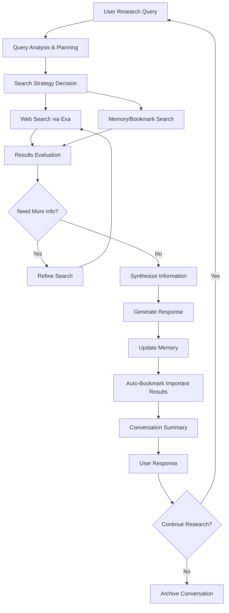

# Epic 0015 - Intelligent Research Agent

> Goal: Implement Pydantic AI-powered research agent with advanced document intelligence, research methodology, conversation history, web search capabilities, memory management, and comprehensive document analysis for sophisticated research workflows.

**Framework**: Built on Pydantic AI with Library Manager integration, web search, conversation management, document intelligence, and research synthesis capabilities.

## Agent Flow Diagram



## Scope & Approach

### Core Capabilities

#### Research Intelligence
- **Research Planning & Strategy**: Query analysis, depth assessment, and iterative planning
- **Multi-Conversation Support**: Maintain separate research contexts across conversations
- **Research Methodology**: Systematic approach to information gathering and synthesis
- **Memory Management**: Store and retrieve important research findings with categorization
- **Smart Bookmarking**: Automatically bookmark valuable research sources with relevance scoring
- **Research Continuity**: Resume research across conversation sessions with progress tracking

#### Document Intelligence (from Library Manager Integration)
- **Document Analysis**: Summarization, key insight extraction, and theme identification
- **Document Collection Intelligence**: Pattern detection and knowledge gap analysis
- **Cross-Document Analysis**: Relationship detection and comparison capabilities
- **Document Lifecycle Management**: Version tracking, usage analytics, and optimization

#### Search & Synthesis
- **Web Search Integration**: Leverage multiple search engines (Exa, Tavily, Linkup) for research
- **Library Search**: Access curated document collections through Library Manager
- **Research Synthesis**: Combine findings from multiple sources and sessions
- **Quality Assessment**: Evaluate source credibility and research completeness

### Target Workflows
- **Exploratory Research**: Initial topic investigation with iterative refinement and library integration
- **Document Intelligence**: Deep analysis of document collections with insight extraction
- **Literature Review**: Comprehensive topic coverage with cross-document analysis
- **Comparative Analysis**: Side-by-side evaluation with document and web source comparison
- **Research Synthesis**: Multi-source synthesis combining libraries, web search, and memory
- **Knowledge Discovery**: Pattern detection across large document collections
- **Research Validation**: Cross-reference claims against curated libraries and web sources

## Pydantic AI Implementation Plan

### FEATURE 0015-001 - Research Agent Framework
> Establish Pydantic AI-powered research agent with core functionality

#### TASK 0015-001-001 - Basic Research Agent Setup
- [ ] 0015-001-001-01 - CHUNK - Research agent class implementation
  - Create `ResearchAgent` class inheriting from base agent
  - Define research-specific dependencies and configuration
  - Implement research-focused conversation system prompt
  - **Acceptance**: Research agent responds to basic research queries
  - **Dependencies**: Requires 0005-001 (Pydantic AI Framework Setup)

- [ ] 0015-001-001-02 - CHUNK - Research agent dependencies
  - Implement `ResearchDependencies` with Exa API and memory configs
  - Add conversation tracking and research session dependencies
  - Create research agent dependency factory
  - **Acceptance**: Research agent receives all required dependencies

- [ ] 0015-001-001-03 - CHUNK - Research agent output models
  - Define Pydantic models for research query planning output
  - Create structured models for search results and synthesis
  - Implement research summary and bookmark output models
  - **Acceptance**: Research agent returns structured, validated outputs

#### TASK 0015-001-002 - Research Tools Integration
- [ ] 0015-001-002-01 - CHUNK - Web search tools
  - Implement `@research_agent.tool` for Exa search integration
  - Add search result filtering and ranking tools
  - Create search strategy planning and execution tools
  - **Acceptance**: Agent performs intelligent web searches

- [ ] 0015-001-002-02 - CHUNK - Memory management tools
  - Implement research memory storage and retrieval tools
  - Add memory search and association tools
  - Create memory summarization and organization tools
  - **Acceptance**: Agent maintains persistent research memory

### FEATURE 0015-002 - Conversation & History Management
> Enhance research agent with multi-conversation support and history tracking

#### TASK 0015-002-001 - Conversation Architecture
- [ ] 0015-002-001-01 - CHUNK - Research conversation models
  - Extend conversation models for research-specific metadata
  - Add research topic and progress tracking to conversations
  - Create research session linking and continuation logic
  - **Acceptance**: Research conversations maintain context and progress
  - **Dependencies**: Requires 0004-012 (Conversation Hierarchy)

- [ ] 0015-002-001-02 - CHUNK - History integration tools
  - Implement conversation history search and reference tools
  - Add cross-conversation research continuity tools
  - Create research timeline and progress tracking tools
  - **Acceptance**: Agent references and builds on previous research

#### TASK 0015-002-002 - Research Context Management
- [ ] 0015-002-002-01 - CHUNK - Research session context
  - Implement research goal and progress context tracking
  - Add research method and source preference tracking
  - Create research quality and depth optimization
  - **Acceptance**: Agent maintains focused research context
  - **Dependencies**: Requires 0004-013 (Agent Context Management)

### FEATURE 0015-003 - Advanced Search & Memory
> Equip research agent with sophisticated search and memory capabilities

#### TASK 0015-003-001 - Exa Search Integration
- [ ] 0015-003-001-01 - CHUNK - Exa API implementation
  - Implement `@research_agent.tool` for Exa search queries
  - Add search result processing and filtering
  - Create search quality assessment and ranking
  - **Acceptance**: Agent performs high-quality web searches

- [ ] 0015-003-001-02 - CHUNK - Search strategy optimization
  - Implement intelligent search query generation
  - Add search result evaluation and iteration
  - Create search coverage gap detection
  - **Acceptance**: Agent optimizes search strategies automatically

#### TASK 0015-003-002 - Memory & Bookmark System
- [ ] 0015-003-002-01 - CHUNK - Research memory storage
  - Implement structured research finding storage
  - Add memory categorization and tagging
  - Create memory relationship and association tracking
  - **Acceptance**: Agent builds comprehensive research knowledge base

- [ ] 0015-003-002-02 - CHUNK - Smart bookmarking system
  - Implement automatic bookmark creation for valuable sources
  - Add bookmark categorization and metadata extraction
  - Create bookmark recommendation and suggestion tools
  - **Acceptance**: Agent maintains organized research source library

### FEATURE 0015-004 - Document Intelligence & Analytics
> Advanced document analysis and collection intelligence capabilities

#### TASK 0015-004-001 - Document Analysis Tools
- [ ] 0015-004-001-01 - CHUNK - Content analysis and summarization
  - Implement document summarization and key insight extraction
  - Add topic modeling and theme identification tools
  - Create document comparison and difference analysis
  - **Acceptance**: Agent provides intelligent document analysis
  - **Dependencies**: Requires 0019 (Library Manager)

- [ ] 0015-004-001-02 - CHUNK - Document collection insights
  - Implement collection-wide analysis and pattern detection
  - Add document clustering and categorization tools
  - Create knowledge gap identification and recommendations
  - **Acceptance**: Agent provides insights across document collections

#### TASK 0015-004-002 - Cross-Document Intelligence
- [ ] 0015-004-002-01 - CHUNK - Relationship detection system
  - Implement cross-document similarity analysis
  - Add citation and reference link detection
  - Create document relationship mapping and visualization
  - **Acceptance**: Agent identifies and maps document relationships

- [ ] 0015-004-002-02 - CHUNK - Document lifecycle analytics
  - Implement document usage analytics and access patterns
  - Add document versioning and change impact analysis
  - Create document archival and optimization recommendations
  - **Acceptance**: Agent manages document lifecycle intelligently

### FEATURE 0015-005 - Research Optimization
> Optimize research agent performance and synthesis capabilities

#### TASK 0015-005-001 - Memory Summarization
- [ ] 0015-005-001-01 - CHUNK - Interval-based summarization
  - Implement configurable memory summarization triggers
  - Add research progress and finding synthesis
  - Create summary quality assessment and refinement
  - **Acceptance**: Agent maintains condensed research summaries

- [ ] 0015-005-001-02 - CHUNK - Research synthesis optimization
  - Implement intelligent research finding synthesis
  - Add contradiction detection and resolution
  - Create research gap identification and filling
  - **Acceptance**: Agent produces coherent research syntheses

#### TASK 0015-005-002 - Performance Optimization
- [ ] 0015-005-002-01 - CHUNK - Research efficiency optimization
  - Implement research workflow optimization
  - Add search redundancy detection and prevention
  - Create research completion criteria and assessment
  - **Acceptance**: Agent conducts efficient, thorough research

---

## Technical Architecture - Pydantic AI Implementation

### Research Agent Structure
```python
@dataclass
class ResearchDependencies:
    account_id: str
    db: DatabaseConn
    library_manager: LibraryManagerClient
    search_engines: Dict[str, SearchEngineConfig]  # exa, tavily, linkup
    memory_config: MemoryConfig
    conversation_context: Optional[ConversationContext]
    research_session: Optional[ResearchSession]
    document_analyzer: DocumentAnalysisEngine

class ResearchQuery(BaseModel):
    query: str
    research_depth: Literal["shallow", "moderate", "deep"]
    time_constraint: Optional[int]  # minutes
    source_preferences: List[str]
    previous_context: Optional[str]

class DocumentAnalysis(BaseModel):
    document_id: str
    summary: str
    key_insights: List[str]
    topics: List[str]
    entities: List[str]
    relationships: List[DocumentRelationship]

class ResearchOutput(BaseModel):
    findings: List[ResearchFinding]
    sources: List[BookmarkedSource]
    document_analyses: List[DocumentAnalysis]
    synthesis: str
    confidence_score: float = Field(ge=0, le=1)
    research_gaps: List[str]
    cross_document_insights: List[str]
    next_steps: List[str]

research_agent = Agent[ResearchDependencies, ResearchOutput](
    'openai:gpt-4o',
    deps_type=ResearchDependencies,
    output_type=ResearchOutput,
    system_prompt="You are a research agent specialized in thorough investigation..."
)

@research_agent.tool
async def web_search(ctx: RunContext[ResearchDependencies], query: str, engine: str = "exa", num_results: int = 10) -> List[SearchResult]:
    """Perform web search using configured search engines."""
    search_config = ctx.deps.search_engines.get(engine)
    if not search_config:
        raise ValueError(f"Search engine {engine} not configured")
    
    search_client = SearchEngineFactory.create(engine, search_config)
    results = await search_client.search(query, num_results=num_results)
    return [SearchResult.from_engine_result(result) for result in results]

@research_agent.tool
async def search_libraries(ctx: RunContext[ResearchDependencies], query: str, library_ids: List[str] = None) -> List[DocumentMatch]:
    """Search document libraries for relevant information."""
    return await ctx.deps.library_manager.search(
        query=query,
        library_ids=library_ids,
        account_id=ctx.deps.account_id
    )

@research_agent.tool
async def analyze_document(ctx: RunContext[ResearchDependencies], document_id: str) -> DocumentAnalysis:
    """Perform deep analysis of a specific document."""
    document = await ctx.deps.library_manager.get_document(document_id)
    analysis = await ctx.deps.document_analyzer.analyze(document)
    return DocumentAnalysis(
        document_id=document_id,
        summary=analysis.summary,
        key_insights=analysis.insights,
        topics=analysis.topics,
        entities=analysis.entities,
        relationships=analysis.relationships
    )

@research_agent.tool
async def compare_documents(ctx: RunContext[ResearchDependencies], document_ids: List[str]) -> DocumentComparison:
    """Compare multiple documents for similarities and differences."""
    documents = await ctx.deps.library_manager.get_documents(document_ids)
    return await ctx.deps.document_analyzer.compare(documents)

@research_agent.tool  
async def store_research_memory(ctx: RunContext[ResearchDependencies], finding: ResearchFinding) -> str:
    """Store important research finding in memory."""
    memory_id = await memory_service.store(
        ctx.deps.memory_config, 
        finding, 
        conversation_id=ctx.deps.conversation_context.id
    )
    return f"Research finding stored with ID: {memory_id}"

@research_agent.tool
async def search_research_memory(ctx: RunContext[ResearchDependencies], query: str) -> List[ResearchFinding]:
    """Search previous research findings in memory."""
    return await memory_service.search(
        ctx.deps.memory_config, 
        query, 
        conversation_id=ctx.deps.conversation_context.id
    )
```

### Agent Module Structure
```
backend/app/agents/research/
├── __init__.py
├── agent.py                    # Main ResearchAgent class
├── models.py                   # Research-specific Pydantic models
├── dependencies.py             # ResearchDependencies class
├── config.py                   # Research agent configuration
├── document_analyzer.py        # Document intelligence engine
└── tools/
    ├── __init__.py
    ├── search_tools.py         # Multi-engine web search tools
    ├── library_tools.py        # Library Manager integration tools
    ├── document_tools.py       # Document analysis and comparison tools
    ├── memory_tools.py         # Memory storage and retrieval tools
    ├── bookmark_tools.py       # Bookmarking and source management tools
    ├── synthesis_tools.py      # Research synthesis and analysis tools
    └── conversation_tools.py   # Conversation and history tools
```

---

## Configuration Schema (app.yaml)

```yaml
research_agent:
  search:
    web_engines:
      exa:
        enabled: true
        api_key: "${EXA_API_KEY}"
        max_results: 20
      tavily:
        enabled: true
        api_key: "${TAVILY_API_KEY}"
        max_results: 15
      linkup:
        enabled: false
        api_key: "${LINKUP_API_KEY}"
        max_results: 10
    quality_threshold: 0.7
    auto_follow_links: true
    
  memory:
    summarization_interval: 50  # messages
    max_memory_items: 1000
    retention_days: 90
    auto_categorization: true
    
  conversations:
    max_concurrent: 5
    auto_archive_days: 30
    cross_conversation_search: true
    
  bookmarks:
    auto_bookmark_threshold: 0.8  # relevance score
    max_bookmarks_per_conversation: 100
    metadata_extraction: true
    duplicate_detection: true
    
  document_intelligence:
    analysis_depth: "comprehensive"  # basic, moderate, comprehensive
    topic_modeling: true
    entity_extraction: true
    relationship_detection: true
    cross_document_analysis: true
    
  library_integration:
    max_libraries_per_query: 5
    library_search_timeout_ms: 5000
    cross_library_synthesis: true
    
  performance:
    max_search_iterations: 5
    response_time_target_ms: 3000
    research_depth_auto_adjust: true
    document_analysis_parallel: true
```

### Database Extensions

```sql
-- Research-specific conversation metadata
research_conversations:
  id (GUID, PK)
  conversation_id (GUID, FK → conversations.id)
  research_topic (VARCHAR)
  research_depth (VARCHAR)
  progress_status (VARCHAR)
  quality_score (FLOAT)
  created_at (TIMESTAMP)

-- Research memory storage
research_memory:
  id (GUID, PK)
  conversation_id (GUID, FK → conversations.id)
  finding_text (TEXT)
  source_urls (JSONB)
  confidence_score (FLOAT)
  category (VARCHAR)
  created_at (TIMESTAMP)
  summarized_at (TIMESTAMP)

-- Research bookmarks
research_bookmarks:
  id (GUID, PK)
  conversation_id (GUID, FK → conversations.id)
  url (VARCHAR)
  title (VARCHAR)
  description (TEXT)
  relevance_score (FLOAT)
  metadata (JSONB)
  created_at (TIMESTAMP)

-- Document analysis results
document_analyses:
  id (GUID, PK)
  document_id (GUID, FK → content_items.id)
  conversation_id (GUID, FK → conversations.id)
  analysis_type (VARCHAR)  -- summary, topic_analysis, entity_extraction
  results (JSONB)
  confidence_score (FLOAT)
  created_at (TIMESTAMP)

-- Cross-document relationships
document_relationships:
  id (GUID, PK)
  source_document_id (GUID, FK → content_items.id)
  target_document_id (GUID, FK → content_items.id)
  relationship_type (VARCHAR)  -- similar, references, contradicts
  strength (FLOAT)
  metadata (JSONB)
  created_at (TIMESTAMP)
```

### Integration Points
- **Multi-Engine Web Search**: Exa, Tavily, Linkup search APIs with intelligent routing
- **Library Manager (Epic 0019)**: Document collections, processing, and vector search
- **Research Memory System**: Persistent storage and retrieval of research findings
- **Document Intelligence Engine**: Analysis, comparison, and relationship detection
- **Conversation Management**: Multi-conversation research context tracking
- **Bookmark System**: Automatic source organization and metadata extraction

### Dependencies
- **0005-001**: Pydantic AI Framework Setup (required for agent foundation)
- **0004-012**: Conversation Hierarchy & Management (required for multi-conversation support)
- **0004-013**: Agent Context Management (required for research context)
- **0019**: Library Manager (required for document collections and processing)
- **0011**: Vector Database Integration (for advanced memory search capabilities)

## Success Criteria
1. **Multi-Conversation Support**: Research agent maintains separate contexts across conversations
2. **Multi-Engine Web Search**: Successful integration with Exa, Tavily, and Linkup search APIs
3. **Library Integration**: Seamless access to document collections through Library Manager
4. **Document Intelligence**: Deep analysis, comparison, and relationship detection capabilities
5. **Memory Management**: Research findings stored and retrieved effectively with categorization
6. **Smart Bookmarking**: Automatic identification and organization of valuable sources
7. **Research Synthesis**: Intelligent combination of web search, library content, and memory
8. **Cross-Document Analysis**: Pattern detection and insight extraction across document collections
9. **Research Continuity**: Ability to resume and build on previous research sessions
10. **Research Quality**: Generated syntheses are accurate, comprehensive, and well-sourced

This epic establishes a comprehensive research platform combining web search, document intelligence, and persistent memory for sophisticated research workflows.
