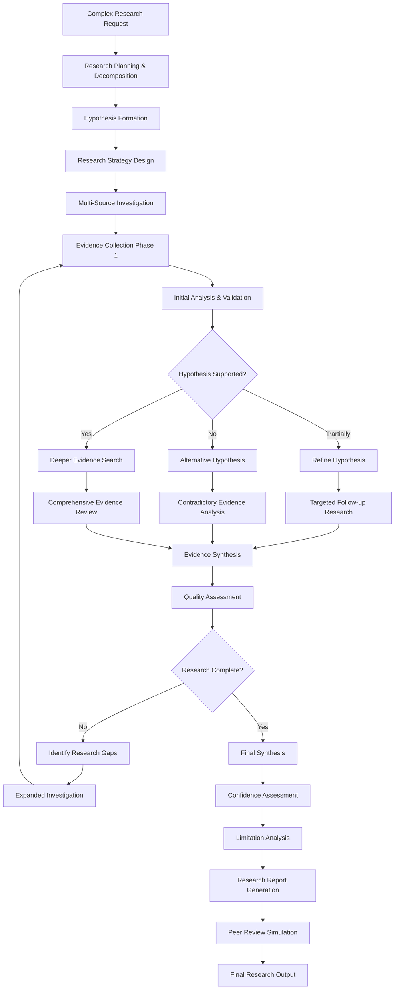

<!--
Copyright (c) 2025 Ape4, Inc. All rights reserved.
Unauthorized copying of this file is strictly prohibited.
-->

# Epic 0016 - Deep Research Agent

> Goal: Implement Pydantic AI-powered autonomous deep research agent with multi-step investigation workflows, hypothesis formation, evidence validation, and comprehensive analytical capabilities for complex research tasks.

**Framework**: Built on Pydantic AI with autonomous planning, multi-stage research methodology, hypothesis testing, and evidence synthesis capabilities.

## Agent Flow Diagram



## Scope & Approach

### Core Capabilities
- **Autonomous Research Planning**: Break down complex topics into investigatable sub-questions
- **Hypothesis-Driven Investigation**: Form and test hypotheses through systematic research
- **Multi-Stage Research Methodology**: Execute research in planned phases with iterative refinement
- **Evidence Validation**: Cross-reference claims across multiple authoritative sources
- **Contradiction Analysis**: Identify and resolve conflicting information
- **Research Quality Assessment**: Evaluate source credibility and evidence strength
- **Comprehensive Synthesis**: Produce detailed, well-supported research conclusions
- **Limitation Recognition**: Identify gaps and constraints in research findings

### Advanced Workflows
- **Literature Reviews**: Systematic exploration of academic and professional sources
- **Comparative Studies**: In-depth analysis of multiple approaches or solutions
- **Trend Analysis**: Historical and predictive analysis of developments
- **Expert Opinion Synthesis**: Aggregation and analysis of expert perspectives
- **Technical Deep Dives**: Comprehensive exploration of complex technical topics
- **Policy Research**: Multi-stakeholder analysis of policy implications and outcomes

## Pydantic AI Implementation Plan

### FEATURE 0016-001 - Deep Research Agent Framework
> Establish autonomous research agent with advanced planning capabilities

#### TASK 0016-001-001 - Advanced Research Agent Setup
- [ ] 0016-001-001-01 - CHUNK - Deep research agent class implementation
  - Create `DeepResearchAgent` class with autonomous planning capabilities
  - Define complex research dependencies and multi-stage configuration
  - Implement research methodology and planning system prompts
  - **Acceptance**: Agent autonomously plans complex research investigations
  - **Dependencies**: Requires 0005-001 (Pydantic AI Framework Setup)

- [ ] 0016-001-001-02 - CHUNK - Research planning dependencies
  - Implement `DeepResearchDependencies` with multi-source access configs
  - Add research methodology and validation framework dependencies
  - Create autonomous research planning and execution factory
  - **Acceptance**: Agent receives comprehensive research planning capabilities

- [ ] 0016-001-001-03 - CHUNK - Research output models
  - Define Pydantic models for research plan and hypothesis output
  - Create structured models for evidence assessment and validation
  - Implement comprehensive research report output models
  - **Acceptance**: Agent returns detailed, structured research outputs

#### TASK 0016-001-002 - Research Planning Tools
- [ ] 0016-001-002-01 - CHUNK - Research decomposition tools
  - Implement `@deep_research_agent.tool` for topic decomposition
  - Add research question generation and prioritization tools
  - Create research scope and boundary definition tools
  - **Acceptance**: Agent breaks down complex topics systematically

- [ ] 0016-001-002-02 - CHUNK - Hypothesis formation tools
  - Implement hypothesis generation and refinement tools
  - Add hypothesis validation and testing framework tools
  - Create alternative hypothesis exploration tools
  - **Acceptance**: Agent forms and tests research hypotheses

### FEATURE 0016-002 - Multi-Stage Investigation Engine
> Implement systematic multi-phase research methodology

#### TASK 0016-002-001 - Research Methodology Framework
- [ ] 0016-002-001-01 - CHUNK - Research phase management
  - Implement multi-stage research workflow orchestration
  - Add phase transition criteria and quality gates
  - Create research progress tracking and assessment
  - **Acceptance**: Agent executes systematic research phases

- [ ] 0016-002-001-02 - CHUNK - Evidence collection tools
  - Implement comprehensive evidence gathering tools
  - Add source diversity and quality assessment tools
  - Create evidence categorization and tagging tools
  - **Acceptance**: Agent collects diverse, high-quality evidence

#### TASK 0016-002-002 - Validation & Analysis Engine
- [ ] 0016-002-002-01 - CHUNK - Evidence validation tools
  - Implement source credibility assessment tools
  - Add fact-checking and cross-referencing tools
  - Create bias detection and mitigation tools
  - **Acceptance**: Agent validates evidence quality and reliability

- [ ] 0016-002-002-02 - CHUNK - Contradiction analysis tools
  - Implement conflicting information detection tools
  - Add contradiction resolution and explanation tools
  - Create uncertainty quantification and handling tools
  - **Acceptance**: Agent handles contradictory evidence systematically

### FEATURE 0016-003 - Advanced Synthesis & Reporting
> Generate comprehensive research outputs with quality assessment

#### TASK 0016-003-001 - Research Synthesis Engine
- [ ] 0016-003-001-01 - CHUNK - Evidence synthesis tools
  - Implement comprehensive evidence aggregation tools
  - Add argument construction and logical flow tools
  - Create research conclusion generation tools
  - **Acceptance**: Agent synthesizes evidence into coherent conclusions

- [ ] 0016-003-001-02 - CHUNK - Quality assessment tools
  - Implement research quality and completeness assessment
  - Add confidence scoring and uncertainty quantification
  - Create limitation and gap identification tools
  - **Acceptance**: Agent assesses and reports research quality

#### TASK 0016-003-002 - Report Generation System
- [ ] 0016-003-002-01 - CHUNK - Comprehensive report generation
  - Implement structured research report generation
  - Add executive summary and detailed findings sections
  - Create citation and reference management tools
  - **Acceptance**: Agent produces publication-quality research reports

- [ ] 0016-003-002-02 - CHUNK - Peer review simulation
  - Implement self-critique and review tools
  - Add alternative perspective consideration tools
  - Create research improvement recommendation tools
  - **Acceptance**: Agent critically evaluates its own research

### FEATURE 0016-004 - Research Optimization & Learning
> Optimize research effectiveness and learn from investigations

#### TASK 0016-004-001 - Research Effectiveness Optimization
- [ ] 0016-004-001-01 - CHUNK - Research efficiency optimization
  - Implement research path optimization tools
  - Add redundancy detection and elimination tools
  - Create time and resource management tools
  - **Acceptance**: Agent optimizes research efficiency

- [ ] 0016-004-001-02 - CHUNK - Research learning system
  - Implement research methodology improvement tools
  - Add pattern recognition and strategy refinement tools
  - Create research effectiveness tracking tools
  - **Acceptance**: Agent improves research capabilities over time

---

## Technical Architecture - Pydantic AI Implementation

### Deep Research Agent Structure
```python
@dataclass
class DeepResearchDependencies:
    account_id: str
    db: DatabaseConn
    search_configs: Dict[str, SearchConfig]  # exa, academic, expert networks
    validation_config: ValidationConfig
    methodology_config: MethodologyConfig
    research_session: Optional[ResearchSession]

class ResearchPlan(BaseModel):
    research_question: str
    sub_questions: List[str]
    hypotheses: List[str]
    methodology: str
    phases: List[ResearchPhase]
    expected_duration: int  # hours
    quality_criteria: List[str]

class ResearchPhase(BaseModel):
    phase_name: str
    objectives: List[str]
    methods: List[str]
    success_criteria: List[str]
    estimated_time: int  # hours

class DeepResearchOutput(BaseModel):
    research_plan: ResearchPlan
    findings: List[DetailedFinding]
    evidence_assessment: EvidenceAssessment
    synthesis: str
    conclusions: List[str]
    confidence_scores: Dict[str, float]
    limitations: List[str]
    recommendations: List[str]
    citations: List[Citation]

deep_research_agent = Agent[DeepResearchDependencies, DeepResearchOutput](
    'openai:gpt-4o',
    deps_type=DeepResearchDependencies,
    output_type=DeepResearchOutput,
    system_prompt="""You are a deep research agent specialized in autonomous, systematic investigation.
    You plan multi-stage research, form and test hypotheses, validate evidence, and produce comprehensive
    research outputs with rigorous quality assessment."""
)

@deep_research_agent.tool
async def plan_research_investigation(
    ctx: RunContext[DeepResearchDependencies], 
    topic: str, 
    complexity_level: str
) -> ResearchPlan:
    """Create comprehensive research plan with phases and methodologies."""
    planner = ResearchPlanner(ctx.deps.methodology_config)
    return await planner.create_plan(topic, complexity_level)

@deep_research_agent.tool
async def validate_evidence_quality(
    ctx: RunContext[DeepResearchDependencies], 
    evidence: List[Evidence]
) -> EvidenceAssessment:
    """Assess quality, credibility, and reliability of collected evidence."""
    validator = EvidenceValidator(ctx.deps.validation_config)
    return await validator.assess_evidence(evidence)

@deep_research_agent.tool
async def synthesize_research_findings(
    ctx: RunContext[DeepResearchDependencies], 
    findings: List[DetailedFinding],
    hypotheses: List[str]
) -> ResearchSynthesis:
    """Synthesize findings into coherent conclusions with confidence assessment."""
    synthesizer = ResearchSynthesizer()
    return await synthesizer.synthesize(findings, hypotheses)
```

### Agent Module Structure
```
backend/app/agents/deep_research/
├── __init__.py
├── agent.py                    # Main DeepResearchAgent class
├── models.py                   # Deep research Pydantic models
├── dependencies.py             # DeepResearchDependencies class
├── config.py                   # Deep research agent configuration
├── methodology/
│   ├── __init__.py
│   ├── planner.py             # Research planning and decomposition
│   ├── phases.py              # Multi-stage research execution
│   └── validation.py          # Evidence validation framework
└── tools/
    ├── __init__.py
    ├── planning_tools.py       # Research planning and decomposition tools
    ├── investigation_tools.py  # Multi-source investigation tools
    ├── validation_tools.py     # Evidence validation and quality tools
    ├── synthesis_tools.py      # Research synthesis and analysis tools
    ├── hypothesis_tools.py     # Hypothesis formation and testing tools
    └── reporting_tools.py      # Comprehensive report generation tools
```

---

## Configuration Schema (app.yaml)

```yaml
deep_research_agent:
  planning:
    max_research_phases: 8
    hypothesis_generation_enabled: true
    alternative_hypothesis_required: true
    quality_gates_enabled: true
    
  investigation:
    multi_source_required: true
    min_sources_per_claim: 3
    source_diversity_threshold: 0.7
    evidence_validation_required: true
    
  search_integration:
    academic_sources:
      enabled: true
      providers: ["semantic_scholar", "arxiv", "pubmed"]
      quality_threshold: 0.8
    
    expert_networks:
      enabled: true
      platforms: ["twitter", "linkedin", "expert_interviews"]
      credibility_scoring: true
    
    web_sources:
      enabled: true
      provider: "exa"
      fact_checking_required: true
      
  validation:
    source_credibility_scoring: true
    bias_detection: true
    contradiction_analysis: true
    uncertainty_quantification: true
    
  synthesis:
    argument_structure_required: true
    confidence_scoring_enabled: true
    limitation_identification: true
    peer_review_simulation: true
    
  reporting:
    comprehensive_citations: true
    executive_summary_required: true
    methodology_documentation: true
    reproducibility_guidelines: true
```

### Database Extensions

```sql
-- Deep research sessions and planning
deep_research_sessions:
  id (GUID, PK)
  conversation_id (GUID, FK → conversations.id)
  research_topic (TEXT)
  complexity_level (VARCHAR)
  plan_json (JSONB)
  current_phase (VARCHAR)
  progress_percentage (FLOAT)
  created_at (TIMESTAMP)

-- Research hypotheses and testing
research_hypotheses:
  id (GUID, PK)
  session_id (GUID, FK → deep_research_sessions.id)
  hypothesis_text (TEXT)
  confidence_score (FLOAT)
  evidence_support (JSONB)
  test_results (JSONB)
  status (VARCHAR)  -- active, supported, refuted, refined

-- Evidence tracking and validation
research_evidence:
  id (GUID, PK)
  session_id (GUID, FK → deep_research_sessions.id)
  hypothesis_id (GUID, FK → research_hypotheses.id)
  source_url (VARCHAR)
  source_type (VARCHAR)  -- academic, expert, web, interview
  credibility_score (FLOAT)
  evidence_text (TEXT)
  validation_status (VARCHAR)
  bias_assessment (JSONB)
  created_at (TIMESTAMP)

-- Research synthesis and conclusions
research_conclusions:
  id (GUID, PK)
  session_id (GUID, FK → deep_research_sessions.id)
  conclusion_text (TEXT)
  confidence_score (FLOAT)
  supporting_evidence_ids (JSONB)
  limitations (JSONB)
  recommendations (JSONB)
  created_at (TIMESTAMP)
```

### Integration Points
- **Academic Search APIs**: Semantic Scholar, arXiv, PubMed for scholarly sources
- **Expert Networks**: Twitter API, LinkedIn for expert opinions and discussions
- **Fact-Checking Services**: Integration with fact-checking APIs and databases
- **Citation Management**: Automated citation formatting and reference management
- **Quality Assessment Tools**: Bias detection and source credibility scoring

### Dependencies
- **0005-001**: Pydantic AI Framework Setup (required for agent foundation)
- **0015**: Simple Research Agent (foundation for research capabilities)
- **0004-012**: Conversation Hierarchy & Management (for research session tracking)
- **0004-013**: Agent Context Management (for deep research context)
- **0011**: Vector Database Integration (for advanced evidence storage and retrieval)

## Success Criteria
1. **Autonomous Planning**: Agent creates comprehensive, multi-phase research plans
2. **Hypothesis Formation**: Systematic hypothesis generation and testing capabilities
3. **Multi-Source Investigation**: Integration with academic, expert, and web sources
4. **Evidence Validation**: Robust source credibility and quality assessment
5. **Contradiction Handling**: Effective analysis and resolution of conflicting information
6. **Research Synthesis**: Coherent, well-supported research conclusions
7. **Quality Assessment**: Accurate confidence scoring and limitation identification
8. **Comprehensive Reporting**: Publication-quality research outputs with full citations

This epic establishes a foundation for autonomous, rigorous research capabilities suitable for complex analytical tasks and comprehensive investigations.
