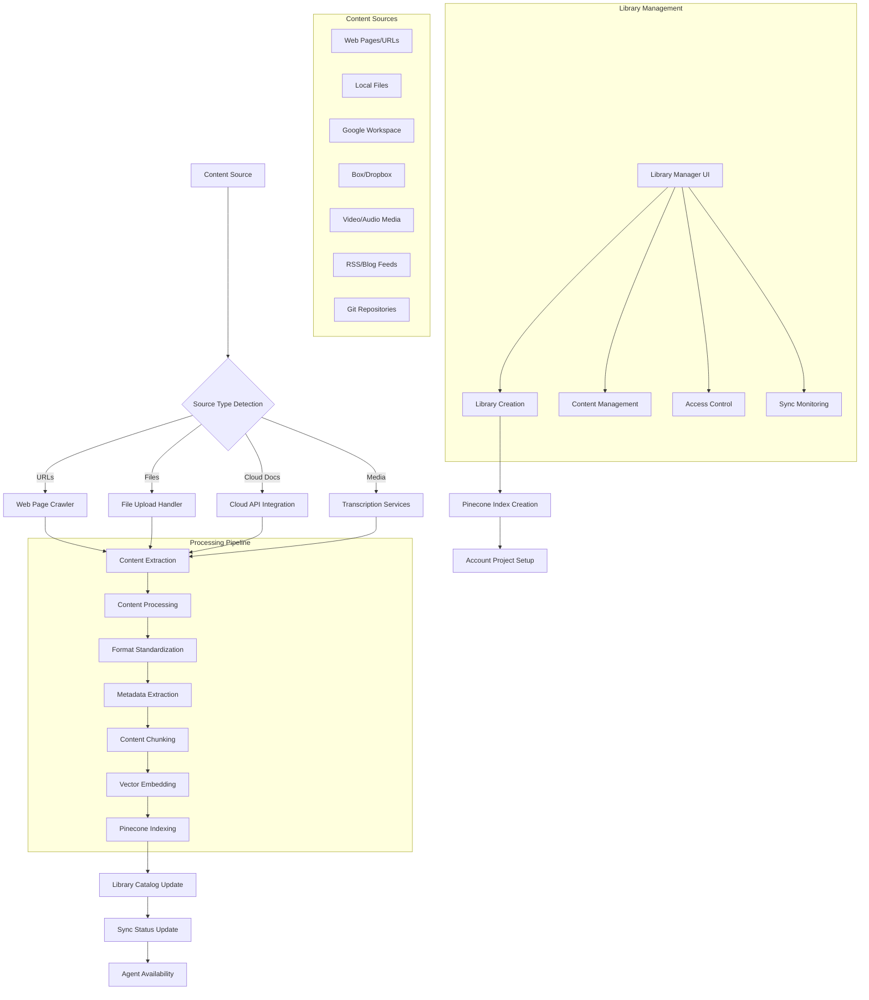

<!--
Copyright (c) 2025 Ape4, Inc. All rights reserved.
Unauthorized copying of this file is strictly prohibited.
-->

# Epic 0019 - Library Manager (Knowledge Base Orchestration)

> Goal: Create a comprehensive library management system for organizing, indexing, and maintaining document collections across multiple sources, enabling AI agents to access curated knowledge bases through vector database integration.

**Framework**: Built on account-isolated Pinecone projects with per-library index organization, supporting multi-source document ingestion, real-time synchronization, and collaborative AI workspace integration.

## Content Ingestion Flow Diagram



## Scope & Approach

### Core Capabilities

#### Content Ingestion Sources
- **Web Content**: URLs, RSS feeds, sitemap crawling, social media feeds
- **Local Files**: PDF, Word, Excel, PowerPoint, text files, Markdown, JSON, CSV
- **Google Workspace**: Docs, Sheets, Slides, Forms with real-time sync
- **Cloud Storage**: Box, Dropbox, OneDrive, SharePoint integration
- **Media Content**: YouTube videos, podcast episodes, conference recordings
- **Code Repositories**: GitHub, GitLab documentation and code comments
- **Structured Data**: Database exports, API documentation, knowledge graphs

#### Library Organization
- **Account-Level Isolation**: Each account gets dedicated Pinecone project
- **Project-Based Structure**: Projects contain one or more libraries with admin management
- **Library-Specific Indexes**: One Pinecone index per library for granular access control
- **Public Knowledge Bases**: Optional shared libraries accessible across accounts
- **Hierarchical Organization**: Libraries can contain sub-collections and folders
- **Content Deduplication**: Automatic detection and handling of duplicate content
- **Delta Synchronization**: Track document versions by timestamp for incremental updates
- **Role-Based Access**: Project admins manage libraries and collaborative workspace access

#### Processing & Intelligence
- **Multi-Format Processing**: Universal content extraction and standardization
- **Automatic Transcription**: Whisper integration for audio/video content
- **Real-Time Synchronization**: Monitor cloud sources and file system changes (Box/Dropbox file additions/removals)
- **Content Enhancement**: Automatic metadata extraction and enrichment
- **Quality Assessment**: Content relevance and completeness scoring
- **Relationship Detection**: Cross-document and cross-library connections

### Target Use Cases
- **Enterprise Knowledge Bases**: Comprehensive company documentation libraries with project-level organization
- **Public Research Collections**: Shared academic papers, industry reports, open-source documentation
- **Training Material Libraries**: Onboarding docs, process guides, training videos with transcription
- **Product Documentation**: Technical specs, user manuals, API documentation with version tracking
- **Content Creator Libraries**: Blog posts, videos, podcasts for digital experts with auto-transcription
- **Legal Document Collections**: Contracts, compliance docs, case law references with delta sync
- **Community Knowledge Bases**: Public libraries accessible across multiple accounts for shared learning

## Implementation Plan

### FEATURE 0019-001 - Library Management Foundation
> Core library creation, organization, and management capabilities

#### TASK 0019-001-001 - Library Infrastructure
- [ ] 0019-001-001-01 - CHUNK - Project and library management UI
  - Create project creation with admin role assignment
  - Implement library creation within projects with admin controls
  - Add public library sharing and cross-account access controls
  - Create project admin interface for collaborative workspace configuration
  - **Acceptance**: Project admins can create libraries and configure workspace access
  - **Dependencies**: Requires account system and UI framework

- [ ] 0019-001-001-02 - CHUNK - Pinecone project orchestration
  - Implement account-level Pinecone project provisioning
  - Create per-library index management and lifecycle
  - Add index configuration and optimization tools
  - **Acceptance**: Each account has isolated Pinecone infrastructure
  - **Dependencies**: Requires 0011 (Vector Database Integration)

- [ ] 0019-001-001-03 - CHUNK - Library metadata system
  - Design library schema and metadata structures
  - Implement content cataloging and organization
  - Create library statistics and analytics tracking
  - **Acceptance**: Libraries maintain comprehensive content metadata

#### TASK 0019-001-002 - Content Source Integration
- [ ] 0019-001-002-01 - CHUNK - File upload system
  - Implement secure file upload with virus scanning
  - Add drag-and-drop interface with progress tracking
  - Create bulk upload and batch processing capabilities
  - **Acceptance**: Users can upload multiple file types safely

- [ ] 0019-001-002-02 - CHUNK - Web content ingestion
  - Implement URL crawling with robots.txt compliance
  - Add sitemap parsing and batch URL processing
  - Create RSS/Atom feed monitoring and ingestion
  - **Acceptance**: System can ingest web content at scale

### FEATURE 0019-002 - Multi-Source Content Processing
> Comprehensive content extraction and processing across all source types

#### TASK 0019-002-001 - Cloud Integration Platform
- [ ] 0019-002-001-01 - CHUNK - Google Workspace integration
  - Implement Google Drive API for file access and monitoring
  - Add real-time sync for Docs, Sheets, and Slides changes
  - Create OAuth flow and permission management
  - **Acceptance**: Google Workspace content syncs automatically
  - **Dependencies**: Google Cloud API setup and credentials

- [ ] 0019-002-001-02 - CHUNK - Box and Dropbox integration
  - Implement Box API for enterprise document access with file system monitoring
  - Add Dropbox integration with real-time file addition/removal detection
  - Create webhook support for file system changes and delta synchronization
  - Implement timestamp-based version tracking for incremental updates
  - **Acceptance**: Cloud storage platforms sync bidirectionally with real-time file system monitoring

- [ ] 0019-002-001-03 - CHUNK - SharePoint and OneDrive integration
  - Implement Microsoft Graph API integration
  - Add enterprise SharePoint site access
  - Create OneDrive file monitoring and sync
  - **Acceptance**: Microsoft ecosystem content accessible

#### TASK 0019-002-002 - Media and Transcription Services
- [ ] 0019-002-002-01 - CHUNK - Video content processing
  - Implement YouTube video download and transcription
  - Add support for uploaded video files (MP4, MOV, AVI)
  - Create conference recording and webinar processing
  - **Acceptance**: Video content converted to searchable text

- [ ] 0019-002-002-02 - CHUNK - Audio content processing  
  - Implement podcast episode download and transcription
  - Add audio file processing (MP3, WAV, M4A)
  - Create speaker identification and timestamp tracking
  - **Acceptance**: Audio content fully transcribed with metadata

- [ ] 0019-002-002-03 - CHUNK - Transcription service integration
  - Integrate OpenAI Whisper as primary transcription service
  - Add fallback transcription services (Rev, Otter.ai, Azure Speech)
  - Create transcription service selection and configuration management
  - Implement transcription quality assessment and validation
  - **Acceptance**: Configurable transcription services with automatic fallback and quality control

### FEATURE 0019-003 - Advanced Content Intelligence
> Intelligent content processing, enhancement, and relationship detection

#### TASK 0019-003-001 - Content Enhancement Pipeline
- [ ] 0019-003-001-01 - CHUNK - Metadata extraction engine
  - Implement automatic title, author, and date extraction
  - Add topic modeling and keyword identification
  - Create content type and format classification
  - **Acceptance**: All content has rich, searchable metadata

- [ ] 0019-003-001-02 - CHUNK - Content quality assessment
  - Implement content completeness and quality scoring
  - Add readability and clarity assessment
  - Create content freshness and relevance tracking
  - **Acceptance**: Content quality metrics guide library curation

- [ ] 0019-003-001-03 - CHUNK - Relationship and similarity detection
  - Implement cross-document similarity analysis
  - Add topic clustering and content grouping
  - Create citation and reference link detection
  - **Acceptance**: Related content automatically linked and grouped

#### TASK 0019-003-002 - Synchronization and Monitoring
- [ ] 0019-003-002-01 - CHUNK - Delta synchronization system
  - Implement timestamp-based change detection for all content sources
  - Add webhook processing for cloud service notifications and file system changes
  - Create delta pull mechanisms for on-demand and automatic updates
  - Implement sync conflict resolution and error handling
  - **Acceptance**: Content changes reflected in vector database through efficient delta sync

- [ ] 0019-003-002-02 - CHUNK - Library health monitoring
  - Implement content freshness tracking and alerts
  - Add broken link detection and repair suggestions
  - Create library completeness and coverage analysis
  - **Acceptance**: Library managers receive actionable health insights

### FEATURE 0019-004 - Collaborative AI Integration
> Integration with AI agents and collaborative workspaces

#### TASK 0019-004-001 - Agent Library Access
- [ ] 0019-004-001-01 - CHUNK - Project admin workspace configuration
  - Implement project admin controls for collaborative AI workspace setup
  - Add library-agent binding configuration through project admin interface
  - Create per-agent library permission and scope management
  - Implement public library access controls and cross-account sharing
  - **Acceptance**: Project admins can configure workspace access to libraries and public knowledge bases
  - **Dependencies**: Requires 0018 (Collaborative AI Workspaces)

- [ ] 0019-004-001-02 - CHUNK - Search and retrieval optimization
  - Implement library-specific search optimization
  - Add cross-library search and result merging
  - Create search performance monitoring and tuning
  - **Acceptance**: Agents perform fast, accurate library searches

#### TASK 0019-004-002 - Analytics and Insights
- [ ] 0019-004-002-01 - CHUNK - Usage analytics system
  - Implement library usage tracking and reporting
  - Add content popularity and effectiveness metrics
  - Create ROI analysis for library investments
  - **Acceptance**: Comprehensive analytics on library value

- [ ] 0019-004-002-02 - CHUNK - Content gap analysis
  - Implement knowledge gap detection across libraries
  - Add content recommendation for library improvement
  - Create content sourcing suggestions and automation
  - **Acceptance**: Proactive suggestions for library enhancement

---

## Technical Architecture

### Library Management Data Model
```python
@dataclass
class LibraryManagerDependencies:
    account_id: str
    db: DatabaseConn
    pinecone_config: PineconeConfig
    cloud_integrations: Dict[str, CloudIntegration]
    transcription_services: Dict[str, TranscriptionService]

class Project(BaseModel):
    id: str
    account_id: str
    name: str
    description: str
    admin_user_ids: List[str]
    is_public: bool
    created_at: datetime
    updated_at: datetime

class Library(BaseModel):
    id: str
    project_id: str
    name: str
    description: str
    pinecone_index_name: str
    content_sources: List[ContentSource]
    sync_settings: SyncSettings
    is_public: bool
    cross_account_access: bool
    version_tracking: VersionTrackingConfig
    statistics: LibraryStatistics

class ContentSource(BaseModel):
    source_type: Literal["file", "url", "cloud_doc", "media", "feed"]
    source_config: Dict[str, Any]
    sync_enabled: bool
    last_sync: Optional[datetime]
    last_modified: Optional[datetime]
    sync_frequency: Optional[str]
    delta_sync_enabled: bool

class ProcessingPipeline(BaseModel):
    content_id: str
    source_type: str
    processing_stages: List[ProcessingStage]
    current_stage: str
    completion_percentage: float
    estimated_completion: Optional[datetime]
```

### Content Processing Architecture
```
backend/app/library_manager/
├── __init__.py
├── manager.py                  # Main LibraryManager class
├── models.py                   # Library and content models
├── dependencies.py             # LibraryManagerDependencies
├── sources/
│   ├── __init__.py
│   ├── web_crawler.py          # URL and web content crawling
│   ├── file_processor.py       # Local file upload and processing
│   ├── google_workspace.py     # Google Docs/Sheets/Slides integration
│   ├── cloud_storage.py        # Box/Dropbox/OneDrive integration
│   ├── media_processor.py      # Video/audio transcription
│   ├── feed_monitor.py         # RSS/Atom feed processing
│   └── code_repository.py      # Git repository integration
├── processing/
│   ├── __init__.py
│   ├── content_extractor.py    # Multi-format content extraction
│   ├── metadata_extractor.py   # Automatic metadata detection
│   ├── content_enhancer.py     # Content quality and enrichment
│   ├── chunking_engine.py      # Intelligent content chunking
│   ├── embedding_generator.py  # Vector embedding creation
│   └── relationship_detector.py # Cross-content relationship analysis
├── transcription/
│   ├── __init__.py
│   ├── whisper_service.py      # OpenAI Whisper integration
│   ├── external_services.py    # Rev, Otter.ai, etc.
│   └── quality_assessor.py     # Transcription quality validation
├── sync/
│   ├── __init__.py
│   ├── sync_manager.py         # Real-time sync coordination
│   ├── webhook_handler.py      # Cloud service webhook processing
│   ├── change_detector.py      # Content change monitoring
│   └── conflict_resolver.py    # Sync conflict resolution
└── ui/
    ├── __init__.py
    ├── library_routes.py       # Library management API routes
    ├── content_routes.py       # Content upload and management routes
    ├── sync_routes.py          # Sync status and control routes
    └── analytics_routes.py     # Usage analytics and reporting routes
```

### Database Schema Extensions
> Database tables defined in [architecture/datamodel.md](../architecture/datamodel.md)

Key tables to be added:
- `projects`: Project definitions with admin user management
- `libraries`: Library definitions within projects with public/private settings
- `content_sources`: Source definitions with delta sync and timestamp tracking
- `content_items`: Individual content pieces with version metadata
- `processing_jobs`: Background processing task tracking
- `sync_logs`: Synchronization history with delta sync status
- `library_access`: Project admin configured agent-library permissions
- `public_library_access`: Cross-account access for public libraries
- `content_analytics`: Usage and performance metrics
- `transcription_jobs`: Audio/video transcription task tracking

### Integration Points
- **Pinecone**: Account-level projects with per-library indexes
- **Google Cloud APIs**: Drive, Docs, Sheets, Slides access
- **Microsoft Graph**: SharePoint, OneDrive, Office 365 integration
- **Box/Dropbox APIs**: Enterprise cloud storage access
- **Transcription Services**: Whisper (primary), Rev, Otter.ai, Azure Speech for media processing
- **Web Crawling**: Scrapy/BeautifulSoup for URL content extraction

### Dependencies
- **0011**: Vector Database Integration (required for Pinecone foundation)
- **0018**: Collaborative AI Workspaces (required for agent integration)
- **0005**: Multi-Agent Support (required for agent-library binding)
- **Account System**: Multi-account support for library isolation

## Configuration Schema

```yaml
library_manager:
  storage:
    max_library_size_gb: 100
    max_libraries_per_account: 50
    content_retention_days: 365
    
  processing:
    max_concurrent_jobs: 10
    chunk_size: 1000
    chunk_overlap: 200
    embedding_model: "text-embedding-3-large"
    
  sources:
    web_crawling:
      max_depth: 3
      respect_robots_txt: true
      crawl_delay_seconds: 1
      max_pages_per_site: 1000
      
    cloud_integration:
      google_workspace:
        enabled: true
        real_time_sync: true
        api_quota_per_day: 10000
        
      box:
        enabled: false
        webhook_verification: true
        
      dropbox:
        enabled: false
        delta_sync_interval: 300  # seconds
        
    transcription:
      primary_service: "whisper"
      fallback_services: ["rev", "otter"]
      max_audio_length_minutes: 180
      speaker_identification: true
      
      sync:
    real_time_enabled: true
    delta_sync_enabled: true
    batch_sync_interval: 3600  # seconds
    delta_check_interval: 300  # seconds
    max_retry_attempts: 3
    webhook_timeout_seconds: 30
    version_tracking_by_timestamp: true
    
  analytics:
    usage_tracking: true
    performance_monitoring: true
    content_popularity_tracking: true
    retention_period_days: 90
```

## Success Criteria

1. **Multi-Source Ingestion**: Successfully ingest content from 8+ different source types
2. **Account Isolation**: Complete separation of libraries and content between accounts
3. **Real-Time Sync**: Cloud document changes reflected in vector database within 5 minutes
4. **Processing Scale**: Handle libraries with 10,000+ documents efficiently
5. **Search Performance**: Sub-200ms search response times across large libraries
6. **Agent Integration**: Seamless library access control for AI agents
7. **Content Quality**: 95%+ accuracy in content extraction and metadata generation
8. **Sync Reliability**: 99.9% uptime for content synchronization services

This epic establishes comprehensive knowledge base management capabilities, enabling sophisticated AI agents with access to curated, up-to-date, and well-organized information sources across diverse content types and platforms.
